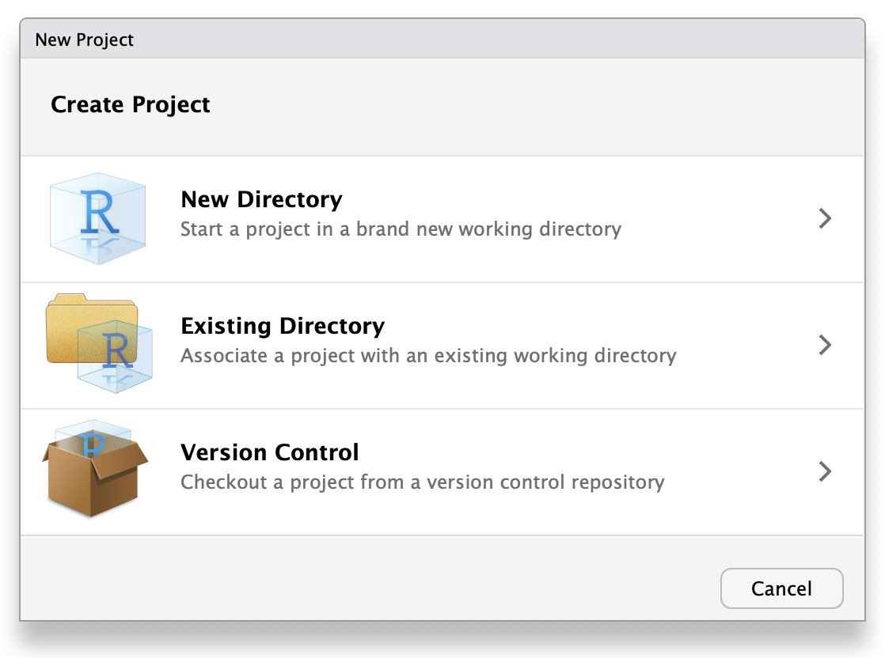

--- 
title: "Glossary<br><a href='https://zenodo.org/badge/latestdoi/176944576'></a>"
author: "psyTeachR Team" 
date: "`r Sys.Date()`"
site: bookdown::bookdown_site
documentclass: book
classoption: oneside # for PDFs
geometry: margin=1in # for PDFs
bibliography: [book.bib, packages.bib]
csl: include/apa.csl
link-citations: yes
description: | 
  Definitions of technical terms
url: https://psyteachr.github.io/glossary
github-repo: psyteachr/glossary
cover-image: images/logos/logo.png
apple-touch-icon: images/logos/apple-touch-icon.png
apple-touch-icon-size: 180
favicon: images/logos/favicon.ico
---
```{r include=FALSE, cache=FALSE}
# psyTeachR styles and functions
# do not edit!!!!!

library(dplyr)
library(tidyr)
library(ggplot2)
library(webexercises)
library(knitr)
library(readr)

# default knitr options
knitr::opts_chunk$set(
  echo       = TRUE,
  #results    = "hold",
  out.width = '100%',
  fig.width  = 8, 
  fig.height = 5, 
  fig.align = 'center',
  collapse = TRUE,
  comment = "#>",
  fig.cap='**CAPTION THIS FIGURE!!**'
)

# make docs directory and include .nojekyll file for github
if (!dir.exists('docs')) dir.create('docs')
file.create('docs/.nojekyll')

## set global theme options for figures
theme_set(theme_bw())

## set class for a chunk using class="className"
knitr::knit_hooks$set(class = function(before, options, envir) {
  if (before) {
    sprintf("<div class = '%s'>", options$class)
  } else {
    "</div>"
  }
})

## verbatim code chunks
knitr::knit_hooks$set(verbatim = function(before, options, envir) {
  if (before) {
    sprintf("<div class='verbatim'><code>&#96;&#96;&#96;{%s}</code>", options$verbatim)
  } else {
    "<code>&#96;&#96;&#96;</code></div>"
  }
})

## verbatim inline R in backticks
backtick <- function(code) {
  paste0("<code>&#096;", code, "&#096;</code>")
}

## palette with psyTeachR logo colour
psyteachr_colours <- function(vals = 1:6) {
  ptrc <- c(
    "pink" = "#983E82",
    "orange" = "#E2A458",
    "yellow" = "#F5DC70",
    "green" = "#59935B",
    "blue" = "#467AAC",
    "purple" = "#61589C"
  )
  
  unname(ptrc[vals])
}
psyteachr_colors <- psyteachr_colours

# book-specific code to include on every page
```

```{r cite-packages, include = FALSE}
# automatically create a bib database for R packages
# add any packages you want to cite here
knitr::write_bib(c(
  .packages(), 'bookdown', 'tidyverse'
), 'packages.bib')

library(glossary)
```

# Overview {-}

The glossary defines common jargon you might encounter while learning R. This specialised vocabulary can help you to communicate more efficiently about coding and statistics and to search for solutions to problems.

The glossary was developed to link to the [PsyTeachR books](https://psyteachr.github.io/){target="_blank"}, but you can link to it from any resource. Suggest additions or changes at the [github issues page](https://github.com/PsyTeachR/glossary/issues){target="_blank"}.

## Cite

Contents are made available under a CC-BY-SA license. To cite:

```{r, results='asis', echo = FALSE}
cite <- citation(package = "glossary")
print(cite, style = "text")
```

```{r, echo = FALSE, eval = FALSE}

contrib <- jsonlite::read_json("https://api.github.com/repos/psyTeachR/glossary/contributors") |>
  sapply(`[[`, "login")

issues <- jsonlite::read_json("https://api.github.com/repos/psyTeachR/glossary/issues?per_page=100") |>
  lapply(`[[`, "user") |>
  sapply(`[[`, "login")

gh_contrib <- c(contrib, issues) |> unique() |> sort()

dput(gh_contrib)
```

```{r, echo = FALSE, results='asis'}
gh_contrib <- c("AnnaWysocki" = "Anna Wysocki", 
                "ASarafoglou" = "Alexandra Sarafoglou", 
                "BartlettJE" = "James Bartlett",
                #"dalejbarr" = "Dale Barr", 
                #"debruine" = "Lisa DeBruine", 
                "EvaRubinova" = "Eva Rubinova", 
                "franzenr" = "Rose Franzen", 
                "JackEdTaylor" = "Jack Taylor", 
                "JeffreyRStevens" = "Jeffrey R Stevens",
                "jhrudey" = "Jessica Hrudey",
                "JulianeKloidt" = "Juliane Kloidt", 
                "nbdutra" = "Natalia Dutra", 
                "nthun" = "Tamás Nagy", 
                "philmcaleer" = "Phil McAleer", 
                "RobbyTi" = "Robert Thibault", 
                "SCgeeker" = "Su-Chin Chen")

ct <- glue::glue("[{gh_contrib}](https://github.com/PsyTeachR/glossary/issues?q=author:{names(gh_contrib)})") |>
  paste0(sep = ", ")

cat("Thanks to the [glossary hackathon](https://docs.google.com/document/d/1FOohcEbWTAXB7OWSvMZzwMI3F--pNNRT3_3DSB6KeB8/edit) contributors: ", ct, ".")
```


## Offline Access

You can download the glossary for offline access (although we update it frequently).

``` r
# install.packages("devtools")
devtools::install_github("psyteachr/glossary")
glossary::open_glossary() # open a local copy
```


## Using the glossary

```{r, include = FALSE}
reset_glossary()
```

You can use the glossary in your own R Markdown resources. The main function is `glossary()`. It has several arguments for controlling the display.


* term: The glossary term to link to, can contain spaces

    ```{verbatim, lang="md"}
    The first `r glossary("argument")` is `term`.
    ```
    
    The first `r glossary("argument")` is `term`.

* display: The display (if different than the term)

    ```{verbatim, lang="md"}
    The `r glossary("dependent variable", "DV")` here is score.
    ```
    
    The `r glossary("dependent variable", "DV")` here is score.

* def: The short definition to display on hover and in the glossary table; if NULL, this will be looked up from https://psyteachr.github.io/glossary/; if "", there will be no tooltip on hover

    ```{verbatim, lang="md"}
    Here, we see a `r glossary("thingamabob", def = "Nobody knows what this is")`.
    ```
    
    Here, we see a `r glossary("thingamabob", def = "Nobody knows what this is")`.

* link: whether to include a link to the glossary when clicked

    ```{verbatim, lang="md"}
    Numbers are `r glossary("numeric", link = FALSE)`.
    ```
    
    Numbers are `r glossary("numeric", link = FALSE)`.

* show_def: whether to show the definition in text (instead of on hover)

    ```{verbatim, lang="md"}
    The `show_def` argument is `r glossary("logical", show_def = TRUE)`. 
    
    YAML: `r glossary("YAML", show_def = TRUE, link = FALSE)`
    ```
    
    The `show_def` argument is `r glossary("logical", show_def = TRUE)`
    
    YAML: `r glossary("YAML", show_def = TRUE, link = FALSE)`

* add_to_table: whether to add to the table created by glossary_table()

    ```{verbatim, lang="md"}
    PsyTeachR books use the `r glossary("tidyverse", add_to_table = FALSE)`.
    ```
    
    PsyTeachR books use the `r glossary("tidyverse", add_to_table = FALSE)`.

You can display a table of all previously defined words (except those exempted with `add_to_table = FALSE`) with the function `glossary_table()`.

```{r}
glossary_table()
```

Reset the glossary table between sections with `reset_glossary()`.

```{r}
reset_glossary()
```


# Symbols

| Symbol | psyTeachR Term    | Also Known As     |
|:------:|:------------------|:------------------|
| ()     | (round) brackets  | parentheses       |
| []     | square brackets   | brackets          |
| {}     | curly brackets    | squiggly brackets |
| <>     | chevrons          | angled brackets / guillemets |
| <      | less than         |                   |
| >      | greater than      |                   |
| &      | ampersand         | "and" symbol      |
| #      | hash              | pound / octothorpe|
| /      | slash             | forward slash     |
| \\     | backslash         |                   |
| -      | dash              | hyphen / minus    |
| _      | underscore        |                   |
| *      | asterisk          | star              |
| ^      | caret             | power symbol      |
| ~      | tilde             | twiddle / squiggle|
| =      | equal sign        |                   |
| ==     | double equal sign |                   |
| .      | full stop         | period / point    |
| !      | exclamation mark  | bang / not        |
| ?      | question mark     |                   |
| '      | single quote      | quote / apostrophe|
| "      | double quote      | quote             |
| %>%    | pipe              | magrittr pipe     |
| \|     | vertical bar      | pipe              |
| ,      | comma             |                   |
| ;      | semi-colon        |                   |
| :      | colon             |                   |
| @      | "at" symbol       | [various hilarious regional terms](https://www.theguardian.com/notesandqueries/query/0,5753,-1773,00.html){target="_blank"} |
| ...    | [ellipsis](e.html#ellipsis)| dots     |

```{r img-soundimals-hash, echo=FALSE, fig.cap="[Image by James Chapman/Soundimals](https://soundimals.tumblr.com/post/167354564886/chapmangamo-the-symbol-has-too-many-names){target='_blank'}"}

knitr::include_graphics("images/soundimals_hash.png")

```


<!--chapter:end:index.Rmd-->

```{r include=FALSE, cache=FALSE}
# psyTeachR styles and functions
# do not edit!!!!!

library(dplyr)
library(tidyr)
library(ggplot2)
library(webexercises)
library(knitr)
library(readr)

# default knitr options
knitr::opts_chunk$set(
  echo       = TRUE,
  #results    = "hold",
  out.width = '100%',
  fig.width  = 8, 
  fig.height = 5, 
  fig.align = 'center',
  collapse = TRUE,
  comment = "#>",
  fig.cap='**CAPTION THIS FIGURE!!**'
)

# make docs directory and include .nojekyll file for github
if (!dir.exists('docs')) dir.create('docs')
file.create('docs/.nojekyll')

## set global theme options for figures
theme_set(theme_bw())

## set class for a chunk using class="className"
knitr::knit_hooks$set(class = function(before, options, envir) {
  if (before) {
    sprintf("<div class = '%s'>", options$class)
  } else {
    "</div>"
  }
})

## verbatim code chunks
knitr::knit_hooks$set(verbatim = function(before, options, envir) {
  if (before) {
    sprintf("<div class='verbatim'><code>&#96;&#96;&#96;{%s}</code>", options$verbatim)
  } else {
    "<code>&#96;&#96;&#96;</code></div>"
  }
})

## verbatim inline R in backticks
backtick <- function(code) {
  paste0("<code>&#096;", code, "&#096;</code>")
}

## palette with psyTeachR logo colour
psyteachr_colours <- function(vals = 1:6) {
  ptrc <- c(
    "pink" = "#983E82",
    "orange" = "#E2A458",
    "yellow" = "#F5DC70",
    "green" = "#59935B",
    "blue" = "#467AAC",
    "purple" = "#61589C"
  )
  
  unname(ptrc[vals])
}
psyteachr_colors <- psyteachr_colours

# book-specific code to include on every page
```
# A

<!--chapter:end:terms/a.Rmd-->

```{r include=FALSE, cache=FALSE}
# psyTeachR styles and functions
# do not edit!!!!!

library(dplyr)
library(tidyr)
library(ggplot2)
library(webexercises)
library(knitr)
library(readr)

# default knitr options
knitr::opts_chunk$set(
  echo       = TRUE,
  #results    = "hold",
  out.width = '100%',
  fig.width  = 8, 
  fig.height = 5, 
  fig.align = 'center',
  collapse = TRUE,
  comment = "#>",
  fig.cap='**CAPTION THIS FIGURE!!**'
)

# make docs directory and include .nojekyll file for github
if (!dir.exists('docs')) dir.create('docs')
file.create('docs/.nojekyll')

## set global theme options for figures
theme_set(theme_bw())

## set class for a chunk using class="className"
knitr::knit_hooks$set(class = function(before, options, envir) {
  if (before) {
    sprintf("<div class = '%s'>", options$class)
  } else {
    "</div>"
  }
})

## verbatim code chunks
knitr::knit_hooks$set(verbatim = function(before, options, envir) {
  if (before) {
    sprintf("<div class='verbatim'><code>&#96;&#96;&#96;{%s}</code>", options$verbatim)
  } else {
    "<code>&#96;&#96;&#96;</code></div>"
  }
})

## verbatim inline R in backticks
backtick <- function(code) {
  paste0("<code>&#096;", code, "&#096;</code>")
}

## palette with psyTeachR logo colour
psyteachr_colours <- function(vals = 1:6) {
  ptrc <- c(
    "pink" = "#983E82",
    "orange" = "#E2A458",
    "yellow" = "#F5DC70",
    "green" = "#59935B",
    "blue" = "#467AAC",
    "purple" = "#61589C"
  )
  
  unname(ptrc[vals])
}
psyteachr_colors <- psyteachr_colours

# book-specific code to include on every page
```
## absolute path

<div class="translation" lang="en">

<dfn>A file path that starts with / and is not appended to the working directory</dfn>

For example, if your [working directory](w.html#working-directory) is `/Users/me/study/` and you want to refer to a file in the directory `data` called `faces.csv`, the absolute path is `/Users/me/study/data/faces.csv`. 

However, you should normally use [relative paths](r.html#relative-path) in scripts, not absolute paths, which can change when you move a project directory to a new computer or even a new place on your computer.

The package R.utils has a function `getAbsolutePath()` that returns the absolute path of a file [path](p.html#path) or a file [object](o.html#object).

</div>


<div class="translation" lang="pt-br">

<dfn> caminho absoluto: um caminho para um arquivo que começa com / e não está fixado ao diretório de trabalho</dfn>

Por exemplo, se o seu [diretório de trabalho](w.html#working-directory) é `/Users/me/study/` e você quer se referir a um arquivo no diretório `data` chamado `faces.csv`, o caminho absoluto é `/Users/me/study/data/faces.csv`.

Entretanto, você deve normalmente usar [caminhos relativos](r.html#relative-path) nos scripts, não caminhos absolutos, pois estes podem mudar quando você move o diretório de um projeto para um computador novo ou até mesmo para um destino novo no seu computador. 

O pacote R.utils possui uma função `getAbsolutePath()` que retorna o caminho absoluto de um arquivo [caminho](p.html#path) ou um arquivo[objeto](o.html#object)

</div>

```{r absolute-path}
R.utils::getAbsolutePath("../index.Rmd")
```

<!--chapter:end:terms/absolute-path.Rmd-->

```{r include=FALSE, cache=FALSE}
# psyTeachR styles and functions
# do not edit!!!!!

library(dplyr)
library(tidyr)
library(ggplot2)
library(webexercises)
library(knitr)
library(readr)

# default knitr options
knitr::opts_chunk$set(
  echo       = TRUE,
  #results    = "hold",
  out.width = '100%',
  fig.width  = 8, 
  fig.height = 5, 
  fig.align = 'center',
  collapse = TRUE,
  comment = "#>",
  fig.cap='**CAPTION THIS FIGURE!!**'
)

# make docs directory and include .nojekyll file for github
if (!dir.exists('docs')) dir.create('docs')
file.create('docs/.nojekyll')

## set global theme options for figures
theme_set(theme_bw())

## set class for a chunk using class="className"
knitr::knit_hooks$set(class = function(before, options, envir) {
  if (before) {
    sprintf("<div class = '%s'>", options$class)
  } else {
    "</div>"
  }
})

## verbatim code chunks
knitr::knit_hooks$set(verbatim = function(before, options, envir) {
  if (before) {
    sprintf("<div class='verbatim'><code>&#96;&#96;&#96;{%s}</code>", options$verbatim)
  } else {
    "<code>&#96;&#96;&#96;</code></div>"
  }
})

## verbatim inline R in backticks
backtick <- function(code) {
  paste0("<code>&#096;", code, "&#096;</code>")
}

## palette with psyTeachR logo colour
psyteachr_colours <- function(vals = 1:6) {
  ptrc <- c(
    "pink" = "#983E82",
    "orange" = "#E2A458",
    "yellow" = "#F5DC70",
    "green" = "#59935B",
    "blue" = "#467AAC",
    "purple" = "#61589C"
  )
  
  unname(ptrc[vals])
}
psyteachr_colors <- psyteachr_colours

# book-specific code to include on every page
```
## adjusted R-squared

<div class="translation" lang="en">

<dfn>A modified version of [R-squared](r.html#r-squared) adjusted for the number of predictors in the model.</dfn>

</div>


<div class="translation" lang="pt-br"> 

<dfn>R-quadrado ajustado: uma versão modificada do R-quadrado ajustado para o número de preditores do modelo.</dfn>

</div>


<!--chapter:end:terms/adjusted-r-squared.Rmd-->

```{r include=FALSE, cache=FALSE}
# psyTeachR styles and functions
# do not edit!!!!!

library(dplyr)
library(tidyr)
library(ggplot2)
library(webexercises)
library(knitr)
library(readr)

# default knitr options
knitr::opts_chunk$set(
  echo       = TRUE,
  #results    = "hold",
  out.width = '100%',
  fig.width  = 8, 
  fig.height = 5, 
  fig.align = 'center',
  collapse = TRUE,
  comment = "#>",
  fig.cap='**CAPTION THIS FIGURE!!**'
)

# make docs directory and include .nojekyll file for github
if (!dir.exists('docs')) dir.create('docs')
file.create('docs/.nojekyll')

## set global theme options for figures
theme_set(theme_bw())

## set class for a chunk using class="className"
knitr::knit_hooks$set(class = function(before, options, envir) {
  if (before) {
    sprintf("<div class = '%s'>", options$class)
  } else {
    "</div>"
  }
})

## verbatim code chunks
knitr::knit_hooks$set(verbatim = function(before, options, envir) {
  if (before) {
    sprintf("<div class='verbatim'><code>&#96;&#96;&#96;{%s}</code>", options$verbatim)
  } else {
    "<code>&#96;&#96;&#96;</code></div>"
  }
})

## verbatim inline R in backticks
backtick <- function(code) {
  paste0("<code>&#096;", code, "&#096;</code>")
}

## palette with psyTeachR logo colour
psyteachr_colours <- function(vals = 1:6) {
  ptrc <- c(
    "pink" = "#983E82",
    "orange" = "#E2A458",
    "yellow" = "#F5DC70",
    "green" = "#59935B",
    "blue" = "#467AAC",
    "purple" = "#61589C"
  )
  
  unname(ptrc[vals])
}
psyteachr_colors <- psyteachr_colours

# book-specific code to include on every page
```
## alpha

<div class="translation" lang="en"> 

<dfn>([stats](a.html#alpha-stats)) The cutoff value for making a decision to reject the null hypothesis; ([graphics](a.html#alpha-graphics)) A value between 0 and 1 used to control the levels of transparency in a plot</dfn>

Can also be a parameter in the [beta distribution](b.html#beta-distribution) or refer to [Cronbach's alpha](c.html#cronbachs-alpha).

</div>


<div class="translation" lang="pt-br"> 

<dfn>([stats](a.html#alpha-stats)) alfa: o valor limite para tomar uma decisão ao rejeitar uma hipótese nula; [graphics](a.html#alpha-graphics)) um valor entre 0 e 1 usado para controlar os níveis de transparência em um gráfico</dfn>

Pode ser também um parâmetro na distribuição beta [beta distribution](b.html#beta-distribution) ou se referir ao alfa de Cronbach [Cronbach's alpha](c.html#cronbachs-alpha).

</div>

## alpha (stats) {#alpha-stats}

<div class="translation" lang="en">

<dfn>The cutoff value for making a decision to reject the null hypothesis</dfn>

If you are using null hypothesis significance testing ([NHST](n.html#nhst)), then you need to decide on a cutoff value called **alpha** for making a decision to reject the null hypothesis. We call p-values below the alpha cutoff [significant](s.html#significant). 

In psychology, alpha is traditionally set at $\alpha$ = .05, but there are good arguments for [setting a different criterion in some circumstances](http://daniellakens.blogspot.com/2019/05/justifying-your-alpha-by-minimizing-or.html){target="_blank"}.

</div>

<div class="translation" lang="pt-br">

<dfn>alfa: o valor limite para tomar uma decisão ao rejeitar uma hipótese nula</dfn>

alfa (estatística): se você estiver usando o [teste de significância da hipótese nula](n.html#nhst), você deve decidir um limiar de valor chamado **alfa** para tomar uma decisão sobre rejeitar a hipótese nula. P-valores abaixo do limiar do alfa são chamados de [significativos](s.html#significant).

Na psicologia, o alfa é tipicamente estabelecido como $\alpha$ = .05, mas há bons argumentos para [estabelecer um critério diferente em algumas circunstâncias](http://daniellakens.blogspot.com/2019/05/justifying-your-alpha-by-minimizing-or.html){target="_blank"}.

</div>

## alpha (graphics) {#alpha-graphics}

<div class="translation" lang="en">

<dfn>A value between 0 and 1 used to control the levels of transparency in a plot</dfn>

</div>

<div class="translation" lang="pt-br">

<dfn>Um valor entre 0 e 1 usado para controlar os níveis de transparência em um gráfico</dfn>

</div>

```{r alpha-plot, fig.cap="Setting alpha to a number lower than 1 lets you see parts of the plot hidden behind an object.", warning=FALSE}
# if you omit alpha, it defaults to 1
alpha1.00 <- ggplot(diamonds, aes(x = depth, fill = cut)) +
  geom_density() + xlim(55, 70)

alpha0.25 <- ggplot(diamonds, aes(x = depth, fill = cut)) +
  geom_density(alpha = 0.25) + xlim(55, 70)

cowplot::plot_grid(alpha1.00, alpha0.25, nrow = 2,
                   labels = c("alpha = 1.0", "alpha = 0.25"))
```


<!--chapter:end:terms/alpha.Rmd-->

```{r include=FALSE, cache=FALSE}
# psyTeachR styles and functions
# do not edit!!!!!

library(dplyr)
library(tidyr)
library(ggplot2)
library(webexercises)
library(knitr)
library(readr)

# default knitr options
knitr::opts_chunk$set(
  echo       = TRUE,
  #results    = "hold",
  out.width = '100%',
  fig.width  = 8, 
  fig.height = 5, 
  fig.align = 'center',
  collapse = TRUE,
  comment = "#>",
  fig.cap='**CAPTION THIS FIGURE!!**'
)

# make docs directory and include .nojekyll file for github
if (!dir.exists('docs')) dir.create('docs')
file.create('docs/.nojekyll')

## set global theme options for figures
theme_set(theme_bw())

## set class for a chunk using class="className"
knitr::knit_hooks$set(class = function(before, options, envir) {
  if (before) {
    sprintf("<div class = '%s'>", options$class)
  } else {
    "</div>"
  }
})

## verbatim code chunks
knitr::knit_hooks$set(verbatim = function(before, options, envir) {
  if (before) {
    sprintf("<div class='verbatim'><code>&#96;&#96;&#96;{%s}</code>", options$verbatim)
  } else {
    "<code>&#96;&#96;&#96;</code></div>"
  }
})

## verbatim inline R in backticks
backtick <- function(code) {
  paste0("<code>&#096;", code, "&#096;</code>")
}

## palette with psyTeachR logo colour
psyteachr_colours <- function(vals = 1:6) {
  ptrc <- c(
    "pink" = "#983E82",
    "orange" = "#E2A458",
    "yellow" = "#F5DC70",
    "green" = "#59935B",
    "blue" = "#467AAC",
    "purple" = "#61589C"
  )
  
  unname(ptrc[vals])
}
psyteachr_colors <- psyteachr_colours

# book-specific code to include on every page
```
## alternate hypothesis

<dfn>The hypothesis that an observed difference between groups or from a specific value is NOT due to chance alone.</dfn>

The alternate hypothesis is also commonly referred to as [H1](h.html#h1). This is contrasted with [H0](h.html#h0), the [null hypothesis](n.html#null-hypothesis) in a null hypothesis significance testing ([NHST](n.html#nhst)) framework.

<!--chapter:end:terms/alternate-hypothesis.Rmd-->

```{r include=FALSE, cache=FALSE}
# psyTeachR styles and functions
# do not edit!!!!!

library(dplyr)
library(tidyr)
library(ggplot2)
library(webexercises)
library(knitr)
library(readr)

# default knitr options
knitr::opts_chunk$set(
  echo       = TRUE,
  #results    = "hold",
  out.width = '100%',
  fig.width  = 8, 
  fig.height = 5, 
  fig.align = 'center',
  collapse = TRUE,
  comment = "#>",
  fig.cap='**CAPTION THIS FIGURE!!**'
)

# make docs directory and include .nojekyll file for github
if (!dir.exists('docs')) dir.create('docs')
file.create('docs/.nojekyll')

## set global theme options for figures
theme_set(theme_bw())

## set class for a chunk using class="className"
knitr::knit_hooks$set(class = function(before, options, envir) {
  if (before) {
    sprintf("<div class = '%s'>", options$class)
  } else {
    "</div>"
  }
})

## verbatim code chunks
knitr::knit_hooks$set(verbatim = function(before, options, envir) {
  if (before) {
    sprintf("<div class='verbatim'><code>&#96;&#96;&#96;{%s}</code>", options$verbatim)
  } else {
    "<code>&#96;&#96;&#96;</code></div>"
  }
})

## verbatim inline R in backticks
backtick <- function(code) {
  paste0("<code>&#096;", code, "&#096;</code>")
}

## palette with psyTeachR logo colour
psyteachr_colours <- function(vals = 1:6) {
  ptrc <- c(
    "pink" = "#983E82",
    "orange" = "#E2A458",
    "yellow" = "#F5DC70",
    "green" = "#59935B",
    "blue" = "#467AAC",
    "purple" = "#61589C"
  )
  
  unname(ptrc[vals])
}
psyteachr_colors <- psyteachr_colours

# book-specific code to include on every page
```
## ampersand

<dfn>The [symbol](symbols.html) &, an [operator](o.html#operator) meaning "AND".</dfn>

A single ampersand is [vectorized](v.html#vectorized), so compares each item in the first [vector](v.html#vector) with the corresponding item in the second vector.

```{r}
c(T, T, F, F) & c(T, T, F, F)
```

A double ampersand is not vectorised, so will ignore all but the first item in vectors, unless your environment has set `_R_CHECK_LENGTH_1_LOGIC2_=true`, in which case you will get an error.

```{r, include = FALSE}
Sys.setenv("_R_CHECK_LENGTH_1_LOGIC2_" = "false")
```


```{r}
c(T, T, F, F) && c(T, T, F, F)
```

```{r, include = FALSE}
Sys.setenv("_R_CHECK_LENGTH_1_LOGIC2_" = "true")
```

::: {.info}

The advantage of a double ampersand is that it will stop as soon as the conclusion is obvious. So if the first item is FALSE, the second item won't even be run. This is useful for testing whether an object exists before checking something that requires the object to exist.

```{r, include = FALSE}
if (exists("x")) rm(x) # removes x from the environment
```


```{r, error = TRUE}
# this produces an error if x doesn't exist
if (is.character(x)) { 
  # do something
}
```

```{r}
if (exists("x") && is.character(x)) { 
  # do something
}
```

:::

<!--chapter:end:terms/ampersand.Rmd-->

```{r include=FALSE, cache=FALSE}
# psyTeachR styles and functions
# do not edit!!!!!

library(dplyr)
library(tidyr)
library(ggplot2)
library(webexercises)
library(knitr)
library(readr)

# default knitr options
knitr::opts_chunk$set(
  echo       = TRUE,
  #results    = "hold",
  out.width = '100%',
  fig.width  = 8, 
  fig.height = 5, 
  fig.align = 'center',
  collapse = TRUE,
  comment = "#>",
  fig.cap='**CAPTION THIS FIGURE!!**'
)

# make docs directory and include .nojekyll file for github
if (!dir.exists('docs')) dir.create('docs')
file.create('docs/.nojekyll')

## set global theme options for figures
theme_set(theme_bw())

## set class for a chunk using class="className"
knitr::knit_hooks$set(class = function(before, options, envir) {
  if (before) {
    sprintf("<div class = '%s'>", options$class)
  } else {
    "</div>"
  }
})

## verbatim code chunks
knitr::knit_hooks$set(verbatim = function(before, options, envir) {
  if (before) {
    sprintf("<div class='verbatim'><code>&#96;&#96;&#96;{%s}</code>", options$verbatim)
  } else {
    "<code>&#96;&#96;&#96;</code></div>"
  }
})

## verbatim inline R in backticks
backtick <- function(code) {
  paste0("<code>&#096;", code, "&#096;</code>")
}

## palette with psyTeachR logo colour
psyteachr_colours <- function(vals = 1:6) {
  ptrc <- c(
    "pink" = "#983E82",
    "orange" = "#E2A458",
    "yellow" = "#F5DC70",
    "green" = "#59935B",
    "blue" = "#467AAC",
    "purple" = "#61589C"
  )
  
  unname(ptrc[vals])
}
psyteachr_colors <- psyteachr_colours

# book-specific code to include on every page
```
## anti_join

<dfn>A [filtering join](f.html#filtering-joins) that returns all rows from the left table where there are *not* matching values in the right table, keeping just columns from the left table.</dfn>

```{r anti-join, echo=FALSE, fig.cap="Anti Join", class.output="join_img"}
knitr::include_graphics("images/joins/anti_join.png")
```

This is useful when you have a table of data that contains IDs you want to exclude from your main dataset.

```{r anti-join-example}
all_data <- tibble(
  id = 1:5,
  x = LETTERS[1:5]
)

to_exclude <- tibble(
  id = 2:4
)

data <- anti_join(all_data, to_exclude, by = "id")
```

`r kable(data)`

See [joins](j.html#joins) for other types of joins and further resources.

<!--chapter:end:terms/anti-join.Rmd-->

```{r include=FALSE, cache=FALSE}
# psyTeachR styles and functions
# do not edit!!!!!

library(dplyr)
library(tidyr)
library(ggplot2)
library(webexercises)
library(knitr)
library(readr)

# default knitr options
knitr::opts_chunk$set(
  echo       = TRUE,
  #results    = "hold",
  out.width = '100%',
  fig.width  = 8, 
  fig.height = 5, 
  fig.align = 'center',
  collapse = TRUE,
  comment = "#>",
  fig.cap='**CAPTION THIS FIGURE!!**'
)

# make docs directory and include .nojekyll file for github
if (!dir.exists('docs')) dir.create('docs')
file.create('docs/.nojekyll')

## set global theme options for figures
theme_set(theme_bw())

## set class for a chunk using class="className"
knitr::knit_hooks$set(class = function(before, options, envir) {
  if (before) {
    sprintf("<div class = '%s'>", options$class)
  } else {
    "</div>"
  }
})

## verbatim code chunks
knitr::knit_hooks$set(verbatim = function(before, options, envir) {
  if (before) {
    sprintf("<div class='verbatim'><code>&#96;&#96;&#96;{%s}</code>", options$verbatim)
  } else {
    "<code>&#96;&#96;&#96;</code></div>"
  }
})

## verbatim inline R in backticks
backtick <- function(code) {
  paste0("<code>&#096;", code, "&#096;</code>")
}

## palette with psyTeachR logo colour
psyteachr_colours <- function(vals = 1:6) {
  ptrc <- c(
    "pink" = "#983E82",
    "orange" = "#E2A458",
    "yellow" = "#F5DC70",
    "green" = "#59935B",
    "blue" = "#467AAC",
    "purple" = "#61589C"
  )
  
  unname(ptrc[vals])
}
psyteachr_colors <- psyteachr_colours

# book-specific code to include on every page
```
## argument

<dfn>A variable that provides input to a [function](f.html#function).</dfn>

For example, the first **argument** to the function `rnorm()` is `n` (the number of [observations](o.html#observation)).

When you look up the help for a function (e.g., `?sd`), you will see a section called **`Arguments`**, which lists the argument names and their definitions.

The function `args()` will show you the argument names and their [default values](d.html#default-value) (if any) for any function.

```{r args}
args(rnorm)
```


<!--chapter:end:terms/argument.Rmd-->

```{r include=FALSE, cache=FALSE}
# psyTeachR styles and functions
# do not edit!!!!!

library(dplyr)
library(tidyr)
library(ggplot2)
library(webexercises)
library(knitr)
library(readr)

# default knitr options
knitr::opts_chunk$set(
  echo       = TRUE,
  #results    = "hold",
  out.width = '100%',
  fig.width  = 8, 
  fig.height = 5, 
  fig.align = 'center',
  collapse = TRUE,
  comment = "#>",
  fig.cap='**CAPTION THIS FIGURE!!**'
)

# make docs directory and include .nojekyll file for github
if (!dir.exists('docs')) dir.create('docs')
file.create('docs/.nojekyll')

## set global theme options for figures
theme_set(theme_bw())

## set class for a chunk using class="className"
knitr::knit_hooks$set(class = function(before, options, envir) {
  if (before) {
    sprintf("<div class = '%s'>", options$class)
  } else {
    "</div>"
  }
})

## verbatim code chunks
knitr::knit_hooks$set(verbatim = function(before, options, envir) {
  if (before) {
    sprintf("<div class='verbatim'><code>&#96;&#96;&#96;{%s}</code>", options$verbatim)
  } else {
    "<code>&#96;&#96;&#96;</code></div>"
  }
})

## verbatim inline R in backticks
backtick <- function(code) {
  paste0("<code>&#096;", code, "&#096;</code>")
}

## palette with psyTeachR logo colour
psyteachr_colours <- function(vals = 1:6) {
  ptrc <- c(
    "pink" = "#983E82",
    "orange" = "#E2A458",
    "yellow" = "#F5DC70",
    "green" = "#59935B",
    "blue" = "#467AAC",
    "purple" = "#61589C"
  )
  
  unname(ptrc[vals])
}
psyteachr_colors <- psyteachr_colours

# book-specific code to include on every page
```
## array

<dfn>A [container](c.html#container) that stores [objects](o.html#object) in one or more dimensions.</dfn>

You can create an array by specifying a list or vector of values and the number of dimensions. The first two dimensions are rows and columns; each dimension after that is printed separately as a facet.

```{r}
# 3-dimensional array with 4 rows, 3 columns, and 2 facets
array(1:24, dim = c(4, 3, 2))
```
You can give your array dimensions names.

```{r}

dimnames <- list(
  subj_id = c("S1", "S2", "S3", "S4"),
  face_id = c("F1", "F2", "F3"),
  condition = c("Control", "experimental")
)
  
array(1:24, dim = c(4, 3, 2), dimnames = dimnames)
```

Objects not need to be the same [data type](d.html#data-type).

```{r}
mylist <- list("A", TRUE, 2L, 3.1)
myarray <- array(mylist, dim = c(2,2))

c(
  myarray[[1,1]] %>% class(),
  myarray[[1,2]] %>% class(),
  myarray[[2,1]] %>% class(),
  myarray[[2,2]] %>% class()
)
```


<!--chapter:end:terms/array.Rmd-->

```{r include=FALSE, cache=FALSE}
# psyTeachR styles and functions
# do not edit!!!!!

library(dplyr)
library(tidyr)
library(ggplot2)
library(webexercises)
library(knitr)
library(readr)

# default knitr options
knitr::opts_chunk$set(
  echo       = TRUE,
  #results    = "hold",
  out.width = '100%',
  fig.width  = 8, 
  fig.height = 5, 
  fig.align = 'center',
  collapse = TRUE,
  comment = "#>",
  fig.cap='**CAPTION THIS FIGURE!!**'
)

# make docs directory and include .nojekyll file for github
if (!dir.exists('docs')) dir.create('docs')
file.create('docs/.nojekyll')

## set global theme options for figures
theme_set(theme_bw())

## set class for a chunk using class="className"
knitr::knit_hooks$set(class = function(before, options, envir) {
  if (before) {
    sprintf("<div class = '%s'>", options$class)
  } else {
    "</div>"
  }
})

## verbatim code chunks
knitr::knit_hooks$set(verbatim = function(before, options, envir) {
  if (before) {
    sprintf("<div class='verbatim'><code>&#96;&#96;&#96;{%s}</code>", options$verbatim)
  } else {
    "<code>&#96;&#96;&#96;</code></div>"
  }
})

## verbatim inline R in backticks
backtick <- function(code) {
  paste0("<code>&#096;", code, "&#096;</code>")
}

## palette with psyTeachR logo colour
psyteachr_colours <- function(vals = 1:6) {
  ptrc <- c(
    "pink" = "#983E82",
    "orange" = "#E2A458",
    "yellow" = "#F5DC70",
    "green" = "#59935B",
    "blue" = "#467AAC",
    "purple" = "#61589C"
  )
  
  unname(ptrc[vals])
}
psyteachr_colors <- psyteachr_colours

# book-specific code to include on every page
```
## aspect ratio

<dfn>The ratio between the width and height of an image.</dfn>

You can specify the aspect ratio of your plots by setting the width and height in the first chunk of an R Markdown file like this:

```{r, eval = FALSE}
knitr::opts_chunk$set(
  fig.width = 7, # default value is 7
  fig.height = 7/1.618 # rolden ratio; default value is 7
)
```

Or in the [chunk](c.html#chunk) options:

```{r aspect-ratio-1, eval = FALSE, verbatim="r fig-golden-ratio, fig.width = 7, fig.height = 4.32"}
ggplot(iris, aes(Sepal.Width, Sepal.Length, color = Species)) +
  geom_point() +
  geom_smooth(method = lm, formula = y~x)
```

```{r aspect-ratio-1-displ, echo = FALSE, fig.width = 7, fig.height = 4.32, fig.cap = "Plot with a 1.618:1 aspect ratio (golden ratio)"}
ggplot(iris, aes(Sepal.Width, Sepal.Length, color = Species)) +
  geom_point() +
  geom_smooth(method = lm, formula = y~x)
```

```{r aspect-ratio-2, eval = FALSE, verbatim="r fig-square, fig.width = 7, fig.height = 7"}
ggplot(iris, aes(Sepal.Width, Sepal.Length, color = Species)) +
  geom_point() +
  geom_smooth(method = lm, formula = y~x)
```

```{r aspect-ratio-2-disp, echo = FALSE, fig.width = 7, fig.height = 7, fig.cap = "Plot with a 1:1 aspect ratio"}
ggplot(iris, aes(Sepal.Width, Sepal.Length, color = Species)) +
  geom_point() +
  geom_smooth(method = lm, formula = y~x)
```


Or when you save the image:

```{r, eval = FALSE}
ggsave("golden-ratio.jpg", width = 7, height = 7/1.618)
```


<!--chapter:end:terms/aspect-ratio.Rmd-->

```{r include=FALSE, cache=FALSE}
# psyTeachR styles and functions
# do not edit!!!!!

library(dplyr)
library(tidyr)
library(ggplot2)
library(webexercises)
library(knitr)
library(readr)

# default knitr options
knitr::opts_chunk$set(
  echo       = TRUE,
  #results    = "hold",
  out.width = '100%',
  fig.width  = 8, 
  fig.height = 5, 
  fig.align = 'center',
  collapse = TRUE,
  comment = "#>",
  fig.cap='**CAPTION THIS FIGURE!!**'
)

# make docs directory and include .nojekyll file for github
if (!dir.exists('docs')) dir.create('docs')
file.create('docs/.nojekyll')

## set global theme options for figures
theme_set(theme_bw())

## set class for a chunk using class="className"
knitr::knit_hooks$set(class = function(before, options, envir) {
  if (before) {
    sprintf("<div class = '%s'>", options$class)
  } else {
    "</div>"
  }
})

## verbatim code chunks
knitr::knit_hooks$set(verbatim = function(before, options, envir) {
  if (before) {
    sprintf("<div class='verbatim'><code>&#96;&#96;&#96;{%s}</code>", options$verbatim)
  } else {
    "<code>&#96;&#96;&#96;</code></div>"
  }
})

## verbatim inline R in backticks
backtick <- function(code) {
  paste0("<code>&#096;", code, "&#096;</code>")
}

## palette with psyTeachR logo colour
psyteachr_colours <- function(vals = 1:6) {
  ptrc <- c(
    "pink" = "#983E82",
    "orange" = "#E2A458",
    "yellow" = "#F5DC70",
    "green" = "#59935B",
    "blue" = "#467AAC",
    "purple" = "#61589C"
  )
  
  unname(ptrc[vals])
}
psyteachr_colors <- psyteachr_colours

# book-specific code to include on every page
```
## assignment operator

<dfn>The [symbol](symbols.html) `<-`, which functions like `=` and assigns the value on the right to the object on the left</dfn>

```{r assignment-operator}
a <- 1

a
```

The assignment operator can also be reversed

```{r reversed-assignment-operator}
2 -> b

b
```

And even go in both direction at the same time!

```{r dual-assignment}
x <- 2 -> y

x
y
```

<!--chapter:end:terms/assignment-operator.Rmd-->

```{r include=FALSE, cache=FALSE}
# psyTeachR styles and functions
# do not edit!!!!!

library(dplyr)
library(tidyr)
library(ggplot2)
library(webexercises)
library(knitr)
library(readr)

# default knitr options
knitr::opts_chunk$set(
  echo       = TRUE,
  #results    = "hold",
  out.width = '100%',
  fig.width  = 8, 
  fig.height = 5, 
  fig.align = 'center',
  collapse = TRUE,
  comment = "#>",
  fig.cap='**CAPTION THIS FIGURE!!**'
)

# make docs directory and include .nojekyll file for github
if (!dir.exists('docs')) dir.create('docs')
file.create('docs/.nojekyll')

## set global theme options for figures
theme_set(theme_bw())

## set class for a chunk using class="className"
knitr::knit_hooks$set(class = function(before, options, envir) {
  if (before) {
    sprintf("<div class = '%s'>", options$class)
  } else {
    "</div>"
  }
})

## verbatim code chunks
knitr::knit_hooks$set(verbatim = function(before, options, envir) {
  if (before) {
    sprintf("<div class='verbatim'><code>&#96;&#96;&#96;{%s}</code>", options$verbatim)
  } else {
    "<code>&#96;&#96;&#96;</code></div>"
  }
})

## verbatim inline R in backticks
backtick <- function(code) {
  paste0("<code>&#096;", code, "&#096;</code>")
}

## palette with psyTeachR logo colour
psyteachr_colours <- function(vals = 1:6) {
  ptrc <- c(
    "pink" = "#983E82",
    "orange" = "#E2A458",
    "yellow" = "#F5DC70",
    "green" = "#59935B",
    "blue" = "#467AAC",
    "purple" = "#61589C"
  )
  
  unname(ptrc[vals])
}
psyteachr_colors <- psyteachr_colours

# book-specific code to include on every page
```
## atomic

<dfn>Only containing [objects](o.html#object) with the same [data type](d.html#data-type) (e.g., all [numeric](n.html#numeric) or [character](c.html#character)).</dfn>

[Vectors](v.html#vector) are atomic data structures in R.

```{r}
a <- c(1, 4, 32)
b <- c("somebody", "once", "told me")
class(a)
class(b)
```

If you try to mix data types in an atomic vector, they will be [coerced](c.html#coerce) to be the same type. (Note that 32 becomes "32" so it can be in the same vector as a character object).

```{r}
c(32, TRUE, "eighteen")
```

Another feature of vectors that makes them atomic is that they are always flat. If you embed vectors within vectors, they will be flattened.

```{r}
c(7, c(1, 4, 32), 2, 6)
```

[Lists](l.html#list), on the other hand, can be nested.

```{r}
list(7, c(1, 4, 32), 2, 6) %>% str()
```


If you try to extract objects inside an atomic vector, you need to use [brackets](b.html#brackets) `[]`. This can be with an index or a name. Single brackets can return one or more elements, and include names, while double brackets can only return one element and don't have names.

```{r}
my_vec <- c(x = 3, y = 1, z = 4)
my_vec[2]
my_vec["y"]
my_vec[["y"]]
```


You cannot use the $ operator on an atomic vector, or you will get this very common error.

```{r, error = TRUE}
my_vec$y
```

See the [Vectors chapter](https://adv-r.hadley.nz/vectors-chap.html#atomic-vectors) of Advanced R for more advanced discussion of atomic vectors.


<!--chapter:end:terms/atomic.Rmd-->

```{r include=FALSE, cache=FALSE}
# psyTeachR styles and functions
# do not edit!!!!!

library(dplyr)
library(tidyr)
library(ggplot2)
library(webexercises)
library(knitr)
library(readr)

# default knitr options
knitr::opts_chunk$set(
  echo       = TRUE,
  #results    = "hold",
  out.width = '100%',
  fig.width  = 8, 
  fig.height = 5, 
  fig.align = 'center',
  collapse = TRUE,
  comment = "#>",
  fig.cap='**CAPTION THIS FIGURE!!**'
)

# make docs directory and include .nojekyll file for github
if (!dir.exists('docs')) dir.create('docs')
file.create('docs/.nojekyll')

## set global theme options for figures
theme_set(theme_bw())

## set class for a chunk using class="className"
knitr::knit_hooks$set(class = function(before, options, envir) {
  if (before) {
    sprintf("<div class = '%s'>", options$class)
  } else {
    "</div>"
  }
})

## verbatim code chunks
knitr::knit_hooks$set(verbatim = function(before, options, envir) {
  if (before) {
    sprintf("<div class='verbatim'><code>&#96;&#96;&#96;{%s}</code>", options$verbatim)
  } else {
    "<code>&#96;&#96;&#96;</code></div>"
  }
})

## verbatim inline R in backticks
backtick <- function(code) {
  paste0("<code>&#096;", code, "&#096;</code>")
}

## palette with psyTeachR logo colour
psyteachr_colours <- function(vals = 1:6) {
  ptrc <- c(
    "pink" = "#983E82",
    "orange" = "#E2A458",
    "yellow" = "#F5DC70",
    "green" = "#59935B",
    "blue" = "#467AAC",
    "purple" = "#61589C"
  )
  
  unname(ptrc[vals])
}
psyteachr_colors <- psyteachr_colours

# book-specific code to include on every page
```
## attribute

<dfn>Extra information about an R object</dfn>

You can access an [object](o.html#object)'s attributes with `attr()`. For example, datasets simulated with [faux](https://debruine.github.io/faux/){target="_blank"} have an attribute called "design" that details their design.

```{r}
data <- faux::sim_design(
  between = list(pet = c(cat = "Cat Owners", 
                         dog = "Dog Owners")),
  within = list(time = c(am = "Morning", 
                         pm = "Night")),
  mu = 1:4,
  r = list(cat = 0.3, dog = 0.6),
  dv = c(score = "Happiness Scale Score"),
  plot = FALSE)

attr(data, "design")
```


## attribute (html) {#attribute-html}

<dfn>Extra information about an HTML element</dfn>

For example, the paragraph [element](e.html#element-html) has an attribute of "id" with a value of "feature". This can be used to refer to the element to change its style with [CSS](c.html#css) or affect its behaviour with [JavaScript](j.html#javascript).

``` html
<p id="feature">This is the main paragraoh of my text...</p>
```

<!--chapter:end:terms/attribute.Rmd-->

```{r include=FALSE, cache=FALSE}
# psyTeachR styles and functions
# do not edit!!!!!

library(dplyr)
library(tidyr)
library(ggplot2)
library(webexercises)
library(knitr)
library(readr)

# default knitr options
knitr::opts_chunk$set(
  echo       = TRUE,
  #results    = "hold",
  out.width = '100%',
  fig.width  = 8, 
  fig.height = 5, 
  fig.align = 'center',
  collapse = TRUE,
  comment = "#>",
  fig.cap='**CAPTION THIS FIGURE!!**'
)

# make docs directory and include .nojekyll file for github
if (!dir.exists('docs')) dir.create('docs')
file.create('docs/.nojekyll')

## set global theme options for figures
theme_set(theme_bw())

## set class for a chunk using class="className"
knitr::knit_hooks$set(class = function(before, options, envir) {
  if (before) {
    sprintf("<div class = '%s'>", options$class)
  } else {
    "</div>"
  }
})

## verbatim code chunks
knitr::knit_hooks$set(verbatim = function(before, options, envir) {
  if (before) {
    sprintf("<div class='verbatim'><code>&#96;&#96;&#96;{%s}</code>", options$verbatim)
  } else {
    "<code>&#96;&#96;&#96;</code></div>"
  }
})

## verbatim inline R in backticks
backtick <- function(code) {
  paste0("<code>&#096;", code, "&#096;</code>")
}

## palette with psyTeachR logo colour
psyteachr_colours <- function(vals = 1:6) {
  ptrc <- c(
    "pink" = "#983E82",
    "orange" = "#E2A458",
    "yellow" = "#F5DC70",
    "green" = "#59935B",
    "blue" = "#467AAC",
    "purple" = "#61589C"
  )
  
  unname(ptrc[vals])
}
psyteachr_colors <- psyteachr_colours

# book-specific code to include on every page
```
# B

<!--chapter:end:terms/b.Rmd-->

```{r include=FALSE, cache=FALSE}
# psyTeachR styles and functions
# do not edit!!!!!

library(dplyr)
library(tidyr)
library(ggplot2)
library(webexercises)
library(knitr)
library(readr)

# default knitr options
knitr::opts_chunk$set(
  echo       = TRUE,
  #results    = "hold",
  out.width = '100%',
  fig.width  = 8, 
  fig.height = 5, 
  fig.align = 'center',
  collapse = TRUE,
  comment = "#>",
  fig.cap='**CAPTION THIS FIGURE!!**'
)

# make docs directory and include .nojekyll file for github
if (!dir.exists('docs')) dir.create('docs')
file.create('docs/.nojekyll')

## set global theme options for figures
theme_set(theme_bw())

## set class for a chunk using class="className"
knitr::knit_hooks$set(class = function(before, options, envir) {
  if (before) {
    sprintf("<div class = '%s'>", options$class)
  } else {
    "</div>"
  }
})

## verbatim code chunks
knitr::knit_hooks$set(verbatim = function(before, options, envir) {
  if (before) {
    sprintf("<div class='verbatim'><code>&#96;&#96;&#96;{%s}</code>", options$verbatim)
  } else {
    "<code>&#96;&#96;&#96;</code></div>"
  }
})

## verbatim inline R in backticks
backtick <- function(code) {
  paste0("<code>&#096;", code, "&#096;</code>")
}

## palette with psyTeachR logo colour
psyteachr_colours <- function(vals = 1:6) {
  ptrc <- c(
    "pink" = "#983E82",
    "orange" = "#E2A458",
    "yellow" = "#F5DC70",
    "green" = "#59935B",
    "blue" = "#467AAC",
    "purple" = "#61589C"
  )
  
  unname(ptrc[vals])
}
psyteachr_colors <- psyteachr_colours

# book-specific code to include on every page
```
## base R

<div class="translation" lang="en">

<dfn>The set of R [functions](f.html#function) that come with a basic installation of R, before you add external [packages](p.html#package).</dfn>

Contrast with [tidyverse](t.html#tidyverse).

</div>


<div class="translation" lang="zh-Hant">

<dfn>完成基本安裝，啟動R就自動載入的[函式庫](f.html#function)。自行安裝的外部[套件](p.html#package)，例如[tidyverse](t.html#tidyverse)，需要手動載入。</dfn>

</div>

<!--chapter:end:terms/base-r.Rmd-->

```{r include=FALSE, cache=FALSE}
# psyTeachR styles and functions
# do not edit!!!!!

library(dplyr)
library(tidyr)
library(ggplot2)
library(webexercises)
library(knitr)
library(readr)

# default knitr options
knitr::opts_chunk$set(
  echo       = TRUE,
  #results    = "hold",
  out.width = '100%',
  fig.width  = 8, 
  fig.height = 5, 
  fig.align = 'center',
  collapse = TRUE,
  comment = "#>",
  fig.cap='**CAPTION THIS FIGURE!!**'
)

# make docs directory and include .nojekyll file for github
if (!dir.exists('docs')) dir.create('docs')
file.create('docs/.nojekyll')

## set global theme options for figures
theme_set(theme_bw())

## set class for a chunk using class="className"
knitr::knit_hooks$set(class = function(before, options, envir) {
  if (before) {
    sprintf("<div class = '%s'>", options$class)
  } else {
    "</div>"
  }
})

## verbatim code chunks
knitr::knit_hooks$set(verbatim = function(before, options, envir) {
  if (before) {
    sprintf("<div class='verbatim'><code>&#96;&#96;&#96;{%s}</code>", options$verbatim)
  } else {
    "<code>&#96;&#96;&#96;</code></div>"
  }
})

## verbatim inline R in backticks
backtick <- function(code) {
  paste0("<code>&#096;", code, "&#096;</code>")
}

## palette with psyTeachR logo colour
psyteachr_colours <- function(vals = 1:6) {
  ptrc <- c(
    "pink" = "#983E82",
    "orange" = "#E2A458",
    "yellow" = "#F5DC70",
    "green" = "#59935B",
    "blue" = "#467AAC",
    "purple" = "#61589C"
  )
  
  unname(ptrc[vals])
}
psyteachr_colors <- psyteachr_colours

# book-specific code to include on every page
```
## beta distribution

<dfn>A family of [distributions](d.html#distribution) of data that are characterised by two [parameters](p.html#paremeter): &alpha; and &beta;</dfn>

[Wikipedia](https://en.wikipedia.org/wiki/Beta_distribution){target="_blank"} actually has really good definitions and examples.

<!--chapter:end:terms/beta-distribution.Rmd-->

```{r include=FALSE, cache=FALSE}
# psyTeachR styles and functions
# do not edit!!!!!

library(dplyr)
library(tidyr)
library(ggplot2)
library(webexercises)
library(knitr)
library(readr)

# default knitr options
knitr::opts_chunk$set(
  echo       = TRUE,
  #results    = "hold",
  out.width = '100%',
  fig.width  = 8, 
  fig.height = 5, 
  fig.align = 'center',
  collapse = TRUE,
  comment = "#>",
  fig.cap='**CAPTION THIS FIGURE!!**'
)

# make docs directory and include .nojekyll file for github
if (!dir.exists('docs')) dir.create('docs')
file.create('docs/.nojekyll')

## set global theme options for figures
theme_set(theme_bw())

## set class for a chunk using class="className"
knitr::knit_hooks$set(class = function(before, options, envir) {
  if (before) {
    sprintf("<div class = '%s'>", options$class)
  } else {
    "</div>"
  }
})

## verbatim code chunks
knitr::knit_hooks$set(verbatim = function(before, options, envir) {
  if (before) {
    sprintf("<div class='verbatim'><code>&#96;&#96;&#96;{%s}</code>", options$verbatim)
  } else {
    "<code>&#96;&#96;&#96;</code></div>"
  }
})

## verbatim inline R in backticks
backtick <- function(code) {
  paste0("<code>&#096;", code, "&#096;</code>")
}

## palette with psyTeachR logo colour
psyteachr_colours <- function(vals = 1:6) {
  ptrc <- c(
    "pink" = "#983E82",
    "orange" = "#E2A458",
    "yellow" = "#F5DC70",
    "green" = "#59935B",
    "blue" = "#467AAC",
    "purple" = "#61589C"
  )
  
  unname(ptrc[vals])
}
psyteachr_colors <- psyteachr_colours

# book-specific code to include on every page
```
## beta

<dfn>The [false negative](f.html#false-negative) rate we accept for a statistical test.</dfn>

Beta is equal to 1 minus [power](p.html#power), so if a test has power of 0.8 for a specific [effect size](e.html#effect-size) and [alpha](a.html#alpha-stats), then beta = 0.2.

Beta can also refer to a parameter of the [beta distribution](b.html#beta-distribution)

<!--chapter:end:terms/beta.Rmd-->

```{r include=FALSE, cache=FALSE}
# psyTeachR styles and functions
# do not edit!!!!!

library(dplyr)
library(tidyr)
library(ggplot2)
library(webexercises)
library(knitr)
library(readr)

# default knitr options
knitr::opts_chunk$set(
  echo       = TRUE,
  #results    = "hold",
  out.width = '100%',
  fig.width  = 8, 
  fig.height = 5, 
  fig.align = 'center',
  collapse = TRUE,
  comment = "#>",
  fig.cap='**CAPTION THIS FIGURE!!**'
)

# make docs directory and include .nojekyll file for github
if (!dir.exists('docs')) dir.create('docs')
file.create('docs/.nojekyll')

## set global theme options for figures
theme_set(theme_bw())

## set class for a chunk using class="className"
knitr::knit_hooks$set(class = function(before, options, envir) {
  if (before) {
    sprintf("<div class = '%s'>", options$class)
  } else {
    "</div>"
  }
})

## verbatim code chunks
knitr::knit_hooks$set(verbatim = function(before, options, envir) {
  if (before) {
    sprintf("<div class='verbatim'><code>&#96;&#96;&#96;{%s}</code>", options$verbatim)
  } else {
    "<code>&#96;&#96;&#96;</code></div>"
  }
})

## verbatim inline R in backticks
backtick <- function(code) {
  paste0("<code>&#096;", code, "&#096;</code>")
}

## palette with psyTeachR logo colour
psyteachr_colours <- function(vals = 1:6) {
  ptrc <- c(
    "pink" = "#983E82",
    "orange" = "#E2A458",
    "yellow" = "#F5DC70",
    "green" = "#59935B",
    "blue" = "#467AAC",
    "purple" = "#61589C"
  )
  
  unname(ptrc[vals])
}
psyteachr_colors <- psyteachr_colours

# book-specific code to include on every page
```
## between subjects

<dfn>Not varying within unit of observation, such that each has only one value</dfn>

For example, imagine an experiment where you test half of subjects in a dark room and the other half in a light. This experiment has one [factor](f.html#factor-experimental), room darkness, which is **between subjects** because each subject only experiences one [level](l.html#level) of room darkness, not both. This experiment may also be described as "between subjects".

Contrast with [within subjects](w.html#within-subjects).


<!--chapter:end:terms/between-subjects.Rmd-->

```{r include=FALSE, cache=FALSE}
# psyTeachR styles and functions
# do not edit!!!!!

library(dplyr)
library(tidyr)
library(ggplot2)
library(webexercises)
library(knitr)
library(readr)

# default knitr options
knitr::opts_chunk$set(
  echo       = TRUE,
  #results    = "hold",
  out.width = '100%',
  fig.width  = 8, 
  fig.height = 5, 
  fig.align = 'center',
  collapse = TRUE,
  comment = "#>",
  fig.cap='**CAPTION THIS FIGURE!!**'
)

# make docs directory and include .nojekyll file for github
if (!dir.exists('docs')) dir.create('docs')
file.create('docs/.nojekyll')

## set global theme options for figures
theme_set(theme_bw())

## set class for a chunk using class="className"
knitr::knit_hooks$set(class = function(before, options, envir) {
  if (before) {
    sprintf("<div class = '%s'>", options$class)
  } else {
    "</div>"
  }
})

## verbatim code chunks
knitr::knit_hooks$set(verbatim = function(before, options, envir) {
  if (before) {
    sprintf("<div class='verbatim'><code>&#96;&#96;&#96;{%s}</code>", options$verbatim)
  } else {
    "<code>&#96;&#96;&#96;</code></div>"
  }
})

## verbatim inline R in backticks
backtick <- function(code) {
  paste0("<code>&#096;", code, "&#096;</code>")
}

## palette with psyTeachR logo colour
psyteachr_colours <- function(vals = 1:6) {
  ptrc <- c(
    "pink" = "#983E82",
    "orange" = "#E2A458",
    "yellow" = "#F5DC70",
    "green" = "#59935B",
    "blue" = "#467AAC",
    "purple" = "#61589C"
  )
  
  unname(ptrc[vals])
}
psyteachr_colors <- psyteachr_colours

# book-specific code to include on every page
```
## bind_cols

<dfn>A [binding join](b.html#binding-joins) that joins one table to another by adding their columns together</dfn>

`bind_cols` takes two tables with the same number of rows and adds the columns from the second table to the first.

```{r bind-cols}
a <- tibble(
  id = 1:3,
  x = LETTERS[1:3]
)

b <- tibble(
  y = c(T, T, F)
)

data <- dplyr::bind_cols(a, b)
```

`r kable(data)`


If any column has the same name in both tables, you will see a warning that the columns have been given new names.

```{r bind-cols-warning}
a <- tibble(
  id = 1:3,
  x = LETTERS[1:3]
)

b <- tibble(
  x = c(T, T, F)
)

data <- dplyr::bind_cols(a, b)
```

`r kable(data)`

See [joins](j.html#joins) for other types of joins and further resources.

<!--chapter:end:terms/bind-cols.Rmd-->

```{r include=FALSE, cache=FALSE}
# psyTeachR styles and functions
# do not edit!!!!!

library(dplyr)
library(tidyr)
library(ggplot2)
library(webexercises)
library(knitr)
library(readr)

# default knitr options
knitr::opts_chunk$set(
  echo       = TRUE,
  #results    = "hold",
  out.width = '100%',
  fig.width  = 8, 
  fig.height = 5, 
  fig.align = 'center',
  collapse = TRUE,
  comment = "#>",
  fig.cap='**CAPTION THIS FIGURE!!**'
)

# make docs directory and include .nojekyll file for github
if (!dir.exists('docs')) dir.create('docs')
file.create('docs/.nojekyll')

## set global theme options for figures
theme_set(theme_bw())

## set class for a chunk using class="className"
knitr::knit_hooks$set(class = function(before, options, envir) {
  if (before) {
    sprintf("<div class = '%s'>", options$class)
  } else {
    "</div>"
  }
})

## verbatim code chunks
knitr::knit_hooks$set(verbatim = function(before, options, envir) {
  if (before) {
    sprintf("<div class='verbatim'><code>&#96;&#96;&#96;{%s}</code>", options$verbatim)
  } else {
    "<code>&#96;&#96;&#96;</code></div>"
  }
})

## verbatim inline R in backticks
backtick <- function(code) {
  paste0("<code>&#096;", code, "&#096;</code>")
}

## palette with psyTeachR logo colour
psyteachr_colours <- function(vals = 1:6) {
  ptrc <- c(
    "pink" = "#983E82",
    "orange" = "#E2A458",
    "yellow" = "#F5DC70",
    "green" = "#59935B",
    "blue" = "#467AAC",
    "purple" = "#61589C"
  )
  
  unname(ptrc[vals])
}
psyteachr_colors <- psyteachr_colours

# book-specific code to include on every page
```
## bind_rows

<dfn>A [binding join](b.html#binding-joins) that joins one table to another by adding their rows together</dfn>

`bind_rows` takes two tables, finds all columns with the same name, and appends the second one to the first. If a column doesn't have a match in the other table, that columns' values are set to [NA](n.html#na).

```{r bind-rows}
a <- tibble(
  id = 1:3,
  x = LETTERS[1:3],
  y = c(T, T, F)
)

b <- tibble(
  x = LETTERS[4:6],
  id = 4:6
)

data <- dplyr::bind_rows(a, b)
```

`r kable(data)`

See [joins](j.html#joins) for other types of joins and further resources.

<!--chapter:end:terms/bind-rows.Rmd-->

```{r include=FALSE, cache=FALSE}
# psyTeachR styles and functions
# do not edit!!!!!

library(dplyr)
library(tidyr)
library(ggplot2)
library(webexercises)
library(knitr)
library(readr)

# default knitr options
knitr::opts_chunk$set(
  echo       = TRUE,
  #results    = "hold",
  out.width = '100%',
  fig.width  = 8, 
  fig.height = 5, 
  fig.align = 'center',
  collapse = TRUE,
  comment = "#>",
  fig.cap='**CAPTION THIS FIGURE!!**'
)

# make docs directory and include .nojekyll file for github
if (!dir.exists('docs')) dir.create('docs')
file.create('docs/.nojekyll')

## set global theme options for figures
theme_set(theme_bw())

## set class for a chunk using class="className"
knitr::knit_hooks$set(class = function(before, options, envir) {
  if (before) {
    sprintf("<div class = '%s'>", options$class)
  } else {
    "</div>"
  }
})

## verbatim code chunks
knitr::knit_hooks$set(verbatim = function(before, options, envir) {
  if (before) {
    sprintf("<div class='verbatim'><code>&#96;&#96;&#96;{%s}</code>", options$verbatim)
  } else {
    "<code>&#96;&#96;&#96;</code></div>"
  }
})

## verbatim inline R in backticks
backtick <- function(code) {
  paste0("<code>&#096;", code, "&#096;</code>")
}

## palette with psyTeachR logo colour
psyteachr_colours <- function(vals = 1:6) {
  ptrc <- c(
    "pink" = "#983E82",
    "orange" = "#E2A458",
    "yellow" = "#F5DC70",
    "green" = "#59935B",
    "blue" = "#467AAC",
    "purple" = "#61589C"
  )
  
  unname(ptrc[vals])
}
psyteachr_colors <- psyteachr_colours

# book-specific code to include on every page
```
## binding joins

<dfn>[Joins](j.html#joins) that bind one table to another by adding their rows or columns together.</dfn>

* [bind_rows](b.html#bind_rows)
* [bind_cols](b.html#bind_cols)


<!--chapter:end:terms/binding-joins.Rmd-->

```{r include=FALSE, cache=FALSE}
# psyTeachR styles and functions
# do not edit!!!!!

library(dplyr)
library(tidyr)
library(ggplot2)
library(webexercises)
library(knitr)
library(readr)

# default knitr options
knitr::opts_chunk$set(
  echo       = TRUE,
  #results    = "hold",
  out.width = '100%',
  fig.width  = 8, 
  fig.height = 5, 
  fig.align = 'center',
  collapse = TRUE,
  comment = "#>",
  fig.cap='**CAPTION THIS FIGURE!!**'
)

# make docs directory and include .nojekyll file for github
if (!dir.exists('docs')) dir.create('docs')
file.create('docs/.nojekyll')

## set global theme options for figures
theme_set(theme_bw())

## set class for a chunk using class="className"
knitr::knit_hooks$set(class = function(before, options, envir) {
  if (before) {
    sprintf("<div class = '%s'>", options$class)
  } else {
    "</div>"
  }
})

## verbatim code chunks
knitr::knit_hooks$set(verbatim = function(before, options, envir) {
  if (before) {
    sprintf("<div class='verbatim'><code>&#96;&#96;&#96;{%s}</code>", options$verbatim)
  } else {
    "<code>&#96;&#96;&#96;</code></div>"
  }
})

## verbatim inline R in backticks
backtick <- function(code) {
  paste0("<code>&#096;", code, "&#096;</code>")
}

## palette with psyTeachR logo colour
psyteachr_colours <- function(vals = 1:6) {
  ptrc <- c(
    "pink" = "#983E82",
    "orange" = "#E2A458",
    "yellow" = "#F5DC70",
    "green" = "#59935B",
    "blue" = "#467AAC",
    "purple" = "#61589C"
  )
  
  unname(ptrc[vals])
}
psyteachr_colors <- psyteachr_colours

# book-specific code to include on every page
```
## binomial distribution

<dfn>The [distribution](d.html#distribution) of data where each observation can have one of two outcomes, like success/failure, yes/no or head/tails. </dfn>

```{r binomial-dist}
# flip 10 coins 10000 times
x <- rbinom(10000, 10, prob = 0.5)
```


```{r binom-plot, echo = FALSE, fig.cap = "Binomial Distribution"}
ggplot() + geom_histogram(
  aes(x), binwidth = 1,
  colour = "black", fill = "white") +
  scale_x_continuous(breaks = 0:10) +
  labs(x = "Number of heads in 10 coin flips")
```

<!--chapter:end:terms/binomial-distribution.Rmd-->

```{r include=FALSE, cache=FALSE}
# psyTeachR styles and functions
# do not edit!!!!!

library(dplyr)
library(tidyr)
library(ggplot2)
library(webexercises)
library(knitr)
library(readr)

# default knitr options
knitr::opts_chunk$set(
  echo       = TRUE,
  #results    = "hold",
  out.width = '100%',
  fig.width  = 8, 
  fig.height = 5, 
  fig.align = 'center',
  collapse = TRUE,
  comment = "#>",
  fig.cap='**CAPTION THIS FIGURE!!**'
)

# make docs directory and include .nojekyll file for github
if (!dir.exists('docs')) dir.create('docs')
file.create('docs/.nojekyll')

## set global theme options for figures
theme_set(theme_bw())

## set class for a chunk using class="className"
knitr::knit_hooks$set(class = function(before, options, envir) {
  if (before) {
    sprintf("<div class = '%s'>", options$class)
  } else {
    "</div>"
  }
})

## verbatim code chunks
knitr::knit_hooks$set(verbatim = function(before, options, envir) {
  if (before) {
    sprintf("<div class='verbatim'><code>&#96;&#96;&#96;{%s}</code>", options$verbatim)
  } else {
    "<code>&#96;&#96;&#96;</code></div>"
  }
})

## verbatim inline R in backticks
backtick <- function(code) {
  paste0("<code>&#096;", code, "&#096;</code>")
}

## palette with psyTeachR logo colour
psyteachr_colours <- function(vals = 1:6) {
  ptrc <- c(
    "pink" = "#983E82",
    "orange" = "#E2A458",
    "yellow" = "#F5DC70",
    "green" = "#59935B",
    "blue" = "#467AAC",
    "purple" = "#61589C"
  )
  
  unname(ptrc[vals])
}
psyteachr_colors <- psyteachr_colours

# book-specific code to include on every page
```
## bivariate normal

<dfn>Two [normally distributed](n.html#normal-distribution) [vectors](v.html#vector) that have a specified [correlation](c.html#correlation) with each other.</dfn>

You can use the {[faux](https://debruine.github.io/faux){target="_blank"}} package to quickly create variables from a bivariate normal distribution with a specified correlation.

```{r bvn-data}
data <- faux::rnorm_multi(
  n = 10000, vars = 2, 
  mu = 0, sd = 1, r = 0.5,
  varnames = c("x", "y")
)
```


```{r bvn-plot, fig.width = 5, fig.height = 5, fig.cap = "A bivariate normal distribution where both variables have mu = 0 and SD = 1, with r = 0.5", echo = FALSE}
g <- ggplot(data, aes(x, y)) + geom_point(alpha = 0.2)
ggExtra::ggMarginal(g, type = "histogram")
```


<!--chapter:end:terms/bivariate-normal.Rmd-->

```{r include=FALSE, cache=FALSE}
# psyTeachR styles and functions
# do not edit!!!!!

library(dplyr)
library(tidyr)
library(ggplot2)
library(webexercises)
library(knitr)
library(readr)

# default knitr options
knitr::opts_chunk$set(
  echo       = TRUE,
  #results    = "hold",
  out.width = '100%',
  fig.width  = 8, 
  fig.height = 5, 
  fig.align = 'center',
  collapse = TRUE,
  comment = "#>",
  fig.cap='**CAPTION THIS FIGURE!!**'
)

# make docs directory and include .nojekyll file for github
if (!dir.exists('docs')) dir.create('docs')
file.create('docs/.nojekyll')

## set global theme options for figures
theme_set(theme_bw())

## set class for a chunk using class="className"
knitr::knit_hooks$set(class = function(before, options, envir) {
  if (before) {
    sprintf("<div class = '%s'>", options$class)
  } else {
    "</div>"
  }
})

## verbatim code chunks
knitr::knit_hooks$set(verbatim = function(before, options, envir) {
  if (before) {
    sprintf("<div class='verbatim'><code>&#96;&#96;&#96;{%s}</code>", options$verbatim)
  } else {
    "<code>&#96;&#96;&#96;</code></div>"
  }
})

## verbatim inline R in backticks
backtick <- function(code) {
  paste0("<code>&#096;", code, "&#096;</code>")
}

## palette with psyTeachR logo colour
psyteachr_colours <- function(vals = 1:6) {
  ptrc <- c(
    "pink" = "#983E82",
    "orange" = "#E2A458",
    "yellow" = "#F5DC70",
    "green" = "#59935B",
    "blue" = "#467AAC",
    "purple" = "#61589C"
  )
  
  unname(ptrc[vals])
}
psyteachr_colors <- psyteachr_colours

# book-specific code to include on every page
```
## block

<dfn>A section of code in an [R Markdown](r.html#r-markdown) file</dfn>

See [chunk](c.html#chunk).


<!--chapter:end:terms/block.Rmd-->

```{r include=FALSE, cache=FALSE}
# psyTeachR styles and functions
# do not edit!!!!!

library(dplyr)
library(tidyr)
library(ggplot2)
library(webexercises)
library(knitr)
library(readr)

# default knitr options
knitr::opts_chunk$set(
  echo       = TRUE,
  #results    = "hold",
  out.width = '100%',
  fig.width  = 8, 
  fig.height = 5, 
  fig.align = 'center',
  collapse = TRUE,
  comment = "#>",
  fig.cap='**CAPTION THIS FIGURE!!**'
)

# make docs directory and include .nojekyll file for github
if (!dir.exists('docs')) dir.create('docs')
file.create('docs/.nojekyll')

## set global theme options for figures
theme_set(theme_bw())

## set class for a chunk using class="className"
knitr::knit_hooks$set(class = function(before, options, envir) {
  if (before) {
    sprintf("<div class = '%s'>", options$class)
  } else {
    "</div>"
  }
})

## verbatim code chunks
knitr::knit_hooks$set(verbatim = function(before, options, envir) {
  if (before) {
    sprintf("<div class='verbatim'><code>&#96;&#96;&#96;{%s}</code>", options$verbatim)
  } else {
    "<code>&#96;&#96;&#96;</code></div>"
  }
})

## verbatim inline R in backticks
backtick <- function(code) {
  paste0("<code>&#096;", code, "&#096;</code>")
}

## palette with psyTeachR logo colour
psyteachr_colours <- function(vals = 1:6) {
  ptrc <- c(
    "pink" = "#983E82",
    "orange" = "#E2A458",
    "yellow" = "#F5DC70",
    "green" = "#59935B",
    "blue" = "#467AAC",
    "purple" = "#61589C"
  )
  
  unname(ptrc[vals])
}
psyteachr_colors <- psyteachr_colours

# book-specific code to include on every page
```
## boolean expression

<dfn>An expression that evaluates to TRUE or FALSE.</dfn>

Boolean expressions usually use a relational [operator](o.html#operator), such as `==` or `>` to compare two values.

```{r}
# == 	Equal to 	
1 == 1
1 == 2
```


```{r}
# != 	Not equal to 	
1 != 2
1 != 1
```


```{r}
# > 	Greater than
2 > 1
1 > 2
```


```{r}
# >= 	Greater than or equal to
2 >= 1
1 >= 2
```


```{r}
# < 	Less than
1 < 2
2 < 1
```


```{r}
# <= 	Less than or equal to
1 <= 2
2 <= 1
```


```{r}
# %in% 	Match operator 	
"A" %in% LETTERS
"1" %in% LETTERS
```


<!--chapter:end:terms/boolean-expression.Rmd-->

```{r include=FALSE, cache=FALSE}
# psyTeachR styles and functions
# do not edit!!!!!

library(dplyr)
library(tidyr)
library(ggplot2)
library(webexercises)
library(knitr)
library(readr)

# default knitr options
knitr::opts_chunk$set(
  echo       = TRUE,
  #results    = "hold",
  out.width = '100%',
  fig.width  = 8, 
  fig.height = 5, 
  fig.align = 'center',
  collapse = TRUE,
  comment = "#>",
  fig.cap='**CAPTION THIS FIGURE!!**'
)

# make docs directory and include .nojekyll file for github
if (!dir.exists('docs')) dir.create('docs')
file.create('docs/.nojekyll')

## set global theme options for figures
theme_set(theme_bw())

## set class for a chunk using class="className"
knitr::knit_hooks$set(class = function(before, options, envir) {
  if (before) {
    sprintf("<div class = '%s'>", options$class)
  } else {
    "</div>"
  }
})

## verbatim code chunks
knitr::knit_hooks$set(verbatim = function(before, options, envir) {
  if (before) {
    sprintf("<div class='verbatim'><code>&#96;&#96;&#96;{%s}</code>", options$verbatim)
  } else {
    "<code>&#96;&#96;&#96;</code></div>"
  }
})

## verbatim inline R in backticks
backtick <- function(code) {
  paste0("<code>&#096;", code, "&#096;</code>")
}

## palette with psyTeachR logo colour
psyteachr_colours <- function(vals = 1:6) {
  ptrc <- c(
    "pink" = "#983E82",
    "orange" = "#E2A458",
    "yellow" = "#F5DC70",
    "green" = "#59935B",
    "blue" = "#467AAC",
    "purple" = "#61589C"
  )
  
  unname(ptrc[vals])
}
psyteachr_colors <- psyteachr_colours

# book-specific code to include on every page
```
## boolean

<dfn>A [data type](d.html#data-type) representing `TRUE` or `FALSE` values.</dfn>

Typically called [logical](l.html#logical) in R.


<!--chapter:end:terms/boolean.Rmd-->

```{r include=FALSE, cache=FALSE}
# psyTeachR styles and functions
# do not edit!!!!!

library(dplyr)
library(tidyr)
library(ggplot2)
library(webexercises)
library(knitr)
library(readr)

# default knitr options
knitr::opts_chunk$set(
  echo       = TRUE,
  #results    = "hold",
  out.width = '100%',
  fig.width  = 8, 
  fig.height = 5, 
  fig.align = 'center',
  collapse = TRUE,
  comment = "#>",
  fig.cap='**CAPTION THIS FIGURE!!**'
)

# make docs directory and include .nojekyll file for github
if (!dir.exists('docs')) dir.create('docs')
file.create('docs/.nojekyll')

## set global theme options for figures
theme_set(theme_bw())

## set class for a chunk using class="className"
knitr::knit_hooks$set(class = function(before, options, envir) {
  if (before) {
    sprintf("<div class = '%s'>", options$class)
  } else {
    "</div>"
  }
})

## verbatim code chunks
knitr::knit_hooks$set(verbatim = function(before, options, envir) {
  if (before) {
    sprintf("<div class='verbatim'><code>&#96;&#96;&#96;{%s}</code>", options$verbatim)
  } else {
    "<code>&#96;&#96;&#96;</code></div>"
  }
})

## verbatim inline R in backticks
backtick <- function(code) {
  paste0("<code>&#096;", code, "&#096;</code>")
}

## palette with psyTeachR logo colour
psyteachr_colours <- function(vals = 1:6) {
  ptrc <- c(
    "pink" = "#983E82",
    "orange" = "#E2A458",
    "yellow" = "#F5DC70",
    "green" = "#59935B",
    "blue" = "#467AAC",
    "purple" = "#61589C"
  )
  
  unname(ptrc[vals])
}
psyteachr_colors <- psyteachr_colours

# book-specific code to include on every page
```
## bootstrap

<dfn>Resampling with replacement.</dfn>

In statistics, bootstrapping is used to resample with replacement from an original small sample. This allows us to calculate confidence intervals for any estimate.

* [A Practical Guide to the Bootstrap in R](https://towardsdatascience.com/a-practical-guide-to-bootstrap-with-r-examples-bd975ec6dcea)
* [Bootstrapping by Quick-R](https://www.statmethods.net/advstats/bootstrapping.html)

<!--chapter:end:terms/bootstrap.Rmd-->

```{r include=FALSE, cache=FALSE}
# psyTeachR styles and functions
# do not edit!!!!!

library(dplyr)
library(tidyr)
library(ggplot2)
library(webexercises)
library(knitr)
library(readr)

# default knitr options
knitr::opts_chunk$set(
  echo       = TRUE,
  #results    = "hold",
  out.width = '100%',
  fig.width  = 8, 
  fig.height = 5, 
  fig.align = 'center',
  collapse = TRUE,
  comment = "#>",
  fig.cap='**CAPTION THIS FIGURE!!**'
)

# make docs directory and include .nojekyll file for github
if (!dir.exists('docs')) dir.create('docs')
file.create('docs/.nojekyll')

## set global theme options for figures
theme_set(theme_bw())

## set class for a chunk using class="className"
knitr::knit_hooks$set(class = function(before, options, envir) {
  if (before) {
    sprintf("<div class = '%s'>", options$class)
  } else {
    "</div>"
  }
})

## verbatim code chunks
knitr::knit_hooks$set(verbatim = function(before, options, envir) {
  if (before) {
    sprintf("<div class='verbatim'><code>&#96;&#96;&#96;{%s}</code>", options$verbatim)
  } else {
    "<code>&#96;&#96;&#96;</code></div>"
  }
})

## verbatim inline R in backticks
backtick <- function(code) {
  paste0("<code>&#096;", code, "&#096;</code>")
}

## palette with psyTeachR logo colour
psyteachr_colours <- function(vals = 1:6) {
  ptrc <- c(
    "pink" = "#983E82",
    "orange" = "#E2A458",
    "yellow" = "#F5DC70",
    "green" = "#59935B",
    "blue" = "#467AAC",
    "purple" = "#61589C"
  )
  
  unname(ptrc[vals])
}
psyteachr_colors <- psyteachr_colours

# book-specific code to include on every page
```
## brackets

<dfn>Square brackets used to subset a [container](c.html#container) like a [vector](v.html#vector), [list](l.html#list), [data frame](d.html#data-frame), or [matrix](m.html#matrix) (e.g., mtcars[[1]] or mtcars[1:2]).</dfn>

When you use [single brackets](s.html#single-brackets) to subset a container, you get back a container with the items you selected. This contrasts with [double brackets](d.html#double-brackets), which only return a single item in the container.


You can use single brackets to select one or more items from a vector.

```{r}
secret_code <- c(16, 19, 25, 20, 5, 1, 3, 8, 18)

LETTERS[secret_code]
```

If you use double brackets, you can only select a single item from the vector. If you try to select more than one, you will get the following error messge.

```{r, error = TRUE}
LETTERS[[secret_code]]
```


You can select items by [index](i.html#index) or name. `mylist[c("a", "c")]` returns a list containing the first and third items.

```{r}
mylist <- list(
  a = 10,
  b = 20,
  c = 30
)

mylist[c("a", "c")]
```

Single brackets return the same type of container as the [object](o.html#object) being subset, so `mylist[1]` returns a [list](l.html#list) containing just the first item.

```{r}
mylist[1]
```

Double brackets return the same type of object as the single item being selected, so `mylist[[1]]` returns a [vector](v.html#vector) that is the same as the first item in `mylist`.

```{r}
mylist[[1]]
```


Single brackets let you select rows and columns of a [data frame](d.html#data-frame) or [tibble](t.html#tibble), if you separate them by a comma.

```{r}
data <- data.frame(
  id = 1:3,
  letter = c("a", "b", "c"),
  vowel = c(TRUE, FALSE, FALSE)
)

# rows 1:2 and columns 3:4
data[1:2, 2:3]
```

If you omit the rows or columns, you select them all.

```{r}
data[1, ] # row 1, all columns
```

```{r}
data[, 1:2] # all rows, columns 1:2
```

::: {.warning}
If you only select one column of a data frame with single brackets, you will get a vector back instead of a data frame. You can change this behaviour by using `drop = FALSE`.

```{r}
data[, 1] # returns a vector
```
```{r}
data[, 1, drop = FALSE] # returns a data frame
```

[Tibbles](t.html#tibble) always returns a tibble. 

```{r}
as_tibble(data)[, 1] # returns a tibble
```
:::

Double brackets can be used with a single index or name to select a column as a vector.

```{r}
data[["vowel"]]
```
Or with row and column values to select a single cell.

```{r}
data[[1, "vowel"]]
```
You can't use double brackets to select a single row of a data table.

```{r, error = TRUE}
data[[1, ]]
```

More complex containers like 3-dimensional [arrays](a.html#array) can have more than 2 values in the brackets, but work on the same principles.

```{r}
myarray <- array(1:8, dim = c(2, 2, 2))
myarray[2, 2, 2]
```


<!--chapter:end:terms/brackets.Rmd-->

```{r include=FALSE, cache=FALSE}
# psyTeachR styles and functions
# do not edit!!!!!

library(dplyr)
library(tidyr)
library(ggplot2)
library(webexercises)
library(knitr)
library(readr)

# default knitr options
knitr::opts_chunk$set(
  echo       = TRUE,
  #results    = "hold",
  out.width = '100%',
  fig.width  = 8, 
  fig.height = 5, 
  fig.align = 'center',
  collapse = TRUE,
  comment = "#>",
  fig.cap='**CAPTION THIS FIGURE!!**'
)

# make docs directory and include .nojekyll file for github
if (!dir.exists('docs')) dir.create('docs')
file.create('docs/.nojekyll')

## set global theme options for figures
theme_set(theme_bw())

## set class for a chunk using class="className"
knitr::knit_hooks$set(class = function(before, options, envir) {
  if (before) {
    sprintf("<div class = '%s'>", options$class)
  } else {
    "</div>"
  }
})

## verbatim code chunks
knitr::knit_hooks$set(verbatim = function(before, options, envir) {
  if (before) {
    sprintf("<div class='verbatim'><code>&#96;&#96;&#96;{%s}</code>", options$verbatim)
  } else {
    "<code>&#96;&#96;&#96;</code></div>"
  }
})

## verbatim inline R in backticks
backtick <- function(code) {
  paste0("<code>&#096;", code, "&#096;</code>")
}

## palette with psyTeachR logo colour
psyteachr_colours <- function(vals = 1:6) {
  ptrc <- c(
    "pink" = "#983E82",
    "orange" = "#E2A458",
    "yellow" = "#F5DC70",
    "green" = "#59935B",
    "blue" = "#467AAC",
    "purple" = "#61589C"
  )
  
  unname(ptrc[vals])
}
psyteachr_colors <- psyteachr_colours

# book-specific code to include on every page
```
# C

<!--chapter:end:terms/c.Rmd-->

```{r include=FALSE, cache=FALSE}
# psyTeachR styles and functions
# do not edit!!!!!

library(dplyr)
library(tidyr)
library(ggplot2)
library(webexercises)
library(knitr)
library(readr)

# default knitr options
knitr::opts_chunk$set(
  echo       = TRUE,
  #results    = "hold",
  out.width = '100%',
  fig.width  = 8, 
  fig.height = 5, 
  fig.align = 'center',
  collapse = TRUE,
  comment = "#>",
  fig.cap='**CAPTION THIS FIGURE!!**'
)

# make docs directory and include .nojekyll file for github
if (!dir.exists('docs')) dir.create('docs')
file.create('docs/.nojekyll')

## set global theme options for figures
theme_set(theme_bw())

## set class for a chunk using class="className"
knitr::knit_hooks$set(class = function(before, options, envir) {
  if (before) {
    sprintf("<div class = '%s'>", options$class)
  } else {
    "</div>"
  }
})

## verbatim code chunks
knitr::knit_hooks$set(verbatim = function(before, options, envir) {
  if (before) {
    sprintf("<div class='verbatim'><code>&#96;&#96;&#96;{%s}</code>", options$verbatim)
  } else {
    "<code>&#96;&#96;&#96;</code></div>"
  }
})

## verbatim inline R in backticks
backtick <- function(code) {
  paste0("<code>&#096;", code, "&#096;</code>")
}

## palette with psyTeachR logo colour
psyteachr_colours <- function(vals = 1:6) {
  ptrc <- c(
    "pink" = "#983E82",
    "orange" = "#E2A458",
    "yellow" = "#F5DC70",
    "green" = "#59935B",
    "blue" = "#467AAC",
    "purple" = "#61589C"
  )
  
  unname(ptrc[vals])
}
psyteachr_colors <- psyteachr_colours

# book-specific code to include on every page
```
## cache

<dfn>Storing information for later retrieval, usually to save time.</dfn>

In [R Markdown](r.html#r-markdown) documents, you can cache time-consuming code chunks, such as running a complex [mixed effects model](l.html#linear-mixed-effects-model), by adding a [chunk](c.html#chunk) option `cache = TRUE`.

[R Markdown Cookbook](https://bookdown.org/yihui/rmarkdown-cookbook/cache.html){target="_blank"}

## cache (web) {#cache-web}

<dfn>In a web browser, external files like [CSS](c.html#css), [JavaScript](j.html#javascript), and images are usually cached so that they don't have to be repeatedly downloaded.</dfn>

When you are developing [Shiny](s.html#shiny) apps, you may find that your styles, scripts, or images don't update, even though you've changed the source files. This is usually because of the cache, and you can fix it by reloading the web browser, or restarting R and rerunning the Shiny app.


<!--chapter:end:terms/cache.Rmd-->

```{r include=FALSE, cache=FALSE}
# psyTeachR styles and functions
# do not edit!!!!!

library(dplyr)
library(tidyr)
library(ggplot2)
library(webexercises)
library(knitr)
library(readr)

# default knitr options
knitr::opts_chunk$set(
  echo       = TRUE,
  #results    = "hold",
  out.width = '100%',
  fig.width  = 8, 
  fig.height = 5, 
  fig.align = 'center',
  collapse = TRUE,
  comment = "#>",
  fig.cap='**CAPTION THIS FIGURE!!**'
)

# make docs directory and include .nojekyll file for github
if (!dir.exists('docs')) dir.create('docs')
file.create('docs/.nojekyll')

## set global theme options for figures
theme_set(theme_bw())

## set class for a chunk using class="className"
knitr::knit_hooks$set(class = function(before, options, envir) {
  if (before) {
    sprintf("<div class = '%s'>", options$class)
  } else {
    "</div>"
  }
})

## verbatim code chunks
knitr::knit_hooks$set(verbatim = function(before, options, envir) {
  if (before) {
    sprintf("<div class='verbatim'><code>&#96;&#96;&#96;{%s}</code>", options$verbatim)
  } else {
    "<code>&#96;&#96;&#96;</code></div>"
  }
})

## verbatim inline R in backticks
backtick <- function(code) {
  paste0("<code>&#096;", code, "&#096;</code>")
}

## palette with psyTeachR logo colour
psyteachr_colours <- function(vals = 1:6) {
  ptrc <- c(
    "pink" = "#983E82",
    "orange" = "#E2A458",
    "yellow" = "#F5DC70",
    "green" = "#59935B",
    "blue" = "#467AAC",
    "purple" = "#61589C"
  )
  
  unname(ptrc[vals])
}
psyteachr_colors <- psyteachr_colours

# book-specific code to include on every page
```
## categorical

<dfn>Data that can only take certain values, such as types of pet.</dfn>

See [discrete](d.html#discrete) or [nominal](n.html#nominal).


<!--chapter:end:terms/categorical.Rmd-->

```{r include=FALSE, cache=FALSE}
# psyTeachR styles and functions
# do not edit!!!!!

library(dplyr)
library(tidyr)
library(ggplot2)
library(webexercises)
library(knitr)
library(readr)

# default knitr options
knitr::opts_chunk$set(
  echo       = TRUE,
  #results    = "hold",
  out.width = '100%',
  fig.width  = 8, 
  fig.height = 5, 
  fig.align = 'center',
  collapse = TRUE,
  comment = "#>",
  fig.cap='**CAPTION THIS FIGURE!!**'
)

# make docs directory and include .nojekyll file for github
if (!dir.exists('docs')) dir.create('docs')
file.create('docs/.nojekyll')

## set global theme options for figures
theme_set(theme_bw())

## set class for a chunk using class="className"
knitr::knit_hooks$set(class = function(before, options, envir) {
  if (before) {
    sprintf("<div class = '%s'>", options$class)
  } else {
    "</div>"
  }
})

## verbatim code chunks
knitr::knit_hooks$set(verbatim = function(before, options, envir) {
  if (before) {
    sprintf("<div class='verbatim'><code>&#96;&#96;&#96;{%s}</code>", options$verbatim)
  } else {
    "<code>&#96;&#96;&#96;</code></div>"
  }
})

## verbatim inline R in backticks
backtick <- function(code) {
  paste0("<code>&#096;", code, "&#096;</code>")
}

## palette with psyTeachR logo colour
psyteachr_colours <- function(vals = 1:6) {
  ptrc <- c(
    "pink" = "#983E82",
    "orange" = "#E2A458",
    "yellow" = "#F5DC70",
    "green" = "#59935B",
    "blue" = "#467AAC",
    "purple" = "#61589C"
  )
  
  unname(ptrc[vals])
}
psyteachr_colors <- psyteachr_colours

# book-specific code to include on every page
```
## character

<dfn>A [data type](d.html#data-type) representing [strings](s.html#string) of text.</dfn>

Examples of character data are:

```{r character-ex}
"I am a string of characters"
paste("The answer is ", 6+6)
as.character(100)
```


<!--chapter:end:terms/character.Rmd-->

```{r include=FALSE, cache=FALSE}
# psyTeachR styles and functions
# do not edit!!!!!

library(dplyr)
library(tidyr)
library(ggplot2)
library(webexercises)
library(knitr)
library(readr)

# default knitr options
knitr::opts_chunk$set(
  echo       = TRUE,
  #results    = "hold",
  out.width = '100%',
  fig.width  = 8, 
  fig.height = 5, 
  fig.align = 'center',
  collapse = TRUE,
  comment = "#>",
  fig.cap='**CAPTION THIS FIGURE!!**'
)

# make docs directory and include .nojekyll file for github
if (!dir.exists('docs')) dir.create('docs')
file.create('docs/.nojekyll')

## set global theme options for figures
theme_set(theme_bw())

## set class for a chunk using class="className"
knitr::knit_hooks$set(class = function(before, options, envir) {
  if (before) {
    sprintf("<div class = '%s'>", options$class)
  } else {
    "</div>"
  }
})

## verbatim code chunks
knitr::knit_hooks$set(verbatim = function(before, options, envir) {
  if (before) {
    sprintf("<div class='verbatim'><code>&#96;&#96;&#96;{%s}</code>", options$verbatim)
  } else {
    "<code>&#96;&#96;&#96;</code></div>"
  }
})

## verbatim inline R in backticks
backtick <- function(code) {
  paste0("<code>&#096;", code, "&#096;</code>")
}

## palette with psyTeachR logo colour
psyteachr_colours <- function(vals = 1:6) {
  ptrc <- c(
    "pink" = "#983E82",
    "orange" = "#E2A458",
    "yellow" = "#F5DC70",
    "green" = "#59935B",
    "blue" = "#467AAC",
    "purple" = "#61589C"
  )
  
  unname(ptrc[vals])
}
psyteachr_colors <- psyteachr_colours

# book-specific code to include on every page
```
## chunk

<dfn>A section of code in an [R Markdown](r.html#r-markdown) file</dfn>

In an `Rmd` file, you can include a chunk by surrounding the code as in the example below:

```{r chunk-example, eval = FALSE, verbatim="r chunk-name"}
mean_age <- mean(ages) %>% round(2)
```

Also sometimes called a [block](b.html#block).

<!--chapter:end:terms/chunk.Rmd-->

```{r include=FALSE, cache=FALSE}
# psyTeachR styles and functions
# do not edit!!!!!

library(dplyr)
library(tidyr)
library(ggplot2)
library(webexercises)
library(knitr)
library(readr)

# default knitr options
knitr::opts_chunk$set(
  echo       = TRUE,
  #results    = "hold",
  out.width = '100%',
  fig.width  = 8, 
  fig.height = 5, 
  fig.align = 'center',
  collapse = TRUE,
  comment = "#>",
  fig.cap='**CAPTION THIS FIGURE!!**'
)

# make docs directory and include .nojekyll file for github
if (!dir.exists('docs')) dir.create('docs')
file.create('docs/.nojekyll')

## set global theme options for figures
theme_set(theme_bw())

## set class for a chunk using class="className"
knitr::knit_hooks$set(class = function(before, options, envir) {
  if (before) {
    sprintf("<div class = '%s'>", options$class)
  } else {
    "</div>"
  }
})

## verbatim code chunks
knitr::knit_hooks$set(verbatim = function(before, options, envir) {
  if (before) {
    sprintf("<div class='verbatim'><code>&#96;&#96;&#96;{%s}</code>", options$verbatim)
  } else {
    "<code>&#96;&#96;&#96;</code></div>"
  }
})

## verbatim inline R in backticks
backtick <- function(code) {
  paste0("<code>&#096;", code, "&#096;</code>")
}

## palette with psyTeachR logo colour
psyteachr_colours <- function(vals = 1:6) {
  ptrc <- c(
    "pink" = "#983E82",
    "orange" = "#E2A458",
    "yellow" = "#F5DC70",
    "green" = "#59935B",
    "blue" = "#467AAC",
    "purple" = "#61589C"
  )
  
  unname(ptrc[vals])
}
psyteachr_colors <- psyteachr_colours

# book-specific code to include on every page
```
## CI

<dfn>Confidence interval: A type of interval estimate used to summarise a given statistic or measurement where a proportion of intervals calculated from the sample(s) will contain the true value of the statistic.</dfn>

See [confidence interval](c.html#confidence-interval)

<!--chapter:end:terms/ci.Rmd-->

```{r include=FALSE, cache=FALSE}
# psyTeachR styles and functions
# do not edit!!!!!

library(dplyr)
library(tidyr)
library(ggplot2)
library(webexercises)
library(knitr)
library(readr)

# default knitr options
knitr::opts_chunk$set(
  echo       = TRUE,
  #results    = "hold",
  out.width = '100%',
  fig.width  = 8, 
  fig.height = 5, 
  fig.align = 'center',
  collapse = TRUE,
  comment = "#>",
  fig.cap='**CAPTION THIS FIGURE!!**'
)

# make docs directory and include .nojekyll file for github
if (!dir.exists('docs')) dir.create('docs')
file.create('docs/.nojekyll')

## set global theme options for figures
theme_set(theme_bw())

## set class for a chunk using class="className"
knitr::knit_hooks$set(class = function(before, options, envir) {
  if (before) {
    sprintf("<div class = '%s'>", options$class)
  } else {
    "</div>"
  }
})

## verbatim code chunks
knitr::knit_hooks$set(verbatim = function(before, options, envir) {
  if (before) {
    sprintf("<div class='verbatim'><code>&#96;&#96;&#96;{%s}</code>", options$verbatim)
  } else {
    "<code>&#96;&#96;&#96;</code></div>"
  }
})

## verbatim inline R in backticks
backtick <- function(code) {
  paste0("<code>&#096;", code, "&#096;</code>")
}

## palette with psyTeachR logo colour
psyteachr_colours <- function(vals = 1:6) {
  ptrc <- c(
    "pink" = "#983E82",
    "orange" = "#E2A458",
    "yellow" = "#F5DC70",
    "green" = "#59935B",
    "blue" = "#467AAC",
    "purple" = "#61589C"
  )
  
  unname(ptrc[vals])
}
psyteachr_colors <- psyteachr_colours

# book-specific code to include on every page
```
## class

<dfn>A way to categorise objects</dfn>

A class is similar to a [data type](d.html#data-type), but object can have more than one class.

```{r}
# character class and type
class("A")
typeof("A")
```


```{r}
# numeric class and double type
class(1.1)
typeof(1.1)
```


```{r}
# numeric class and integer type
class(1L)
typeof(1L)
```


```{r}
# function class and closure type
class(mean)
typeof(mean)
```

Classes often control how an object is printed. For example, the result of `t.test()` is a list with class "htest", which is why printing the result gives you formatted output.

```{r}
t <- t.test(rnorm(10), rnorm(10))
typeof(t)
class(t)
t
```

If you `unclass()` an object, it no longer gets specical printing styles.

```{r}
unclass(t)
```


<!--chapter:end:terms/class.Rmd-->

```{r include=FALSE, cache=FALSE}
# psyTeachR styles and functions
# do not edit!!!!!

library(dplyr)
library(tidyr)
library(ggplot2)
library(webexercises)
library(knitr)
library(readr)

# default knitr options
knitr::opts_chunk$set(
  echo       = TRUE,
  #results    = "hold",
  out.width = '100%',
  fig.width  = 8, 
  fig.height = 5, 
  fig.align = 'center',
  collapse = TRUE,
  comment = "#>",
  fig.cap='**CAPTION THIS FIGURE!!**'
)

# make docs directory and include .nojekyll file for github
if (!dir.exists('docs')) dir.create('docs')
file.create('docs/.nojekyll')

## set global theme options for figures
theme_set(theme_bw())

## set class for a chunk using class="className"
knitr::knit_hooks$set(class = function(before, options, envir) {
  if (before) {
    sprintf("<div class = '%s'>", options$class)
  } else {
    "</div>"
  }
})

## verbatim code chunks
knitr::knit_hooks$set(verbatim = function(before, options, envir) {
  if (before) {
    sprintf("<div class='verbatim'><code>&#96;&#96;&#96;{%s}</code>", options$verbatim)
  } else {
    "<code>&#96;&#96;&#96;</code></div>"
  }
})

## verbatim inline R in backticks
backtick <- function(code) {
  paste0("<code>&#096;", code, "&#096;</code>")
}

## palette with psyTeachR logo colour
psyteachr_colours <- function(vals = 1:6) {
  ptrc <- c(
    "pink" = "#983E82",
    "orange" = "#E2A458",
    "yellow" = "#F5DC70",
    "green" = "#59935B",
    "blue" = "#467AAC",
    "purple" = "#61589C"
  )
  
  unname(ptrc[vals])
}
psyteachr_colors <- psyteachr_colours

# book-specific code to include on every page
```
## coding scheme

<dfn>How to represent [categorical](c.html#categorical) variables with numbers for use in models</dfn>

* [effect code](e.html#effect-code)
* [sum code](s.html#sum-code)
* [treatment code](t.html#treatment-code) (dummy code)

[Example of different coding schemes for the same data](https://debruine.github.io/post/coding-schemes/){target="_blank"}

[Contrast coding in detail](https://debruine.github.io/faux/articles/contrasts.html){target="_blank"}

[Contrast coding in R](https://marissabarlaz.github.io/portfolio/contrastcoding/){target="_blank"} by Marissa Barlaz

<!--chapter:end:terms/coding-scheme.Rmd-->

```{r include=FALSE, cache=FALSE}
# psyTeachR styles and functions
# do not edit!!!!!

library(dplyr)
library(tidyr)
library(ggplot2)
library(webexercises)
library(knitr)
library(readr)

# default knitr options
knitr::opts_chunk$set(
  echo       = TRUE,
  #results    = "hold",
  out.width = '100%',
  fig.width  = 8, 
  fig.height = 5, 
  fig.align = 'center',
  collapse = TRUE,
  comment = "#>",
  fig.cap='**CAPTION THIS FIGURE!!**'
)

# make docs directory and include .nojekyll file for github
if (!dir.exists('docs')) dir.create('docs')
file.create('docs/.nojekyll')

## set global theme options for figures
theme_set(theme_bw())

## set class for a chunk using class="className"
knitr::knit_hooks$set(class = function(before, options, envir) {
  if (before) {
    sprintf("<div class = '%s'>", options$class)
  } else {
    "</div>"
  }
})

## verbatim code chunks
knitr::knit_hooks$set(verbatim = function(before, options, envir) {
  if (before) {
    sprintf("<div class='verbatim'><code>&#96;&#96;&#96;{%s}</code>", options$verbatim)
  } else {
    "<code>&#96;&#96;&#96;</code></div>"
  }
})

## verbatim inline R in backticks
backtick <- function(code) {
  paste0("<code>&#096;", code, "&#096;</code>")
}

## palette with psyTeachR logo colour
psyteachr_colours <- function(vals = 1:6) {
  ptrc <- c(
    "pink" = "#983E82",
    "orange" = "#E2A458",
    "yellow" = "#F5DC70",
    "green" = "#59935B",
    "blue" = "#467AAC",
    "purple" = "#61589C"
  )
  
  unname(ptrc[vals])
}
psyteachr_colors <- psyteachr_colours

# book-specific code to include on every page
```
## coercion

<dfn>Changing the data type of values in a vector to a single compatible type.</dfn>

If you try to combine values with different [data types](d.html#data-type) in a [vector](v.html#vector) or [matrix](m.html#matrix), they get coerced to a common type. [Strings](s.html#string) are most dominant which means, if you try to combine a string with another data type, the other data type will be coerced into a string. [Doubles](d.html#double) are dominant over [integers](i.html#integer) and [numeric](n.html#numeric) values are dominant over [logical](l.html#logical) values.

```{r vector-coersion}
c(2L, T, F)  # integers and logicals become integers
c(1.5, T, F) # doubles and logicals become doubles
c(1.5, 2L)   # doubles and integers become doubles
c("A", 1.5, 1L, T)  # strings and anything become strings
```


<!--chapter:end:terms/coercion.Rmd-->

```{r include=FALSE, cache=FALSE}
# psyTeachR styles and functions
# do not edit!!!!!

library(dplyr)
library(tidyr)
library(ggplot2)
library(webexercises)
library(knitr)
library(readr)

# default knitr options
knitr::opts_chunk$set(
  echo       = TRUE,
  #results    = "hold",
  out.width = '100%',
  fig.width  = 8, 
  fig.height = 5, 
  fig.align = 'center',
  collapse = TRUE,
  comment = "#>",
  fig.cap='**CAPTION THIS FIGURE!!**'
)

# make docs directory and include .nojekyll file for github
if (!dir.exists('docs')) dir.create('docs')
file.create('docs/.nojekyll')

## set global theme options for figures
theme_set(theme_bw())

## set class for a chunk using class="className"
knitr::knit_hooks$set(class = function(before, options, envir) {
  if (before) {
    sprintf("<div class = '%s'>", options$class)
  } else {
    "</div>"
  }
})

## verbatim code chunks
knitr::knit_hooks$set(verbatim = function(before, options, envir) {
  if (before) {
    sprintf("<div class='verbatim'><code>&#96;&#96;&#96;{%s}</code>", options$verbatim)
  } else {
    "<code>&#96;&#96;&#96;</code></div>"
  }
})

## verbatim inline R in backticks
backtick <- function(code) {
  paste0("<code>&#096;", code, "&#096;</code>")
}

## palette with psyTeachR logo colour
psyteachr_colours <- function(vals = 1:6) {
  ptrc <- c(
    "pink" = "#983E82",
    "orange" = "#E2A458",
    "yellow" = "#F5DC70",
    "green" = "#59935B",
    "blue" = "#467AAC",
    "purple" = "#61589C"
  )
  
  unname(ptrc[vals])
}
psyteachr_colors <- psyteachr_colours

# book-specific code to include on every page
```
## comment

<dfn> Comments are text that R will not run as code. You can annotate `.R` files or [chunks](c.html#chunk) in [R Markdown](r.html#r-markdown) files with comments by prefacing each line of the comment with one or more hash symbols (`#`).</dfn>

```{r comment-demo}
# I'm demonstrating comments in this chunk
# This comment will be added to the document outline ----
```
You can comment multiple lines at once by highlighting the code you would like to change into a comment and using the keyboard shortcut Ctrl + Shift + C (Windows) or Command + Shift + C (Mac). You can also change from comment to code (un-commenting) by using the same keyboard shortcut.

Comments get added to the document outline if you put four or more dashes, equal signs, or hashes at the end. This is a great way to keep track of more complicated scripts.


<!--chapter:end:terms/comment.Rmd-->

```{r include=FALSE, cache=FALSE}
# psyTeachR styles and functions
# do not edit!!!!!

library(dplyr)
library(tidyr)
library(ggplot2)
library(webexercises)
library(knitr)
library(readr)

# default knitr options
knitr::opts_chunk$set(
  echo       = TRUE,
  #results    = "hold",
  out.width = '100%',
  fig.width  = 8, 
  fig.height = 5, 
  fig.align = 'center',
  collapse = TRUE,
  comment = "#>",
  fig.cap='**CAPTION THIS FIGURE!!**'
)

# make docs directory and include .nojekyll file for github
if (!dir.exists('docs')) dir.create('docs')
file.create('docs/.nojekyll')

## set global theme options for figures
theme_set(theme_bw())

## set class for a chunk using class="className"
knitr::knit_hooks$set(class = function(before, options, envir) {
  if (before) {
    sprintf("<div class = '%s'>", options$class)
  } else {
    "</div>"
  }
})

## verbatim code chunks
knitr::knit_hooks$set(verbatim = function(before, options, envir) {
  if (before) {
    sprintf("<div class='verbatim'><code>&#96;&#96;&#96;{%s}</code>", options$verbatim)
  } else {
    "<code>&#96;&#96;&#96;</code></div>"
  }
})

## verbatim inline R in backticks
backtick <- function(code) {
  paste0("<code>&#096;", code, "&#096;</code>")
}

## palette with psyTeachR logo colour
psyteachr_colours <- function(vals = 1:6) {
  ptrc <- c(
    "pink" = "#983E82",
    "orange" = "#E2A458",
    "yellow" = "#F5DC70",
    "green" = "#59935B",
    "blue" = "#467AAC",
    "purple" = "#61589C"
  )
  
  unname(ptrc[vals])
}
psyteachr_colors <- psyteachr_colours

# book-specific code to include on every page
```
## commit

<dfn>The action of storing a new snapshot of a project's state in the [git](g.html#git) history.</dfn>


<!--chapter:end:terms/commit.Rmd-->

```{r include=FALSE, cache=FALSE}
# psyTeachR styles and functions
# do not edit!!!!!

library(dplyr)
library(tidyr)
library(ggplot2)
library(webexercises)
library(knitr)
library(readr)

# default knitr options
knitr::opts_chunk$set(
  echo       = TRUE,
  #results    = "hold",
  out.width = '100%',
  fig.width  = 8, 
  fig.height = 5, 
  fig.align = 'center',
  collapse = TRUE,
  comment = "#>",
  fig.cap='**CAPTION THIS FIGURE!!**'
)

# make docs directory and include .nojekyll file for github
if (!dir.exists('docs')) dir.create('docs')
file.create('docs/.nojekyll')

## set global theme options for figures
theme_set(theme_bw())

## set class for a chunk using class="className"
knitr::knit_hooks$set(class = function(before, options, envir) {
  if (before) {
    sprintf("<div class = '%s'>", options$class)
  } else {
    "</div>"
  }
})

## verbatim code chunks
knitr::knit_hooks$set(verbatim = function(before, options, envir) {
  if (before) {
    sprintf("<div class='verbatim'><code>&#96;&#96;&#96;{%s}</code>", options$verbatim)
  } else {
    "<code>&#96;&#96;&#96;</code></div>"
  }
})

## verbatim inline R in backticks
backtick <- function(code) {
  paste0("<code>&#096;", code, "&#096;</code>")
}

## palette with psyTeachR logo colour
psyteachr_colours <- function(vals = 1:6) {
  ptrc <- c(
    "pink" = "#983E82",
    "orange" = "#E2A458",
    "yellow" = "#F5DC70",
    "green" = "#59935B",
    "blue" = "#467AAC",
    "purple" = "#61589C"
  )
  
  unname(ptrc[vals])
}
psyteachr_colors <- psyteachr_colours

# book-specific code to include on every page
```
## compile

<dfn>To create another resource, such as an app, from source code.</dfn>

Compiling usually refers to taking human-readable code and converting it into code that is more efficient for a computer to run, but that a human can't read.

In the context of [R Markdown](r.html#r-markdown) files, [knit](k.html#knit), [render](r.html#render) and compile are sometimes used interchangeably.

<!--chapter:end:terms/compile.Rmd-->

```{r include=FALSE, cache=FALSE}
# psyTeachR styles and functions
# do not edit!!!!!

library(dplyr)
library(tidyr)
library(ggplot2)
library(webexercises)
library(knitr)
library(readr)

# default knitr options
knitr::opts_chunk$set(
  echo       = TRUE,
  #results    = "hold",
  out.width = '100%',
  fig.width  = 8, 
  fig.height = 5, 
  fig.align = 'center',
  collapse = TRUE,
  comment = "#>",
  fig.cap='**CAPTION THIS FIGURE!!**'
)

# make docs directory and include .nojekyll file for github
if (!dir.exists('docs')) dir.create('docs')
file.create('docs/.nojekyll')

## set global theme options for figures
theme_set(theme_bw())

## set class for a chunk using class="className"
knitr::knit_hooks$set(class = function(before, options, envir) {
  if (before) {
    sprintf("<div class = '%s'>", options$class)
  } else {
    "</div>"
  }
})

## verbatim code chunks
knitr::knit_hooks$set(verbatim = function(before, options, envir) {
  if (before) {
    sprintf("<div class='verbatim'><code>&#96;&#96;&#96;{%s}</code>", options$verbatim)
  } else {
    "<code>&#96;&#96;&#96;</code></div>"
  }
})

## verbatim inline R in backticks
backtick <- function(code) {
  paste0("<code>&#096;", code, "&#096;</code>")
}

## palette with psyTeachR logo colour
psyteachr_colours <- function(vals = 1:6) {
  ptrc <- c(
    "pink" = "#983E82",
    "orange" = "#E2A458",
    "yellow" = "#F5DC70",
    "green" = "#59935B",
    "blue" = "#467AAC",
    "purple" = "#61589C"
  )
  
  unname(ptrc[vals])
}
psyteachr_colors <- psyteachr_colours

# book-specific code to include on every page
```
## computational reproducibility

<dfn>The extent to which the findings of a study can be repeated with the same raw data but analyzed by different researchers or by the same researchers on a different occasion.</dfn>

See also [reproducibility](r.html#reproducibility).


<!--chapter:end:terms/computational-reproducibility.Rmd-->

```{r include=FALSE, cache=FALSE}
# psyTeachR styles and functions
# do not edit!!!!!

library(dplyr)
library(tidyr)
library(ggplot2)
library(webexercises)
library(knitr)
library(readr)

# default knitr options
knitr::opts_chunk$set(
  echo       = TRUE,
  #results    = "hold",
  out.width = '100%',
  fig.width  = 8, 
  fig.height = 5, 
  fig.align = 'center',
  collapse = TRUE,
  comment = "#>",
  fig.cap='**CAPTION THIS FIGURE!!**'
)

# make docs directory and include .nojekyll file for github
if (!dir.exists('docs')) dir.create('docs')
file.create('docs/.nojekyll')

## set global theme options for figures
theme_set(theme_bw())

## set class for a chunk using class="className"
knitr::knit_hooks$set(class = function(before, options, envir) {
  if (before) {
    sprintf("<div class = '%s'>", options$class)
  } else {
    "</div>"
  }
})

## verbatim code chunks
knitr::knit_hooks$set(verbatim = function(before, options, envir) {
  if (before) {
    sprintf("<div class='verbatim'><code>&#96;&#96;&#96;{%s}</code>", options$verbatim)
  } else {
    "<code>&#96;&#96;&#96;</code></div>"
  }
})

## verbatim inline R in backticks
backtick <- function(code) {
  paste0("<code>&#096;", code, "&#096;</code>")
}

## palette with psyTeachR logo colour
psyteachr_colours <- function(vals = 1:6) {
  ptrc <- c(
    "pink" = "#983E82",
    "orange" = "#E2A458",
    "yellow" = "#F5DC70",
    "green" = "#59935B",
    "blue" = "#467AAC",
    "purple" = "#61589C"
  )
  
  unname(ptrc[vals])
}
psyteachr_colors <- psyteachr_colours

# book-specific code to include on every page
```
## concatenate

<dfn>To combine strings or vectors.</dfn>

When referring to strings, concatenate means to add strings together using the function `paste` (adds a space between strings) or `paste0` (doesn't add anything between strings). 

```{r concatenate-demo1}
subject_name <- "Lisa"
paste("Hello,", subject_name)
```

When referring to other types of variables, concatenate can mean to create a vector with those variables, usually using the `c` function. For example, you could concatenate the numbers 1, 3, 6, and 10 like this: `c(1, 3, 6, 10)`. You can concatenate two [vectors](v.html#vector) as well:

```{r concatenate-demo2}
v1 <- 1:5
v2 <- 11:15
c(v1, v2)
```

::: {.warning}
Remember, a [vector](v.html#vector) can only have one [data type](d.html#data_type). So if you concatenate a [string](s.html#string) vector and a [numeric](n.html#numeric) vector, the numbers will get turned into their string versions. If you concatenate an [integer](i.html#integer) and a [double](d.html#double) vector, the integers will be converted to doubles.
:::

```{r concatenate-demo3}
strings <- c("a", "c", "e")
integers <- c(1L, 3L, 5L)
doubles <- c(1.1, 3.3, 5.5)
c(strings, integers)
c(doubles, integers)
```

<!--chapter:end:terms/concatenate.Rmd-->

```{r include=FALSE, cache=FALSE}
# psyTeachR styles and functions
# do not edit!!!!!

library(dplyr)
library(tidyr)
library(ggplot2)
library(webexercises)
library(knitr)
library(readr)

# default knitr options
knitr::opts_chunk$set(
  echo       = TRUE,
  #results    = "hold",
  out.width = '100%',
  fig.width  = 8, 
  fig.height = 5, 
  fig.align = 'center',
  collapse = TRUE,
  comment = "#>",
  fig.cap='**CAPTION THIS FIGURE!!**'
)

# make docs directory and include .nojekyll file for github
if (!dir.exists('docs')) dir.create('docs')
file.create('docs/.nojekyll')

## set global theme options for figures
theme_set(theme_bw())

## set class for a chunk using class="className"
knitr::knit_hooks$set(class = function(before, options, envir) {
  if (before) {
    sprintf("<div class = '%s'>", options$class)
  } else {
    "</div>"
  }
})

## verbatim code chunks
knitr::knit_hooks$set(verbatim = function(before, options, envir) {
  if (before) {
    sprintf("<div class='verbatim'><code>&#96;&#96;&#96;{%s}</code>", options$verbatim)
  } else {
    "<code>&#96;&#96;&#96;</code></div>"
  }
})

## verbatim inline R in backticks
backtick <- function(code) {
  paste0("<code>&#096;", code, "&#096;</code>")
}

## palette with psyTeachR logo colour
psyteachr_colours <- function(vals = 1:6) {
  ptrc <- c(
    "pink" = "#983E82",
    "orange" = "#E2A458",
    "yellow" = "#F5DC70",
    "green" = "#59935B",
    "blue" = "#467AAC",
    "purple" = "#61589C"
  )
  
  unname(ptrc[vals])
}
psyteachr_colors <- psyteachr_colours

# book-specific code to include on every page
```
## confidence interval

<dfn>A type of interval estimate used to summarise a given statistic or measurement where a proportion of intervals calculated from the sample(s) will contain the true value of the statistic.</dfn>

For example, 95% Confidence Intervals of the mean state that if you were to run the same study on 100 samples and calculate this interval for each iteration of the study, then 95 of the intervals calculated will contain the true mean of the population.

Most commonly cited Confidence Intervals are the 95% Confidence Interval and the 99% Confidence Interval. The 95% CI and 99% CI of the mean are calculated as follows:

* $95\%\ CI = \mu ± 1.96 \times SD$
* $99\%\ CI = \mu ± 2.58 \times SD$

```{r conf-int, echo = FALSE}
upperCI <- 10 + 1.25*1.96
lowerCI <- 10 - 1.25*1.96
```

For example, given $\mu$ = 10 and $SD$ = 1.25, the $95\%\ CI = [`r lowerCI`, `r upperCI`]$

There are a number of misconceptions about Confidence Intervals and it would be worth reading the following papers:

* <a href = "https://link.springer.com/article/10.1007/s10654-016-0149-3" target = "_blank">Greenland, S., Senn, S.J., Rothman, K.J. et al. Statistical tests, P values, confidence intervals, and power: a guide to misinterpretations. Eur J Epidemiol 31, 337–350 (2016). https://doi.org/10.1007/s10654-016-0149-3</a>

* <a href = "https://link.springer.com/article/10.3758%2Fs13423-013-0572-3" target = "_blank">Hoekstra, R., Morey, R.D., Rouder, J.N. et al. Robust misinterpretation of confidence intervals. Psychon Bull Rev 21, 1157–1164 (2014). https://doi.org/10.3758/s13423-013-0572-3</a>


<!--chapter:end:terms/confidence-interval.Rmd-->

```{r include=FALSE, cache=FALSE}
# psyTeachR styles and functions
# do not edit!!!!!

library(dplyr)
library(tidyr)
library(ggplot2)
library(webexercises)
library(knitr)
library(readr)

# default knitr options
knitr::opts_chunk$set(
  echo       = TRUE,
  #results    = "hold",
  out.width = '100%',
  fig.width  = 8, 
  fig.height = 5, 
  fig.align = 'center',
  collapse = TRUE,
  comment = "#>",
  fig.cap='**CAPTION THIS FIGURE!!**'
)

# make docs directory and include .nojekyll file for github
if (!dir.exists('docs')) dir.create('docs')
file.create('docs/.nojekyll')

## set global theme options for figures
theme_set(theme_bw())

## set class for a chunk using class="className"
knitr::knit_hooks$set(class = function(before, options, envir) {
  if (before) {
    sprintf("<div class = '%s'>", options$class)
  } else {
    "</div>"
  }
})

## verbatim code chunks
knitr::knit_hooks$set(verbatim = function(before, options, envir) {
  if (before) {
    sprintf("<div class='verbatim'><code>&#96;&#96;&#96;{%s}</code>", options$verbatim)
  } else {
    "<code>&#96;&#96;&#96;</code></div>"
  }
})

## verbatim inline R in backticks
backtick <- function(code) {
  paste0("<code>&#096;", code, "&#096;</code>")
}

## palette with psyTeachR logo colour
psyteachr_colours <- function(vals = 1:6) {
  ptrc <- c(
    "pink" = "#983E82",
    "orange" = "#E2A458",
    "yellow" = "#F5DC70",
    "green" = "#59935B",
    "blue" = "#467AAC",
    "purple" = "#61589C"
  )
  
  unname(ptrc[vals])
}
psyteachr_colors <- psyteachr_colours

# book-specific code to include on every page
```
## conflict

<dfn>Having two [packages](p.html#package) loaded that have a [function](f.html#function) with the same name.</dfn>

For example, when you load the [tidyverse](t.html#tidyverse), you will see several warnings under the Conflicts heading.

```{r, eval = FALSE}
library(tidyverse)
```

<code>
── Conflicts ───── tidyverse_conflicts() ──<br>
<span style="color:red;">x</span> <span style="color:rgb(52,101,164);">dplyr</span>::<span style="color:green;">filter()</span> masks <span style="color:rgb(52,101,164);">stats</span>::filter()<br>
<span style="color:red;">x</span> <span style="color:rgb(52,101,164);">lag()</span>::<span style="color:green;">filter()</span> masks <span style="color:rgb(52,101,164);">stats</span>::lag()
</code>

This means that the stats package has functions called `filter()` and `lag()`, but the dplyr package (part of the tidyverse), also has functions with the same name.

Because you loaded dplyr *after* stats (which is loaded by default when you start R), the functions from dplyr [mask](#mask) the functions from stats, but you can still use the functions from stats, you just need to preface them with `stats::`.

Sometime, the two functions do totally different things. There just aren't enough names to go around; this is why all packages aren't loaded by default. For example, `stats::filter()` applies linear filtering to a time series, while `dplyr::filter()` subsets a data frame.

```{r}
stats::filter(1:10, rep(1, 3))
```


```{r}
dplyr::filter(tidyr::table1, country == "Afghanistan")
```

In other cases, a package will name a function the same as a base R function on purpose, in order to do the same thing with more features. For example, `base::setdiff()` and `dplyr::setdiff()` both return rows from the first table that are not in the second table, but the base R version requires columns to be in the same order, while the dplyr version does not. 

```{r}
# define overlapping tables
t1 <- data.frame(a = 1:3, b = 1:3)
t2 <- data.frame(b = 2:4, a = 2:4)

# concludes all t1 rows are not in t2
base::setdiff(t1, t2)
```

```{r}
# concludes only 1 t1 row is not in t2
dplyr::setdiff(t1, t2)
```


<!--chapter:end:terms/conflict.Rmd-->

```{r include=FALSE, cache=FALSE}
# psyTeachR styles and functions
# do not edit!!!!!

library(dplyr)
library(tidyr)
library(ggplot2)
library(webexercises)
library(knitr)
library(readr)

# default knitr options
knitr::opts_chunk$set(
  echo       = TRUE,
  #results    = "hold",
  out.width = '100%',
  fig.width  = 8, 
  fig.height = 5, 
  fig.align = 'center',
  collapse = TRUE,
  comment = "#>",
  fig.cap='**CAPTION THIS FIGURE!!**'
)

# make docs directory and include .nojekyll file for github
if (!dir.exists('docs')) dir.create('docs')
file.create('docs/.nojekyll')

## set global theme options for figures
theme_set(theme_bw())

## set class for a chunk using class="className"
knitr::knit_hooks$set(class = function(before, options, envir) {
  if (before) {
    sprintf("<div class = '%s'>", options$class)
  } else {
    "</div>"
  }
})

## verbatim code chunks
knitr::knit_hooks$set(verbatim = function(before, options, envir) {
  if (before) {
    sprintf("<div class='verbatim'><code>&#96;&#96;&#96;{%s}</code>", options$verbatim)
  } else {
    "<code>&#96;&#96;&#96;</code></div>"
  }
})

## verbatim inline R in backticks
backtick <- function(code) {
  paste0("<code>&#096;", code, "&#096;</code>")
}

## palette with psyTeachR logo colour
psyteachr_colours <- function(vals = 1:6) {
  ptrc <- c(
    "pink" = "#983E82",
    "orange" = "#E2A458",
    "yellow" = "#F5DC70",
    "green" = "#59935B",
    "blue" = "#467AAC",
    "purple" = "#61589C"
  )
  
  unname(ptrc[vals])
}
psyteachr_colors <- psyteachr_colours

# book-specific code to include on every page
```
## console

<dfn>The [pane](p.html#panes) in RStudio where you can type in commands and view output messages.</dfn>

Commands typed into the console are not saved in a script, although they may be saved in the history.

<!--chapter:end:terms/console.Rmd-->

```{r include=FALSE, cache=FALSE}
# psyTeachR styles and functions
# do not edit!!!!!

library(dplyr)
library(tidyr)
library(ggplot2)
library(webexercises)
library(knitr)
library(readr)

# default knitr options
knitr::opts_chunk$set(
  echo       = TRUE,
  #results    = "hold",
  out.width = '100%',
  fig.width  = 8, 
  fig.height = 5, 
  fig.align = 'center',
  collapse = TRUE,
  comment = "#>",
  fig.cap='**CAPTION THIS FIGURE!!**'
)

# make docs directory and include .nojekyll file for github
if (!dir.exists('docs')) dir.create('docs')
file.create('docs/.nojekyll')

## set global theme options for figures
theme_set(theme_bw())

## set class for a chunk using class="className"
knitr::knit_hooks$set(class = function(before, options, envir) {
  if (before) {
    sprintf("<div class = '%s'>", options$class)
  } else {
    "</div>"
  }
})

## verbatim code chunks
knitr::knit_hooks$set(verbatim = function(before, options, envir) {
  if (before) {
    sprintf("<div class='verbatim'><code>&#96;&#96;&#96;{%s}</code>", options$verbatim)
  } else {
    "<code>&#96;&#96;&#96;</code></div>"
  }
})

## verbatim inline R in backticks
backtick <- function(code) {
  paste0("<code>&#096;", code, "&#096;</code>")
}

## palette with psyTeachR logo colour
psyteachr_colours <- function(vals = 1:6) {
  ptrc <- c(
    "pink" = "#983E82",
    "orange" = "#E2A458",
    "yellow" = "#F5DC70",
    "green" = "#59935B",
    "blue" = "#467AAC",
    "purple" = "#61589C"
  )
  
  unname(ptrc[vals])
}
psyteachr_colors <- psyteachr_colours

# book-specific code to include on every page
```
## container

<dfn>A data structure that aggregates data, such as a [vector](v.html#vector), [list](l.html#list), [matrix](m.html#matrix), or [data frame](d.html#data-frame)</dfn>

```{r}
# vector
c(1,2,3,4) 
# list
list(1, "A", TRUE)
# matrix
matrix(1:6, nrow = 2)
# data frame
data.frame(
  id = 1:5,
  name = c("Lisa", "Phil", "Helena", "Rachel", "Jack")
)
```


A container may also refer to a virtual software environment that can be used to make sure that your code has the intended versions of all packages. [Docker](https://www.docker.com/){target="_blank"}, [Binder](https://mybinder.org/){target="_blank"} and [Code Ocean](https://codeocean.com/){target="_blank"} are popular conatiner types.


<!--chapter:end:terms/container.Rmd-->

```{r include=FALSE, cache=FALSE}
# psyTeachR styles and functions
# do not edit!!!!!

library(dplyr)
library(tidyr)
library(ggplot2)
library(webexercises)
library(knitr)
library(readr)

# default knitr options
knitr::opts_chunk$set(
  echo       = TRUE,
  #results    = "hold",
  out.width = '100%',
  fig.width  = 8, 
  fig.height = 5, 
  fig.align = 'center',
  collapse = TRUE,
  comment = "#>",
  fig.cap='**CAPTION THIS FIGURE!!**'
)

# make docs directory and include .nojekyll file for github
if (!dir.exists('docs')) dir.create('docs')
file.create('docs/.nojekyll')

## set global theme options for figures
theme_set(theme_bw())

## set class for a chunk using class="className"
knitr::knit_hooks$set(class = function(before, options, envir) {
  if (before) {
    sprintf("<div class = '%s'>", options$class)
  } else {
    "</div>"
  }
})

## verbatim code chunks
knitr::knit_hooks$set(verbatim = function(before, options, envir) {
  if (before) {
    sprintf("<div class='verbatim'><code>&#96;&#96;&#96;{%s}</code>", options$verbatim)
  } else {
    "<code>&#96;&#96;&#96;</code></div>"
  }
})

## verbatim inline R in backticks
backtick <- function(code) {
  paste0("<code>&#096;", code, "&#096;</code>")
}

## palette with psyTeachR logo colour
psyteachr_colours <- function(vals = 1:6) {
  ptrc <- c(
    "pink" = "#983E82",
    "orange" = "#E2A458",
    "yellow" = "#F5DC70",
    "green" = "#59935B",
    "blue" = "#467AAC",
    "purple" = "#61589C"
  )
  
  unname(ptrc[vals])
}
psyteachr_colors <- psyteachr_colours

# book-specific code to include on every page
```
## continuous

<dfn>Data that can take on any values between other existing values.</dfn>

As opposed to [discrete](d.html#discrete) data, where fractional values don't make sense, continuous data can take fractional values (as far as the sensitivity of the measurement allows). So even if you are measuring height to the nearest whole centimeter, this is continuous data because it is possible and makes sense for intermediate values to exist.

<!--chapter:end:terms/continuous.Rmd-->

```{r include=FALSE, cache=FALSE}
# psyTeachR styles and functions
# do not edit!!!!!

library(dplyr)
library(tidyr)
library(ggplot2)
library(webexercises)
library(knitr)
library(readr)

# default knitr options
knitr::opts_chunk$set(
  echo       = TRUE,
  #results    = "hold",
  out.width = '100%',
  fig.width  = 8, 
  fig.height = 5, 
  fig.align = 'center',
  collapse = TRUE,
  comment = "#>",
  fig.cap='**CAPTION THIS FIGURE!!**'
)

# make docs directory and include .nojekyll file for github
if (!dir.exists('docs')) dir.create('docs')
file.create('docs/.nojekyll')

## set global theme options for figures
theme_set(theme_bw())

## set class for a chunk using class="className"
knitr::knit_hooks$set(class = function(before, options, envir) {
  if (before) {
    sprintf("<div class = '%s'>", options$class)
  } else {
    "</div>"
  }
})

## verbatim code chunks
knitr::knit_hooks$set(verbatim = function(before, options, envir) {
  if (before) {
    sprintf("<div class='verbatim'><code>&#96;&#96;&#96;{%s}</code>", options$verbatim)
  } else {
    "<code>&#96;&#96;&#96;</code></div>"
  }
})

## verbatim inline R in backticks
backtick <- function(code) {
  paste0("<code>&#096;", code, "&#096;</code>")
}

## palette with psyTeachR logo colour
psyteachr_colours <- function(vals = 1:6) {
  ptrc <- c(
    "pink" = "#983E82",
    "orange" = "#E2A458",
    "yellow" = "#F5DC70",
    "green" = "#59935B",
    "blue" = "#467AAC",
    "purple" = "#61589C"
  )
  
  unname(ptrc[vals])
}
psyteachr_colors <- psyteachr_colours

# book-specific code to include on every page
```
## correlation matrix

<dfn>[Parameters](p.html#parameter) showing how a set of [vectors](v.html#vector) are [correlated](c.html#correlation).</dfn>

This is set up as a [matrix](m.html#matrix) with 1.0 along the diagonal, meaning that every variable is perfectly correlated with itself.

```{r, echo = FALSE}
set.seed(1)
```


```{r}
data <- tibble(
  A = rnorm(100),
  B = rnorm(100), # uncorrelated with A
  C = rnorm(100) + A, # positively correlated with A
  D = rnorm(100) - A # negatively correlated with A
)

cor(data) # correlation matrix
```

<!--chapter:end:terms/correlation-matrix.Rmd-->

```{r include=FALSE, cache=FALSE}
# psyTeachR styles and functions
# do not edit!!!!!

library(dplyr)
library(tidyr)
library(ggplot2)
library(webexercises)
library(knitr)
library(readr)

# default knitr options
knitr::opts_chunk$set(
  echo       = TRUE,
  #results    = "hold",
  out.width = '100%',
  fig.width  = 8, 
  fig.height = 5, 
  fig.align = 'center',
  collapse = TRUE,
  comment = "#>",
  fig.cap='**CAPTION THIS FIGURE!!**'
)

# make docs directory and include .nojekyll file for github
if (!dir.exists('docs')) dir.create('docs')
file.create('docs/.nojekyll')

## set global theme options for figures
theme_set(theme_bw())

## set class for a chunk using class="className"
knitr::knit_hooks$set(class = function(before, options, envir) {
  if (before) {
    sprintf("<div class = '%s'>", options$class)
  } else {
    "</div>"
  }
})

## verbatim code chunks
knitr::knit_hooks$set(verbatim = function(before, options, envir) {
  if (before) {
    sprintf("<div class='verbatim'><code>&#96;&#96;&#96;{%s}</code>", options$verbatim)
  } else {
    "<code>&#96;&#96;&#96;</code></div>"
  }
})

## verbatim inline R in backticks
backtick <- function(code) {
  paste0("<code>&#096;", code, "&#096;</code>")
}

## palette with psyTeachR logo colour
psyteachr_colours <- function(vals = 1:6) {
  ptrc <- c(
    "pink" = "#983E82",
    "orange" = "#E2A458",
    "yellow" = "#F5DC70",
    "green" = "#59935B",
    "blue" = "#467AAC",
    "purple" = "#61589C"
  )
  
  unname(ptrc[vals])
}
psyteachr_colors <- psyteachr_colours

# book-specific code to include on every page
```
## correlation

<dfn>The relationship two [vectors](v.html#vector) have to each other.</dfn>

If you sample two sets of numbers independently, they will have a correlation close to 0 (on average). If one number perfectly predicts the other, the correlation is 1 if one gets bigger as the other gets bigger and -1 if one gets smaller as the other gets smaller.

```{r cor, fig.cap="Different Correlations (n = 100)", echo = FALSE}
r <- c(-.99, seq(-.75, .75, .25), .99)
data <- purrr::map_df(r, 
  ~faux::rnorm_multi(n = 100, vars = 2, r = .x, varnames = c("x", "y"), empirical = TRUE)
) %>%
  mutate(r = rep(seq(-1, 1, .25), each = 100),
         y = case_when(r == -1 ~ -x,
                       r == 1 ~ x,
                       TRUE ~ y))

data %>%
  ggplot(aes(x, y, color = as.factor(r))) +
  geom_point(show.legend = FALSE) +
  geom_smooth(method = lm, formula = y~x, show.legend = FALSE) +
  facet_wrap(~r, labeller = label_both)
```

<!--chapter:end:terms/correlation.Rmd-->

```{r include=FALSE, cache=FALSE}
# psyTeachR styles and functions
# do not edit!!!!!

library(dplyr)
library(tidyr)
library(ggplot2)
library(webexercises)
library(knitr)
library(readr)

# default knitr options
knitr::opts_chunk$set(
  echo       = TRUE,
  #results    = "hold",
  out.width = '100%',
  fig.width  = 8, 
  fig.height = 5, 
  fig.align = 'center',
  collapse = TRUE,
  comment = "#>",
  fig.cap='**CAPTION THIS FIGURE!!**'
)

# make docs directory and include .nojekyll file for github
if (!dir.exists('docs')) dir.create('docs')
file.create('docs/.nojekyll')

## set global theme options for figures
theme_set(theme_bw())

## set class for a chunk using class="className"
knitr::knit_hooks$set(class = function(before, options, envir) {
  if (before) {
    sprintf("<div class = '%s'>", options$class)
  } else {
    "</div>"
  }
})

## verbatim code chunks
knitr::knit_hooks$set(verbatim = function(before, options, envir) {
  if (before) {
    sprintf("<div class='verbatim'><code>&#96;&#96;&#96;{%s}</code>", options$verbatim)
  } else {
    "<code>&#96;&#96;&#96;</code></div>"
  }
})

## verbatim inline R in backticks
backtick <- function(code) {
  paste0("<code>&#096;", code, "&#096;</code>")
}

## palette with psyTeachR logo colour
psyteachr_colours <- function(vals = 1:6) {
  ptrc <- c(
    "pink" = "#983E82",
    "orange" = "#E2A458",
    "yellow" = "#F5DC70",
    "green" = "#59935B",
    "blue" = "#467AAC",
    "purple" = "#61589C"
  )
  
  unname(ptrc[vals])
}
psyteachr_colors <- psyteachr_colours

# book-specific code to include on every page
```
## covariance matrix

<dfn>[Parameters](p.html#parameter) showing how a set of [vectors](v.html#vector) vary and covary.</dfn>

The covariance [matrix](m.html#matrix) is related to the [correlation matrix](c.html#correlation-matrix), but also incorporates information about the [standard deviations](s.html#standard-deviation) of all the variables.

```{r}
data <- faux::rnorm_multi(
  n = 100,
  mu = 0,
  sd = c(A = 1, B = 2, C = 3),
  r = 0.5,
  empirical = TRUE
)

cor(data) # correlation matrix
cov(data) # covariance matrix
```

The matrix of the products of the standard deviations is called "sigma". If you multiply this by the correlation matrix, you get the covariance matrix.

```{r}
  # multiply SDs    A    B    C
sigma <- matrix(c(1*1, 1*2, 1*3,  # A
                  2*1, 2*2, 2*3,  # B
                  3*1, 3*2, 3*3), # C
                nrow = 3)
sigma * cor(data)
```


<!--chapter:end:terms/covariance-matrix.Rmd-->

```{r include=FALSE, cache=FALSE}
# psyTeachR styles and functions
# do not edit!!!!!

library(dplyr)
library(tidyr)
library(ggplot2)
library(webexercises)
library(knitr)
library(readr)

# default knitr options
knitr::opts_chunk$set(
  echo       = TRUE,
  #results    = "hold",
  out.width = '100%',
  fig.width  = 8, 
  fig.height = 5, 
  fig.align = 'center',
  collapse = TRUE,
  comment = "#>",
  fig.cap='**CAPTION THIS FIGURE!!**'
)

# make docs directory and include .nojekyll file for github
if (!dir.exists('docs')) dir.create('docs')
file.create('docs/.nojekyll')

## set global theme options for figures
theme_set(theme_bw())

## set class for a chunk using class="className"
knitr::knit_hooks$set(class = function(before, options, envir) {
  if (before) {
    sprintf("<div class = '%s'>", options$class)
  } else {
    "</div>"
  }
})

## verbatim code chunks
knitr::knit_hooks$set(verbatim = function(before, options, envir) {
  if (before) {
    sprintf("<div class='verbatim'><code>&#96;&#96;&#96;{%s}</code>", options$verbatim)
  } else {
    "<code>&#96;&#96;&#96;</code></div>"
  }
})

## verbatim inline R in backticks
backtick <- function(code) {
  paste0("<code>&#096;", code, "&#096;</code>")
}

## palette with psyTeachR logo colour
psyteachr_colours <- function(vals = 1:6) {
  ptrc <- c(
    "pink" = "#983E82",
    "orange" = "#E2A458",
    "yellow" = "#F5DC70",
    "green" = "#59935B",
    "blue" = "#467AAC",
    "purple" = "#61589C"
  )
  
  unname(ptrc[vals])
}
psyteachr_colors <- psyteachr_colours

# book-specific code to include on every page
```
## covariance

<dfn>The relationship two [vectors](v.html#vector) have to each other.</dfn>

A positive covariance means that as one vector increases the other does as well. A negative covariance means that as one vector increases the other decreases. A covariance of 0 means that the two vectors have to relation to each other. 

Covariances can take on any numerical value which can make them difficult to interpret. Because of this covariances are often converted into [correlations](c.html#correlation) by incorporating information about each vectors' [standard deviations](s.html#standard-deviation).

<!--chapter:end:terms/covariance.Rmd-->

```{r include=FALSE, cache=FALSE}
# psyTeachR styles and functions
# do not edit!!!!!

library(dplyr)
library(tidyr)
library(ggplot2)
library(webexercises)
library(knitr)
library(readr)

# default knitr options
knitr::opts_chunk$set(
  echo       = TRUE,
  #results    = "hold",
  out.width = '100%',
  fig.width  = 8, 
  fig.height = 5, 
  fig.align = 'center',
  collapse = TRUE,
  comment = "#>",
  fig.cap='**CAPTION THIS FIGURE!!**'
)

# make docs directory and include .nojekyll file for github
if (!dir.exists('docs')) dir.create('docs')
file.create('docs/.nojekyll')

## set global theme options for figures
theme_set(theme_bw())

## set class for a chunk using class="className"
knitr::knit_hooks$set(class = function(before, options, envir) {
  if (before) {
    sprintf("<div class = '%s'>", options$class)
  } else {
    "</div>"
  }
})

## verbatim code chunks
knitr::knit_hooks$set(verbatim = function(before, options, envir) {
  if (before) {
    sprintf("<div class='verbatim'><code>&#96;&#96;&#96;{%s}</code>", options$verbatim)
  } else {
    "<code>&#96;&#96;&#96;</code></div>"
  }
})

## verbatim inline R in backticks
backtick <- function(code) {
  paste0("<code>&#096;", code, "&#096;</code>")
}

## palette with psyTeachR logo colour
psyteachr_colours <- function(vals = 1:6) {
  ptrc <- c(
    "pink" = "#983E82",
    "orange" = "#E2A458",
    "yellow" = "#F5DC70",
    "green" = "#59935B",
    "blue" = "#467AAC",
    "purple" = "#61589C"
  )
  
  unname(ptrc[vals])
}
psyteachr_colors <- psyteachr_colours

# book-specific code to include on every page
```
## CRAN

<div class="translation" lang="en">

<dfn>The Comprehensive R Archive Network: a network of ftp and web servers around the world that store identical, up-to-date, versions of code and documentation for R.</dfn>

[Packages](p.html#package) that you download from CRAN have been checked to make sure they won't harm your computer. You can learn more about CRAN at <https://cran.r-project.org/>{target="_blank"}.

</div>

<!--chapter:end:terms/cran.Rmd-->

```{r include=FALSE, cache=FALSE}
# psyTeachR styles and functions
# do not edit!!!!!

library(dplyr)
library(tidyr)
library(ggplot2)
library(webexercises)
library(knitr)
library(readr)

# default knitr options
knitr::opts_chunk$set(
  echo       = TRUE,
  #results    = "hold",
  out.width = '100%',
  fig.width  = 8, 
  fig.height = 5, 
  fig.align = 'center',
  collapse = TRUE,
  comment = "#>",
  fig.cap='**CAPTION THIS FIGURE!!**'
)

# make docs directory and include .nojekyll file for github
if (!dir.exists('docs')) dir.create('docs')
file.create('docs/.nojekyll')

## set global theme options for figures
theme_set(theme_bw())

## set class for a chunk using class="className"
knitr::knit_hooks$set(class = function(before, options, envir) {
  if (before) {
    sprintf("<div class = '%s'>", options$class)
  } else {
    "</div>"
  }
})

## verbatim code chunks
knitr::knit_hooks$set(verbatim = function(before, options, envir) {
  if (before) {
    sprintf("<div class='verbatim'><code>&#96;&#96;&#96;{%s}</code>", options$verbatim)
  } else {
    "<code>&#96;&#96;&#96;</code></div>"
  }
})

## verbatim inline R in backticks
backtick <- function(code) {
  paste0("<code>&#096;", code, "&#096;</code>")
}

## palette with psyTeachR logo colour
psyteachr_colours <- function(vals = 1:6) {
  ptrc <- c(
    "pink" = "#983E82",
    "orange" = "#E2A458",
    "yellow" = "#F5DC70",
    "green" = "#59935B",
    "blue" = "#467AAC",
    "purple" = "#61589C"
  )
  
  unname(ptrc[vals])
}
psyteachr_colors <- psyteachr_colours

# book-specific code to include on every page
```
## Cronbach's alpha {#cronbachs-alpha}

<dfn>A measure used to assess the internal consistency of scale items</dfn>

If a scale is a reliable measure of a concept, then the items of the scale should consistently measure that concept. A scale where all the items perfectly measure the same concept will have a Cronbach's alpha close to 1.0, basically meaning that all the items are nearly perfectly correlated. A scale where each item measures a totally different concept will have a Cronbach's alpha close to 0.0, meaning that each item is uncorrelated with the others.

::: {.warning}
Remember that internal reliability is not the same as external reliability. A scale can have a very high Cronbach's alpha, meaning it measures *something* well, but that thing may not be what you meant to measure.
:::

We can use the function `psych::alpha()` to calculate Cronbach's alpha.

```{r cronbachs-alpha, message = FALSE}
# read in data from the 3 domains of disgust scale
disgust <- readr::read_csv("https://psyteachr.github.io/msc-data-skills/data/disgust.csv")
  
# select just the items that measure pathogen disgust
pathogen_alpha <- disgust %>%
  select(pathogen1:pathogen7) %>%
  psych::alpha()
```

You often just want to report the raw or standard alpha.

```{r}
pathogen_alpha$total$raw_alpha
pathogen_alpha$total$std.alpha
```

The `item.stats` section gives you some [descriptive](d.html#descriptive) statistics about each item (see `?psych::alpha` for more info).

```{r}
pathogen_alpha$item.stats
```

You can look at the `alpha.drop` section to see what the alpha would be if you dropped an item. If we add an item from the moral disgust scale, you can see that the alpha increases if you drop it.

```{r}
mixed_alpha <- disgust %>%
  select(pathogen1:pathogen7, moral1) %>%
  psych::alpha()

select(mixed_alpha$alpha.drop, raw_alpha, std.alpha)
```


<!--chapter:end:terms/cronbachs-alpha.Rmd-->

```{r include=FALSE, cache=FALSE}
# psyTeachR styles and functions
# do not edit!!!!!

library(dplyr)
library(tidyr)
library(ggplot2)
library(webexercises)
library(knitr)
library(readr)

# default knitr options
knitr::opts_chunk$set(
  echo       = TRUE,
  #results    = "hold",
  out.width = '100%',
  fig.width  = 8, 
  fig.height = 5, 
  fig.align = 'center',
  collapse = TRUE,
  comment = "#>",
  fig.cap='**CAPTION THIS FIGURE!!**'
)

# make docs directory and include .nojekyll file for github
if (!dir.exists('docs')) dir.create('docs')
file.create('docs/.nojekyll')

## set global theme options for figures
theme_set(theme_bw())

## set class for a chunk using class="className"
knitr::knit_hooks$set(class = function(before, options, envir) {
  if (before) {
    sprintf("<div class = '%s'>", options$class)
  } else {
    "</div>"
  }
})

## verbatim code chunks
knitr::knit_hooks$set(verbatim = function(before, options, envir) {
  if (before) {
    sprintf("<div class='verbatim'><code>&#96;&#96;&#96;{%s}</code>", options$verbatim)
  } else {
    "<code>&#96;&#96;&#96;</code></div>"
  }
})

## verbatim inline R in backticks
backtick <- function(code) {
  paste0("<code>&#096;", code, "&#096;</code>")
}

## palette with psyTeachR logo colour
psyteachr_colours <- function(vals = 1:6) {
  ptrc <- c(
    "pink" = "#983E82",
    "orange" = "#E2A458",
    "yellow" = "#F5DC70",
    "green" = "#59935B",
    "blue" = "#467AAC",
    "purple" = "#61589C"
  )
  
  unname(ptrc[vals])
}
psyteachr_colors <- psyteachr_colours

# book-specific code to include on every page
```
## CSS

<dfn>Cascading Style Sheet: A system for controlling the visual presentation of [HTML](h.html#html) in web pages.</dfn>

[R Markdown](r.html#r-markdown) scripts are often [knit](k.html#knit) to HTML. Therefore, you can also include HTML (a way to semantically tag information) and CSS in your scripts.

Here is an example of some simple CSS (in the style tag) and HTML. 
```
<style>
  h3 { color: red; }
  .ferret { width: 200px; height: 150px; }
</style>

<h3>Red Title</h3>


```

**Resources**

* [W3Schools Learn CSS](https://www.w3schools.com/css/){target="_blank"}
* [Academic Webpages](https://debruine.github.io/tutorials/webpages.html#webpage-styles){target="_blank"}

<!--chapter:end:terms/css.Rmd-->

```{r include=FALSE, cache=FALSE}
# psyTeachR styles and functions
# do not edit!!!!!

library(dplyr)
library(tidyr)
library(ggplot2)
library(webexercises)
library(knitr)
library(readr)

# default knitr options
knitr::opts_chunk$set(
  echo       = TRUE,
  #results    = "hold",
  out.width = '100%',
  fig.width  = 8, 
  fig.height = 5, 
  fig.align = 'center',
  collapse = TRUE,
  comment = "#>",
  fig.cap='**CAPTION THIS FIGURE!!**'
)

# make docs directory and include .nojekyll file for github
if (!dir.exists('docs')) dir.create('docs')
file.create('docs/.nojekyll')

## set global theme options for figures
theme_set(theme_bw())

## set class for a chunk using class="className"
knitr::knit_hooks$set(class = function(before, options, envir) {
  if (before) {
    sprintf("<div class = '%s'>", options$class)
  } else {
    "</div>"
  }
})

## verbatim code chunks
knitr::knit_hooks$set(verbatim = function(before, options, envir) {
  if (before) {
    sprintf("<div class='verbatim'><code>&#96;&#96;&#96;{%s}</code>", options$verbatim)
  } else {
    "<code>&#96;&#96;&#96;</code></div>"
  }
})

## verbatim inline R in backticks
backtick <- function(code) {
  paste0("<code>&#096;", code, "&#096;</code>")
}

## palette with psyTeachR logo colour
psyteachr_colours <- function(vals = 1:6) {
  ptrc <- c(
    "pink" = "#983E82",
    "orange" = "#E2A458",
    "yellow" = "#F5DC70",
    "green" = "#59935B",
    "blue" = "#467AAC",
    "purple" = "#61589C"
  )
  
  unname(ptrc[vals])
}
psyteachr_colors <- psyteachr_colours

# book-specific code to include on every page
```
## CSV

<dfn>Comma-separated variable: a file type for representing data where each variable is separated from the next by a comma.</dfn>


<!--chapter:end:terms/csv.Rmd-->

```{r include=FALSE, cache=FALSE}
# psyTeachR styles and functions
# do not edit!!!!!

library(dplyr)
library(tidyr)
library(ggplot2)
library(webexercises)
library(knitr)
library(readr)

# default knitr options
knitr::opts_chunk$set(
  echo       = TRUE,
  #results    = "hold",
  out.width = '100%',
  fig.width  = 8, 
  fig.height = 5, 
  fig.align = 'center',
  collapse = TRUE,
  comment = "#>",
  fig.cap='**CAPTION THIS FIGURE!!**'
)

# make docs directory and include .nojekyll file for github
if (!dir.exists('docs')) dir.create('docs')
file.create('docs/.nojekyll')

## set global theme options for figures
theme_set(theme_bw())

## set class for a chunk using class="className"
knitr::knit_hooks$set(class = function(before, options, envir) {
  if (before) {
    sprintf("<div class = '%s'>", options$class)
  } else {
    "</div>"
  }
})

## verbatim code chunks
knitr::knit_hooks$set(verbatim = function(before, options, envir) {
  if (before) {
    sprintf("<div class='verbatim'><code>&#96;&#96;&#96;{%s}</code>", options$verbatim)
  } else {
    "<code>&#96;&#96;&#96;</code></div>"
  }
})

## verbatim inline R in backticks
backtick <- function(code) {
  paste0("<code>&#096;", code, "&#096;</code>")
}

## palette with psyTeachR logo colour
psyteachr_colours <- function(vals = 1:6) {
  ptrc <- c(
    "pink" = "#983E82",
    "orange" = "#E2A458",
    "yellow" = "#F5DC70",
    "green" = "#59935B",
    "blue" = "#467AAC",
    "purple" = "#61589C"
  )
  
  unname(ptrc[vals])
}
psyteachr_colors <- psyteachr_colours

# book-specific code to include on every page
```
# D

<!--chapter:end:terms/d.Rmd-->

```{r include=FALSE, cache=FALSE}
# psyTeachR styles and functions
# do not edit!!!!!

library(dplyr)
library(tidyr)
library(ggplot2)
library(webexercises)
library(knitr)
library(readr)

# default knitr options
knitr::opts_chunk$set(
  echo       = TRUE,
  #results    = "hold",
  out.width = '100%',
  fig.width  = 8, 
  fig.height = 5, 
  fig.align = 'center',
  collapse = TRUE,
  comment = "#>",
  fig.cap='**CAPTION THIS FIGURE!!**'
)

# make docs directory and include .nojekyll file for github
if (!dir.exists('docs')) dir.create('docs')
file.create('docs/.nojekyll')

## set global theme options for figures
theme_set(theme_bw())

## set class for a chunk using class="className"
knitr::knit_hooks$set(class = function(before, options, envir) {
  if (before) {
    sprintf("<div class = '%s'>", options$class)
  } else {
    "</div>"
  }
})

## verbatim code chunks
knitr::knit_hooks$set(verbatim = function(before, options, envir) {
  if (before) {
    sprintf("<div class='verbatim'><code>&#96;&#96;&#96;{%s}</code>", options$verbatim)
  } else {
    "<code>&#96;&#96;&#96;</code></div>"
  }
})

## verbatim inline R in backticks
backtick <- function(code) {
  paste0("<code>&#096;", code, "&#096;</code>")
}

## palette with psyTeachR logo colour
psyteachr_colours <- function(vals = 1:6) {
  ptrc <- c(
    "pink" = "#983E82",
    "orange" = "#E2A458",
    "yellow" = "#F5DC70",
    "green" = "#59935B",
    "blue" = "#467AAC",
    "purple" = "#61589C"
  )
  
  unname(ptrc[vals])
}
psyteachr_colors <- psyteachr_colours

# book-specific code to include on every page
```
## data frame

<dfn>A [container](c.html#container) data type for storing [tabular data](t.html#tabular-data).</dfn>

```{r}
data.frame(
  id = 1:5,
  name = c("Lisa", "Phil", "Helena", "Rachel", "Jack")
)
```


<!--chapter:end:terms/data-frame.Rmd-->

```{r include=FALSE, cache=FALSE}
# psyTeachR styles and functions
# do not edit!!!!!

library(dplyr)
library(tidyr)
library(ggplot2)
library(webexercises)
library(knitr)
library(readr)

# default knitr options
knitr::opts_chunk$set(
  echo       = TRUE,
  #results    = "hold",
  out.width = '100%',
  fig.width  = 8, 
  fig.height = 5, 
  fig.align = 'center',
  collapse = TRUE,
  comment = "#>",
  fig.cap='**CAPTION THIS FIGURE!!**'
)

# make docs directory and include .nojekyll file for github
if (!dir.exists('docs')) dir.create('docs')
file.create('docs/.nojekyll')

## set global theme options for figures
theme_set(theme_bw())

## set class for a chunk using class="className"
knitr::knit_hooks$set(class = function(before, options, envir) {
  if (before) {
    sprintf("<div class = '%s'>", options$class)
  } else {
    "</div>"
  }
})

## verbatim code chunks
knitr::knit_hooks$set(verbatim = function(before, options, envir) {
  if (before) {
    sprintf("<div class='verbatim'><code>&#96;&#96;&#96;{%s}</code>", options$verbatim)
  } else {
    "<code>&#96;&#96;&#96;</code></div>"
  }
})

## verbatim inline R in backticks
backtick <- function(code) {
  paste0("<code>&#096;", code, "&#096;</code>")
}

## palette with psyTeachR logo colour
psyteachr_colours <- function(vals = 1:6) {
  ptrc <- c(
    "pink" = "#983E82",
    "orange" = "#E2A458",
    "yellow" = "#F5DC70",
    "green" = "#59935B",
    "blue" = "#467AAC",
    "purple" = "#61589C"
  )
  
  unname(ptrc[vals])
}
psyteachr_colors <- psyteachr_colours

# book-specific code to include on every page
```
## data type

<dfn>The kind of data represented by an object.</dfn>

* [integer](i.html#integer) (whole numbers like `1L`, `-10L`, `3000L`)
* [double](d.html#double) (numbers like `-0.223`, `10.324`, `1e4`)
* [character](c.html#character) (letters or words like "I love R")
* [logical](l.html#logical) (`TRUE` or `FALSE`)
* complex (numbers with real and imaginary parts like `2i`)

Integers and doubles are both [numeric](n.html#numeric).

If you want to know what data type a variable is, use the function `typeof`.

```{r data-type-demo-1}
typeof(10)
```

```{r data-type-demo-2}
typeof("10")
```

```{r data-type-demo-3}
typeof(10L)
```

```{r data-type-demo-4}
typeof(10 == 10)
```

```{r data-type-demo-5}
typeof(10i)
```

<!--chapter:end:terms/data-type.Rmd-->

```{r include=FALSE, cache=FALSE}
# psyTeachR styles and functions
# do not edit!!!!!

library(dplyr)
library(tidyr)
library(ggplot2)
library(webexercises)
library(knitr)
library(readr)

# default knitr options
knitr::opts_chunk$set(
  echo       = TRUE,
  #results    = "hold",
  out.width = '100%',
  fig.width  = 8, 
  fig.height = 5, 
  fig.align = 'center',
  collapse = TRUE,
  comment = "#>",
  fig.cap='**CAPTION THIS FIGURE!!**'
)

# make docs directory and include .nojekyll file for github
if (!dir.exists('docs')) dir.create('docs')
file.create('docs/.nojekyll')

## set global theme options for figures
theme_set(theme_bw())

## set class for a chunk using class="className"
knitr::knit_hooks$set(class = function(before, options, envir) {
  if (before) {
    sprintf("<div class = '%s'>", options$class)
  } else {
    "</div>"
  }
})

## verbatim code chunks
knitr::knit_hooks$set(verbatim = function(before, options, envir) {
  if (before) {
    sprintf("<div class='verbatim'><code>&#96;&#96;&#96;{%s}</code>", options$verbatim)
  } else {
    "<code>&#96;&#96;&#96;</code></div>"
  }
})

## verbatim inline R in backticks
backtick <- function(code) {
  paste0("<code>&#096;", code, "&#096;</code>")
}

## palette with psyTeachR logo colour
psyteachr_colours <- function(vals = 1:6) {
  ptrc <- c(
    "pink" = "#983E82",
    "orange" = "#E2A458",
    "yellow" = "#F5DC70",
    "green" = "#59935B",
    "blue" = "#467AAC",
    "purple" = "#61589C"
  )
  
  unname(ptrc[vals])
}
psyteachr_colors <- psyteachr_colours

# book-specific code to include on every page
```
## data wrangling

<dfn>The process of preparing data for visualisation and statistical analysis.</dfn>

<!--chapter:end:terms/data-wrangling.Rmd-->

```{r include=FALSE, cache=FALSE}
# psyTeachR styles and functions
# do not edit!!!!!

library(dplyr)
library(tidyr)
library(ggplot2)
library(webexercises)
library(knitr)
library(readr)

# default knitr options
knitr::opts_chunk$set(
  echo       = TRUE,
  #results    = "hold",
  out.width = '100%',
  fig.width  = 8, 
  fig.height = 5, 
  fig.align = 'center',
  collapse = TRUE,
  comment = "#>",
  fig.cap='**CAPTION THIS FIGURE!!**'
)

# make docs directory and include .nojekyll file for github
if (!dir.exists('docs')) dir.create('docs')
file.create('docs/.nojekyll')

## set global theme options for figures
theme_set(theme_bw())

## set class for a chunk using class="className"
knitr::knit_hooks$set(class = function(before, options, envir) {
  if (before) {
    sprintf("<div class = '%s'>", options$class)
  } else {
    "</div>"
  }
})

## verbatim code chunks
knitr::knit_hooks$set(verbatim = function(before, options, envir) {
  if (before) {
    sprintf("<div class='verbatim'><code>&#96;&#96;&#96;{%s}</code>", options$verbatim)
  } else {
    "<code>&#96;&#96;&#96;</code></div>"
  }
})

## verbatim inline R in backticks
backtick <- function(code) {
  paste0("<code>&#096;", code, "&#096;</code>")
}

## palette with psyTeachR logo colour
psyteachr_colours <- function(vals = 1:6) {
  ptrc <- c(
    "pink" = "#983E82",
    "orange" = "#E2A458",
    "yellow" = "#F5DC70",
    "green" = "#59935B",
    "blue" = "#467AAC",
    "purple" = "#61589C"
  )
  
  unname(ptrc[vals])
}
psyteachr_colors <- psyteachr_colours

# book-specific code to include on every page
```
## default value

<div class="translation" lang="en">

<dfn>A value that a [function](f.html#function) uses for an [argument](a.html#argument) if it is skipped.</dfn>

For example, `mean()` has a default value of `FALSE` for the argument `na.rm` (don't ignore NA values). 

```{r}
x <- c(1,2,3,NA)
mean(x)
```
So if you leave that argument out, it's the same as setting it to `FALSE`.

```{r}
mean(x, na.rm = FALSE)
```

And you have to explicitly set it if you want it to be different.

```{r}
mean(x, na.rm = TRUE)
```

If an argument does not have a default value, you can't omit it. In the example below, there is no default value for `n`.

```{r, error = TRUE}
x = rnorm()
```

</div>

<div class="translation" lang="zh-Hant">

<dfn>TRANSLATED TERM:預設值 任何R[函式](f.html#function)事先設定的[參數](a.html#argument)數值，編寫程式碼未設定即取用的數值。</dfn>

請測試以下程式碼：<br/>
`mean()` 的其中一項參數`na.rm`，預設值是 `FALSE`(表示計算不忽略NA)。 

```{r}
x <- c(1,2,3,NA)
mean(x)
```

即使寫出參數及預設值，計算結果也是一樣。

```{r}
mean(x, na.rm = FALSE)
```

更改參數數值，才會得到不同的結果。

```{r}
mean(x, na.rm = TRUE)
```

如果參數未指定預設值，通常必須手動指定數值。以下例子直接執行會有錯誤，因為參數`n`沒有預設值。
 
```{r, error = TRUE}
x = rnorm()
```
  
</div>

<!--chapter:end:terms/default-value.Rmd-->

```{r include=FALSE, cache=FALSE}
# psyTeachR styles and functions
# do not edit!!!!!

library(dplyr)
library(tidyr)
library(ggplot2)
library(webexercises)
library(knitr)
library(readr)

# default knitr options
knitr::opts_chunk$set(
  echo       = TRUE,
  #results    = "hold",
  out.width = '100%',
  fig.width  = 8, 
  fig.height = 5, 
  fig.align = 'center',
  collapse = TRUE,
  comment = "#>",
  fig.cap='**CAPTION THIS FIGURE!!**'
)

# make docs directory and include .nojekyll file for github
if (!dir.exists('docs')) dir.create('docs')
file.create('docs/.nojekyll')

## set global theme options for figures
theme_set(theme_bw())

## set class for a chunk using class="className"
knitr::knit_hooks$set(class = function(before, options, envir) {
  if (before) {
    sprintf("<div class = '%s'>", options$class)
  } else {
    "</div>"
  }
})

## verbatim code chunks
knitr::knit_hooks$set(verbatim = function(before, options, envir) {
  if (before) {
    sprintf("<div class='verbatim'><code>&#96;&#96;&#96;{%s}</code>", options$verbatim)
  } else {
    "<code>&#96;&#96;&#96;</code></div>"
  }
})

## verbatim inline R in backticks
backtick <- function(code) {
  paste0("<code>&#096;", code, "&#096;</code>")
}

## palette with psyTeachR logo colour
psyteachr_colours <- function(vals = 1:6) {
  ptrc <- c(
    "pink" = "#983E82",
    "orange" = "#E2A458",
    "yellow" = "#F5DC70",
    "green" = "#59935B",
    "blue" = "#467AAC",
    "purple" = "#61589C"
  )
  
  unname(ptrc[vals])
}
psyteachr_colors <- psyteachr_colours

# book-specific code to include on every page
```
## degrees of freedom

<div class="translation" lang="en"> 

<dfn>The number of observations that are free to vary to produce a known outcome.</dfn>

If you run 5 people and ask them their age, and you know the mean age of those 5 people is 20.1, then four of those people can have any age, but the 5th person must have a specific age to maintain the mean of 20.1. The mean age here is the known outcome and four people's age can vary freely, so the *degrees of freedom* is 4.

You need to know the degrees of freedom (usually abbreviated *df*) to interpret test statistics like t-values and F-values.

```{r, echo = FALSE, out.width = "75%", fig.cap = "How p-values vary depending on the degrees of freedom for specific t-values in a t-test."}
dat <- crossing(
  t = seq(1.8, 2.6, .2),
  df = 1:100
) %>%
mutate(p = purrr::map2_dbl(t, df, pt, lower.tail = FALSE) * 2)

ggplot(dat, aes(x = df, y = p, color = as.factor(t))) +
  geom_line(size = 1) +
  scale_color_brewer(name = "t-value", palette = "Dark2") +
  scale_x_continuous(name = "degrees of freedom (df)") +
  scale_y_continuous(name = "p-value (two-tailed)")

```

</div>

<div class="translation" lang="zh-Hant"> 

<dfn>自由度  有n個觀察值且已知樣本平均值，不能用已知估計值推測的可變異觀察值個數。</dfn>

假設你想知道五位同班同學今年幾歲，而你事先知道五人平均20.1歲。樣本平均值是已知的估計值，你只能推測其中一位的真實年齡是20.1歲，但是其他四位回答的年齡可以是任何數值。這個例子的樣本有4個觀察值可自由變異，所以**自由度**是4。

當你進行統計檢定如t檢定和F檢定，必須要知道正確的自由度(簡寫 *df*)。

```{r, echo = FALSE, out.width = "75%", fig.cap = "How p-values vary depending on the degrees of freedom for specific t-values in a t-test."}
dat <- crossing(
  t = seq(1.8, 2.6, .2),
  df = 1:100
) %>%
mutate(p = purrr::map2_dbl(t, df, pt, lower.tail = FALSE) * 2)

ggplot(dat, aes(x = df, y = p, color = as.factor(t))) +
  geom_line(size = 1) +
  scale_color_brewer(name = "t-value", palette = "Dark2") +
  scale_x_continuous(name = "degrees of freedom (df)") +
  scale_y_continuous(name = "p-value (two-tailed)")

```

中文參考資料：林澤民(2017)。[統計學中算變異量為什麼要除以n-1？什麼是「自由度」？](http://blog.udn.com/nilnimest/92412101)

</div>

<!--chapter:end:terms/degrees-of-freedom.Rmd-->

```{r include=FALSE, cache=FALSE}
# psyTeachR styles and functions
# do not edit!!!!!

library(dplyr)
library(tidyr)
library(ggplot2)
library(webexercises)
library(knitr)
library(readr)

# default knitr options
knitr::opts_chunk$set(
  echo       = TRUE,
  #results    = "hold",
  out.width = '100%',
  fig.width  = 8, 
  fig.height = 5, 
  fig.align = 'center',
  collapse = TRUE,
  comment = "#>",
  fig.cap='**CAPTION THIS FIGURE!!**'
)

# make docs directory and include .nojekyll file for github
if (!dir.exists('docs')) dir.create('docs')
file.create('docs/.nojekyll')

## set global theme options for figures
theme_set(theme_bw())

## set class for a chunk using class="className"
knitr::knit_hooks$set(class = function(before, options, envir) {
  if (before) {
    sprintf("<div class = '%s'>", options$class)
  } else {
    "</div>"
  }
})

## verbatim code chunks
knitr::knit_hooks$set(verbatim = function(before, options, envir) {
  if (before) {
    sprintf("<div class='verbatim'><code>&#96;&#96;&#96;{%s}</code>", options$verbatim)
  } else {
    "<code>&#96;&#96;&#96;</code></div>"
  }
})

## verbatim inline R in backticks
backtick <- function(code) {
  paste0("<code>&#096;", code, "&#096;</code>")
}

## palette with psyTeachR logo colour
psyteachr_colours <- function(vals = 1:6) {
  ptrc <- c(
    "pink" = "#983E82",
    "orange" = "#E2A458",
    "yellow" = "#F5DC70",
    "green" = "#59935B",
    "blue" = "#467AAC",
    "purple" = "#61589C"
  )
  
  unname(ptrc[vals])
}
psyteachr_colors <- psyteachr_colours

# book-specific code to include on every page
```
## dependent variable

<div class="translation" lang="en">

<dfn>The target variable that is being analyzed, whose value is assumed to depend on other variables.</dfn>

You are generally interested in how other variables you have measured impact the dependent variable. For example, if you are testing the effect of stress on anxiety, stress would be your [independent variable](i.html#independent-variable) and anxiety would be the dependent variable. The terms independent/dependent variable are typically used in an experimental context. In the context of regression, the dependent variable is often referred to as the [response variable](r.html#response-variable).

</div>
 
<div class="translation" lang="zh-Hant">
  
<dfn>依變項  分析程序作用的目標變項之一，數值範圍依賴其他變項的設定。</dfn>

依變項是測量數值的集合，進行資料分析通常想知道其他變項如何影響測量結果。例如你測量個人感受的壓力如何影響焦慮感，壓力就是你要分析的[獨變項](i.html#independent-variable)，焦慮感就是依變項。實驗研究都稱呼這些變項為獨變項與依變項，迴歸分析則稱呼為[反應變項](r.html#response-variable)。
 
</div>

<!--chapter:end:terms/dependent-variable.Rmd-->

```{r include=FALSE, cache=FALSE}
# psyTeachR styles and functions
# do not edit!!!!!

library(dplyr)
library(tidyr)
library(ggplot2)
library(webexercises)
library(knitr)
library(readr)

# default knitr options
knitr::opts_chunk$set(
  echo       = TRUE,
  #results    = "hold",
  out.width = '100%',
  fig.width  = 8, 
  fig.height = 5, 
  fig.align = 'center',
  collapse = TRUE,
  comment = "#>",
  fig.cap='**CAPTION THIS FIGURE!!**'
)

# make docs directory and include .nojekyll file for github
if (!dir.exists('docs')) dir.create('docs')
file.create('docs/.nojekyll')

## set global theme options for figures
theme_set(theme_bw())

## set class for a chunk using class="className"
knitr::knit_hooks$set(class = function(before, options, envir) {
  if (before) {
    sprintf("<div class = '%s'>", options$class)
  } else {
    "</div>"
  }
})

## verbatim code chunks
knitr::knit_hooks$set(verbatim = function(before, options, envir) {
  if (before) {
    sprintf("<div class='verbatim'><code>&#96;&#96;&#96;{%s}</code>", options$verbatim)
  } else {
    "<code>&#96;&#96;&#96;</code></div>"
  }
})

## verbatim inline R in backticks
backtick <- function(code) {
  paste0("<code>&#096;", code, "&#096;</code>")
}

## palette with psyTeachR logo colour
psyteachr_colours <- function(vals = 1:6) {
  ptrc <- c(
    "pink" = "#983E82",
    "orange" = "#E2A458",
    "yellow" = "#F5DC70",
    "green" = "#59935B",
    "blue" = "#467AAC",
    "purple" = "#61589C"
  )
  
  unname(ptrc[vals])
}
psyteachr_colors <- psyteachr_colours

# book-specific code to include on every page
```
## descriptive

<dfn>Statistics that describe an aspect of data (e.g., mean, median, mode, variance, range)</dfn>

Contrast with [inferential](i.html#inferential) statistics.


<!--chapter:end:terms/descriptive.Rmd-->

```{r include=FALSE, cache=FALSE}
# psyTeachR styles and functions
# do not edit!!!!!

library(dplyr)
library(tidyr)
library(ggplot2)
library(webexercises)
library(knitr)
library(readr)

# default knitr options
knitr::opts_chunk$set(
  echo       = TRUE,
  #results    = "hold",
  out.width = '100%',
  fig.width  = 8, 
  fig.height = 5, 
  fig.align = 'center',
  collapse = TRUE,
  comment = "#>",
  fig.cap='**CAPTION THIS FIGURE!!**'
)

# make docs directory and include .nojekyll file for github
if (!dir.exists('docs')) dir.create('docs')
file.create('docs/.nojekyll')

## set global theme options for figures
theme_set(theme_bw())

## set class for a chunk using class="className"
knitr::knit_hooks$set(class = function(before, options, envir) {
  if (before) {
    sprintf("<div class = '%s'>", options$class)
  } else {
    "</div>"
  }
})

## verbatim code chunks
knitr::knit_hooks$set(verbatim = function(before, options, envir) {
  if (before) {
    sprintf("<div class='verbatim'><code>&#96;&#96;&#96;{%s}</code>", options$verbatim)
  } else {
    "<code>&#96;&#96;&#96;</code></div>"
  }
})

## verbatim inline R in backticks
backtick <- function(code) {
  paste0("<code>&#096;", code, "&#096;</code>")
}

## palette with psyTeachR logo colour
psyteachr_colours <- function(vals = 1:6) {
  ptrc <- c(
    "pink" = "#983E82",
    "orange" = "#E2A458",
    "yellow" = "#F5DC70",
    "green" = "#59935B",
    "blue" = "#467AAC",
    "purple" = "#61589C"
  )
  
  unname(ptrc[vals])
}
psyteachr_colors <- psyteachr_colours

# book-specific code to include on every page
```
## deviation score

<dfn>A score minus the mean</dfn>

```{r}
tibble(
  score = 8:12
) %>%
  mutate(mean = mean(score),
         deviation_score = score - mean)
```


<!--chapter:end:terms/deviation-score.Rmd-->

```{r include=FALSE, cache=FALSE}
# psyTeachR styles and functions
# do not edit!!!!!

library(dplyr)
library(tidyr)
library(ggplot2)
library(webexercises)
library(knitr)
library(readr)

# default knitr options
knitr::opts_chunk$set(
  echo       = TRUE,
  #results    = "hold",
  out.width = '100%',
  fig.width  = 8, 
  fig.height = 5, 
  fig.align = 'center',
  collapse = TRUE,
  comment = "#>",
  fig.cap='**CAPTION THIS FIGURE!!**'
)

# make docs directory and include .nojekyll file for github
if (!dir.exists('docs')) dir.create('docs')
file.create('docs/.nojekyll')

## set global theme options for figures
theme_set(theme_bw())

## set class for a chunk using class="className"
knitr::knit_hooks$set(class = function(before, options, envir) {
  if (before) {
    sprintf("<div class = '%s'>", options$class)
  } else {
    "</div>"
  }
})

## verbatim code chunks
knitr::knit_hooks$set(verbatim = function(before, options, envir) {
  if (before) {
    sprintf("<div class='verbatim'><code>&#96;&#96;&#96;{%s}</code>", options$verbatim)
  } else {
    "<code>&#96;&#96;&#96;</code></div>"
  }
})

## verbatim inline R in backticks
backtick <- function(code) {
  paste0("<code>&#096;", code, "&#096;</code>")
}

## palette with psyTeachR logo colour
psyteachr_colours <- function(vals = 1:6) {
  ptrc <- c(
    "pink" = "#983E82",
    "orange" = "#E2A458",
    "yellow" = "#F5DC70",
    "green" = "#59935B",
    "blue" = "#467AAC",
    "purple" = "#61589C"
  )
  
  unname(ptrc[vals])
}
psyteachr_colors <- psyteachr_colours

# book-specific code to include on every page
```
## dimension

<dfn>An axis used to locate or specify a data point in a data structure (e.g., vectors have 1 dimension and data frames have 2: rows and columns)</dfn>

For example, [vectors](v.html#vector) are 1-dimensional, so you only need one [index](i.html#index) to specify a value. [Data frames](d.html#data-frame) and [matrices](m.html#matrix) are 2-dimensional, so need two numbers to specify a value. [Arrays](a.html#array) can have any number of dimensions.

The code below arranges the numbers 1 to 12 in data structures with 1, 2 or 3 dimensions and shows how to [extract](e.html#extract-operator) the value 3 from each.

```{r}
# 1-dimensional vector
v <- 1:12
v
v[3] # index
```


```{r}
# 2-dimensional data frame
df <- data.frame(
  a = 1:6,
  b = 7:12
)
df
df[3, 1] # row, column
```


```{r}
# 2-dimensional matrix
m <- matrix(1:12, nrow = 2)
m
m[1, 2] # row, column
```


```{r}
# 3-dimensional array
a <- array(1:12, dim = c(2, 3, 2))
a
a[1, 2, 1] # row, column, D3
```


<!--chapter:end:terms/dimension.Rmd-->

```{r include=FALSE, cache=FALSE}
# psyTeachR styles and functions
# do not edit!!!!!

library(dplyr)
library(tidyr)
library(ggplot2)
library(webexercises)
library(knitr)
library(readr)

# default knitr options
knitr::opts_chunk$set(
  echo       = TRUE,
  #results    = "hold",
  out.width = '100%',
  fig.width  = 8, 
  fig.height = 5, 
  fig.align = 'center',
  collapse = TRUE,
  comment = "#>",
  fig.cap='**CAPTION THIS FIGURE!!**'
)

# make docs directory and include .nojekyll file for github
if (!dir.exists('docs')) dir.create('docs')
file.create('docs/.nojekyll')

## set global theme options for figures
theme_set(theme_bw())

## set class for a chunk using class="className"
knitr::knit_hooks$set(class = function(before, options, envir) {
  if (before) {
    sprintf("<div class = '%s'>", options$class)
  } else {
    "</div>"
  }
})

## verbatim code chunks
knitr::knit_hooks$set(verbatim = function(before, options, envir) {
  if (before) {
    sprintf("<div class='verbatim'><code>&#96;&#96;&#96;{%s}</code>", options$verbatim)
  } else {
    "<code>&#96;&#96;&#96;</code></div>"
  }
})

## verbatim inline R in backticks
backtick <- function(code) {
  paste0("<code>&#096;", code, "&#096;</code>")
}

## palette with psyTeachR logo colour
psyteachr_colours <- function(vals = 1:6) {
  ptrc <- c(
    "pink" = "#983E82",
    "orange" = "#E2A458",
    "yellow" = "#F5DC70",
    "green" = "#59935B",
    "blue" = "#467AAC",
    "purple" = "#61589C"
  )
  
  unname(ptrc[vals])
}
psyteachr_colors <- psyteachr_colours

# book-specific code to include on every page
```
## directory

<dfn>A collection or "folder" of files on a computer.</dfn>

In a file [path](p.html#path), each directory is separated by forward slashes, e.g., "dir1/dir2/file.Rmd".

Sometimes you need to check if a directory exists and/or make a new directory. For example, a script may save images in a directory called "images" that is in the same directory as the script (so you can use the [relative path](r.html#relative-path)). Below is code for checking whether that directory exists and making it if it doesn't.

```{r, eval = FALSE}
path <- "images"

if (!dir.exists(path)) {
  dir.create(path)
}
```


<!--chapter:end:terms/directory.Rmd-->

```{r include=FALSE, cache=FALSE}
# psyTeachR styles and functions
# do not edit!!!!!

library(dplyr)
library(tidyr)
library(ggplot2)
library(webexercises)
library(knitr)
library(readr)

# default knitr options
knitr::opts_chunk$set(
  echo       = TRUE,
  #results    = "hold",
  out.width = '100%',
  fig.width  = 8, 
  fig.height = 5, 
  fig.align = 'center',
  collapse = TRUE,
  comment = "#>",
  fig.cap='**CAPTION THIS FIGURE!!**'
)

# make docs directory and include .nojekyll file for github
if (!dir.exists('docs')) dir.create('docs')
file.create('docs/.nojekyll')

## set global theme options for figures
theme_set(theme_bw())

## set class for a chunk using class="className"
knitr::knit_hooks$set(class = function(before, options, envir) {
  if (before) {
    sprintf("<div class = '%s'>", options$class)
  } else {
    "</div>"
  }
})

## verbatim code chunks
knitr::knit_hooks$set(verbatim = function(before, options, envir) {
  if (before) {
    sprintf("<div class='verbatim'><code>&#96;&#96;&#96;{%s}</code>", options$verbatim)
  } else {
    "<code>&#96;&#96;&#96;</code></div>"
  }
})

## verbatim inline R in backticks
backtick <- function(code) {
  paste0("<code>&#096;", code, "&#096;</code>")
}

## palette with psyTeachR logo colour
psyteachr_colours <- function(vals = 1:6) {
  ptrc <- c(
    "pink" = "#983E82",
    "orange" = "#E2A458",
    "yellow" = "#F5DC70",
    "green" = "#59935B",
    "blue" = "#467AAC",
    "purple" = "#61589C"
  )
  
  unname(ptrc[vals])
}
psyteachr_colors <- psyteachr_colours

# book-specific code to include on every page
```
## discrete

<dfn>Data that can only take certain values, such as integers.</dfn>

Discrete data are not [continuous](c.html#continuous), so it doesn't make sense to have a value that is partway between two values. For example, the number of texts you send per day is discrete; you can't send 12.5 texts. Discrete data can be [ordinal](o.html#ordinal) or [nominal](n.html#nominal).

<!--chapter:end:terms/discrete.Rmd-->

```{r include=FALSE, cache=FALSE}
# psyTeachR styles and functions
# do not edit!!!!!

library(dplyr)
library(tidyr)
library(ggplot2)
library(webexercises)
library(knitr)
library(readr)

# default knitr options
knitr::opts_chunk$set(
  echo       = TRUE,
  #results    = "hold",
  out.width = '100%',
  fig.width  = 8, 
  fig.height = 5, 
  fig.align = 'center',
  collapse = TRUE,
  comment = "#>",
  fig.cap='**CAPTION THIS FIGURE!!**'
)

# make docs directory and include .nojekyll file for github
if (!dir.exists('docs')) dir.create('docs')
file.create('docs/.nojekyll')

## set global theme options for figures
theme_set(theme_bw())

## set class for a chunk using class="className"
knitr::knit_hooks$set(class = function(before, options, envir) {
  if (before) {
    sprintf("<div class = '%s'>", options$class)
  } else {
    "</div>"
  }
})

## verbatim code chunks
knitr::knit_hooks$set(verbatim = function(before, options, envir) {
  if (before) {
    sprintf("<div class='verbatim'><code>&#96;&#96;&#96;{%s}</code>", options$verbatim)
  } else {
    "<code>&#96;&#96;&#96;</code></div>"
  }
})

## verbatim inline R in backticks
backtick <- function(code) {
  paste0("<code>&#096;", code, "&#096;</code>")
}

## palette with psyTeachR logo colour
psyteachr_colours <- function(vals = 1:6) {
  ptrc <- c(
    "pink" = "#983E82",
    "orange" = "#E2A458",
    "yellow" = "#F5DC70",
    "green" = "#59935B",
    "blue" = "#467AAC",
    "purple" = "#61589C"
  )
  
  unname(ptrc[vals])
}
psyteachr_colors <- psyteachr_colours

# book-specific code to include on every page
```
## distribution

<dfn>A probability distribution is way to describe the shape of data.</dfn>

* [normal distribution](n.html#normal-distribution)
* [binomial distribution](b.html#binomial-distribution)
* [Poisson distribution](p.html#poisson-distribution)
* [uniform distribution](u.html#uniform-distribution)


<!--chapter:end:terms/distribution.Rmd-->

```{r include=FALSE, cache=FALSE}
# psyTeachR styles and functions
# do not edit!!!!!

library(dplyr)
library(tidyr)
library(ggplot2)
library(webexercises)
library(knitr)
library(readr)

# default knitr options
knitr::opts_chunk$set(
  echo       = TRUE,
  #results    = "hold",
  out.width = '100%',
  fig.width  = 8, 
  fig.height = 5, 
  fig.align = 'center',
  collapse = TRUE,
  comment = "#>",
  fig.cap='**CAPTION THIS FIGURE!!**'
)

# make docs directory and include .nojekyll file for github
if (!dir.exists('docs')) dir.create('docs')
file.create('docs/.nojekyll')

## set global theme options for figures
theme_set(theme_bw())

## set class for a chunk using class="className"
knitr::knit_hooks$set(class = function(before, options, envir) {
  if (before) {
    sprintf("<div class = '%s'>", options$class)
  } else {
    "</div>"
  }
})

## verbatim code chunks
knitr::knit_hooks$set(verbatim = function(before, options, envir) {
  if (before) {
    sprintf("<div class='verbatim'><code>&#96;&#96;&#96;{%s}</code>", options$verbatim)
  } else {
    "<code>&#96;&#96;&#96;</code></div>"
  }
})

## verbatim inline R in backticks
backtick <- function(code) {
  paste0("<code>&#096;", code, "&#096;</code>")
}

## palette with psyTeachR logo colour
psyteachr_colours <- function(vals = 1:6) {
  ptrc <- c(
    "pink" = "#983E82",
    "orange" = "#E2A458",
    "yellow" = "#F5DC70",
    "green" = "#59935B",
    "blue" = "#467AAC",
    "purple" = "#61589C"
  )
  
  unname(ptrc[vals])
}
psyteachr_colors <- psyteachr_colours

# book-specific code to include on every page
```
## double brackets

<dfn>Two pairs of square brackets used to select a single item from a [container](c.html#container) like a [list](l.html#list), [data frame](d.html#data-frame), or [matrix](m.html#matrix) (e.g., data[[1]]).</dfn>

```{r}
data <- data.frame(
  id = 1:3,
  x = c(1.4, 2.3, 8.2)
)

# double brackets return the id column as a vector
data[["id"]] 
```

See [brackets](b.html#brackets) for an explanation of the difference between [single](s.html#single-brackets) and double brackets.


<!--chapter:end:terms/double-brackets.Rmd-->

```{r include=FALSE, cache=FALSE}
# psyTeachR styles and functions
# do not edit!!!!!

library(dplyr)
library(tidyr)
library(ggplot2)
library(webexercises)
library(knitr)
library(readr)

# default knitr options
knitr::opts_chunk$set(
  echo       = TRUE,
  #results    = "hold",
  out.width = '100%',
  fig.width  = 8, 
  fig.height = 5, 
  fig.align = 'center',
  collapse = TRUE,
  comment = "#>",
  fig.cap='**CAPTION THIS FIGURE!!**'
)

# make docs directory and include .nojekyll file for github
if (!dir.exists('docs')) dir.create('docs')
file.create('docs/.nojekyll')

## set global theme options for figures
theme_set(theme_bw())

## set class for a chunk using class="className"
knitr::knit_hooks$set(class = function(before, options, envir) {
  if (before) {
    sprintf("<div class = '%s'>", options$class)
  } else {
    "</div>"
  }
})

## verbatim code chunks
knitr::knit_hooks$set(verbatim = function(before, options, envir) {
  if (before) {
    sprintf("<div class='verbatim'><code>&#96;&#96;&#96;{%s}</code>", options$verbatim)
  } else {
    "<code>&#96;&#96;&#96;</code></div>"
  }
})

## verbatim inline R in backticks
backtick <- function(code) {
  paste0("<code>&#096;", code, "&#096;</code>")
}

## palette with psyTeachR logo colour
psyteachr_colours <- function(vals = 1:6) {
  ptrc <- c(
    "pink" = "#983E82",
    "orange" = "#E2A458",
    "yellow" = "#F5DC70",
    "green" = "#59935B",
    "blue" = "#467AAC",
    "purple" = "#61589C"
  )
  
  unname(ptrc[vals])
}
psyteachr_colors <- psyteachr_colours

# book-specific code to include on every page
```
## double

<dfn>A [data type](d.html#data-type) representing a real decimal number</dfn>. 

Examples of doubles are `1`, `1.0`, `-0.01`, or `1e4`.

<!--chapter:end:terms/double.Rmd-->

```{r include=FALSE, cache=FALSE}
# psyTeachR styles and functions
# do not edit!!!!!

library(dplyr)
library(tidyr)
library(ggplot2)
library(webexercises)
library(knitr)
library(readr)

# default knitr options
knitr::opts_chunk$set(
  echo       = TRUE,
  #results    = "hold",
  out.width = '100%',
  fig.width  = 8, 
  fig.height = 5, 
  fig.align = 'center',
  collapse = TRUE,
  comment = "#>",
  fig.cap='**CAPTION THIS FIGURE!!**'
)

# make docs directory and include .nojekyll file for github
if (!dir.exists('docs')) dir.create('docs')
file.create('docs/.nojekyll')

## set global theme options for figures
theme_set(theme_bw())

## set class for a chunk using class="className"
knitr::knit_hooks$set(class = function(before, options, envir) {
  if (before) {
    sprintf("<div class = '%s'>", options$class)
  } else {
    "</div>"
  }
})

## verbatim code chunks
knitr::knit_hooks$set(verbatim = function(before, options, envir) {
  if (before) {
    sprintf("<div class='verbatim'><code>&#96;&#96;&#96;{%s}</code>", options$verbatim)
  } else {
    "<code>&#96;&#96;&#96;</code></div>"
  }
})

## verbatim inline R in backticks
backtick <- function(code) {
  paste0("<code>&#096;", code, "&#096;</code>")
}

## palette with psyTeachR logo colour
psyteachr_colours <- function(vals = 1:6) {
  ptrc <- c(
    "pink" = "#983E82",
    "orange" = "#E2A458",
    "yellow" = "#F5DC70",
    "green" = "#59935B",
    "blue" = "#467AAC",
    "purple" = "#61589C"
  )
  
  unname(ptrc[vals])
}
psyteachr_colors <- psyteachr_colours

# book-specific code to include on every page
```
## dynamic

<dfn>Something that can change in response to user actions</dfn>

For example, in a [shiny](s.html#shiny) app, the following code creates dynamic and [static](s.html#static) elements. 

```{r, eval = FALSE}
dynamic <- shiny::textOutput("This text can change")
static <- shiny::p("This text cannot change")
```

<!--chapter:end:terms/dynamic.Rmd-->

```{r include=FALSE, cache=FALSE}
# psyTeachR styles and functions
# do not edit!!!!!

library(dplyr)
library(tidyr)
library(ggplot2)
library(webexercises)
library(knitr)
library(readr)

# default knitr options
knitr::opts_chunk$set(
  echo       = TRUE,
  #results    = "hold",
  out.width = '100%',
  fig.width  = 8, 
  fig.height = 5, 
  fig.align = 'center',
  collapse = TRUE,
  comment = "#>",
  fig.cap='**CAPTION THIS FIGURE!!**'
)

# make docs directory and include .nojekyll file for github
if (!dir.exists('docs')) dir.create('docs')
file.create('docs/.nojekyll')

## set global theme options for figures
theme_set(theme_bw())

## set class for a chunk using class="className"
knitr::knit_hooks$set(class = function(before, options, envir) {
  if (before) {
    sprintf("<div class = '%s'>", options$class)
  } else {
    "</div>"
  }
})

## verbatim code chunks
knitr::knit_hooks$set(verbatim = function(before, options, envir) {
  if (before) {
    sprintf("<div class='verbatim'><code>&#96;&#96;&#96;{%s}</code>", options$verbatim)
  } else {
    "<code>&#96;&#96;&#96;</code></div>"
  }
})

## verbatim inline R in backticks
backtick <- function(code) {
  paste0("<code>&#096;", code, "&#096;</code>")
}

## palette with psyTeachR logo colour
psyteachr_colours <- function(vals = 1:6) {
  ptrc <- c(
    "pink" = "#983E82",
    "orange" = "#E2A458",
    "yellow" = "#F5DC70",
    "green" = "#59935B",
    "blue" = "#467AAC",
    "purple" = "#61589C"
  )
  
  unname(ptrc[vals])
}
psyteachr_colors <- psyteachr_colours

# book-specific code to include on every page
```
# E

<!--chapter:end:terms/e.Rmd-->

```{r include=FALSE, cache=FALSE}
# psyTeachR styles and functions
# do not edit!!!!!

library(dplyr)
library(tidyr)
library(ggplot2)
library(webexercises)
library(knitr)
library(readr)

# default knitr options
knitr::opts_chunk$set(
  echo       = TRUE,
  #results    = "hold",
  out.width = '100%',
  fig.width  = 8, 
  fig.height = 5, 
  fig.align = 'center',
  collapse = TRUE,
  comment = "#>",
  fig.cap='**CAPTION THIS FIGURE!!**'
)

# make docs directory and include .nojekyll file for github
if (!dir.exists('docs')) dir.create('docs')
file.create('docs/.nojekyll')

## set global theme options for figures
theme_set(theme_bw())

## set class for a chunk using class="className"
knitr::knit_hooks$set(class = function(before, options, envir) {
  if (before) {
    sprintf("<div class = '%s'>", options$class)
  } else {
    "</div>"
  }
})

## verbatim code chunks
knitr::knit_hooks$set(verbatim = function(before, options, envir) {
  if (before) {
    sprintf("<div class='verbatim'><code>&#96;&#96;&#96;{%s}</code>", options$verbatim)
  } else {
    "<code>&#96;&#96;&#96;</code></div>"
  }
})

## verbatim inline R in backticks
backtick <- function(code) {
  paste0("<code>&#096;", code, "&#096;</code>")
}

## palette with psyTeachR logo colour
psyteachr_colours <- function(vals = 1:6) {
  ptrc <- c(
    "pink" = "#983E82",
    "orange" = "#E2A458",
    "yellow" = "#F5DC70",
    "green" = "#59935B",
    "blue" = "#467AAC",
    "purple" = "#61589C"
  )
  
  unname(ptrc[vals])
}
psyteachr_colors <- psyteachr_colours

# book-specific code to include on every page
```
## effect code

<dfn>A [coding scheme](c.html#coding-scheme) for categorical variables that contrasts each group mean with the mean of all the group means.</dfn>

Also referred to as **contrast coding**.


<!--chapter:end:terms/effect-code.Rmd-->

```{r include=FALSE, cache=FALSE}
# psyTeachR styles and functions
# do not edit!!!!!

library(dplyr)
library(tidyr)
library(ggplot2)
library(webexercises)
library(knitr)
library(readr)

# default knitr options
knitr::opts_chunk$set(
  echo       = TRUE,
  #results    = "hold",
  out.width = '100%',
  fig.width  = 8, 
  fig.height = 5, 
  fig.align = 'center',
  collapse = TRUE,
  comment = "#>",
  fig.cap='**CAPTION THIS FIGURE!!**'
)

# make docs directory and include .nojekyll file for github
if (!dir.exists('docs')) dir.create('docs')
file.create('docs/.nojekyll')

## set global theme options for figures
theme_set(theme_bw())

## set class for a chunk using class="className"
knitr::knit_hooks$set(class = function(before, options, envir) {
  if (before) {
    sprintf("<div class = '%s'>", options$class)
  } else {
    "</div>"
  }
})

## verbatim code chunks
knitr::knit_hooks$set(verbatim = function(before, options, envir) {
  if (before) {
    sprintf("<div class='verbatim'><code>&#96;&#96;&#96;{%s}</code>", options$verbatim)
  } else {
    "<code>&#96;&#96;&#96;</code></div>"
  }
})

## verbatim inline R in backticks
backtick <- function(code) {
  paste0("<code>&#096;", code, "&#096;</code>")
}

## palette with psyTeachR logo colour
psyteachr_colours <- function(vals = 1:6) {
  ptrc <- c(
    "pink" = "#983E82",
    "orange" = "#E2A458",
    "yellow" = "#F5DC70",
    "green" = "#59935B",
    "blue" = "#467AAC",
    "purple" = "#61589C"
  )
  
  unname(ptrc[vals])
}
psyteachr_colors <- psyteachr_colours

# book-specific code to include on every page
```
## effect size

<dfn>The difference between the effect in your data and the [null effect](n.html#null-effect) (usually a chance value)</dfn>

Effect sizes can be raw (in the same units as the dependent variable) or [standardized](s.html#standardize) (in units of [standard deviation](s.html#standard-deviation)).

```{r}
set.seed(8675309) # for simulation reproducibility

dv <- rnorm(n = 100, mean = 55, sd = 20)
null_value <- 50
raw_effect <- mean(dv) - null_value
std_effect <- raw_effect / sd(dv)
```

For the example above, we sampled 100 values from a normal distribution with a mean of 55 and SD of 20. Let's say the DV units here are "percentage points" and the chance value for this example is 50. Therefore, the raw effect is the difference between the mean value and the null value: `r round(raw_effect, 1)` percentage points. The standardized effect is this value, divided by the SD, so the units disappear: `r round(std_effect, 1)`.

Raw effect sizes can be more meaningful in some circumstances (e.g., when [multilevel](m.html#multilevel) stuenture makes it hard to define a single SD), while standardized effect sizes can make it easier to compare effects across different experimental designs.

<!--chapter:end:terms/effect-size.Rmd-->

```{r include=FALSE, cache=FALSE}
# psyTeachR styles and functions
# do not edit!!!!!

library(dplyr)
library(tidyr)
library(ggplot2)
library(webexercises)
library(knitr)
library(readr)

# default knitr options
knitr::opts_chunk$set(
  echo       = TRUE,
  #results    = "hold",
  out.width = '100%',
  fig.width  = 8, 
  fig.height = 5, 
  fig.align = 'center',
  collapse = TRUE,
  comment = "#>",
  fig.cap='**CAPTION THIS FIGURE!!**'
)

# make docs directory and include .nojekyll file for github
if (!dir.exists('docs')) dir.create('docs')
file.create('docs/.nojekyll')

## set global theme options for figures
theme_set(theme_bw())

## set class for a chunk using class="className"
knitr::knit_hooks$set(class = function(before, options, envir) {
  if (before) {
    sprintf("<div class = '%s'>", options$class)
  } else {
    "</div>"
  }
})

## verbatim code chunks
knitr::knit_hooks$set(verbatim = function(before, options, envir) {
  if (before) {
    sprintf("<div class='verbatim'><code>&#96;&#96;&#96;{%s}</code>", options$verbatim)
  } else {
    "<code>&#96;&#96;&#96;</code></div>"
  }
})

## verbatim inline R in backticks
backtick <- function(code) {
  paste0("<code>&#096;", code, "&#096;</code>")
}

## palette with psyTeachR logo colour
psyteachr_colours <- function(vals = 1:6) {
  ptrc <- c(
    "pink" = "#983E82",
    "orange" = "#E2A458",
    "yellow" = "#F5DC70",
    "green" = "#59935B",
    "blue" = "#467AAC",
    "purple" = "#61589C"
  )
  
  unname(ptrc[vals])
}
psyteachr_colors <- psyteachr_colours

# book-specific code to include on every page
```
## effect

<dfn>Some measure of your data, such as the [mean](m.html#mean) value, or the number of [standard deviations](s.html#standard-deviation) the mean differs from a chance value.</dfn>


<!--chapter:end:terms/effect.Rmd-->

```{r include=FALSE, cache=FALSE}
# psyTeachR styles and functions
# do not edit!!!!!

library(dplyr)
library(tidyr)
library(ggplot2)
library(webexercises)
library(knitr)
library(readr)

# default knitr options
knitr::opts_chunk$set(
  echo       = TRUE,
  #results    = "hold",
  out.width = '100%',
  fig.width  = 8, 
  fig.height = 5, 
  fig.align = 'center',
  collapse = TRUE,
  comment = "#>",
  fig.cap='**CAPTION THIS FIGURE!!**'
)

# make docs directory and include .nojekyll file for github
if (!dir.exists('docs')) dir.create('docs')
file.create('docs/.nojekyll')

## set global theme options for figures
theme_set(theme_bw())

## set class for a chunk using class="className"
knitr::knit_hooks$set(class = function(before, options, envir) {
  if (before) {
    sprintf("<div class = '%s'>", options$class)
  } else {
    "</div>"
  }
})

## verbatim code chunks
knitr::knit_hooks$set(verbatim = function(before, options, envir) {
  if (before) {
    sprintf("<div class='verbatim'><code>&#96;&#96;&#96;{%s}</code>", options$verbatim)
  } else {
    "<code>&#96;&#96;&#96;</code></div>"
  }
})

## verbatim inline R in backticks
backtick <- function(code) {
  paste0("<code>&#096;", code, "&#096;</code>")
}

## palette with psyTeachR logo colour
psyteachr_colours <- function(vals = 1:6) {
  ptrc <- c(
    "pink" = "#983E82",
    "orange" = "#E2A458",
    "yellow" = "#F5DC70",
    "green" = "#59935B",
    "blue" = "#467AAC",
    "purple" = "#61589C"
  )
  
  unname(ptrc[vals])
}
psyteachr_colors <- psyteachr_colours

# book-specific code to include on every page
```
## element

<dfn>One item in a [vector](v.html#vector).</dfn>

For example, the built-in vector `LETTERS` contains 26 elements: the uppercase latin letters A through Z. You can select an element from a vector by putting its [index](i.html#index) in square brackets.

```{r}
# get the tenth upppercase letter
LETTERS[10]
```

## element (html) {#element-html}

<dfn>A unit of HTML, such as a header, paragraph, or image.</dfn> 

In [HTML](h.html#html), an element is defined by start and end [tags](t.html#tag). Labelling parts of HTML content as elements defines how they should be visually displayed (controlled by [CSS](c.html#css)) and handled by screen readers.


<!--chapter:end:terms/element.Rmd-->

```{r include=FALSE, cache=FALSE}
# psyTeachR styles and functions
# do not edit!!!!!

library(dplyr)
library(tidyr)
library(ggplot2)
library(webexercises)
library(knitr)
library(readr)

# default knitr options
knitr::opts_chunk$set(
  echo       = TRUE,
  #results    = "hold",
  out.width = '100%',
  fig.width  = 8, 
  fig.height = 5, 
  fig.align = 'center',
  collapse = TRUE,
  comment = "#>",
  fig.cap='**CAPTION THIS FIGURE!!**'
)

# make docs directory and include .nojekyll file for github
if (!dir.exists('docs')) dir.create('docs')
file.create('docs/.nojekyll')

## set global theme options for figures
theme_set(theme_bw())

## set class for a chunk using class="className"
knitr::knit_hooks$set(class = function(before, options, envir) {
  if (before) {
    sprintf("<div class = '%s'>", options$class)
  } else {
    "</div>"
  }
})

## verbatim code chunks
knitr::knit_hooks$set(verbatim = function(before, options, envir) {
  if (before) {
    sprintf("<div class='verbatim'><code>&#96;&#96;&#96;{%s}</code>", options$verbatim)
  } else {
    "<code>&#96;&#96;&#96;</code></div>"
  }
})

## verbatim inline R in backticks
backtick <- function(code) {
  paste0("<code>&#096;", code, "&#096;</code>")
}

## palette with psyTeachR logo colour
psyteachr_colours <- function(vals = 1:6) {
  ptrc <- c(
    "pink" = "#983E82",
    "orange" = "#E2A458",
    "yellow" = "#F5DC70",
    "green" = "#59935B",
    "blue" = "#467AAC",
    "purple" = "#61589C"
  )
  
  unname(ptrc[vals])
}
psyteachr_colors <- psyteachr_colours

# book-specific code to include on every page
```
## ellipsis

<dfn>Three dots (...) representing further unspecified [arguments](a.html#argument) to a [function](f.html#function).</dfn>

When you look up the help for a function, you often see one of the arguments is `...`. This means that you can supply your own argument names and values here.

For example, the help page for `dplyr::mutate()` shows a usage of `mutate(.data, ...)`, which means that the first argument is called `.data` and is the data table you want to mutate, and the second argument is `...`, which means that you can add as many new arguments as you want and each one will create a new column with the argument name and value.

```{r}
# create a data frame with letters and numbers 
df <- data.frame(
  number = 1:5,
  letter = LETTERS[1:5]
)

# the mutate function lets you add custom arguments
# like lower and plus_10
mutate(
  .data = df,
  lower = tolower(letter),
  plus_10 = number + 10
)

```

<!--chapter:end:terms/ellipsis.Rmd-->

```{r include=FALSE, cache=FALSE}
# psyTeachR styles and functions
# do not edit!!!!!

library(dplyr)
library(tidyr)
library(ggplot2)
library(webexercises)
library(knitr)
library(readr)

# default knitr options
knitr::opts_chunk$set(
  echo       = TRUE,
  #results    = "hold",
  out.width = '100%',
  fig.width  = 8, 
  fig.height = 5, 
  fig.align = 'center',
  collapse = TRUE,
  comment = "#>",
  fig.cap='**CAPTION THIS FIGURE!!**'
)

# make docs directory and include .nojekyll file for github
if (!dir.exists('docs')) dir.create('docs')
file.create('docs/.nojekyll')

## set global theme options for figures
theme_set(theme_bw())

## set class for a chunk using class="className"
knitr::knit_hooks$set(class = function(before, options, envir) {
  if (before) {
    sprintf("<div class = '%s'>", options$class)
  } else {
    "</div>"
  }
})

## verbatim code chunks
knitr::knit_hooks$set(verbatim = function(before, options, envir) {
  if (before) {
    sprintf("<div class='verbatim'><code>&#96;&#96;&#96;{%s}</code>", options$verbatim)
  } else {
    "<code>&#96;&#96;&#96;</code></div>"
  }
})

## verbatim inline R in backticks
backtick <- function(code) {
  paste0("<code>&#096;", code, "&#096;</code>")
}

## palette with psyTeachR logo colour
psyteachr_colours <- function(vals = 1:6) {
  ptrc <- c(
    "pink" = "#983E82",
    "orange" = "#E2A458",
    "yellow" = "#F5DC70",
    "green" = "#59935B",
    "blue" = "#467AAC",
    "purple" = "#61589C"
  )
  
  unname(ptrc[vals])
}
psyteachr_colors <- psyteachr_colours

# book-specific code to include on every page
```
## environment

<dfn>A data structure that contains R objects such as variables and functions</dfn>

The Environment [pane](p.html#panes) defaults to showing the contents of the Global Environment. This is where [objects](o.html#object) defined in the [console](c.html#console) or interactively running [scripts](s.html#script) are stored. You can also use the code `ls()` to list all objects.

When you restart R, the global environment should clear. If it doesn't, go to **`Global Options...`** under the Tools menu (⌘,), and uncheck the box that says Restore .RData into workspace at startup. If you keep things around in your workspace, things will get messy, and unexpected things will happen. You should always start with a clear workspace. This also means that you never want to save your workspace when you exit, so set this to Never. The only thing you want to save are your scripts.

You can also use the code `rm(list = ls())` or click on the broom icon in the Environment pane to clear the global environment without restarting R.

When you [knit](k.html#knit) an [R markdown](r.html#r-markdown) file, this happens in a new environment, so if any of your code relies on objects you created outside your script, that code will run interactively in R Studio, but will fail when you knit because the objects in the gloabl environment are not available in the knitting environment.

If you start writing your own functions, you need to understand a little about [scope](s.html#scope) and how the environment inside a function is not the same as the global environment. The [Environments chapter](http://adv-r.had.co.nz/Environments.html){target="_blank"} in Advanced R is a good resource for advanced understanding.

<!--chapter:end:terms/environment.Rmd-->

```{r include=FALSE, cache=FALSE}
# psyTeachR styles and functions
# do not edit!!!!!

library(dplyr)
library(tidyr)
library(ggplot2)
library(webexercises)
library(knitr)
library(readr)

# default knitr options
knitr::opts_chunk$set(
  echo       = TRUE,
  #results    = "hold",
  out.width = '100%',
  fig.width  = 8, 
  fig.height = 5, 
  fig.align = 'center',
  collapse = TRUE,
  comment = "#>",
  fig.cap='**CAPTION THIS FIGURE!!**'
)

# make docs directory and include .nojekyll file for github
if (!dir.exists('docs')) dir.create('docs')
file.create('docs/.nojekyll')

## set global theme options for figures
theme_set(theme_bw())

## set class for a chunk using class="className"
knitr::knit_hooks$set(class = function(before, options, envir) {
  if (before) {
    sprintf("<div class = '%s'>", options$class)
  } else {
    "</div>"
  }
})

## verbatim code chunks
knitr::knit_hooks$set(verbatim = function(before, options, envir) {
  if (before) {
    sprintf("<div class='verbatim'><code>&#96;&#96;&#96;{%s}</code>", options$verbatim)
  } else {
    "<code>&#96;&#96;&#96;</code></div>"
  }
})

## verbatim inline R in backticks
backtick <- function(code) {
  paste0("<code>&#096;", code, "&#096;</code>")
}

## palette with psyTeachR logo colour
psyteachr_colours <- function(vals = 1:6) {
  ptrc <- c(
    "pink" = "#983E82",
    "orange" = "#E2A458",
    "yellow" = "#F5DC70",
    "green" = "#59935B",
    "blue" = "#467AAC",
    "purple" = "#61589C"
  )
  
  unname(ptrc[vals])
}
psyteachr_colors <- psyteachr_colours

# book-specific code to include on every page
```
## error term

<dfn>The term in a model that represents the difference between the actual and predicted values</dfn>

Model [formulae](f.html#formula) typically do not include an explicit error term; it is implicit. For example, the linear model formula below only includes a main effect of `group`; the [intercept](i.html#intercept) and error term are implied.

```{r, eval = FALSE}
lm(dv ~ group, data = df)
```


See [residual](r.html#residual) for a concrete example.


<!--chapter:end:terms/error-term.Rmd-->

```{r include=FALSE, cache=FALSE}
# psyTeachR styles and functions
# do not edit!!!!!

library(dplyr)
library(tidyr)
library(ggplot2)
library(webexercises)
library(knitr)
library(readr)

# default knitr options
knitr::opts_chunk$set(
  echo       = TRUE,
  #results    = "hold",
  out.width = '100%',
  fig.width  = 8, 
  fig.height = 5, 
  fig.align = 'center',
  collapse = TRUE,
  comment = "#>",
  fig.cap='**CAPTION THIS FIGURE!!**'
)

# make docs directory and include .nojekyll file for github
if (!dir.exists('docs')) dir.create('docs')
file.create('docs/.nojekyll')

## set global theme options for figures
theme_set(theme_bw())

## set class for a chunk using class="className"
knitr::knit_hooks$set(class = function(before, options, envir) {
  if (before) {
    sprintf("<div class = '%s'>", options$class)
  } else {
    "</div>"
  }
})

## verbatim code chunks
knitr::knit_hooks$set(verbatim = function(before, options, envir) {
  if (before) {
    sprintf("<div class='verbatim'><code>&#96;&#96;&#96;{%s}</code>", options$verbatim)
  } else {
    "<code>&#96;&#96;&#96;</code></div>"
  }
})

## verbatim inline R in backticks
backtick <- function(code) {
  paste0("<code>&#096;", code, "&#096;</code>")
}

## palette with psyTeachR logo colour
psyteachr_colours <- function(vals = 1:6) {
  ptrc <- c(
    "pink" = "#983E82",
    "orange" = "#E2A458",
    "yellow" = "#F5DC70",
    "green" = "#59935B",
    "blue" = "#467AAC",
    "purple" = "#61589C"
  )
  
  unname(ptrc[vals])
}
psyteachr_colors <- psyteachr_colours

# book-specific code to include on every page
```
## error

<dfn>The statistical error in a linear model is how much an observation's value differs from the (typically unobserved) true value of a population parameter.</dfn>

It is closely related to the notion of a [residual](r.html#residual), except that it reflects deflection from the (usually unknown) **true** value as opposed to an **estimate** of the true value. It is usually only possible to know an observation's error if one is dealing with simulated data.


<!--chapter:end:terms/error.Rmd-->

```{r include=FALSE, cache=FALSE}
# psyTeachR styles and functions
# do not edit!!!!!

library(dplyr)
library(tidyr)
library(ggplot2)
library(webexercises)
library(knitr)
library(readr)

# default knitr options
knitr::opts_chunk$set(
  echo       = TRUE,
  #results    = "hold",
  out.width = '100%',
  fig.width  = 8, 
  fig.height = 5, 
  fig.align = 'center',
  collapse = TRUE,
  comment = "#>",
  fig.cap='**CAPTION THIS FIGURE!!**'
)

# make docs directory and include .nojekyll file for github
if (!dir.exists('docs')) dir.create('docs')
file.create('docs/.nojekyll')

## set global theme options for figures
theme_set(theme_bw())

## set class for a chunk using class="className"
knitr::knit_hooks$set(class = function(before, options, envir) {
  if (before) {
    sprintf("<div class = '%s'>", options$class)
  } else {
    "</div>"
  }
})

## verbatim code chunks
knitr::knit_hooks$set(verbatim = function(before, options, envir) {
  if (before) {
    sprintf("<div class='verbatim'><code>&#96;&#96;&#96;{%s}</code>", options$verbatim)
  } else {
    "<code>&#96;&#96;&#96;</code></div>"
  }
})

## verbatim inline R in backticks
backtick <- function(code) {
  paste0("<code>&#096;", code, "&#096;</code>")
}

## palette with psyTeachR logo colour
psyteachr_colours <- function(vals = 1:6) {
  ptrc <- c(
    "pink" = "#983E82",
    "orange" = "#E2A458",
    "yellow" = "#F5DC70",
    "green" = "#59935B",
    "blue" = "#467AAC",
    "purple" = "#61589C"
  )
  
  unname(ptrc[vals])
}
psyteachr_colors <- psyteachr_colours

# book-specific code to include on every page
```
## escape

<dfn>Include special characters like " inside of a string by prefacing them with a backslash.</dfn>

When you need to use a character that has a special meaning in R or markdown, you can create the [literal](l.html#literal) version by escaping it with a backslash.

```{r}
str <- "This prints a \"quote\" and prevents twitter handles like \\@psyteachr from turning into references."
```

`r str`


<!--chapter:end:terms/escape.Rmd-->

```{r include=FALSE, cache=FALSE}
# psyTeachR styles and functions
# do not edit!!!!!

library(dplyr)
library(tidyr)
library(ggplot2)
library(webexercises)
library(knitr)
library(readr)

# default knitr options
knitr::opts_chunk$set(
  echo       = TRUE,
  #results    = "hold",
  out.width = '100%',
  fig.width  = 8, 
  fig.height = 5, 
  fig.align = 'center',
  collapse = TRUE,
  comment = "#>",
  fig.cap='**CAPTION THIS FIGURE!!**'
)

# make docs directory and include .nojekyll file for github
if (!dir.exists('docs')) dir.create('docs')
file.create('docs/.nojekyll')

## set global theme options for figures
theme_set(theme_bw())

## set class for a chunk using class="className"
knitr::knit_hooks$set(class = function(before, options, envir) {
  if (before) {
    sprintf("<div class = '%s'>", options$class)
  } else {
    "</div>"
  }
})

## verbatim code chunks
knitr::knit_hooks$set(verbatim = function(before, options, envir) {
  if (before) {
    sprintf("<div class='verbatim'><code>&#96;&#96;&#96;{%s}</code>", options$verbatim)
  } else {
    "<code>&#96;&#96;&#96;</code></div>"
  }
})

## verbatim inline R in backticks
backtick <- function(code) {
  paste0("<code>&#096;", code, "&#096;</code>")
}

## palette with psyTeachR logo colour
psyteachr_colours <- function(vals = 1:6) {
  ptrc <- c(
    "pink" = "#983E82",
    "orange" = "#E2A458",
    "yellow" = "#F5DC70",
    "green" = "#59935B",
    "blue" = "#467AAC",
    "purple" = "#61589C"
  )
  
  unname(ptrc[vals])
}
psyteachr_colors <- psyteachr_colours

# book-specific code to include on every page
```
## extension

<dfn>The end part of a file name that tells you what type of file it is (e.g., .R or .Rmd).</dfn>

Common file types and their extensions

| File type                 | extension   |
|:--------------------------|:------------|
| R script                  | .R          |
| R Markdown                | .Rmd        |
| Comma-separated variable  | .csv        |
| SPSS data file            | .sav        |
| Plain text                | .txt        |
| Web file                  | .html       |
| Word document             | .doc, .docx |
| PDF                       | .pdf        |

Often extensions are forgotten when importing files (e.g., reading data files into R) or when exporting files (e.g., saving plots as pictures). 

```{r, eval = FALSE}
# Always include the correct extension when specifying file names 

# 1) when reading in data files
readr::read_csv("MyTable.csv")

# 2) when saving plots and graphs
ggsave("MyPlot.png")

# 3) when sourcing R code
source("MyCode.R")
```

<!--chapter:end:terms/extension.Rmd-->

```{r include=FALSE, cache=FALSE}
# psyTeachR styles and functions
# do not edit!!!!!

library(dplyr)
library(tidyr)
library(ggplot2)
library(webexercises)
library(knitr)
library(readr)

# default knitr options
knitr::opts_chunk$set(
  echo       = TRUE,
  #results    = "hold",
  out.width = '100%',
  fig.width  = 8, 
  fig.height = 5, 
  fig.align = 'center',
  collapse = TRUE,
  comment = "#>",
  fig.cap='**CAPTION THIS FIGURE!!**'
)

# make docs directory and include .nojekyll file for github
if (!dir.exists('docs')) dir.create('docs')
file.create('docs/.nojekyll')

## set global theme options for figures
theme_set(theme_bw())

## set class for a chunk using class="className"
knitr::knit_hooks$set(class = function(before, options, envir) {
  if (before) {
    sprintf("<div class = '%s'>", options$class)
  } else {
    "</div>"
  }
})

## verbatim code chunks
knitr::knit_hooks$set(verbatim = function(before, options, envir) {
  if (before) {
    sprintf("<div class='verbatim'><code>&#96;&#96;&#96;{%s}</code>", options$verbatim)
  } else {
    "<code>&#96;&#96;&#96;</code></div>"
  }
})

## verbatim inline R in backticks
backtick <- function(code) {
  paste0("<code>&#096;", code, "&#096;</code>")
}

## palette with psyTeachR logo colour
psyteachr_colours <- function(vals = 1:6) {
  ptrc <- c(
    "pink" = "#983E82",
    "orange" = "#E2A458",
    "yellow" = "#F5DC70",
    "green" = "#59935B",
    "blue" = "#467AAC",
    "purple" = "#61589C"
  )
  
  unname(ptrc[vals])
}
psyteachr_colors <- psyteachr_colours

# book-specific code to include on every page
```
## extract operator

<dfn>A symbol used to get values from a [container](c.html#container) object, such as `[`, `[[`, or `$`</dfn>


You can extract values from a [vector](v.html#vector) by [index](i.html#index) or name using `[` and `[[`.

```{r}
my_vector <- c(A = "first", B = "second")
my_vector[1]   # by index, retains name
my_vector[[1]] # by index, removes name
my_vector["B"] # by name, retains name
my_vector[["B"]] # by name, removes name
```

You can extract values from a [list](l.html#list) by [index](i.html#index) or name using `[` and `[[` and by name using `$`.

```{r}
my_list <- list(
  A = "First item",
  B = 2
)

my_list[1]     # by index, returns a (named) list 
my_list[[1]]   # by index, returns an (unnamed) vector
my_list["B"]   # by name, returns a (named) list 
my_list[["B"]] # by name, returns an (unnamed) vector
my_list$A      # by name, returns an (unnamed) vector
```


<!--chapter:end:terms/extract-operator.Rmd-->

```{r include=FALSE, cache=FALSE}
# psyTeachR styles and functions
# do not edit!!!!!

library(dplyr)
library(tidyr)
library(ggplot2)
library(webexercises)
library(knitr)
library(readr)

# default knitr options
knitr::opts_chunk$set(
  echo       = TRUE,
  #results    = "hold",
  out.width = '100%',
  fig.width  = 8, 
  fig.height = 5, 
  fig.align = 'center',
  collapse = TRUE,
  comment = "#>",
  fig.cap='**CAPTION THIS FIGURE!!**'
)

# make docs directory and include .nojekyll file for github
if (!dir.exists('docs')) dir.create('docs')
file.create('docs/.nojekyll')

## set global theme options for figures
theme_set(theme_bw())

## set class for a chunk using class="className"
knitr::knit_hooks$set(class = function(before, options, envir) {
  if (before) {
    sprintf("<div class = '%s'>", options$class)
  } else {
    "</div>"
  }
})

## verbatim code chunks
knitr::knit_hooks$set(verbatim = function(before, options, envir) {
  if (before) {
    sprintf("<div class='verbatim'><code>&#96;&#96;&#96;{%s}</code>", options$verbatim)
  } else {
    "<code>&#96;&#96;&#96;</code></div>"
  }
})

## verbatim inline R in backticks
backtick <- function(code) {
  paste0("<code>&#096;", code, "&#096;</code>")
}

## palette with psyTeachR logo colour
psyteachr_colours <- function(vals = 1:6) {
  ptrc <- c(
    "pink" = "#983E82",
    "orange" = "#E2A458",
    "yellow" = "#F5DC70",
    "green" = "#59935B",
    "blue" = "#467AAC",
    "purple" = "#61589C"
  )
  
  unname(ptrc[vals])
}
psyteachr_colors <- psyteachr_colours

# book-specific code to include on every page
```
# F

<!--chapter:end:terms/f.Rmd-->

```{r include=FALSE, cache=FALSE}
# psyTeachR styles and functions
# do not edit!!!!!

library(dplyr)
library(tidyr)
library(ggplot2)
library(webexercises)
library(knitr)
library(readr)

# default knitr options
knitr::opts_chunk$set(
  echo       = TRUE,
  #results    = "hold",
  out.width = '100%',
  fig.width  = 8, 
  fig.height = 5, 
  fig.align = 'center',
  collapse = TRUE,
  comment = "#>",
  fig.cap='**CAPTION THIS FIGURE!!**'
)

# make docs directory and include .nojekyll file for github
if (!dir.exists('docs')) dir.create('docs')
file.create('docs/.nojekyll')

## set global theme options for figures
theme_set(theme_bw())

## set class for a chunk using class="className"
knitr::knit_hooks$set(class = function(before, options, envir) {
  if (before) {
    sprintf("<div class = '%s'>", options$class)
  } else {
    "</div>"
  }
})

## verbatim code chunks
knitr::knit_hooks$set(verbatim = function(before, options, envir) {
  if (before) {
    sprintf("<div class='verbatim'><code>&#96;&#96;&#96;{%s}</code>", options$verbatim)
  } else {
    "<code>&#96;&#96;&#96;</code></div>"
  }
})

## verbatim inline R in backticks
backtick <- function(code) {
  paste0("<code>&#096;", code, "&#096;</code>")
}

## palette with psyTeachR logo colour
psyteachr_colours <- function(vals = 1:6) {
  ptrc <- c(
    "pink" = "#983E82",
    "orange" = "#E2A458",
    "yellow" = "#F5DC70",
    "green" = "#59935B",
    "blue" = "#467AAC",
    "purple" = "#61589C"
  )
  
  unname(ptrc[vals])
}
psyteachr_colors <- psyteachr_colours

# book-specific code to include on every page
```
## factor

<dfn>A data type where a specific set of values are stored with labels; An explanatory variable manipulated by the experimenter</dfn>

## factor (data type) {#factor-data-type}

<dfn>A data type where a specific set of values are stored with labels</dfn>

In tables, you can store strings as [characters](c.html#character) or factors.

```{r factor}
data <- tibble(
  chr = c("A", "B", "C"),
  fctr = factor(c("A", "B", "C"))
)
```

If you print a character [vector](v.html#vector), it will have quotes around each values, while a factor vector will show the [Levels](l.html#level) after.

```{r factor-vector}
data$chr

data$fctr
```

In a [tibble](t.html#tibble), these types will have "\<chr>" or "\<fctr>" under the column header. 

```{r factor-tibble}
data
```

You can convert between characters and factors like this:

```{r factor-convert}
as.character(data$fctr)

# set the levels to the order you want
factor(data$chr, levels = c("C", "B", "A"))
```


**Resources**

* [Factors](https://r4ds.had.co.nz/factors.html) in R for Data Science


## factor (experimental) {#factor-experimental}

<dfn>An explanatory variable manipulated by the experimenter</dfn>

For example, imagine an experiment where you test half of subjects in a dark room with easy, medium, and hard tasks, and the other half in a light room with easy and hard tasks. This experiment has two **factors**: room darkness and task difficulty. The factor of room darkness is [between subjects](b.html#between-subjects) and has two [levels](l.html#level): dark and light. The factor of task difficulty is [within subjects](w.html#within-subjects) has three levels: easy, medium, and hard.

See [independent variable](i.html#independent-variable)


<!--chapter:end:terms/factor.Rmd-->

```{r include=FALSE, cache=FALSE}
# psyTeachR styles and functions
# do not edit!!!!!

library(dplyr)
library(tidyr)
library(ggplot2)
library(webexercises)
library(knitr)
library(readr)

# default knitr options
knitr::opts_chunk$set(
  echo       = TRUE,
  #results    = "hold",
  out.width = '100%',
  fig.width  = 8, 
  fig.height = 5, 
  fig.align = 'center',
  collapse = TRUE,
  comment = "#>",
  fig.cap='**CAPTION THIS FIGURE!!**'
)

# make docs directory and include .nojekyll file for github
if (!dir.exists('docs')) dir.create('docs')
file.create('docs/.nojekyll')

## set global theme options for figures
theme_set(theme_bw())

## set class for a chunk using class="className"
knitr::knit_hooks$set(class = function(before, options, envir) {
  if (before) {
    sprintf("<div class = '%s'>", options$class)
  } else {
    "</div>"
  }
})

## verbatim code chunks
knitr::knit_hooks$set(verbatim = function(before, options, envir) {
  if (before) {
    sprintf("<div class='verbatim'><code>&#96;&#96;&#96;{%s}</code>", options$verbatim)
  } else {
    "<code>&#96;&#96;&#96;</code></div>"
  }
})

## verbatim inline R in backticks
backtick <- function(code) {
  paste0("<code>&#096;", code, "&#096;</code>")
}

## palette with psyTeachR logo colour
psyteachr_colours <- function(vals = 1:6) {
  ptrc <- c(
    "pink" = "#983E82",
    "orange" = "#E2A458",
    "yellow" = "#F5DC70",
    "green" = "#59935B",
    "blue" = "#467AAC",
    "purple" = "#61589C"
  )
  
  unname(ptrc[vals])
}
psyteachr_colors <- psyteachr_colours

# book-specific code to include on every page
```
## false negative

<dfn>When a test concludes there is no effect when there really is an effect</dfn>

Also called a [type II error](t.html#type-ii-error), but we prefer the more descriptive "false negative".

See also [false positive](f.html#false-positive) and [beta](b.html#beta).

<!--chapter:end:terms/false-negative.Rmd-->

```{r include=FALSE, cache=FALSE}
# psyTeachR styles and functions
# do not edit!!!!!

library(dplyr)
library(tidyr)
library(ggplot2)
library(webexercises)
library(knitr)
library(readr)

# default knitr options
knitr::opts_chunk$set(
  echo       = TRUE,
  #results    = "hold",
  out.width = '100%',
  fig.width  = 8, 
  fig.height = 5, 
  fig.align = 'center',
  collapse = TRUE,
  comment = "#>",
  fig.cap='**CAPTION THIS FIGURE!!**'
)

# make docs directory and include .nojekyll file for github
if (!dir.exists('docs')) dir.create('docs')
file.create('docs/.nojekyll')

## set global theme options for figures
theme_set(theme_bw())

## set class for a chunk using class="className"
knitr::knit_hooks$set(class = function(before, options, envir) {
  if (before) {
    sprintf("<div class = '%s'>", options$class)
  } else {
    "</div>"
  }
})

## verbatim code chunks
knitr::knit_hooks$set(verbatim = function(before, options, envir) {
  if (before) {
    sprintf("<div class='verbatim'><code>&#96;&#96;&#96;{%s}</code>", options$verbatim)
  } else {
    "<code>&#96;&#96;&#96;</code></div>"
  }
})

## verbatim inline R in backticks
backtick <- function(code) {
  paste0("<code>&#096;", code, "&#096;</code>")
}

## palette with psyTeachR logo colour
psyteachr_colours <- function(vals = 1:6) {
  ptrc <- c(
    "pink" = "#983E82",
    "orange" = "#E2A458",
    "yellow" = "#F5DC70",
    "green" = "#59935B",
    "blue" = "#467AAC",
    "purple" = "#61589C"
  )
  
  unname(ptrc[vals])
}
psyteachr_colors <- psyteachr_colours

# book-specific code to include on every page
```
## false positive

<dfn>When a test concludes there is an effect when there really is no effect</dfn>

Also called a [type I error](t.html#type-i-error), but we prefer the more descriptive "false positive".

See also [false negative](f.html#false-negative) and [alpha (stats)](a.html#alpha-stats).

<!--chapter:end:terms/false-positive.Rmd-->

```{r include=FALSE, cache=FALSE}
# psyTeachR styles and functions
# do not edit!!!!!

library(dplyr)
library(tidyr)
library(ggplot2)
library(webexercises)
library(knitr)
library(readr)

# default knitr options
knitr::opts_chunk$set(
  echo       = TRUE,
  #results    = "hold",
  out.width = '100%',
  fig.width  = 8, 
  fig.height = 5, 
  fig.align = 'center',
  collapse = TRUE,
  comment = "#>",
  fig.cap='**CAPTION THIS FIGURE!!**'
)

# make docs directory and include .nojekyll file for github
if (!dir.exists('docs')) dir.create('docs')
file.create('docs/.nojekyll')

## set global theme options for figures
theme_set(theme_bw())

## set class for a chunk using class="className"
knitr::knit_hooks$set(class = function(before, options, envir) {
  if (before) {
    sprintf("<div class = '%s'>", options$class)
  } else {
    "</div>"
  }
})

## verbatim code chunks
knitr::knit_hooks$set(verbatim = function(before, options, envir) {
  if (before) {
    sprintf("<div class='verbatim'><code>&#96;&#96;&#96;{%s}</code>", options$verbatim)
  } else {
    "<code>&#96;&#96;&#96;</code></div>"
  }
})

## verbatim inline R in backticks
backtick <- function(code) {
  paste0("<code>&#096;", code, "&#096;</code>")
}

## palette with psyTeachR logo colour
psyteachr_colours <- function(vals = 1:6) {
  ptrc <- c(
    "pink" = "#983E82",
    "orange" = "#E2A458",
    "yellow" = "#F5DC70",
    "green" = "#59935B",
    "blue" = "#467AAC",
    "purple" = "#61589C"
  )
  
  unname(ptrc[vals])
}
psyteachr_colors <- psyteachr_colours

# book-specific code to include on every page
```
## filtering joins

<dfn>[Joins](j.html#joins) that act like the `dplyr::filter()` function in that they remove rows from the data in one table based on the values in another table.</dfn>

The result of a filtering join will only contain rows from the left table and have the same number or fewer rows than the left table.

* [anti_join](a.html#anti_join)
* [semi_join](s.html#semi_join)


<!--chapter:end:terms/filtering-joins.Rmd-->

```{r include=FALSE, cache=FALSE}
# psyTeachR styles and functions
# do not edit!!!!!

library(dplyr)
library(tidyr)
library(ggplot2)
library(webexercises)
library(knitr)
library(readr)

# default knitr options
knitr::opts_chunk$set(
  echo       = TRUE,
  #results    = "hold",
  out.width = '100%',
  fig.width  = 8, 
  fig.height = 5, 
  fig.align = 'center',
  collapse = TRUE,
  comment = "#>",
  fig.cap='**CAPTION THIS FIGURE!!**'
)

# make docs directory and include .nojekyll file for github
if (!dir.exists('docs')) dir.create('docs')
file.create('docs/.nojekyll')

## set global theme options for figures
theme_set(theme_bw())

## set class for a chunk using class="className"
knitr::knit_hooks$set(class = function(before, options, envir) {
  if (before) {
    sprintf("<div class = '%s'>", options$class)
  } else {
    "</div>"
  }
})

## verbatim code chunks
knitr::knit_hooks$set(verbatim = function(before, options, envir) {
  if (before) {
    sprintf("<div class='verbatim'><code>&#96;&#96;&#96;{%s}</code>", options$verbatim)
  } else {
    "<code>&#96;&#96;&#96;</code></div>"
  }
})

## verbatim inline R in backticks
backtick <- function(code) {
  paste0("<code>&#096;", code, "&#096;</code>")
}

## palette with psyTeachR logo colour
psyteachr_colours <- function(vals = 1:6) {
  ptrc <- c(
    "pink" = "#983E82",
    "orange" = "#E2A458",
    "yellow" = "#F5DC70",
    "green" = "#59935B",
    "blue" = "#467AAC",
    "purple" = "#61589C"
  )
  
  unname(ptrc[vals])
}
psyteachr_colors <- psyteachr_colours

# book-specific code to include on every page
```
## fitted value

<dfn>The value of the response variable predicted by the model given certain values for any predictor variables.</dfn>

If you have a model

$$Y_i = \beta_0 + \beta_1 X_i + e_i$$

then the fitted value for observation $i$ equals $\beta_0 + \beta_1 X_i$; that is, the model's prediction for a residual ($e_i$) of zero.

<!--chapter:end:terms/fitted-value.Rmd-->

```{r include=FALSE, cache=FALSE}
# psyTeachR styles and functions
# do not edit!!!!!

library(dplyr)
library(tidyr)
library(ggplot2)
library(webexercises)
library(knitr)
library(readr)

# default knitr options
knitr::opts_chunk$set(
  echo       = TRUE,
  #results    = "hold",
  out.width = '100%',
  fig.width  = 8, 
  fig.height = 5, 
  fig.align = 'center',
  collapse = TRUE,
  comment = "#>",
  fig.cap='**CAPTION THIS FIGURE!!**'
)

# make docs directory and include .nojekyll file for github
if (!dir.exists('docs')) dir.create('docs')
file.create('docs/.nojekyll')

## set global theme options for figures
theme_set(theme_bw())

## set class for a chunk using class="className"
knitr::knit_hooks$set(class = function(before, options, envir) {
  if (before) {
    sprintf("<div class = '%s'>", options$class)
  } else {
    "</div>"
  }
})

## verbatim code chunks
knitr::knit_hooks$set(verbatim = function(before, options, envir) {
  if (before) {
    sprintf("<div class='verbatim'><code>&#96;&#96;&#96;{%s}</code>", options$verbatim)
  } else {
    "<code>&#96;&#96;&#96;</code></div>"
  }
})

## verbatim inline R in backticks
backtick <- function(code) {
  paste0("<code>&#096;", code, "&#096;</code>")
}

## palette with psyTeachR logo colour
psyteachr_colours <- function(vals = 1:6) {
  ptrc <- c(
    "pink" = "#983E82",
    "orange" = "#E2A458",
    "yellow" = "#F5DC70",
    "green" = "#59935B",
    "blue" = "#467AAC",
    "purple" = "#61589C"
  )
  
  unname(ptrc[vals])
}
psyteachr_colors <- psyteachr_colours

# book-specific code to include on every page
```
## fixed effect

<dfn>An effect assumed to be identical over all sampling units.</dfn>

In the standard regression model

$$Y_i = \beta_0 + \beta_1 X_i + e_i$$

the parameters $\beta_0$ (the intercept) and $\beta_1$ (the slope) are assumed to be constant across all sampling units (e.g. subjects). These are contrasted with [random effects](r.html#random effect), which are effects that differ across the units.

In a mixed effects model, you can get a table of just the fixed effects with the code below:

```{r}
model <- afex::lmer(
  rating ~ rater_age * face_age + # fixed effects
  (1 | rater_id) + (1 | face_id), # random effects
  data = faux::fr4
)

broom.mixed::tidy(model, effects = "fixed")
```


<!--chapter:end:terms/fixed-effect.Rmd-->

```{r include=FALSE, cache=FALSE}
# psyTeachR styles and functions
# do not edit!!!!!

library(dplyr)
library(tidyr)
library(ggplot2)
library(webexercises)
library(knitr)
library(readr)

# default knitr options
knitr::opts_chunk$set(
  echo       = TRUE,
  #results    = "hold",
  out.width = '100%',
  fig.width  = 8, 
  fig.height = 5, 
  fig.align = 'center',
  collapse = TRUE,
  comment = "#>",
  fig.cap='**CAPTION THIS FIGURE!!**'
)

# make docs directory and include .nojekyll file for github
if (!dir.exists('docs')) dir.create('docs')
file.create('docs/.nojekyll')

## set global theme options for figures
theme_set(theme_bw())

## set class for a chunk using class="className"
knitr::knit_hooks$set(class = function(before, options, envir) {
  if (before) {
    sprintf("<div class = '%s'>", options$class)
  } else {
    "</div>"
  }
})

## verbatim code chunks
knitr::knit_hooks$set(verbatim = function(before, options, envir) {
  if (before) {
    sprintf("<div class='verbatim'><code>&#96;&#96;&#96;{%s}</code>", options$verbatim)
  } else {
    "<code>&#96;&#96;&#96;</code></div>"
  }
})

## verbatim inline R in backticks
backtick <- function(code) {
  paste0("<code>&#096;", code, "&#096;</code>")
}

## palette with psyTeachR logo colour
psyteachr_colours <- function(vals = 1:6) {
  ptrc <- c(
    "pink" = "#983E82",
    "orange" = "#E2A458",
    "yellow" = "#F5DC70",
    "green" = "#59935B",
    "blue" = "#467AAC",
    "purple" = "#61589C"
  )
  
  unname(ptrc[vals])
}
psyteachr_colors <- psyteachr_colours

# book-specific code to include on every page
```
## fixed factor

<dfn>A [factor](f.html#factor) whose [levels](l.html#level) are assumed to represent all the levels of interest in a population; its levels would remain fixed across replications of the study.</dfn>

For example, if you were studying the nations making up the United Kingdom, you would have a factor with the levels England, Northern Ireland, Scotland, and Wales. If you would replicate a study, you would include these exact same levels. These four levels represent all the nations comprising the union, and there usually would be no interest in generalizing beyond the data to other (hypothetical) nations.

Fixed factors are usually contrasted with [random factors](r.html#random-factor), whose levels usually are assumed to be the result of (quasi-)random [sampling](s.html#sample).

<!--chapter:end:terms/fixed-factor.Rmd-->

```{r include=FALSE, cache=FALSE}
# psyTeachR styles and functions
# do not edit!!!!!

library(dplyr)
library(tidyr)
library(ggplot2)
library(webexercises)
library(knitr)
library(readr)

# default knitr options
knitr::opts_chunk$set(
  echo       = TRUE,
  #results    = "hold",
  out.width = '100%',
  fig.width  = 8, 
  fig.height = 5, 
  fig.align = 'center',
  collapse = TRUE,
  comment = "#>",
  fig.cap='**CAPTION THIS FIGURE!!**'
)

# make docs directory and include .nojekyll file for github
if (!dir.exists('docs')) dir.create('docs')
file.create('docs/.nojekyll')

## set global theme options for figures
theme_set(theme_bw())

## set class for a chunk using class="className"
knitr::knit_hooks$set(class = function(before, options, envir) {
  if (before) {
    sprintf("<div class = '%s'>", options$class)
  } else {
    "</div>"
  }
})

## verbatim code chunks
knitr::knit_hooks$set(verbatim = function(before, options, envir) {
  if (before) {
    sprintf("<div class='verbatim'><code>&#96;&#96;&#96;{%s}</code>", options$verbatim)
  } else {
    "<code>&#96;&#96;&#96;</code></div>"
  }
})

## verbatim inline R in backticks
backtick <- function(code) {
  paste0("<code>&#096;", code, "&#096;</code>")
}

## palette with psyTeachR logo colour
psyteachr_colours <- function(vals = 1:6) {
  ptrc <- c(
    "pink" = "#983E82",
    "orange" = "#E2A458",
    "yellow" = "#F5DC70",
    "green" = "#59935B",
    "blue" = "#467AAC",
    "purple" = "#61589C"
  )
  
  unname(ptrc[vals])
}
psyteachr_colors <- psyteachr_colours

# book-specific code to include on every page
```
## formula

<dfn>A symbolic expression that defines a model.</dfn>

It takes a format like this:

`y ~ 1 + x + z*w - z:w`

The elements of the formula are:  
- `~` : on the left hand side, there is the outcome (y), on the right hand, the predictors.
- `1` : refers to the intercept that does not have to be written out as it is added by default. If you want to remove the intercept, you have to use 0 instead of 1.
- `+` : you can add predictors using the + sign.
- `*` : means to take two (or more) pradictors, and use their main effect AND also their interaction. `z*w` translates into `z + w + z:w`.
- `:` : referes to an interaction, without the main effects of the predictors.
- `-` : removes a predictor. For e.g. `z*w - z:w` translates into: `z + w`

In [linear mixed effects model](l.html#linear-mixed-effects-model) the formula also contains [random effects](r.html#random-effect). For example consider the following models:

`y ~ x + (1|group)`  
`y ~ x + (x|group)`  
`y ~ x + (1|group/cluster)`

- `()` : defines the random effects. Can be more than one random effect.
- `(1|group)` : adds a random intercept by group.
- `(x|group)` : adds a random intercept and slope by group.
- `(1|group/cluster)` : adds a random intercept by group nested in clusters. You can add more levels.

More info about adding random terms.
[https://bbolker.github.io/mixedmodels-misc/glmmFAQ.html#model-specification 

<!--chapter:end:terms/formula.Rmd-->

```{r include=FALSE, cache=FALSE}
# psyTeachR styles and functions
# do not edit!!!!!

library(dplyr)
library(tidyr)
library(ggplot2)
library(webexercises)
library(knitr)
library(readr)

# default knitr options
knitr::opts_chunk$set(
  echo       = TRUE,
  #results    = "hold",
  out.width = '100%',
  fig.width  = 8, 
  fig.height = 5, 
  fig.align = 'center',
  collapse = TRUE,
  comment = "#>",
  fig.cap='**CAPTION THIS FIGURE!!**'
)

# make docs directory and include .nojekyll file for github
if (!dir.exists('docs')) dir.create('docs')
file.create('docs/.nojekyll')

## set global theme options for figures
theme_set(theme_bw())

## set class for a chunk using class="className"
knitr::knit_hooks$set(class = function(before, options, envir) {
  if (before) {
    sprintf("<div class = '%s'>", options$class)
  } else {
    "</div>"
  }
})

## verbatim code chunks
knitr::knit_hooks$set(verbatim = function(before, options, envir) {
  if (before) {
    sprintf("<div class='verbatim'><code>&#96;&#96;&#96;{%s}</code>", options$verbatim)
  } else {
    "<code>&#96;&#96;&#96;</code></div>"
  }
})

## verbatim inline R in backticks
backtick <- function(code) {
  paste0("<code>&#096;", code, "&#096;</code>")
}

## palette with psyTeachR logo colour
psyteachr_colours <- function(vals = 1:6) {
  ptrc <- c(
    "pink" = "#983E82",
    "orange" = "#E2A458",
    "yellow" = "#F5DC70",
    "green" = "#59935B",
    "blue" = "#467AAC",
    "purple" = "#61589C"
  )
  
  unname(ptrc[vals])
}
psyteachr_colors <- psyteachr_colours

# book-specific code to include on every page
```
## full_join

<dfn>A [mutating join](m.html#mutating-joins) that lets you join up rows in two tables while keeping all of the information from both tables</dfn>

```{r full-join, echo=FALSE, fig.cap="Full Join", class.output="join_img"}
knitr::include_graphics("images/joins/full_join.png")
```

```{r ful-join-example-setup}
X <- tibble(
  id = 1:5,
  x = LETTERS[1:5]
)

Y <- tibble(
  id = 2:6,
  y = LETTERS[22:26]
)
```

<table>
  <tr><th>Table X</th><th>Table Y</th></td>
  <tr>
    <td>`r kable(X)`</td>
    <td>`r kable(Y)`</td>
  </tr>
</table>

If there is no matching data in the other table for a row, the values are set to [NA](n.html#na).

```{r full-join-example-a-b}
# a columns come first
data <- full_join(a, b, by = "id")
```

`r kable(data)`

Order is not important for full joins, but does change the order of columns in the resulting table.

```{r full-join-example-b-a}
# b columns come first
data <- full_join(b, a, by = "id")
```

`r kable(data)`

See [joins](j.html#joins) for other types of joins and further resources.

<!--chapter:end:terms/full-join.Rmd-->

```{r include=FALSE, cache=FALSE}
# psyTeachR styles and functions
# do not edit!!!!!

library(dplyr)
library(tidyr)
library(ggplot2)
library(webexercises)
library(knitr)
library(readr)

# default knitr options
knitr::opts_chunk$set(
  echo       = TRUE,
  #results    = "hold",
  out.width = '100%',
  fig.width  = 8, 
  fig.height = 5, 
  fig.align = 'center',
  collapse = TRUE,
  comment = "#>",
  fig.cap='**CAPTION THIS FIGURE!!**'
)

# make docs directory and include .nojekyll file for github
if (!dir.exists('docs')) dir.create('docs')
file.create('docs/.nojekyll')

## set global theme options for figures
theme_set(theme_bw())

## set class for a chunk using class="className"
knitr::knit_hooks$set(class = function(before, options, envir) {
  if (before) {
    sprintf("<div class = '%s'>", options$class)
  } else {
    "</div>"
  }
})

## verbatim code chunks
knitr::knit_hooks$set(verbatim = function(before, options, envir) {
  if (before) {
    sprintf("<div class='verbatim'><code>&#96;&#96;&#96;{%s}</code>", options$verbatim)
  } else {
    "<code>&#96;&#96;&#96;</code></div>"
  }
})

## verbatim inline R in backticks
backtick <- function(code) {
  paste0("<code>&#096;", code, "&#096;</code>")
}

## palette with psyTeachR logo colour
psyteachr_colours <- function(vals = 1:6) {
  ptrc <- c(
    "pink" = "#983E82",
    "orange" = "#E2A458",
    "yellow" = "#F5DC70",
    "green" = "#59935B",
    "blue" = "#467AAC",
    "purple" = "#61589C"
  )
  
  unname(ptrc[vals])
}
psyteachr_colors <- psyteachr_colours

# book-specific code to include on every page
```
## function

<dfn>A named section of code that can be reused.</dfn> 

For example, `sd` is a function that returns the standard deviation of the [vector](v.html#vector) of numbers that you provide as the input [argument](a.html#argument). Functions are set up like this: `function_name(argument1 = a1, argument2 = a2)`. The [arguments](a.html#argument) in parentheses can be named (like, `x = c(1,3,5,8)`) or you can skip the names if you put them in the exact same order that they're defined in the function. You can check this by typing `?sd` (or whatever function name you're looking up) into the console and the Help pane will show you the default order under **Usage**.

```{r img-function-help, echo=FALSE, fig.cap="Function help"}
knitr::include_graphics("images/defs/function-sd-help.png")
```

<!--chapter:end:terms/function.Rmd-->

```{r include=FALSE, cache=FALSE}
# psyTeachR styles and functions
# do not edit!!!!!

library(dplyr)
library(tidyr)
library(ggplot2)
library(webexercises)
library(knitr)
library(readr)

# default knitr options
knitr::opts_chunk$set(
  echo       = TRUE,
  #results    = "hold",
  out.width = '100%',
  fig.width  = 8, 
  fig.height = 5, 
  fig.align = 'center',
  collapse = TRUE,
  comment = "#>",
  fig.cap='**CAPTION THIS FIGURE!!**'
)

# make docs directory and include .nojekyll file for github
if (!dir.exists('docs')) dir.create('docs')
file.create('docs/.nojekyll')

## set global theme options for figures
theme_set(theme_bw())

## set class for a chunk using class="className"
knitr::knit_hooks$set(class = function(before, options, envir) {
  if (before) {
    sprintf("<div class = '%s'>", options$class)
  } else {
    "</div>"
  }
})

## verbatim code chunks
knitr::knit_hooks$set(verbatim = function(before, options, envir) {
  if (before) {
    sprintf("<div class='verbatim'><code>&#96;&#96;&#96;{%s}</code>", options$verbatim)
  } else {
    "<code>&#96;&#96;&#96;</code></div>"
  }
})

## verbatim inline R in backticks
backtick <- function(code) {
  paste0("<code>&#096;", code, "&#096;</code>")
}

## palette with psyTeachR logo colour
psyteachr_colours <- function(vals = 1:6) {
  ptrc <- c(
    "pink" = "#983E82",
    "orange" = "#E2A458",
    "yellow" = "#F5DC70",
    "green" = "#59935B",
    "blue" = "#467AAC",
    "purple" = "#61589C"
  )
  
  unname(ptrc[vals])
}
psyteachr_colors <- psyteachr_colours

# book-specific code to include on every page
```
# G

<!--chapter:end:terms/g.Rmd-->

```{r include=FALSE, cache=FALSE}
# psyTeachR styles and functions
# do not edit!!!!!

library(dplyr)
library(tidyr)
library(ggplot2)
library(webexercises)
library(knitr)
library(readr)

# default knitr options
knitr::opts_chunk$set(
  echo       = TRUE,
  #results    = "hold",
  out.width = '100%',
  fig.width  = 8, 
  fig.height = 5, 
  fig.align = 'center',
  collapse = TRUE,
  comment = "#>",
  fig.cap='**CAPTION THIS FIGURE!!**'
)

# make docs directory and include .nojekyll file for github
if (!dir.exists('docs')) dir.create('docs')
file.create('docs/.nojekyll')

## set global theme options for figures
theme_set(theme_bw())

## set class for a chunk using class="className"
knitr::knit_hooks$set(class = function(before, options, envir) {
  if (before) {
    sprintf("<div class = '%s'>", options$class)
  } else {
    "</div>"
  }
})

## verbatim code chunks
knitr::knit_hooks$set(verbatim = function(before, options, envir) {
  if (before) {
    sprintf("<div class='verbatim'><code>&#96;&#96;&#96;{%s}</code>", options$verbatim)
  } else {
    "<code>&#96;&#96;&#96;</code></div>"
  }
})

## verbatim inline R in backticks
backtick <- function(code) {
  paste0("<code>&#096;", code, "&#096;</code>")
}

## palette with psyTeachR logo colour
psyteachr_colours <- function(vals = 1:6) {
  ptrc <- c(
    "pink" = "#983E82",
    "orange" = "#E2A458",
    "yellow" = "#F5DC70",
    "green" = "#59935B",
    "blue" = "#467AAC",
    "purple" = "#61589C"
  )
  
  unname(ptrc[vals])
}
psyteachr_colors <- psyteachr_colours

# book-specific code to include on every page
```
## general linear model

<dfn>A mathematical model comparing how one or more independent variables affect a continuous dependent variable</dfn>


The GLM is a general mathematical framework for expressing relationships among variables that can express or test linear relationships between a numerical [dependent variable](d.html#dependent-variable) and any combination of [categorical](c.html#categorical) or [continuous](c.html#continuous) [independent variables](i.html#independent-variable).


<!--chapter:end:terms/general-linear-model.Rmd-->

```{r include=FALSE, cache=FALSE}
# psyTeachR styles and functions
# do not edit!!!!!

library(dplyr)
library(tidyr)
library(ggplot2)
library(webexercises)
library(knitr)
library(readr)

# default knitr options
knitr::opts_chunk$set(
  echo       = TRUE,
  #results    = "hold",
  out.width = '100%',
  fig.width  = 8, 
  fig.height = 5, 
  fig.align = 'center',
  collapse = TRUE,
  comment = "#>",
  fig.cap='**CAPTION THIS FIGURE!!**'
)

# make docs directory and include .nojekyll file for github
if (!dir.exists('docs')) dir.create('docs')
file.create('docs/.nojekyll')

## set global theme options for figures
theme_set(theme_bw())

## set class for a chunk using class="className"
knitr::knit_hooks$set(class = function(before, options, envir) {
  if (before) {
    sprintf("<div class = '%s'>", options$class)
  } else {
    "</div>"
  }
})

## verbatim code chunks
knitr::knit_hooks$set(verbatim = function(before, options, envir) {
  if (before) {
    sprintf("<div class='verbatim'><code>&#96;&#96;&#96;{%s}</code>", options$verbatim)
  } else {
    "<code>&#96;&#96;&#96;</code></div>"
  }
})

## verbatim inline R in backticks
backtick <- function(code) {
  paste0("<code>&#096;", code, "&#096;</code>")
}

## palette with psyTeachR logo colour
psyteachr_colours <- function(vals = 1:6) {
  ptrc <- c(
    "pink" = "#983E82",
    "orange" = "#E2A458",
    "yellow" = "#F5DC70",
    "green" = "#59935B",
    "blue" = "#467AAC",
    "purple" = "#61589C"
  )
  
  unname(ptrc[vals])
}
psyteachr_colors <- psyteachr_colours

# book-specific code to include on every page
```
## generalizability

<dfn>A term referring to the degree to which findings can be readily applied to situations beyond the particular context in which the data were collected.</dfn>

In the ideal case, we want our findings to be as generalizable as possible. However, when collecting data, we face limitations in the kinds of people, stimuli, and situations we are able to observe. Findings from a study are not generalizable if they do not apply beyond the context in which they are collected. Subjects, stimuli, tasks, and situations are all factors to consider when assessing the generalizability of a study.

<!--chapter:end:terms/generalizability.Rmd-->

```{r include=FALSE, cache=FALSE}
# psyTeachR styles and functions
# do not edit!!!!!

library(dplyr)
library(tidyr)
library(ggplot2)
library(webexercises)
library(knitr)
library(readr)

# default knitr options
knitr::opts_chunk$set(
  echo       = TRUE,
  #results    = "hold",
  out.width = '100%',
  fig.width  = 8, 
  fig.height = 5, 
  fig.align = 'center',
  collapse = TRUE,
  comment = "#>",
  fig.cap='**CAPTION THIS FIGURE!!**'
)

# make docs directory and include .nojekyll file for github
if (!dir.exists('docs')) dir.create('docs')
file.create('docs/.nojekyll')

## set global theme options for figures
theme_set(theme_bw())

## set class for a chunk using class="className"
knitr::knit_hooks$set(class = function(before, options, envir) {
  if (before) {
    sprintf("<div class = '%s'>", options$class)
  } else {
    "</div>"
  }
})

## verbatim code chunks
knitr::knit_hooks$set(verbatim = function(before, options, envir) {
  if (before) {
    sprintf("<div class='verbatim'><code>&#96;&#96;&#96;{%s}</code>", options$verbatim)
  } else {
    "<code>&#96;&#96;&#96;</code></div>"
  }
})

## verbatim inline R in backticks
backtick <- function(code) {
  paste0("<code>&#096;", code, "&#096;</code>")
}

## palette with psyTeachR logo colour
psyteachr_colours <- function(vals = 1:6) {
  ptrc <- c(
    "pink" = "#983E82",
    "orange" = "#E2A458",
    "yellow" = "#F5DC70",
    "green" = "#59935B",
    "blue" = "#467AAC",
    "purple" = "#61589C"
  )
  
  unname(ptrc[vals])
}
psyteachr_colors <- psyteachr_colours

# book-specific code to include on every page
```
## geom

<dfn>The geometric style in which data are displayed, such as boxplot, density, or histogram.</dfn>

In ggplot2, the geoms control how your data are visualised. You can start with the same base plot...

```{r}
gg <- ggplot(mtcars, aes(as.factor(gear), hp)) +
  labs(x = "Number of gears", 
       y = "Horsepower")
```

...and use different geoms to visualise it:

```{r geom-boxplot, fig.cap= "Visualisation using geom_boxplot"}
gg + geom_boxplot()
```

```{r geom-violin, fig.cap= "Visualisation using geom_violin"}
gg + geom_violin()
```

```{r geom-pointrange, fig.cap= "Visualisation using pointrange", message = FALSE}
gg + stat_summary(geom = "pointrange")
```

```{r geom-crossbar, fig.cap= "Visualisation using crossbar", message = FALSE}
gg + stat_summary(geom = "crossbar")
```

<!--chapter:end:terms/geom.Rmd-->

```{r include=FALSE, cache=FALSE}
# psyTeachR styles and functions
# do not edit!!!!!

library(dplyr)
library(tidyr)
library(ggplot2)
library(webexercises)
library(knitr)
library(readr)

# default knitr options
knitr::opts_chunk$set(
  echo       = TRUE,
  #results    = "hold",
  out.width = '100%',
  fig.width  = 8, 
  fig.height = 5, 
  fig.align = 'center',
  collapse = TRUE,
  comment = "#>",
  fig.cap='**CAPTION THIS FIGURE!!**'
)

# make docs directory and include .nojekyll file for github
if (!dir.exists('docs')) dir.create('docs')
file.create('docs/.nojekyll')

## set global theme options for figures
theme_set(theme_bw())

## set class for a chunk using class="className"
knitr::knit_hooks$set(class = function(before, options, envir) {
  if (before) {
    sprintf("<div class = '%s'>", options$class)
  } else {
    "</div>"
  }
})

## verbatim code chunks
knitr::knit_hooks$set(verbatim = function(before, options, envir) {
  if (before) {
    sprintf("<div class='verbatim'><code>&#96;&#96;&#96;{%s}</code>", options$verbatim)
  } else {
    "<code>&#96;&#96;&#96;</code></div>"
  }
})

## verbatim inline R in backticks
backtick <- function(code) {
  paste0("<code>&#096;", code, "&#096;</code>")
}

## palette with psyTeachR logo colour
psyteachr_colours <- function(vals = 1:6) {
  ptrc <- c(
    "pink" = "#983E82",
    "orange" = "#E2A458",
    "yellow" = "#F5DC70",
    "green" = "#59935B",
    "blue" = "#467AAC",
    "purple" = "#61589C"
  )
  
  unname(ptrc[vals])
}
psyteachr_colors <- psyteachr_colours

# book-specific code to include on every page
```
## git

<dfn>One type of [version control](v.html#version-control) software.</dfn>

[Set up git and github](https://debruine.github.io/tutorials/git-and-github.html){target="_blank"} with RStudio.

<!--chapter:end:terms/git.Rmd-->

```{r include=FALSE, cache=FALSE}
# psyTeachR styles and functions
# do not edit!!!!!

library(dplyr)
library(tidyr)
library(ggplot2)
library(webexercises)
library(knitr)
library(readr)

# default knitr options
knitr::opts_chunk$set(
  echo       = TRUE,
  #results    = "hold",
  out.width = '100%',
  fig.width  = 8, 
  fig.height = 5, 
  fig.align = 'center',
  collapse = TRUE,
  comment = "#>",
  fig.cap='**CAPTION THIS FIGURE!!**'
)

# make docs directory and include .nojekyll file for github
if (!dir.exists('docs')) dir.create('docs')
file.create('docs/.nojekyll')

## set global theme options for figures
theme_set(theme_bw())

## set class for a chunk using class="className"
knitr::knit_hooks$set(class = function(before, options, envir) {
  if (before) {
    sprintf("<div class = '%s'>", options$class)
  } else {
    "</div>"
  }
})

## verbatim code chunks
knitr::knit_hooks$set(verbatim = function(before, options, envir) {
  if (before) {
    sprintf("<div class='verbatim'><code>&#96;&#96;&#96;{%s}</code>", options$verbatim)
  } else {
    "<code>&#96;&#96;&#96;</code></div>"
  }
})

## verbatim inline R in backticks
backtick <- function(code) {
  paste0("<code>&#096;", code, "&#096;</code>")
}

## palette with psyTeachR logo colour
psyteachr_colours <- function(vals = 1:6) {
  ptrc <- c(
    "pink" = "#983E82",
    "orange" = "#E2A458",
    "yellow" = "#F5DC70",
    "green" = "#59935B",
    "blue" = "#467AAC",
    "purple" = "#61589C"
  )
  
  unname(ptrc[vals])
}
psyteachr_colors <- psyteachr_colours

# book-specific code to include on every page
```
## github

<dfn>A cloud-based service for storing and sharing your [version controlled](v.html#version-control) files.</dfn>

[Set up git and github](https://debruine.github.io/tutorials/git-and-github.html) with RStudio.

<!--chapter:end:terms/github.Rmd-->

```{r include=FALSE, cache=FALSE}
# psyTeachR styles and functions
# do not edit!!!!!

library(dplyr)
library(tidyr)
library(ggplot2)
library(webexercises)
library(knitr)
library(readr)

# default knitr options
knitr::opts_chunk$set(
  echo       = TRUE,
  #results    = "hold",
  out.width = '100%',
  fig.width  = 8, 
  fig.height = 5, 
  fig.align = 'center',
  collapse = TRUE,
  comment = "#>",
  fig.cap='**CAPTION THIS FIGURE!!**'
)

# make docs directory and include .nojekyll file for github
if (!dir.exists('docs')) dir.create('docs')
file.create('docs/.nojekyll')

## set global theme options for figures
theme_set(theme_bw())

## set class for a chunk using class="className"
knitr::knit_hooks$set(class = function(before, options, envir) {
  if (before) {
    sprintf("<div class = '%s'>", options$class)
  } else {
    "</div>"
  }
})

## verbatim code chunks
knitr::knit_hooks$set(verbatim = function(before, options, envir) {
  if (before) {
    sprintf("<div class='verbatim'><code>&#96;&#96;&#96;{%s}</code>", options$verbatim)
  } else {
    "<code>&#96;&#96;&#96;</code></div>"
  }
})

## verbatim inline R in backticks
backtick <- function(code) {
  paste0("<code>&#096;", code, "&#096;</code>")
}

## palette with psyTeachR logo colour
psyteachr_colours <- function(vals = 1:6) {
  ptrc <- c(
    "pink" = "#983E82",
    "orange" = "#E2A458",
    "yellow" = "#F5DC70",
    "green" = "#59935B",
    "blue" = "#467AAC",
    "purple" = "#61589C"
  )
  
  unname(ptrc[vals])
}
psyteachr_colors <- psyteachr_colours

# book-specific code to include on every page
```
## glm

<dfn>A mathematical model comparing how one or more independent variables affect a continuous dependent variable</dfn>

See [general linear model](g.html#general-linear-model)

<!--chapter:end:terms/glm.Rmd-->

```{r include=FALSE, cache=FALSE}
# psyTeachR styles and functions
# do not edit!!!!!

library(dplyr)
library(tidyr)
library(ggplot2)
library(webexercises)
library(knitr)
library(readr)

# default knitr options
knitr::opts_chunk$set(
  echo       = TRUE,
  #results    = "hold",
  out.width = '100%',
  fig.width  = 8, 
  fig.height = 5, 
  fig.align = 'center',
  collapse = TRUE,
  comment = "#>",
  fig.cap='**CAPTION THIS FIGURE!!**'
)

# make docs directory and include .nojekyll file for github
if (!dir.exists('docs')) dir.create('docs')
file.create('docs/.nojekyll')

## set global theme options for figures
theme_set(theme_bw())

## set class for a chunk using class="className"
knitr::knit_hooks$set(class = function(before, options, envir) {
  if (before) {
    sprintf("<div class = '%s'>", options$class)
  } else {
    "</div>"
  }
})

## verbatim code chunks
knitr::knit_hooks$set(verbatim = function(before, options, envir) {
  if (before) {
    sprintf("<div class='verbatim'><code>&#96;&#96;&#96;{%s}</code>", options$verbatim)
  } else {
    "<code>&#96;&#96;&#96;</code></div>"
  }
})

## verbatim inline R in backticks
backtick <- function(code) {
  paste0("<code>&#096;", code, "&#096;</code>")
}

## palette with psyTeachR logo colour
psyteachr_colours <- function(vals = 1:6) {
  ptrc <- c(
    "pink" = "#983E82",
    "orange" = "#E2A458",
    "yellow" = "#F5DC70",
    "green" = "#59935B",
    "blue" = "#467AAC",
    "purple" = "#61589C"
  )
  
  unname(ptrc[vals])
}
psyteachr_colors <- psyteachr_colours

# book-specific code to include on every page
```
## global environment

<dfn>The interactive workspace where your script runs</dfn> 

When you create a variable, it is usually stored in the global environment. You can view this in the environment tab of the top right [pane](p.html#panes) of RStudio.

If you create a variable inside of a function, it is usually not accessible outside of that function and you won't see it in the global environment tab.

You don't need to know much about environments to use R until you start developing packages; they are covered in [Advanced R](http://adv-r.had.co.nz/Environments.html){target="_blank"}.

<!--chapter:end:terms/global-environment.Rmd-->

```{r include=FALSE, cache=FALSE}
# psyTeachR styles and functions
# do not edit!!!!!

library(dplyr)
library(tidyr)
library(ggplot2)
library(webexercises)
library(knitr)
library(readr)

# default knitr options
knitr::opts_chunk$set(
  echo       = TRUE,
  #results    = "hold",
  out.width = '100%',
  fig.width  = 8, 
  fig.height = 5, 
  fig.align = 'center',
  collapse = TRUE,
  comment = "#>",
  fig.cap='**CAPTION THIS FIGURE!!**'
)

# make docs directory and include .nojekyll file for github
if (!dir.exists('docs')) dir.create('docs')
file.create('docs/.nojekyll')

## set global theme options for figures
theme_set(theme_bw())

## set class for a chunk using class="className"
knitr::knit_hooks$set(class = function(before, options, envir) {
  if (before) {
    sprintf("<div class = '%s'>", options$class)
  } else {
    "</div>"
  }
})

## verbatim code chunks
knitr::knit_hooks$set(verbatim = function(before, options, envir) {
  if (before) {
    sprintf("<div class='verbatim'><code>&#96;&#96;&#96;{%s}</code>", options$verbatim)
  } else {
    "<code>&#96;&#96;&#96;</code></div>"
  }
})

## verbatim inline R in backticks
backtick <- function(code) {
  paste0("<code>&#096;", code, "&#096;</code>")
}

## palette with psyTeachR logo colour
psyteachr_colours <- function(vals = 1:6) {
  ptrc <- c(
    "pink" = "#983E82",
    "orange" = "#E2A458",
    "yellow" = "#F5DC70",
    "green" = "#59935B",
    "blue" = "#467AAC",
    "purple" = "#61589C"
  )
  
  unname(ptrc[vals])
}
psyteachr_colors <- psyteachr_colours

# book-specific code to include on every page
```
# H

<!--chapter:end:terms/h.Rmd-->

```{r include=FALSE, cache=FALSE}
# psyTeachR styles and functions
# do not edit!!!!!

library(dplyr)
library(tidyr)
library(ggplot2)
library(webexercises)
library(knitr)
library(readr)

# default knitr options
knitr::opts_chunk$set(
  echo       = TRUE,
  #results    = "hold",
  out.width = '100%',
  fig.width  = 8, 
  fig.height = 5, 
  fig.align = 'center',
  collapse = TRUE,
  comment = "#>",
  fig.cap='**CAPTION THIS FIGURE!!**'
)

# make docs directory and include .nojekyll file for github
if (!dir.exists('docs')) dir.create('docs')
file.create('docs/.nojekyll')

## set global theme options for figures
theme_set(theme_bw())

## set class for a chunk using class="className"
knitr::knit_hooks$set(class = function(before, options, envir) {
  if (before) {
    sprintf("<div class = '%s'>", options$class)
  } else {
    "</div>"
  }
})

## verbatim code chunks
knitr::knit_hooks$set(verbatim = function(before, options, envir) {
  if (before) {
    sprintf("<div class='verbatim'><code>&#96;&#96;&#96;{%s}</code>", options$verbatim)
  } else {
    "<code>&#96;&#96;&#96;</code></div>"
  }
})

## verbatim inline R in backticks
backtick <- function(code) {
  paste0("<code>&#096;", code, "&#096;</code>")
}

## palette with psyTeachR logo colour
psyteachr_colours <- function(vals = 1:6) {
  ptrc <- c(
    "pink" = "#983E82",
    "orange" = "#E2A458",
    "yellow" = "#F5DC70",
    "green" = "#59935B",
    "blue" = "#467AAC",
    "purple" = "#61589C"
  )
  
  unname(ptrc[vals])
}
psyteachr_colors <- psyteachr_colours

# book-specific code to include on every page
```
## H0

<dfn>The [null hypothesis](n.html#null-hypothesis): that an observed difference between groups or from a specific value is due to chance alone.</dfn>

See also [null hypothesis](n.html#null-hypothesis), [H1](h.html#h1), [alternate hypothesis](a.html#alternate-hypothesis), and [NHST](n.html#nhst).


<!--chapter:end:terms/h0.Rmd-->

```{r include=FALSE, cache=FALSE}
# psyTeachR styles and functions
# do not edit!!!!!

library(dplyr)
library(tidyr)
library(ggplot2)
library(webexercises)
library(knitr)
library(readr)

# default knitr options
knitr::opts_chunk$set(
  echo       = TRUE,
  #results    = "hold",
  out.width = '100%',
  fig.width  = 8, 
  fig.height = 5, 
  fig.align = 'center',
  collapse = TRUE,
  comment = "#>",
  fig.cap='**CAPTION THIS FIGURE!!**'
)

# make docs directory and include .nojekyll file for github
if (!dir.exists('docs')) dir.create('docs')
file.create('docs/.nojekyll')

## set global theme options for figures
theme_set(theme_bw())

## set class for a chunk using class="className"
knitr::knit_hooks$set(class = function(before, options, envir) {
  if (before) {
    sprintf("<div class = '%s'>", options$class)
  } else {
    "</div>"
  }
})

## verbatim code chunks
knitr::knit_hooks$set(verbatim = function(before, options, envir) {
  if (before) {
    sprintf("<div class='verbatim'><code>&#96;&#96;&#96;{%s}</code>", options$verbatim)
  } else {
    "<code>&#96;&#96;&#96;</code></div>"
  }
})

## verbatim inline R in backticks
backtick <- function(code) {
  paste0("<code>&#096;", code, "&#096;</code>")
}

## palette with psyTeachR logo colour
psyteachr_colours <- function(vals = 1:6) {
  ptrc <- c(
    "pink" = "#983E82",
    "orange" = "#E2A458",
    "yellow" = "#F5DC70",
    "green" = "#59935B",
    "blue" = "#467AAC",
    "purple" = "#61589C"
  )
  
  unname(ptrc[vals])
}
psyteachr_colors <- psyteachr_colours

# book-specific code to include on every page
```
## H1

<dfn>The [alternate hypothesis](a.html#alternate-hypothesis): that an observed difference between groups or from a specific value is NOT due to chance alone.</dfn>

See also [alternate hypothesis](a.html#alternate-hypothesis), [H0](h.html#h0), [null hypothesis](n.html#null-hypothesis), and [NHST](n.html#nhst).

<!--chapter:end:terms/h1.Rmd-->

```{r include=FALSE, cache=FALSE}
# psyTeachR styles and functions
# do not edit!!!!!

library(dplyr)
library(tidyr)
library(ggplot2)
library(webexercises)
library(knitr)
library(readr)

# default knitr options
knitr::opts_chunk$set(
  echo       = TRUE,
  #results    = "hold",
  out.width = '100%',
  fig.width  = 8, 
  fig.height = 5, 
  fig.align = 'center',
  collapse = TRUE,
  comment = "#>",
  fig.cap='**CAPTION THIS FIGURE!!**'
)

# make docs directory and include .nojekyll file for github
if (!dir.exists('docs')) dir.create('docs')
file.create('docs/.nojekyll')

## set global theme options for figures
theme_set(theme_bw())

## set class for a chunk using class="className"
knitr::knit_hooks$set(class = function(before, options, envir) {
  if (before) {
    sprintf("<div class = '%s'>", options$class)
  } else {
    "</div>"
  }
})

## verbatim code chunks
knitr::knit_hooks$set(verbatim = function(before, options, envir) {
  if (before) {
    sprintf("<div class='verbatim'><code>&#96;&#96;&#96;{%s}</code>", options$verbatim)
  } else {
    "<code>&#96;&#96;&#96;</code></div>"
  }
})

## verbatim inline R in backticks
backtick <- function(code) {
  paste0("<code>&#096;", code, "&#096;</code>")
}

## palette with psyTeachR logo colour
psyteachr_colours <- function(vals = 1:6) {
  ptrc <- c(
    "pink" = "#983E82",
    "orange" = "#E2A458",
    "yellow" = "#F5DC70",
    "green" = "#59935B",
    "blue" = "#467AAC",
    "purple" = "#61589C"
  )
  
  unname(ptrc[vals])
}
psyteachr_colors <- psyteachr_colours

# book-specific code to include on every page
```
## hierarchical model

<dfn>A type of regression model that involves estimating both [fixed effects](f.html#fixed-effect) and [random effects](r.html#random-effect).</dfn>

See [linear mixed effects model](l.html#linear-mixed-effects-model).

<!--chapter:end:terms/hierarchical-model.Rmd-->

```{r include=FALSE, cache=FALSE}
# psyTeachR styles and functions
# do not edit!!!!!

library(dplyr)
library(tidyr)
library(ggplot2)
library(webexercises)
library(knitr)
library(readr)

# default knitr options
knitr::opts_chunk$set(
  echo       = TRUE,
  #results    = "hold",
  out.width = '100%',
  fig.width  = 8, 
  fig.height = 5, 
  fig.align = 'center',
  collapse = TRUE,
  comment = "#>",
  fig.cap='**CAPTION THIS FIGURE!!**'
)

# make docs directory and include .nojekyll file for github
if (!dir.exists('docs')) dir.create('docs')
file.create('docs/.nojekyll')

## set global theme options for figures
theme_set(theme_bw())

## set class for a chunk using class="className"
knitr::knit_hooks$set(class = function(before, options, envir) {
  if (before) {
    sprintf("<div class = '%s'>", options$class)
  } else {
    "</div>"
  }
})

## verbatim code chunks
knitr::knit_hooks$set(verbatim = function(before, options, envir) {
  if (before) {
    sprintf("<div class='verbatim'><code>&#96;&#96;&#96;{%s}</code>", options$verbatim)
  } else {
    "<code>&#96;&#96;&#96;</code></div>"
  }
})

## verbatim inline R in backticks
backtick <- function(code) {
  paste0("<code>&#096;", code, "&#096;</code>")
}

## palette with psyTeachR logo colour
psyteachr_colours <- function(vals = 1:6) {
  ptrc <- c(
    "pink" = "#983E82",
    "orange" = "#E2A458",
    "yellow" = "#F5DC70",
    "green" = "#59935B",
    "blue" = "#467AAC",
    "purple" = "#61589C"
  )
  
  unname(ptrc[vals])
}
psyteachr_colors <- psyteachr_colours

# book-specific code to include on every page
```
## HTML

<dfn>Hyper-Text Markup Language: A system for semantically tagging structure and information on web pages.</dfn>

[R Markdown](r.html#r-markdown) scripts are often [knit](k.html#knit) to HTML. Therefore, you can also include HTML and [CSS](c.html#css) (a way to control visual style) in your scripts.

Here is an example of some simple HTML. 

```
<h1>My Title</h1>

<p>A paragraph of stuff...</p>

<ul>
  <li>List item</li>
  <li>Another list item</li>
</ul>


```

### Resources

* [W3Schools Learn HTML](https://www.w3schools.com/html/){target="_blank"}
* [Academic Webpages](https://debruine.github.io/tutorials/webpages.html#webpage-content){target="_blank"}

<!--chapter:end:terms/html.Rmd-->

```{r include=FALSE, cache=FALSE}
# psyTeachR styles and functions
# do not edit!!!!!

library(dplyr)
library(tidyr)
library(ggplot2)
library(webexercises)
library(knitr)
library(readr)

# default knitr options
knitr::opts_chunk$set(
  echo       = TRUE,
  #results    = "hold",
  out.width = '100%',
  fig.width  = 8, 
  fig.height = 5, 
  fig.align = 'center',
  collapse = TRUE,
  comment = "#>",
  fig.cap='**CAPTION THIS FIGURE!!**'
)

# make docs directory and include .nojekyll file for github
if (!dir.exists('docs')) dir.create('docs')
file.create('docs/.nojekyll')

## set global theme options for figures
theme_set(theme_bw())

## set class for a chunk using class="className"
knitr::knit_hooks$set(class = function(before, options, envir) {
  if (before) {
    sprintf("<div class = '%s'>", options$class)
  } else {
    "</div>"
  }
})

## verbatim code chunks
knitr::knit_hooks$set(verbatim = function(before, options, envir) {
  if (before) {
    sprintf("<div class='verbatim'><code>&#96;&#96;&#96;{%s}</code>", options$verbatim)
  } else {
    "<code>&#96;&#96;&#96;</code></div>"
  }
})

## verbatim inline R in backticks
backtick <- function(code) {
  paste0("<code>&#096;", code, "&#096;</code>")
}

## palette with psyTeachR logo colour
psyteachr_colours <- function(vals = 1:6) {
  ptrc <- c(
    "pink" = "#983E82",
    "orange" = "#E2A458",
    "yellow" = "#F5DC70",
    "green" = "#59935B",
    "blue" = "#467AAC",
    "purple" = "#61589C"
  )
  
  unname(ptrc[vals])
}
psyteachr_colors <- psyteachr_colours

# book-specific code to include on every page
```
## hypothesis

<dfn>A proposed explanation made on the basis of limited evidence as a starting point for further investigation.</dfn>


In science, hypotheses are based on published literature and theories. In quantitative sciences, hypotheses can then be evaluated using statistical methods (e.g., "[NHST](n.html#nhst)")). Hypotheses are usually not considered in isolation, but in relation to other hypotheses. For instance, if a researcher wants to investigate the relationship between depression and insomnia, they could contrast the following two hypotheses:

A hypothesis describing the researchers' assumption, usually that there is a non-chance difference between groups or a difference from a specified value ([alternate hypothesis](a.html#alternate-hypothesis)): "People with depression report sleep problems more often than healthy controls."

A hypothesis that refutes the researchers' assumption, usually that any differences are due to chance ([null hypothesis](n.html#null-hypothesis)): "People with depression report sleep problems as often as healthy controls".

<!--chapter:end:terms/hypothesis.Rmd-->

```{r include=FALSE, cache=FALSE}
# psyTeachR styles and functions
# do not edit!!!!!

library(dplyr)
library(tidyr)
library(ggplot2)
library(webexercises)
library(knitr)
library(readr)

# default knitr options
knitr::opts_chunk$set(
  echo       = TRUE,
  #results    = "hold",
  out.width = '100%',
  fig.width  = 8, 
  fig.height = 5, 
  fig.align = 'center',
  collapse = TRUE,
  comment = "#>",
  fig.cap='**CAPTION THIS FIGURE!!**'
)

# make docs directory and include .nojekyll file for github
if (!dir.exists('docs')) dir.create('docs')
file.create('docs/.nojekyll')

## set global theme options for figures
theme_set(theme_bw())

## set class for a chunk using class="className"
knitr::knit_hooks$set(class = function(before, options, envir) {
  if (before) {
    sprintf("<div class = '%s'>", options$class)
  } else {
    "</div>"
  }
})

## verbatim code chunks
knitr::knit_hooks$set(verbatim = function(before, options, envir) {
  if (before) {
    sprintf("<div class='verbatim'><code>&#96;&#96;&#96;{%s}</code>", options$verbatim)
  } else {
    "<code>&#96;&#96;&#96;</code></div>"
  }
})

## verbatim inline R in backticks
backtick <- function(code) {
  paste0("<code>&#096;", code, "&#096;</code>")
}

## palette with psyTeachR logo colour
psyteachr_colours <- function(vals = 1:6) {
  ptrc <- c(
    "pink" = "#983E82",
    "orange" = "#E2A458",
    "yellow" = "#F5DC70",
    "green" = "#59935B",
    "blue" = "#467AAC",
    "purple" = "#61589C"
  )
  
  unname(ptrc[vals])
}
psyteachr_colors <- psyteachr_colours

# book-specific code to include on every page
```
# I

<!--chapter:end:terms/i.Rmd-->

```{r include=FALSE, cache=FALSE}
# psyTeachR styles and functions
# do not edit!!!!!

library(dplyr)
library(tidyr)
library(ggplot2)
library(webexercises)
library(knitr)
library(readr)

# default knitr options
knitr::opts_chunk$set(
  echo       = TRUE,
  #results    = "hold",
  out.width = '100%',
  fig.width  = 8, 
  fig.height = 5, 
  fig.align = 'center',
  collapse = TRUE,
  comment = "#>",
  fig.cap='**CAPTION THIS FIGURE!!**'
)

# make docs directory and include .nojekyll file for github
if (!dir.exists('docs')) dir.create('docs')
file.create('docs/.nojekyll')

## set global theme options for figures
theme_set(theme_bw())

## set class for a chunk using class="className"
knitr::knit_hooks$set(class = function(before, options, envir) {
  if (before) {
    sprintf("<div class = '%s'>", options$class)
  } else {
    "</div>"
  }
})

## verbatim code chunks
knitr::knit_hooks$set(verbatim = function(before, options, envir) {
  if (before) {
    sprintf("<div class='verbatim'><code>&#96;&#96;&#96;{%s}</code>", options$verbatim)
  } else {
    "<code>&#96;&#96;&#96;</code></div>"
  }
})

## verbatim inline R in backticks
backtick <- function(code) {
  paste0("<code>&#096;", code, "&#096;</code>")
}

## palette with psyTeachR logo colour
psyteachr_colours <- function(vals = 1:6) {
  ptrc <- c(
    "pink" = "#983E82",
    "orange" = "#E2A458",
    "yellow" = "#F5DC70",
    "green" = "#59935B",
    "blue" = "#467AAC",
    "purple" = "#61589C"
  )
  
  unname(ptrc[vals])
}
psyteachr_colors <- psyteachr_colours

# book-specific code to include on every page
```
## IDE

<dfn>Integrated Development Environment: a program that serves as a text editor, file manager, and provides functions to help you read and write code. [RStudio](r.html#rstudio) is an IDE for R.</dfn>


<!--chapter:end:terms/ide.Rmd-->

```{r include=FALSE, cache=FALSE}
# psyTeachR styles and functions
# do not edit!!!!!

library(dplyr)
library(tidyr)
library(ggplot2)
library(webexercises)
library(knitr)
library(readr)

# default knitr options
knitr::opts_chunk$set(
  echo       = TRUE,
  #results    = "hold",
  out.width = '100%',
  fig.width  = 8, 
  fig.height = 5, 
  fig.align = 'center',
  collapse = TRUE,
  comment = "#>",
  fig.cap='**CAPTION THIS FIGURE!!**'
)

# make docs directory and include .nojekyll file for github
if (!dir.exists('docs')) dir.create('docs')
file.create('docs/.nojekyll')

## set global theme options for figures
theme_set(theme_bw())

## set class for a chunk using class="className"
knitr::knit_hooks$set(class = function(before, options, envir) {
  if (before) {
    sprintf("<div class = '%s'>", options$class)
  } else {
    "</div>"
  }
})

## verbatim code chunks
knitr::knit_hooks$set(verbatim = function(before, options, envir) {
  if (before) {
    sprintf("<div class='verbatim'><code>&#96;&#96;&#96;{%s}</code>", options$verbatim)
  } else {
    "<code>&#96;&#96;&#96;</code></div>"
  }
})

## verbatim inline R in backticks
backtick <- function(code) {
  paste0("<code>&#096;", code, "&#096;</code>")
}

## palette with psyTeachR logo colour
psyteachr_colours <- function(vals = 1:6) {
  ptrc <- c(
    "pink" = "#983E82",
    "orange" = "#E2A458",
    "yellow" = "#F5DC70",
    "green" = "#59935B",
    "blue" = "#467AAC",
    "purple" = "#61589C"
  )
  
  unname(ptrc[vals])
}
psyteachr_colors <- psyteachr_colours

# book-specific code to include on every page
```
## %in% {#in}

<dfn>The [match operator](m.html#match-operator), a binary operator that returns a logical vector indicating if there is a match or not for its left operand.</dfn>


<!--chapter:end:terms/in.Rmd-->

```{r include=FALSE, cache=FALSE}
# psyTeachR styles and functions
# do not edit!!!!!

library(dplyr)
library(tidyr)
library(ggplot2)
library(webexercises)
library(knitr)
library(readr)

# default knitr options
knitr::opts_chunk$set(
  echo       = TRUE,
  #results    = "hold",
  out.width = '100%',
  fig.width  = 8, 
  fig.height = 5, 
  fig.align = 'center',
  collapse = TRUE,
  comment = "#>",
  fig.cap='**CAPTION THIS FIGURE!!**'
)

# make docs directory and include .nojekyll file for github
if (!dir.exists('docs')) dir.create('docs')
file.create('docs/.nojekyll')

## set global theme options for figures
theme_set(theme_bw())

## set class for a chunk using class="className"
knitr::knit_hooks$set(class = function(before, options, envir) {
  if (before) {
    sprintf("<div class = '%s'>", options$class)
  } else {
    "</div>"
  }
})

## verbatim code chunks
knitr::knit_hooks$set(verbatim = function(before, options, envir) {
  if (before) {
    sprintf("<div class='verbatim'><code>&#96;&#96;&#96;{%s}</code>", options$verbatim)
  } else {
    "<code>&#96;&#96;&#96;</code></div>"
  }
})

## verbatim inline R in backticks
backtick <- function(code) {
  paste0("<code>&#096;", code, "&#096;</code>")
}

## palette with psyTeachR logo colour
psyteachr_colours <- function(vals = 1:6) {
  ptrc <- c(
    "pink" = "#983E82",
    "orange" = "#E2A458",
    "yellow" = "#F5DC70",
    "green" = "#59935B",
    "blue" = "#467AAC",
    "purple" = "#61589C"
  )
  
  unname(ptrc[vals])
}
psyteachr_colors <- psyteachr_colours

# book-specific code to include on every page
```
## independent variable

<dfn>A variable whose value is assumed to influence the value of a [dependent variable](d.html#dependent-variable).</dfn>

This term is often used in an experimental context. In a regression context, this is equivalent in meaning to [predictor variable](p.html#predictor-variable).

<!--chapter:end:terms/independent-variable.Rmd-->

```{r include=FALSE, cache=FALSE}
# psyTeachR styles and functions
# do not edit!!!!!

library(dplyr)
library(tidyr)
library(ggplot2)
library(webexercises)
library(knitr)
library(readr)

# default knitr options
knitr::opts_chunk$set(
  echo       = TRUE,
  #results    = "hold",
  out.width = '100%',
  fig.width  = 8, 
  fig.height = 5, 
  fig.align = 'center',
  collapse = TRUE,
  comment = "#>",
  fig.cap='**CAPTION THIS FIGURE!!**'
)

# make docs directory and include .nojekyll file for github
if (!dir.exists('docs')) dir.create('docs')
file.create('docs/.nojekyll')

## set global theme options for figures
theme_set(theme_bw())

## set class for a chunk using class="className"
knitr::knit_hooks$set(class = function(before, options, envir) {
  if (before) {
    sprintf("<div class = '%s'>", options$class)
  } else {
    "</div>"
  }
})

## verbatim code chunks
knitr::knit_hooks$set(verbatim = function(before, options, envir) {
  if (before) {
    sprintf("<div class='verbatim'><code>&#96;&#96;&#96;{%s}</code>", options$verbatim)
  } else {
    "<code>&#96;&#96;&#96;</code></div>"
  }
})

## verbatim inline R in backticks
backtick <- function(code) {
  paste0("<code>&#096;", code, "&#096;</code>")
}

## palette with psyTeachR logo colour
psyteachr_colours <- function(vals = 1:6) {
  ptrc <- c(
    "pink" = "#983E82",
    "orange" = "#E2A458",
    "yellow" = "#F5DC70",
    "green" = "#59935B",
    "blue" = "#467AAC",
    "purple" = "#61589C"
  )
  
  unname(ptrc[vals])
}
psyteachr_colors <- psyteachr_colours

# book-specific code to include on every page
```
## index

<dfn>The number that represents an [element](e.html#element)'s location in a [vector](v.html#vector).</dfn>

For example, the **index** of the letter `E` in the vector `LETTERS` is 5.

This can also refer to the main page of a website. For example, the address for the main page of the glossary is technically `https://psyteachr.github.io/glossary/index.html` (but `https://psyteachr.github.io/glossary/` invisibly directs you to the index page).

<!--chapter:end:terms/index.Rmd-->

```{r include=FALSE, cache=FALSE}
# psyTeachR styles and functions
# do not edit!!!!!

library(dplyr)
library(tidyr)
library(ggplot2)
library(webexercises)
library(knitr)
library(readr)

# default knitr options
knitr::opts_chunk$set(
  echo       = TRUE,
  #results    = "hold",
  out.width = '100%',
  fig.width  = 8, 
  fig.height = 5, 
  fig.align = 'center',
  collapse = TRUE,
  comment = "#>",
  fig.cap='**CAPTION THIS FIGURE!!**'
)

# make docs directory and include .nojekyll file for github
if (!dir.exists('docs')) dir.create('docs')
file.create('docs/.nojekyll')

## set global theme options for figures
theme_set(theme_bw())

## set class for a chunk using class="className"
knitr::knit_hooks$set(class = function(before, options, envir) {
  if (before) {
    sprintf("<div class = '%s'>", options$class)
  } else {
    "</div>"
  }
})

## verbatim code chunks
knitr::knit_hooks$set(verbatim = function(before, options, envir) {
  if (before) {
    sprintf("<div class='verbatim'><code>&#96;&#96;&#96;{%s}</code>", options$verbatim)
  } else {
    "<code>&#96;&#96;&#96;</code></div>"
  }
})

## verbatim inline R in backticks
backtick <- function(code) {
  paste0("<code>&#096;", code, "&#096;</code>")
}

## palette with psyTeachR logo colour
psyteachr_colours <- function(vals = 1:6) {
  ptrc <- c(
    "pink" = "#983E82",
    "orange" = "#E2A458",
    "yellow" = "#F5DC70",
    "green" = "#59935B",
    "blue" = "#467AAC",
    "purple" = "#61589C"
  )
  
  unname(ptrc[vals])
}
psyteachr_colors <- psyteachr_colours

# book-specific code to include on every page
```
## Inf

<dfn>A value representing infinity</dfn>

In `R` infinity is represented with the symbol `Inf`. Use the function `is.infinite()` to check if values are infinite.

```{r inf-pos}
value <- 1/0
value
is.infinite(1/0)
```


```{r inf-neg}
# negative infinity
value <- -1/0
value
is.infinite(1/0)
```


<!--chapter:end:terms/inf.Rmd-->

```{r include=FALSE, cache=FALSE}
# psyTeachR styles and functions
# do not edit!!!!!

library(dplyr)
library(tidyr)
library(ggplot2)
library(webexercises)
library(knitr)
library(readr)

# default knitr options
knitr::opts_chunk$set(
  echo       = TRUE,
  #results    = "hold",
  out.width = '100%',
  fig.width  = 8, 
  fig.height = 5, 
  fig.align = 'center',
  collapse = TRUE,
  comment = "#>",
  fig.cap='**CAPTION THIS FIGURE!!**'
)

# make docs directory and include .nojekyll file for github
if (!dir.exists('docs')) dir.create('docs')
file.create('docs/.nojekyll')

## set global theme options for figures
theme_set(theme_bw())

## set class for a chunk using class="className"
knitr::knit_hooks$set(class = function(before, options, envir) {
  if (before) {
    sprintf("<div class = '%s'>", options$class)
  } else {
    "</div>"
  }
})

## verbatim code chunks
knitr::knit_hooks$set(verbatim = function(before, options, envir) {
  if (before) {
    sprintf("<div class='verbatim'><code>&#96;&#96;&#96;{%s}</code>", options$verbatim)
  } else {
    "<code>&#96;&#96;&#96;</code></div>"
  }
})

## verbatim inline R in backticks
backtick <- function(code) {
  paste0("<code>&#096;", code, "&#096;</code>")
}

## palette with psyTeachR logo colour
psyteachr_colours <- function(vals = 1:6) {
  ptrc <- c(
    "pink" = "#983E82",
    "orange" = "#E2A458",
    "yellow" = "#F5DC70",
    "green" = "#59935B",
    "blue" = "#467AAC",
    "purple" = "#61589C"
  )
  
  unname(ptrc[vals])
}
psyteachr_colors <- psyteachr_colours

# book-specific code to include on every page
```
## inferential

<dfn>Statistics that allow you to make predictions about or comparisons between data (e.g., t-value, F-value, rho)</dfn>

Contrast with [descriptive](d.html#descriptive) statistics.

<!--chapter:end:terms/inferential.Rmd-->

```{r include=FALSE, cache=FALSE}
# psyTeachR styles and functions
# do not edit!!!!!

library(dplyr)
library(tidyr)
library(ggplot2)
library(webexercises)
library(knitr)
library(readr)

# default knitr options
knitr::opts_chunk$set(
  echo       = TRUE,
  #results    = "hold",
  out.width = '100%',
  fig.width  = 8, 
  fig.height = 5, 
  fig.align = 'center',
  collapse = TRUE,
  comment = "#>",
  fig.cap='**CAPTION THIS FIGURE!!**'
)

# make docs directory and include .nojekyll file for github
if (!dir.exists('docs')) dir.create('docs')
file.create('docs/.nojekyll')

## set global theme options for figures
theme_set(theme_bw())

## set class for a chunk using class="className"
knitr::knit_hooks$set(class = function(before, options, envir) {
  if (before) {
    sprintf("<div class = '%s'>", options$class)
  } else {
    "</div>"
  }
})

## verbatim code chunks
knitr::knit_hooks$set(verbatim = function(before, options, envir) {
  if (before) {
    sprintf("<div class='verbatim'><code>&#96;&#96;&#96;{%s}</code>", options$verbatim)
  } else {
    "<code>&#96;&#96;&#96;</code></div>"
  }
})

## verbatim inline R in backticks
backtick <- function(code) {
  paste0("<code>&#096;", code, "&#096;</code>")
}

## palette with psyTeachR logo colour
psyteachr_colours <- function(vals = 1:6) {
  ptrc <- c(
    "pink" = "#983E82",
    "orange" = "#E2A458",
    "yellow" = "#F5DC70",
    "green" = "#59935B",
    "blue" = "#467AAC",
    "purple" = "#61589C"
  )
  
  unname(ptrc[vals])
}
psyteachr_colors <- psyteachr_colours

# book-specific code to include on every page
```
## inner-join

<dfn>A [mutating join](m.html#mutating-joins) that returns all the rows that have a match in the other table.</dfn>


```{r inner-join, echo=FALSE, fig.cap="Inner Join", class.output="join_img"}
knitr::include_graphics("images/joins/inner_join.png")
```

```{r inner-join-example-setup}
X <- tibble(
  id = 1:5,
  x = LETTERS[1:5]
)

Y <- tibble(
  id = 2:6,
  y = LETTERS[22:26]
)
```

<table>
  <tr><th>Table X</th><th>Table Y</th></td>
  <tr>
    <td>`r kable(X)`</td>
    <td>`r kable(Y)`</td>
  </tr>
</table>

```{r inner-join-example-a-b}
# a columns come first
data <- inner_join(a, b, by = "id")
```

`r kable(data)`

Order is not important for inner joins, but does change the order of columns in the resulting table.

```{r inner-join-example-b-a}
# b columns come first
data <- inner_join(b, a, by = "id")
```

`r kable(data)`

See [joins](j.html#joins) for other types of joins and further resources.


<!--chapter:end:terms/inner-join.Rmd-->

```{r include=FALSE, cache=FALSE}
# psyTeachR styles and functions
# do not edit!!!!!

library(dplyr)
library(tidyr)
library(ggplot2)
library(webexercises)
library(knitr)
library(readr)

# default knitr options
knitr::opts_chunk$set(
  echo       = TRUE,
  #results    = "hold",
  out.width = '100%',
  fig.width  = 8, 
  fig.height = 5, 
  fig.align = 'center',
  collapse = TRUE,
  comment = "#>",
  fig.cap='**CAPTION THIS FIGURE!!**'
)

# make docs directory and include .nojekyll file for github
if (!dir.exists('docs')) dir.create('docs')
file.create('docs/.nojekyll')

## set global theme options for figures
theme_set(theme_bw())

## set class for a chunk using class="className"
knitr::knit_hooks$set(class = function(before, options, envir) {
  if (before) {
    sprintf("<div class = '%s'>", options$class)
  } else {
    "</div>"
  }
})

## verbatim code chunks
knitr::knit_hooks$set(verbatim = function(before, options, envir) {
  if (before) {
    sprintf("<div class='verbatim'><code>&#96;&#96;&#96;{%s}</code>", options$verbatim)
  } else {
    "<code>&#96;&#96;&#96;</code></div>"
  }
})

## verbatim inline R in backticks
backtick <- function(code) {
  paste0("<code>&#096;", code, "&#096;</code>")
}

## palette with psyTeachR logo colour
psyteachr_colours <- function(vals = 1:6) {
  ptrc <- c(
    "pink" = "#983E82",
    "orange" = "#E2A458",
    "yellow" = "#F5DC70",
    "green" = "#59935B",
    "blue" = "#467AAC",
    "purple" = "#61589C"
  )
  
  unname(ptrc[vals])
}
psyteachr_colors <- psyteachr_colours

# book-specific code to include on every page
```
## integer

<dfn>A [data type](d.html#data-type) representing whole numbers.</dfn>

In R, you specify that a number is an integer by adding an L at the end, like `1L`, `-36L`, or `100L`.

<!--chapter:end:terms/integer.Rmd-->

```{r include=FALSE, cache=FALSE}
# psyTeachR styles and functions
# do not edit!!!!!

library(dplyr)
library(tidyr)
library(ggplot2)
library(webexercises)
library(knitr)
library(readr)

# default knitr options
knitr::opts_chunk$set(
  echo       = TRUE,
  #results    = "hold",
  out.width = '100%',
  fig.width  = 8, 
  fig.height = 5, 
  fig.align = 'center',
  collapse = TRUE,
  comment = "#>",
  fig.cap='**CAPTION THIS FIGURE!!**'
)

# make docs directory and include .nojekyll file for github
if (!dir.exists('docs')) dir.create('docs')
file.create('docs/.nojekyll')

## set global theme options for figures
theme_set(theme_bw())

## set class for a chunk using class="className"
knitr::knit_hooks$set(class = function(before, options, envir) {
  if (before) {
    sprintf("<div class = '%s'>", options$class)
  } else {
    "</div>"
  }
})

## verbatim code chunks
knitr::knit_hooks$set(verbatim = function(before, options, envir) {
  if (before) {
    sprintf("<div class='verbatim'><code>&#96;&#96;&#96;{%s}</code>", options$verbatim)
  } else {
    "<code>&#96;&#96;&#96;</code></div>"
  }
})

## verbatim inline R in backticks
backtick <- function(code) {
  paste0("<code>&#096;", code, "&#096;</code>")
}

## palette with psyTeachR logo colour
psyteachr_colours <- function(vals = 1:6) {
  ptrc <- c(
    "pink" = "#983E82",
    "orange" = "#E2A458",
    "yellow" = "#F5DC70",
    "green" = "#59935B",
    "blue" = "#467AAC",
    "purple" = "#61589C"
  )
  
  unname(ptrc[vals])
}
psyteachr_colors <- psyteachr_colours

# book-specific code to include on every page
```
## intercept

<dfn>Also referred to as **y-intercept**, this is a constant corresponding to the value of the $y$ variable (in a regression context, the [response variable](r.html#response-variable)) when all [predictor variables](p.html#predictor-variable) are set to zero.</dfn>

The value of the intercept is the predicted value when all other model terms are equal to zero. Therefore, it depends on how groups are coded and whether covariates are centered. For example, the code below shows data sampled from two distributions with means of 100 and 105. Two different [contrast coding schemes](c.html#coding-scheme) are used to code the `group` variable: treatment and sum.

```{r}
set.seed(8675309) # for reproducibility

control <- rnorm(n = 50, mean = 100, sd = 10)
experimental <- rnorm(n = 50, mean = 105, sd = 10)

df <- tibble(
  dv = c(control, experimental),
  group = rep(c("control", "experimental"), each = 50),
  treatment = recode(group, control = 0, experimental = 1),
  sum = recode(group, control = -1, experimental = 1)
)
```

[Treatment coding](t.html#treatment-code) codes the baseline group as 0, so the intercept is equal to the predicted mean value for this group.

```{r}
model_t <- lm(dv ~ treatment, data = df)

summary(model_t)$coefficients
```

For two groups, [sum coding](s.html#sum-code) codes one group as -1 and the other as +1, so the intercept is equal to the mean of the predicted mean values for each group.

```{r}
model_s <- lm(dv ~ sum, data = df)

summary(model_s)$coefficients
```


<!--chapter:end:terms/intercept.Rmd-->

```{r include=FALSE, cache=FALSE}
# psyTeachR styles and functions
# do not edit!!!!!

library(dplyr)
library(tidyr)
library(ggplot2)
library(webexercises)
library(knitr)
library(readr)

# default knitr options
knitr::opts_chunk$set(
  echo       = TRUE,
  #results    = "hold",
  out.width = '100%',
  fig.width  = 8, 
  fig.height = 5, 
  fig.align = 'center',
  collapse = TRUE,
  comment = "#>",
  fig.cap='**CAPTION THIS FIGURE!!**'
)

# make docs directory and include .nojekyll file for github
if (!dir.exists('docs')) dir.create('docs')
file.create('docs/.nojekyll')

## set global theme options for figures
theme_set(theme_bw())

## set class for a chunk using class="className"
knitr::knit_hooks$set(class = function(before, options, envir) {
  if (before) {
    sprintf("<div class = '%s'>", options$class)
  } else {
    "</div>"
  }
})

## verbatim code chunks
knitr::knit_hooks$set(verbatim = function(before, options, envir) {
  if (before) {
    sprintf("<div class='verbatim'><code>&#96;&#96;&#96;{%s}</code>", options$verbatim)
  } else {
    "<code>&#96;&#96;&#96;</code></div>"
  }
})

## verbatim inline R in backticks
backtick <- function(code) {
  paste0("<code>&#096;", code, "&#096;</code>")
}

## palette with psyTeachR logo colour
psyteachr_colours <- function(vals = 1:6) {
  ptrc <- c(
    "pink" = "#983E82",
    "orange" = "#E2A458",
    "yellow" = "#F5DC70",
    "green" = "#59935B",
    "blue" = "#467AAC",
    "purple" = "#61589C"
  )
  
  unname(ptrc[vals])
}
psyteachr_colors <- psyteachr_colours

# book-specific code to include on every page
```
## iteration

<dfn>Repeating a process or function</dfn>

Repeating a process or function is useful when we want to perform the same operation on each element in a list or vector.

For example, you may want to check the power of a two-sample t-test to detect an effect size of 0.2 for all of the possible sample sizes between 100 and 1000, incrementing by 100. You can "iterate" over the values of n to get the power for each n.

```{r}
n_range <- seq(100, 1000, 100)
power <- c() # make an empty vector

for (n in n_range) {
  pcalc <- power.t.test(n = n, delta = 0.2, sd = 1, 
                      type = "two.sample")
  power <- c(power, pcalc$power)
}

power
```

Many functions are "vectorized" such that they return a vector of results if you use a vector for an argument. The function itself takes care of the iteration for you.

```{r}
pcalc <- power.t.test(n = n_range, 
                      delta = 0.2, sd = 1, 
                      type = "two.sample")
power <-  pcalc$power
power
```

You can also use `apply()` or `map()` functions to apply a single function to each element of a vector or list. 

```{r}
# apply power.t.test to each n and return a list of lists
pcalc <- map(.x = n_range, # vector to iterate over
             .f = power.t.test, # function to apply
             # other arguments to the function
             delta = 0.2, sd = 1, 
             type="two.sample")

# extract the "power" element from each element in pcalc
# and return a vector of doubles
power <- map_dbl(pcalc, getElement, "power")
power
```


<!--chapter:end:terms/iteration.Rmd-->

```{r include=FALSE, cache=FALSE}
# psyTeachR styles and functions
# do not edit!!!!!

library(dplyr)
library(tidyr)
library(ggplot2)
library(webexercises)
library(knitr)
library(readr)

# default knitr options
knitr::opts_chunk$set(
  echo       = TRUE,
  #results    = "hold",
  out.width = '100%',
  fig.width  = 8, 
  fig.height = 5, 
  fig.align = 'center',
  collapse = TRUE,
  comment = "#>",
  fig.cap='**CAPTION THIS FIGURE!!**'
)

# make docs directory and include .nojekyll file for github
if (!dir.exists('docs')) dir.create('docs')
file.create('docs/.nojekyll')

## set global theme options for figures
theme_set(theme_bw())

## set class for a chunk using class="className"
knitr::knit_hooks$set(class = function(before, options, envir) {
  if (before) {
    sprintf("<div class = '%s'>", options$class)
  } else {
    "</div>"
  }
})

## verbatim code chunks
knitr::knit_hooks$set(verbatim = function(before, options, envir) {
  if (before) {
    sprintf("<div class='verbatim'><code>&#96;&#96;&#96;{%s}</code>", options$verbatim)
  } else {
    "<code>&#96;&#96;&#96;</code></div>"
  }
})

## verbatim inline R in backticks
backtick <- function(code) {
  paste0("<code>&#096;", code, "&#096;</code>")
}

## palette with psyTeachR logo colour
psyteachr_colours <- function(vals = 1:6) {
  ptrc <- c(
    "pink" = "#983E82",
    "orange" = "#E2A458",
    "yellow" = "#F5DC70",
    "green" = "#59935B",
    "blue" = "#467AAC",
    "purple" = "#61589C"
  )
  
  unname(ptrc[vals])
}
psyteachr_colors <- psyteachr_colours

# book-specific code to include on every page
```
# J

<!--chapter:end:terms/j.Rmd-->

```{r include=FALSE, cache=FALSE}
# psyTeachR styles and functions
# do not edit!!!!!

library(dplyr)
library(tidyr)
library(ggplot2)
library(webexercises)
library(knitr)
library(readr)

# default knitr options
knitr::opts_chunk$set(
  echo       = TRUE,
  #results    = "hold",
  out.width = '100%',
  fig.width  = 8, 
  fig.height = 5, 
  fig.align = 'center',
  collapse = TRUE,
  comment = "#>",
  fig.cap='**CAPTION THIS FIGURE!!**'
)

# make docs directory and include .nojekyll file for github
if (!dir.exists('docs')) dir.create('docs')
file.create('docs/.nojekyll')

## set global theme options for figures
theme_set(theme_bw())

## set class for a chunk using class="className"
knitr::knit_hooks$set(class = function(before, options, envir) {
  if (before) {
    sprintf("<div class = '%s'>", options$class)
  } else {
    "</div>"
  }
})

## verbatim code chunks
knitr::knit_hooks$set(verbatim = function(before, options, envir) {
  if (before) {
    sprintf("<div class='verbatim'><code>&#96;&#96;&#96;{%s}</code>", options$verbatim)
  } else {
    "<code>&#96;&#96;&#96;</code></div>"
  }
})

## verbatim inline R in backticks
backtick <- function(code) {
  paste0("<code>&#096;", code, "&#096;</code>")
}

## palette with psyTeachR logo colour
psyteachr_colours <- function(vals = 1:6) {
  ptrc <- c(
    "pink" = "#983E82",
    "orange" = "#E2A458",
    "yellow" = "#F5DC70",
    "green" = "#59935B",
    "blue" = "#467AAC",
    "purple" = "#61589C"
  )
  
  unname(ptrc[vals])
}
psyteachr_colors <- psyteachr_colours

# book-specific code to include on every page
```
## JavaScript

<dfn>An object-oriented computer programming language commonly used to create interactive effects in web browsers.</dfn>

JavaScript can be used to create [dynamic](d.html#dynamic) effects in [Shiny](s.html#shiny) apps or [R Markdown](r.html#r-markdown) [HTML](h.html#html) documents.

[W3Schools JavaScript Tutorial](https://www.w3schools.com/js/){target="_blank"}


<!--chapter:end:terms/javascript.Rmd-->

```{r include=FALSE, cache=FALSE}
# psyTeachR styles and functions
# do not edit!!!!!

library(dplyr)
library(tidyr)
library(ggplot2)
library(webexercises)
library(knitr)
library(readr)

# default knitr options
knitr::opts_chunk$set(
  echo       = TRUE,
  #results    = "hold",
  out.width = '100%',
  fig.width  = 8, 
  fig.height = 5, 
  fig.align = 'center',
  collapse = TRUE,
  comment = "#>",
  fig.cap='**CAPTION THIS FIGURE!!**'
)

# make docs directory and include .nojekyll file for github
if (!dir.exists('docs')) dir.create('docs')
file.create('docs/.nojekyll')

## set global theme options for figures
theme_set(theme_bw())

## set class for a chunk using class="className"
knitr::knit_hooks$set(class = function(before, options, envir) {
  if (before) {
    sprintf("<div class = '%s'>", options$class)
  } else {
    "</div>"
  }
})

## verbatim code chunks
knitr::knit_hooks$set(verbatim = function(before, options, envir) {
  if (before) {
    sprintf("<div class='verbatim'><code>&#96;&#96;&#96;{%s}</code>", options$verbatim)
  } else {
    "<code>&#96;&#96;&#96;</code></div>"
  }
})

## verbatim inline R in backticks
backtick <- function(code) {
  paste0("<code>&#096;", code, "&#096;</code>")
}

## palette with psyTeachR logo colour
psyteachr_colours <- function(vals = 1:6) {
  ptrc <- c(
    "pink" = "#983E82",
    "orange" = "#E2A458",
    "yellow" = "#F5DC70",
    "green" = "#59935B",
    "blue" = "#467AAC",
    "purple" = "#61589C"
  )
  
  unname(ptrc[vals])
}
psyteachr_colors <- psyteachr_colours

# book-specific code to include on every page
```
## joins

<dfn>Ways to combine data from two tables</dfn>

* [binding joins](b.html#binding-joins): 
    * [bind_rows](b.html#bind_rows)
    * [bind_cols](b.html#bind_cols)
* [filtering joins](f.html#filtering-joins): 
    * [anti_join](a.html#anti_join)
    * [semi_join](s.html#semi_join)
* [mutating joins](m.html#mutating-joins): 
    * [left_join](l.html#left_join)
    * [right_join](r.html#right_join)
    * [inner_join](i.html#inner_join)
    * [full_join](f.html#full_join)

**Resources**

* [Data Relations](https://psyteachr.github.io/msc-data-skills/joins.html){target="_blank"} in Data Skills for Reproducible Science
* [Relational Data](http://r4ds.had.co.nz/relational-data.html){target="_blank"} in R for Data Science
* [Cheatsheet](http://stat545.com/bit001_dplyr-cheatsheet.html){target="_blank"} for dplyr join functions

<!--chapter:end:terms/joins.Rmd-->

```{r include=FALSE, cache=FALSE}
# psyTeachR styles and functions
# do not edit!!!!!

library(dplyr)
library(tidyr)
library(ggplot2)
library(webexercises)
library(knitr)
library(readr)

# default knitr options
knitr::opts_chunk$set(
  echo       = TRUE,
  #results    = "hold",
  out.width = '100%',
  fig.width  = 8, 
  fig.height = 5, 
  fig.align = 'center',
  collapse = TRUE,
  comment = "#>",
  fig.cap='**CAPTION THIS FIGURE!!**'
)

# make docs directory and include .nojekyll file for github
if (!dir.exists('docs')) dir.create('docs')
file.create('docs/.nojekyll')

## set global theme options for figures
theme_set(theme_bw())

## set class for a chunk using class="className"
knitr::knit_hooks$set(class = function(before, options, envir) {
  if (before) {
    sprintf("<div class = '%s'>", options$class)
  } else {
    "</div>"
  }
})

## verbatim code chunks
knitr::knit_hooks$set(verbatim = function(before, options, envir) {
  if (before) {
    sprintf("<div class='verbatim'><code>&#96;&#96;&#96;{%s}</code>", options$verbatim)
  } else {
    "<code>&#96;&#96;&#96;</code></div>"
  }
})

## verbatim inline R in backticks
backtick <- function(code) {
  paste0("<code>&#096;", code, "&#096;</code>")
}

## palette with psyTeachR logo colour
psyteachr_colours <- function(vals = 1:6) {
  ptrc <- c(
    "pink" = "#983E82",
    "orange" = "#E2A458",
    "yellow" = "#F5DC70",
    "green" = "#59935B",
    "blue" = "#467AAC",
    "purple" = "#61589C"
  )
  
  unname(ptrc[vals])
}
psyteachr_colors <- psyteachr_colours

# book-specific code to include on every page
```
## jQuery

<dfn>A library that makes it easier to write JavaScript.</dfn>

jQuery allows you to reference [HTML elements](e.html#element-html) in the same way that [CSS](c.html#css) works.

For example, the following code hides any level-2 headers with the class "extra".

``` js
$("h2.extra").hide();
```

[R Markdown](r.html#r-markdown) and [Shiny](s.html#shiny) apps use jQuery. 

[W3Schools jQuery Tutorial](https://www.w3schools.com/jquery/){target="_blank"}


<!--chapter:end:terms/jquery.Rmd-->

```{r include=FALSE, cache=FALSE}
# psyTeachR styles and functions
# do not edit!!!!!

library(dplyr)
library(tidyr)
library(ggplot2)
library(webexercises)
library(knitr)
library(readr)

# default knitr options
knitr::opts_chunk$set(
  echo       = TRUE,
  #results    = "hold",
  out.width = '100%',
  fig.width  = 8, 
  fig.height = 5, 
  fig.align = 'center',
  collapse = TRUE,
  comment = "#>",
  fig.cap='**CAPTION THIS FIGURE!!**'
)

# make docs directory and include .nojekyll file for github
if (!dir.exists('docs')) dir.create('docs')
file.create('docs/.nojekyll')

## set global theme options for figures
theme_set(theme_bw())

## set class for a chunk using class="className"
knitr::knit_hooks$set(class = function(before, options, envir) {
  if (before) {
    sprintf("<div class = '%s'>", options$class)
  } else {
    "</div>"
  }
})

## verbatim code chunks
knitr::knit_hooks$set(verbatim = function(before, options, envir) {
  if (before) {
    sprintf("<div class='verbatim'><code>&#96;&#96;&#96;{%s}</code>", options$verbatim)
  } else {
    "<code>&#96;&#96;&#96;</code></div>"
  }
})

## verbatim inline R in backticks
backtick <- function(code) {
  paste0("<code>&#096;", code, "&#096;</code>")
}

## palette with psyTeachR logo colour
psyteachr_colours <- function(vals = 1:6) {
  ptrc <- c(
    "pink" = "#983E82",
    "orange" = "#E2A458",
    "yellow" = "#F5DC70",
    "green" = "#59935B",
    "blue" = "#467AAC",
    "purple" = "#61589C"
  )
  
  unname(ptrc[vals])
}
psyteachr_colors <- psyteachr_colours

# book-specific code to include on every page
```
# K

<!--chapter:end:terms/k.Rmd-->

```{r include=FALSE, cache=FALSE}
# psyTeachR styles and functions
# do not edit!!!!!

library(dplyr)
library(tidyr)
library(ggplot2)
library(webexercises)
library(knitr)
library(readr)

# default knitr options
knitr::opts_chunk$set(
  echo       = TRUE,
  #results    = "hold",
  out.width = '100%',
  fig.width  = 8, 
  fig.height = 5, 
  fig.align = 'center',
  collapse = TRUE,
  comment = "#>",
  fig.cap='**CAPTION THIS FIGURE!!**'
)

# make docs directory and include .nojekyll file for github
if (!dir.exists('docs')) dir.create('docs')
file.create('docs/.nojekyll')

## set global theme options for figures
theme_set(theme_bw())

## set class for a chunk using class="className"
knitr::knit_hooks$set(class = function(before, options, envir) {
  if (before) {
    sprintf("<div class = '%s'>", options$class)
  } else {
    "</div>"
  }
})

## verbatim code chunks
knitr::knit_hooks$set(verbatim = function(before, options, envir) {
  if (before) {
    sprintf("<div class='verbatim'><code>&#96;&#96;&#96;{%s}</code>", options$verbatim)
  } else {
    "<code>&#96;&#96;&#96;</code></div>"
  }
})

## verbatim inline R in backticks
backtick <- function(code) {
  paste0("<code>&#096;", code, "&#096;</code>")
}

## palette with psyTeachR logo colour
psyteachr_colours <- function(vals = 1:6) {
  ptrc <- c(
    "pink" = "#983E82",
    "orange" = "#E2A458",
    "yellow" = "#F5DC70",
    "green" = "#59935B",
    "blue" = "#467AAC",
    "purple" = "#61589C"
  )
  
  unname(ptrc[vals])
}
psyteachr_colors <- psyteachr_colours

# book-specific code to include on every page
```
## knit

<dfn>To create an HTML, PDF, or Word document from an R Markdown (Rmd) document</dfn>

You can knit your Rmd file by clicking on the **`Knit`** button at the top of the [source pane](p.html#panes) or typing `knitr::knit("file.Rmd", "file.html")` in the [console pane](p.html#panes).

In the context of [R Markdown](r.html#r-markdown) files, knit, [render](r.html#render) and [compile](c.html#compile) tend to be used interchangeably.


<!--chapter:end:terms/knit.Rmd-->

```{r include=FALSE, cache=FALSE}
# psyTeachR styles and functions
# do not edit!!!!!

library(dplyr)
library(tidyr)
library(ggplot2)
library(webexercises)
library(knitr)
library(readr)

# default knitr options
knitr::opts_chunk$set(
  echo       = TRUE,
  #results    = "hold",
  out.width = '100%',
  fig.width  = 8, 
  fig.height = 5, 
  fig.align = 'center',
  collapse = TRUE,
  comment = "#>",
  fig.cap='**CAPTION THIS FIGURE!!**'
)

# make docs directory and include .nojekyll file for github
if (!dir.exists('docs')) dir.create('docs')
file.create('docs/.nojekyll')

## set global theme options for figures
theme_set(theme_bw())

## set class for a chunk using class="className"
knitr::knit_hooks$set(class = function(before, options, envir) {
  if (before) {
    sprintf("<div class = '%s'>", options$class)
  } else {
    "</div>"
  }
})

## verbatim code chunks
knitr::knit_hooks$set(verbatim = function(before, options, envir) {
  if (before) {
    sprintf("<div class='verbatim'><code>&#96;&#96;&#96;{%s}</code>", options$verbatim)
  } else {
    "<code>&#96;&#96;&#96;</code></div>"
  }
})

## verbatim inline R in backticks
backtick <- function(code) {
  paste0("<code>&#096;", code, "&#096;</code>")
}

## palette with psyTeachR logo colour
psyteachr_colours <- function(vals = 1:6) {
  ptrc <- c(
    "pink" = "#983E82",
    "orange" = "#E2A458",
    "yellow" = "#F5DC70",
    "green" = "#59935B",
    "blue" = "#467AAC",
    "purple" = "#61589C"
  )
  
  unname(ptrc[vals])
}
psyteachr_colors <- psyteachr_colours

# book-specific code to include on every page
```
# L

<!--chapter:end:terms/l.Rmd-->

```{r include=FALSE, cache=FALSE}
# psyTeachR styles and functions
# do not edit!!!!!

library(dplyr)
library(tidyr)
library(ggplot2)
library(webexercises)
library(knitr)
library(readr)

# default knitr options
knitr::opts_chunk$set(
  echo       = TRUE,
  #results    = "hold",
  out.width = '100%',
  fig.width  = 8, 
  fig.height = 5, 
  fig.align = 'center',
  collapse = TRUE,
  comment = "#>",
  fig.cap='**CAPTION THIS FIGURE!!**'
)

# make docs directory and include .nojekyll file for github
if (!dir.exists('docs')) dir.create('docs')
file.create('docs/.nojekyll')

## set global theme options for figures
theme_set(theme_bw())

## set class for a chunk using class="className"
knitr::knit_hooks$set(class = function(before, options, envir) {
  if (before) {
    sprintf("<div class = '%s'>", options$class)
  } else {
    "</div>"
  }
})

## verbatim code chunks
knitr::knit_hooks$set(verbatim = function(before, options, envir) {
  if (before) {
    sprintf("<div class='verbatim'><code>&#96;&#96;&#96;{%s}</code>", options$verbatim)
  } else {
    "<code>&#96;&#96;&#96;</code></div>"
  }
})

## verbatim inline R in backticks
backtick <- function(code) {
  paste0("<code>&#096;", code, "&#096;</code>")
}

## palette with psyTeachR logo colour
psyteachr_colours <- function(vals = 1:6) {
  ptrc <- c(
    "pink" = "#983E82",
    "orange" = "#E2A458",
    "yellow" = "#F5DC70",
    "green" = "#59935B",
    "blue" = "#467AAC",
    "purple" = "#61589C"
  )
  
  unname(ptrc[vals])
}
psyteachr_colors <- psyteachr_colours

# book-specific code to include on every page
```
## LaTeX

<dfn>A typesetting program needed to create PDF files from [R Markdown](r.html#r-markdown) documents.</dfn>

${\LaTeX}$ is pronounced "lah-tech" or "lay-tech" (the X is a chi) and you can make the fancy version in [R Markdown](r.html#r-markdown) using this code:

```
${\LaTeX}$
```

[${\LaTeX}$ Project](https://www.latex-project.org){target="_blank"}

<!--chapter:end:terms/latex.Rmd-->

```{r include=FALSE, cache=FALSE}
# psyTeachR styles and functions
# do not edit!!!!!

library(dplyr)
library(tidyr)
library(ggplot2)
library(webexercises)
library(knitr)
library(readr)

# default knitr options
knitr::opts_chunk$set(
  echo       = TRUE,
  #results    = "hold",
  out.width = '100%',
  fig.width  = 8, 
  fig.height = 5, 
  fig.align = 'center',
  collapse = TRUE,
  comment = "#>",
  fig.cap='**CAPTION THIS FIGURE!!**'
)

# make docs directory and include .nojekyll file for github
if (!dir.exists('docs')) dir.create('docs')
file.create('docs/.nojekyll')

## set global theme options for figures
theme_set(theme_bw())

## set class for a chunk using class="className"
knitr::knit_hooks$set(class = function(before, options, envir) {
  if (before) {
    sprintf("<div class = '%s'>", options$class)
  } else {
    "</div>"
  }
})

## verbatim code chunks
knitr::knit_hooks$set(verbatim = function(before, options, envir) {
  if (before) {
    sprintf("<div class='verbatim'><code>&#96;&#96;&#96;{%s}</code>", options$verbatim)
  } else {
    "<code>&#96;&#96;&#96;</code></div>"
  }
})

## verbatim inline R in backticks
backtick <- function(code) {
  paste0("<code>&#096;", code, "&#096;</code>")
}

## palette with psyTeachR logo colour
psyteachr_colours <- function(vals = 1:6) {
  ptrc <- c(
    "pink" = "#983E82",
    "orange" = "#E2A458",
    "yellow" = "#F5DC70",
    "green" = "#59935B",
    "blue" = "#467AAC",
    "purple" = "#61589C"
  )
  
  unname(ptrc[vals])
}
psyteachr_colors <- psyteachr_colours

# book-specific code to include on every page
```
## left_join

<dfn>A [mutating join](m.html#mutating-joins) that keeps all the data from the first (left) table and joins anything that matches from the second (right) table.</dfn>

```{r left-join, echo=FALSE, fig.cap="Left Join", class.output="join_img"}
knitr::include_graphics("images/joins/left_join.png")
```


```{r left-join-example-setup}
X <- tibble(
  id = 1:5,
  x = LETTERS[1:5]
)

Y <- tibble(
  id = 2:6,
  y = LETTERS[22:26]
)
```

<table>
  <tr><th>Table X</th><th>Table Y</th></td>
  <tr>
    <td>`r kable(X)`</td>
    <td>`r kable(Y)`</td>
  </tr>
</table>

If there is no matching data in the right table for a row, the values are set to [NA](n.html#na).

```{r left-join-example-a-b}
# X is the left table
data <- left_join(X, Y, by = "id")
```

`r kable(data)`

Order is important for left joins.

```{r left-join-example-b-a}
# Y is the left table
data <- left_join(Y, X, by = "id")
```

`r kable(data)`

See [joins](j.html#joins) for other types of joins and further resources.

<!--chapter:end:terms/left-join.Rmd-->

```{r include=FALSE, cache=FALSE}
# psyTeachR styles and functions
# do not edit!!!!!

library(dplyr)
library(tidyr)
library(ggplot2)
library(webexercises)
library(knitr)
library(readr)

# default knitr options
knitr::opts_chunk$set(
  echo       = TRUE,
  #results    = "hold",
  out.width = '100%',
  fig.width  = 8, 
  fig.height = 5, 
  fig.align = 'center',
  collapse = TRUE,
  comment = "#>",
  fig.cap='**CAPTION THIS FIGURE!!**'
)

# make docs directory and include .nojekyll file for github
if (!dir.exists('docs')) dir.create('docs')
file.create('docs/.nojekyll')

## set global theme options for figures
theme_set(theme_bw())

## set class for a chunk using class="className"
knitr::knit_hooks$set(class = function(before, options, envir) {
  if (before) {
    sprintf("<div class = '%s'>", options$class)
  } else {
    "</div>"
  }
})

## verbatim code chunks
knitr::knit_hooks$set(verbatim = function(before, options, envir) {
  if (before) {
    sprintf("<div class='verbatim'><code>&#96;&#96;&#96;{%s}</code>", options$verbatim)
  } else {
    "<code>&#96;&#96;&#96;</code></div>"
  }
})

## verbatim inline R in backticks
backtick <- function(code) {
  paste0("<code>&#096;", code, "&#096;</code>")
}

## palette with psyTeachR logo colour
psyteachr_colours <- function(vals = 1:6) {
  ptrc <- c(
    "pink" = "#983E82",
    "orange" = "#E2A458",
    "yellow" = "#F5DC70",
    "green" = "#59935B",
    "blue" = "#467AAC",
    "purple" = "#61589C"
  )
  
  unname(ptrc[vals])
}
psyteachr_colors <- psyteachr_colours

# book-specific code to include on every page
```
## level

<dfn>The set of valid values for a [factor](f.html#factor)</dfn>

Setting the levels for a [factor](f.html#factor) can be helpful to make sure they display and plot in the intended order.

```{r}
# levels in the right order
day_levels <- c("Mon", "Tue", "Wed", "Thu", "Fri", "Sat", "Sun")

# repeat each day 1:7 times
days <- rep(day_levels, 1:7) 

# make into factors with and without levels
without_levels <- factor(days)
with_levels <- factor(days, levels = day_levels)
```

```{r levels-without, fig.cap="Without setting levels, categories display in alphabetical order."}
ggplot() + geom_bar(aes(x = without_levels))
```

```{r levels-with, fig.cap="With setting levels, categories display in the level order"}
ggplot() + geom_bar(aes(x = with_levels))
```


<!--chapter:end:terms/level.Rmd-->

```{r include=FALSE, cache=FALSE}
# psyTeachR styles and functions
# do not edit!!!!!

library(dplyr)
library(tidyr)
library(ggplot2)
library(webexercises)
library(knitr)
library(readr)

# default knitr options
knitr::opts_chunk$set(
  echo       = TRUE,
  #results    = "hold",
  out.width = '100%',
  fig.width  = 8, 
  fig.height = 5, 
  fig.align = 'center',
  collapse = TRUE,
  comment = "#>",
  fig.cap='**CAPTION THIS FIGURE!!**'
)

# make docs directory and include .nojekyll file for github
if (!dir.exists('docs')) dir.create('docs')
file.create('docs/.nojekyll')

## set global theme options for figures
theme_set(theme_bw())

## set class for a chunk using class="className"
knitr::knit_hooks$set(class = function(before, options, envir) {
  if (before) {
    sprintf("<div class = '%s'>", options$class)
  } else {
    "</div>"
  }
})

## verbatim code chunks
knitr::knit_hooks$set(verbatim = function(before, options, envir) {
  if (before) {
    sprintf("<div class='verbatim'><code>&#96;&#96;&#96;{%s}</code>", options$verbatim)
  } else {
    "<code>&#96;&#96;&#96;</code></div>"
  }
})

## verbatim inline R in backticks
backtick <- function(code) {
  paste0("<code>&#096;", code, "&#096;</code>")
}

## palette with psyTeachR logo colour
psyteachr_colours <- function(vals = 1:6) {
  ptrc <- c(
    "pink" = "#983E82",
    "orange" = "#E2A458",
    "yellow" = "#F5DC70",
    "green" = "#59935B",
    "blue" = "#467AAC",
    "purple" = "#61589C"
  )
  
  unname(ptrc[vals])
}
psyteachr_colors <- psyteachr_colours

# book-specific code to include on every page
```
## library

<dfn>The [function used to load packages](l.html#library-function) or the [directory where packages are stored](l.html#library-directory).</dfn>


## library (function) {#library-function}

<dfn>The function used to load packages.</dfn>

You can use the `library()` function to load [packages](p.html#package). This makes the functions in the package available to use without prefixing them with the package name.

If you try to use a non-prefixed function without loading its package, you will get an error like this:

```{r, include = FALSE}
# make sure glue isn't loaded
library(glue)
detach("package:glue")
```


```{r, error = TRUE}
glue("My name is {name}", name = "Lisa")
```


You can use this function with its package prefix (helpfully, the `glue()` function comes from the glue package).

```{r}
glue::glue("My name is {name}", name = "Lisa")
```

Or you can load the package with `library()` and use it without the prefix.

```{r, message=FALSE}
library(glue)

glue("My name is {name}", name = "Lisa")
```

## library (directory) {#library-directory}

<dfn>The [directory](d.html#directory) where [packages](p.html#package) are stored.</dfn>

Find out the location(s) where your packages are stored with the following code:

```{r}
.libPaths()
```

If you have problems installing packages, you may need to change your library location to a directory that you have permission to write to. You can do this by setting the library path.

```{r, eval = FALSE}
# use a path relevant to your computer
.libPaths("/Users/myaccount/R/Library")
```


<!--chapter:end:terms/library.Rmd-->

```{r include=FALSE, cache=FALSE}
# psyTeachR styles and functions
# do not edit!!!!!

library(dplyr)
library(tidyr)
library(ggplot2)
library(webexercises)
library(knitr)
library(readr)

# default knitr options
knitr::opts_chunk$set(
  echo       = TRUE,
  #results    = "hold",
  out.width = '100%',
  fig.width  = 8, 
  fig.height = 5, 
  fig.align = 'center',
  collapse = TRUE,
  comment = "#>",
  fig.cap='**CAPTION THIS FIGURE!!**'
)

# make docs directory and include .nojekyll file for github
if (!dir.exists('docs')) dir.create('docs')
file.create('docs/.nojekyll')

## set global theme options for figures
theme_set(theme_bw())

## set class for a chunk using class="className"
knitr::knit_hooks$set(class = function(before, options, envir) {
  if (before) {
    sprintf("<div class = '%s'>", options$class)
  } else {
    "</div>"
  }
})

## verbatim code chunks
knitr::knit_hooks$set(verbatim = function(before, options, envir) {
  if (before) {
    sprintf("<div class='verbatim'><code>&#96;&#96;&#96;{%s}</code>", options$verbatim)
  } else {
    "<code>&#96;&#96;&#96;</code></div>"
  }
})

## verbatim inline R in backticks
backtick <- function(code) {
  paste0("<code>&#096;", code, "&#096;</code>")
}

## palette with psyTeachR logo colour
psyteachr_colours <- function(vals = 1:6) {
  ptrc <- c(
    "pink" = "#983E82",
    "orange" = "#E2A458",
    "yellow" = "#F5DC70",
    "green" = "#59935B",
    "blue" = "#467AAC",
    "purple" = "#61589C"
  )
  
  unname(ptrc[vals])
}
psyteachr_colors <- psyteachr_colours

# book-specific code to include on every page
```
## Likert

<dfn>A rating scale with a small number of discrete points in order</dfn>

An example of a Likert scale is the following:

| Question | 1 = Much less than average | 2 = Less than average | 3 = Average | 4 = More than average | 5 = Much more than average |
|-|-|-|-|-|-|
| I like R | <input type="radio" name = "a"> | <input type="radio" name = "a"> | <input type="radio" name = "a"> | <input type="radio" name = "a"> | <input type="radio" name = "a"> |
| I like stats | <input type="radio" name = "b"> | <input type="radio" name = "b"> | <input type="radio" name = "b"> | <input type="radio" name = "b"> | <input type="radio" name = "b"> |

The points on Likert scales are [ordinal](o.html#ordinal), but not necessarily [continuous](c.html#continuous). That is, you can assume 3 is higher than 2, but the difference between 2 and 3 isn't always the same as the difference between 1 and 2. Therefore, think carefully before averaging Likert values, since the average of 2 and 4 is not necessarily equal to 3.

<!--chapter:end:terms/likert.Rmd-->

```{r include=FALSE, cache=FALSE}
# psyTeachR styles and functions
# do not edit!!!!!

library(dplyr)
library(tidyr)
library(ggplot2)
library(webexercises)
library(knitr)
library(readr)

# default knitr options
knitr::opts_chunk$set(
  echo       = TRUE,
  #results    = "hold",
  out.width = '100%',
  fig.width  = 8, 
  fig.height = 5, 
  fig.align = 'center',
  collapse = TRUE,
  comment = "#>",
  fig.cap='**CAPTION THIS FIGURE!!**'
)

# make docs directory and include .nojekyll file for github
if (!dir.exists('docs')) dir.create('docs')
file.create('docs/.nojekyll')

## set global theme options for figures
theme_set(theme_bw())

## set class for a chunk using class="className"
knitr::knit_hooks$set(class = function(before, options, envir) {
  if (before) {
    sprintf("<div class = '%s'>", options$class)
  } else {
    "</div>"
  }
})

## verbatim code chunks
knitr::knit_hooks$set(verbatim = function(before, options, envir) {
  if (before) {
    sprintf("<div class='verbatim'><code>&#96;&#96;&#96;{%s}</code>", options$verbatim)
  } else {
    "<code>&#96;&#96;&#96;</code></div>"
  }
})

## verbatim inline R in backticks
backtick <- function(code) {
  paste0("<code>&#096;", code, "&#096;</code>")
}

## palette with psyTeachR logo colour
psyteachr_colours <- function(vals = 1:6) {
  ptrc <- c(
    "pink" = "#983E82",
    "orange" = "#E2A458",
    "yellow" = "#F5DC70",
    "green" = "#59935B",
    "blue" = "#467AAC",
    "purple" = "#61589C"
  )
  
  unname(ptrc[vals])
}
psyteachr_colors <- psyteachr_colours

# book-specific code to include on every page
```
## Linear mixed-effects model

<dfn>A type of regression model that involves estimating both [fixed effects](f.html#fixed-effect) and [random effects](r.html#random-effect).</dfn>

Most conventional regression models only estimate parameters associated with fixed effects and residual error. Mixed-effects models additionally estimate random effects parameters that capture variability associated with sampling units. In psychology, these sampling units are usually human participants or stimulus items.

Linear mixed-effects models are often called **multi-level models** or **hierarchical models**; these terms are roughly interchangeable. Linear mixed-effects models (LMEMs) are still **linear models** in the sense that they model a response variable in terms of a linear combination of predictor variables whose values are weighted by parameter estimates.

Because there is no closed form solution to finding the optimal parameter estimates, their values are typically estimated through an iterative procedure that searches the space of possible values for the optimum.

The function `lmer()` from the R package **`lme4`** is often used to estimate mixed-effects models. The **`brms`** package in R allows Bayesian estimation of mixed-effects models.

<!--chapter:end:terms/linear-mixed-effects-model.Rmd-->

```{r include=FALSE, cache=FALSE}
# psyTeachR styles and functions
# do not edit!!!!!

library(dplyr)
library(tidyr)
library(ggplot2)
library(webexercises)
library(knitr)
library(readr)

# default knitr options
knitr::opts_chunk$set(
  echo       = TRUE,
  #results    = "hold",
  out.width = '100%',
  fig.width  = 8, 
  fig.height = 5, 
  fig.align = 'center',
  collapse = TRUE,
  comment = "#>",
  fig.cap='**CAPTION THIS FIGURE!!**'
)

# make docs directory and include .nojekyll file for github
if (!dir.exists('docs')) dir.create('docs')
file.create('docs/.nojekyll')

## set global theme options for figures
theme_set(theme_bw())

## set class for a chunk using class="className"
knitr::knit_hooks$set(class = function(before, options, envir) {
  if (before) {
    sprintf("<div class = '%s'>", options$class)
  } else {
    "</div>"
  }
})

## verbatim code chunks
knitr::knit_hooks$set(verbatim = function(before, options, envir) {
  if (before) {
    sprintf("<div class='verbatim'><code>&#96;&#96;&#96;{%s}</code>", options$verbatim)
  } else {
    "<code>&#96;&#96;&#96;</code></div>"
  }
})

## verbatim inline R in backticks
backtick <- function(code) {
  paste0("<code>&#096;", code, "&#096;</code>")
}

## palette with psyTeachR logo colour
psyteachr_colours <- function(vals = 1:6) {
  ptrc <- c(
    "pink" = "#983E82",
    "orange" = "#E2A458",
    "yellow" = "#F5DC70",
    "green" = "#59935B",
    "blue" = "#467AAC",
    "purple" = "#61589C"
  )
  
  unname(ptrc[vals])
}
psyteachr_colors <- psyteachr_colours

# book-specific code to include on every page
```
## list

<dfn>A [container](c.html#container) data type that allows items with different data types to be grouped together.</dfn>

Each item in a list can be any type of R [object](o.html#object), but is usually a [vector](v.html#vector) or another list.

```{r}
list(
  integers = 1:10,
  strings = LETTERS,
  another_list = list(1, "A", TRUE),
  object = rnorm
)
```


<!--chapter:end:terms/list.Rmd-->

```{r include=FALSE, cache=FALSE}
# psyTeachR styles and functions
# do not edit!!!!!

library(dplyr)
library(tidyr)
library(ggplot2)
library(webexercises)
library(knitr)
library(readr)

# default knitr options
knitr::opts_chunk$set(
  echo       = TRUE,
  #results    = "hold",
  out.width = '100%',
  fig.width  = 8, 
  fig.height = 5, 
  fig.align = 'center',
  collapse = TRUE,
  comment = "#>",
  fig.cap='**CAPTION THIS FIGURE!!**'
)

# make docs directory and include .nojekyll file for github
if (!dir.exists('docs')) dir.create('docs')
file.create('docs/.nojekyll')

## set global theme options for figures
theme_set(theme_bw())

## set class for a chunk using class="className"
knitr::knit_hooks$set(class = function(before, options, envir) {
  if (before) {
    sprintf("<div class = '%s'>", options$class)
  } else {
    "</div>"
  }
})

## verbatim code chunks
knitr::knit_hooks$set(verbatim = function(before, options, envir) {
  if (before) {
    sprintf("<div class='verbatim'><code>&#96;&#96;&#96;{%s}</code>", options$verbatim)
  } else {
    "<code>&#96;&#96;&#96;</code></div>"
  }
})

## verbatim inline R in backticks
backtick <- function(code) {
  paste0("<code>&#096;", code, "&#096;</code>")
}

## palette with psyTeachR logo colour
psyteachr_colours <- function(vals = 1:6) {
  ptrc <- c(
    "pink" = "#983E82",
    "orange" = "#E2A458",
    "yellow" = "#F5DC70",
    "green" = "#59935B",
    "blue" = "#467AAC",
    "purple" = "#61589C"
  )
  
  unname(ptrc[vals])
}
psyteachr_colors <- psyteachr_colours

# book-specific code to include on every page
```
## literal

<dfn>The actual character being typed, not the special meaning it has to code.</dfn>

R and markdown have some characters that are used for code or formatting, making them difficult to use *literally* in the text. You can [escape](e.html#escape) characters to use the literal version.


<!--chapter:end:terms/literal.Rmd-->

```{r include=FALSE, cache=FALSE}
# psyTeachR styles and functions
# do not edit!!!!!

library(dplyr)
library(tidyr)
library(ggplot2)
library(webexercises)
library(knitr)
library(readr)

# default knitr options
knitr::opts_chunk$set(
  echo       = TRUE,
  #results    = "hold",
  out.width = '100%',
  fig.width  = 8, 
  fig.height = 5, 
  fig.align = 'center',
  collapse = TRUE,
  comment = "#>",
  fig.cap='**CAPTION THIS FIGURE!!**'
)

# make docs directory and include .nojekyll file for github
if (!dir.exists('docs')) dir.create('docs')
file.create('docs/.nojekyll')

## set global theme options for figures
theme_set(theme_bw())

## set class for a chunk using class="className"
knitr::knit_hooks$set(class = function(before, options, envir) {
  if (before) {
    sprintf("<div class = '%s'>", options$class)
  } else {
    "</div>"
  }
})

## verbatim code chunks
knitr::knit_hooks$set(verbatim = function(before, options, envir) {
  if (before) {
    sprintf("<div class='verbatim'><code>&#96;&#96;&#96;{%s}</code>", options$verbatim)
  } else {
    "<code>&#96;&#96;&#96;</code></div>"
  }
})

## verbatim inline R in backticks
backtick <- function(code) {
  paste0("<code>&#096;", code, "&#096;</code>")
}

## palette with psyTeachR logo colour
psyteachr_colours <- function(vals = 1:6) {
  ptrc <- c(
    "pink" = "#983E82",
    "orange" = "#E2A458",
    "yellow" = "#F5DC70",
    "green" = "#59935B",
    "blue" = "#467AAC",
    "purple" = "#61589C"
  )
  
  unname(ptrc[vals])
}
psyteachr_colors <- psyteachr_colours

# book-specific code to include on every page
```
## logical

<dfn>A [data type](d.html#data-type) representing `TRUE` or `FALSE` values.</dfn>

Sometimes also called [boolean](b.html#boolean)

```{r}
true_logical_values <- list(
  full = TRUE,
  abbreviated = T,
  integer = as.logical(1),
  equation = "A" == "A"
)
str(true_logical_values)
```

```{r}
false_logical_values <- list(
  full = FALSE,
  abbreviated = F,
  integer = as.logical(0),
  equation = "A" == "B"
)

str(false_logical_values)
```


<!--chapter:end:terms/logical.Rmd-->

```{r include=FALSE, cache=FALSE}
# psyTeachR styles and functions
# do not edit!!!!!

library(dplyr)
library(tidyr)
library(ggplot2)
library(webexercises)
library(knitr)
library(readr)

# default knitr options
knitr::opts_chunk$set(
  echo       = TRUE,
  #results    = "hold",
  out.width = '100%',
  fig.width  = 8, 
  fig.height = 5, 
  fig.align = 'center',
  collapse = TRUE,
  comment = "#>",
  fig.cap='**CAPTION THIS FIGURE!!**'
)

# make docs directory and include .nojekyll file for github
if (!dir.exists('docs')) dir.create('docs')
file.create('docs/.nojekyll')

## set global theme options for figures
theme_set(theme_bw())

## set class for a chunk using class="className"
knitr::knit_hooks$set(class = function(before, options, envir) {
  if (before) {
    sprintf("<div class = '%s'>", options$class)
  } else {
    "</div>"
  }
})

## verbatim code chunks
knitr::knit_hooks$set(verbatim = function(before, options, envir) {
  if (before) {
    sprintf("<div class='verbatim'><code>&#96;&#96;&#96;{%s}</code>", options$verbatim)
  } else {
    "<code>&#96;&#96;&#96;</code></div>"
  }
})

## verbatim inline R in backticks
backtick <- function(code) {
  paste0("<code>&#096;", code, "&#096;</code>")
}

## palette with psyTeachR logo colour
psyteachr_colours <- function(vals = 1:6) {
  ptrc <- c(
    "pink" = "#983E82",
    "orange" = "#E2A458",
    "yellow" = "#F5DC70",
    "green" = "#59935B",
    "blue" = "#467AAC",
    "purple" = "#61589C"
  )
  
  unname(ptrc[vals])
}
psyteachr_colors <- psyteachr_colours

# book-specific code to include on every page
```
## long

<dfn>A data format where each observation is on a separate row</dfn>

```{r long-data, echo = FALSE, render = "asis"}
tibble::tibble(id = c("A", "B"),
            Q1 = c(1,4),
            Q2 = c(2,5),
            Q3 = c(3,6)) %>%
  tidyr::gather("item", "value", Q1:Q3) %>%
  knitr::kable(caption = "Long data format")
```

Contrast with [wide](w.html#wide) data format.

<!--chapter:end:terms/long.Rmd-->

```{r include=FALSE, cache=FALSE}
# psyTeachR styles and functions
# do not edit!!!!!

library(dplyr)
library(tidyr)
library(ggplot2)
library(webexercises)
library(knitr)
library(readr)

# default knitr options
knitr::opts_chunk$set(
  echo       = TRUE,
  #results    = "hold",
  out.width = '100%',
  fig.width  = 8, 
  fig.height = 5, 
  fig.align = 'center',
  collapse = TRUE,
  comment = "#>",
  fig.cap='**CAPTION THIS FIGURE!!**'
)

# make docs directory and include .nojekyll file for github
if (!dir.exists('docs')) dir.create('docs')
file.create('docs/.nojekyll')

## set global theme options for figures
theme_set(theme_bw())

## set class for a chunk using class="className"
knitr::knit_hooks$set(class = function(before, options, envir) {
  if (before) {
    sprintf("<div class = '%s'>", options$class)
  } else {
    "</div>"
  }
})

## verbatim code chunks
knitr::knit_hooks$set(verbatim = function(before, options, envir) {
  if (before) {
    sprintf("<div class='verbatim'><code>&#96;&#96;&#96;{%s}</code>", options$verbatim)
  } else {
    "<code>&#96;&#96;&#96;</code></div>"
  }
})

## verbatim inline R in backticks
backtick <- function(code) {
  paste0("<code>&#096;", code, "&#096;</code>")
}

## palette with psyTeachR logo colour
psyteachr_colours <- function(vals = 1:6) {
  ptrc <- c(
    "pink" = "#983E82",
    "orange" = "#E2A458",
    "yellow" = "#F5DC70",
    "green" = "#59935B",
    "blue" = "#467AAC",
    "purple" = "#61589C"
  )
  
  unname(ptrc[vals])
}
psyteachr_colors <- psyteachr_colours

# book-specific code to include on every page
```
# M

<!--chapter:end:terms/m.Rmd-->

```{r include=FALSE, cache=FALSE}
# psyTeachR styles and functions
# do not edit!!!!!

library(dplyr)
library(tidyr)
library(ggplot2)
library(webexercises)
library(knitr)
library(readr)

# default knitr options
knitr::opts_chunk$set(
  echo       = TRUE,
  #results    = "hold",
  out.width = '100%',
  fig.width  = 8, 
  fig.height = 5, 
  fig.align = 'center',
  collapse = TRUE,
  comment = "#>",
  fig.cap='**CAPTION THIS FIGURE!!**'
)

# make docs directory and include .nojekyll file for github
if (!dir.exists('docs')) dir.create('docs')
file.create('docs/.nojekyll')

## set global theme options for figures
theme_set(theme_bw())

## set class for a chunk using class="className"
knitr::knit_hooks$set(class = function(before, options, envir) {
  if (before) {
    sprintf("<div class = '%s'>", options$class)
  } else {
    "</div>"
  }
})

## verbatim code chunks
knitr::knit_hooks$set(verbatim = function(before, options, envir) {
  if (before) {
    sprintf("<div class='verbatim'><code>&#96;&#96;&#96;{%s}</code>", options$verbatim)
  } else {
    "<code>&#96;&#96;&#96;</code></div>"
  }
})

## verbatim inline R in backticks
backtick <- function(code) {
  paste0("<code>&#096;", code, "&#096;</code>")
}

## palette with psyTeachR logo colour
psyteachr_colours <- function(vals = 1:6) {
  ptrc <- c(
    "pink" = "#983E82",
    "orange" = "#E2A458",
    "yellow" = "#F5DC70",
    "green" = "#59935B",
    "blue" = "#467AAC",
    "purple" = "#61589C"
  )
  
  unname(ptrc[vals])
}
psyteachr_colors <- psyteachr_colours

# book-specific code to include on every page
```
## markdown

<dfn>A way to specify formatting, such as headers, paragraphs, lists, bolding, and links.</dfn>

See [R Markdown](r.html#r-markdown) for more infomation on the R-specific version.


<!--chapter:end:terms/markdown.Rmd-->

```{r include=FALSE, cache=FALSE}
# psyTeachR styles and functions
# do not edit!!!!!

library(dplyr)
library(tidyr)
library(ggplot2)
library(webexercises)
library(knitr)
library(readr)

# default knitr options
knitr::opts_chunk$set(
  echo       = TRUE,
  #results    = "hold",
  out.width = '100%',
  fig.width  = 8, 
  fig.height = 5, 
  fig.align = 'center',
  collapse = TRUE,
  comment = "#>",
  fig.cap='**CAPTION THIS FIGURE!!**'
)

# make docs directory and include .nojekyll file for github
if (!dir.exists('docs')) dir.create('docs')
file.create('docs/.nojekyll')

## set global theme options for figures
theme_set(theme_bw())

## set class for a chunk using class="className"
knitr::knit_hooks$set(class = function(before, options, envir) {
  if (before) {
    sprintf("<div class = '%s'>", options$class)
  } else {
    "</div>"
  }
})

## verbatim code chunks
knitr::knit_hooks$set(verbatim = function(before, options, envir) {
  if (before) {
    sprintf("<div class='verbatim'><code>&#96;&#96;&#96;{%s}</code>", options$verbatim)
  } else {
    "<code>&#96;&#96;&#96;</code></div>"
  }
})

## verbatim inline R in backticks
backtick <- function(code) {
  paste0("<code>&#096;", code, "&#096;</code>")
}

## palette with psyTeachR logo colour
psyteachr_colours <- function(vals = 1:6) {
  ptrc <- c(
    "pink" = "#983E82",
    "orange" = "#E2A458",
    "yellow" = "#F5DC70",
    "green" = "#59935B",
    "blue" = "#467AAC",
    "purple" = "#61589C"
  )
  
  unname(ptrc[vals])
}
psyteachr_colors <- psyteachr_colours

# book-specific code to include on every page
```
## mask

<dfn>When two packages have functions with the same name, the function from the package loaded last is used as the default unless the package name is also specified.</dfn>

See [conflict](c.html#conflict).


<!--chapter:end:terms/mask.Rmd-->

```{r include=FALSE, cache=FALSE}
# psyTeachR styles and functions
# do not edit!!!!!

library(dplyr)
library(tidyr)
library(ggplot2)
library(webexercises)
library(knitr)
library(readr)

# default knitr options
knitr::opts_chunk$set(
  echo       = TRUE,
  #results    = "hold",
  out.width = '100%',
  fig.width  = 8, 
  fig.height = 5, 
  fig.align = 'center',
  collapse = TRUE,
  comment = "#>",
  fig.cap='**CAPTION THIS FIGURE!!**'
)

# make docs directory and include .nojekyll file for github
if (!dir.exists('docs')) dir.create('docs')
file.create('docs/.nojekyll')

## set global theme options for figures
theme_set(theme_bw())

## set class for a chunk using class="className"
knitr::knit_hooks$set(class = function(before, options, envir) {
  if (before) {
    sprintf("<div class = '%s'>", options$class)
  } else {
    "</div>"
  }
})

## verbatim code chunks
knitr::knit_hooks$set(verbatim = function(before, options, envir) {
  if (before) {
    sprintf("<div class='verbatim'><code>&#96;&#96;&#96;{%s}</code>", options$verbatim)
  } else {
    "<code>&#96;&#96;&#96;</code></div>"
  }
})

## verbatim inline R in backticks
backtick <- function(code) {
  paste0("<code>&#096;", code, "&#096;</code>")
}

## palette with psyTeachR logo colour
psyteachr_colours <- function(vals = 1:6) {
  ptrc <- c(
    "pink" = "#983E82",
    "orange" = "#E2A458",
    "yellow" = "#F5DC70",
    "green" = "#59935B",
    "blue" = "#467AAC",
    "purple" = "#61589C"
  )
  
  unname(ptrc[vals])
}
psyteachr_colors <- psyteachr_colours

# book-specific code to include on every page
```
## match operator

<dfn>A binary operator (%in%) that returns a [logical](l.html#logical) [vector](v.html#vector) indicating if there is a match or not for its left operand.</dfn>

```{r}
# check if a single value is in a vector
"West Dakota" %in% state.name
```


```{r}
# check if each item in the lefthand vector is in the righthand vector
c("A", "B", "1") %in% LETTERS
```


```{r}
pangram <- "the quick brown fox jumps over the lazy dog"
pangram_chars <- strsplit(pangram, "")[[1]]
letters %in% pangram_chars
```


<!--chapter:end:terms/match-operator.Rmd-->

```{r include=FALSE, cache=FALSE}
# psyTeachR styles and functions
# do not edit!!!!!

library(dplyr)
library(tidyr)
library(ggplot2)
library(webexercises)
library(knitr)
library(readr)

# default knitr options
knitr::opts_chunk$set(
  echo       = TRUE,
  #results    = "hold",
  out.width = '100%',
  fig.width  = 8, 
  fig.height = 5, 
  fig.align = 'center',
  collapse = TRUE,
  comment = "#>",
  fig.cap='**CAPTION THIS FIGURE!!**'
)

# make docs directory and include .nojekyll file for github
if (!dir.exists('docs')) dir.create('docs')
file.create('docs/.nojekyll')

## set global theme options for figures
theme_set(theme_bw())

## set class for a chunk using class="className"
knitr::knit_hooks$set(class = function(before, options, envir) {
  if (before) {
    sprintf("<div class = '%s'>", options$class)
  } else {
    "</div>"
  }
})

## verbatim code chunks
knitr::knit_hooks$set(verbatim = function(before, options, envir) {
  if (before) {
    sprintf("<div class='verbatim'><code>&#96;&#96;&#96;{%s}</code>", options$verbatim)
  } else {
    "<code>&#96;&#96;&#96;</code></div>"
  }
})

## verbatim inline R in backticks
backtick <- function(code) {
  paste0("<code>&#096;", code, "&#096;</code>")
}

## palette with psyTeachR logo colour
psyteachr_colours <- function(vals = 1:6) {
  ptrc <- c(
    "pink" = "#983E82",
    "orange" = "#E2A458",
    "yellow" = "#F5DC70",
    "green" = "#59935B",
    "blue" = "#467AAC",
    "purple" = "#61589C"
  )
  
  unname(ptrc[vals])
}
psyteachr_colors <- psyteachr_colours

# book-specific code to include on every page
```
## matrix

<dfn>A [container](c.html#container) data type consisting of numbers arranged into a fixed number of rows and columns</dfn>

You can use the `matrix()` function to set up a [vector](v.html#vector) of numbers as a matrix with a specified number of rows of columns.

```{r}
# a 4x4 matrix
matrix(data = 1:16, nrow = 4)
```

Set `byrow = TRUE` to assign the vector across rows rather than down columns.

```{r}
matrix(data = 1:16, nrow = 4, byrow = TRUE)
```


<!--chapter:end:terms/matrix.Rmd-->

```{r include=FALSE, cache=FALSE}
# psyTeachR styles and functions
# do not edit!!!!!

library(dplyr)
library(tidyr)
library(ggplot2)
library(webexercises)
library(knitr)
library(readr)

# default knitr options
knitr::opts_chunk$set(
  echo       = TRUE,
  #results    = "hold",
  out.width = '100%',
  fig.width  = 8, 
  fig.height = 5, 
  fig.align = 'center',
  collapse = TRUE,
  comment = "#>",
  fig.cap='**CAPTION THIS FIGURE!!**'
)

# make docs directory and include .nojekyll file for github
if (!dir.exists('docs')) dir.create('docs')
file.create('docs/.nojekyll')

## set global theme options for figures
theme_set(theme_bw())

## set class for a chunk using class="className"
knitr::knit_hooks$set(class = function(before, options, envir) {
  if (before) {
    sprintf("<div class = '%s'>", options$class)
  } else {
    "</div>"
  }
})

## verbatim code chunks
knitr::knit_hooks$set(verbatim = function(before, options, envir) {
  if (before) {
    sprintf("<div class='verbatim'><code>&#96;&#96;&#96;{%s}</code>", options$verbatim)
  } else {
    "<code>&#96;&#96;&#96;</code></div>"
  }
})

## verbatim inline R in backticks
backtick <- function(code) {
  paste0("<code>&#096;", code, "&#096;</code>")
}

## palette with psyTeachR logo colour
psyteachr_colours <- function(vals = 1:6) {
  ptrc <- c(
    "pink" = "#983E82",
    "orange" = "#E2A458",
    "yellow" = "#F5DC70",
    "green" = "#59935B",
    "blue" = "#467AAC",
    "purple" = "#61589C"
  )
  
  unname(ptrc[vals])
}
psyteachr_colors <- psyteachr_colours

# book-specific code to include on every page
```
## mean

<dfn>A [descriptive](d.html#descriptive) statistic that measures the average value of a set of numbers.</dfn>

```{r}
x <- c(3,5,8,9,11)
mean(x)
```


<!--chapter:end:terms/mean.Rmd-->

```{r include=FALSE, cache=FALSE}
# psyTeachR styles and functions
# do not edit!!!!!

library(dplyr)
library(tidyr)
library(ggplot2)
library(webexercises)
library(knitr)
library(readr)

# default knitr options
knitr::opts_chunk$set(
  echo       = TRUE,
  #results    = "hold",
  out.width = '100%',
  fig.width  = 8, 
  fig.height = 5, 
  fig.align = 'center',
  collapse = TRUE,
  comment = "#>",
  fig.cap='**CAPTION THIS FIGURE!!**'
)

# make docs directory and include .nojekyll file for github
if (!dir.exists('docs')) dir.create('docs')
file.create('docs/.nojekyll')

## set global theme options for figures
theme_set(theme_bw())

## set class for a chunk using class="className"
knitr::knit_hooks$set(class = function(before, options, envir) {
  if (before) {
    sprintf("<div class = '%s'>", options$class)
  } else {
    "</div>"
  }
})

## verbatim code chunks
knitr::knit_hooks$set(verbatim = function(before, options, envir) {
  if (before) {
    sprintf("<div class='verbatim'><code>&#96;&#96;&#96;{%s}</code>", options$verbatim)
  } else {
    "<code>&#96;&#96;&#96;</code></div>"
  }
})

## verbatim inline R in backticks
backtick <- function(code) {
  paste0("<code>&#096;", code, "&#096;</code>")
}

## palette with psyTeachR logo colour
psyteachr_colours <- function(vals = 1:6) {
  ptrc <- c(
    "pink" = "#983E82",
    "orange" = "#E2A458",
    "yellow" = "#F5DC70",
    "green" = "#59935B",
    "blue" = "#467AAC",
    "purple" = "#61589C"
  )
  
  unname(ptrc[vals])
}
psyteachr_colors <- psyteachr_colours

# book-specific code to include on every page
```
## median

<dfn>The middle number in a distribution where half of the values are larger and half are smaller.</dfn>

```{r median}
values <- c(1, 1, 1, 2, 3, 5, 6, 9, 9)

# calculate the median of the values
median(values)
```


<!--chapter:end:terms/median.Rmd-->

```{r include=FALSE, cache=FALSE}
# psyTeachR styles and functions
# do not edit!!!!!

library(dplyr)
library(tidyr)
library(ggplot2)
library(webexercises)
library(knitr)
library(readr)

# default knitr options
knitr::opts_chunk$set(
  echo       = TRUE,
  #results    = "hold",
  out.width = '100%',
  fig.width  = 8, 
  fig.height = 5, 
  fig.align = 'center',
  collapse = TRUE,
  comment = "#>",
  fig.cap='**CAPTION THIS FIGURE!!**'
)

# make docs directory and include .nojekyll file for github
if (!dir.exists('docs')) dir.create('docs')
file.create('docs/.nojekyll')

## set global theme options for figures
theme_set(theme_bw())

## set class for a chunk using class="className"
knitr::knit_hooks$set(class = function(before, options, envir) {
  if (before) {
    sprintf("<div class = '%s'>", options$class)
  } else {
    "</div>"
  }
})

## verbatim code chunks
knitr::knit_hooks$set(verbatim = function(before, options, envir) {
  if (before) {
    sprintf("<div class='verbatim'><code>&#96;&#96;&#96;{%s}</code>", options$verbatim)
  } else {
    "<code>&#96;&#96;&#96;</code></div>"
  }
})

## verbatim inline R in backticks
backtick <- function(code) {
  paste0("<code>&#096;", code, "&#096;</code>")
}

## palette with psyTeachR logo colour
psyteachr_colours <- function(vals = 1:6) {
  ptrc <- c(
    "pink" = "#983E82",
    "orange" = "#E2A458",
    "yellow" = "#F5DC70",
    "green" = "#59935B",
    "blue" = "#467AAC",
    "purple" = "#61589C"
  )
  
  unname(ptrc[vals])
}
psyteachr_colors <- psyteachr_colours

# book-specific code to include on every page
```
## mixed design

<dfn>An experimental design that has both [within-subject](w.html#within-subject) and [between-subject](b.html#between-subject) [factors](f.html#factor).</dfn>

For example, imagine an experiment where you test half of subjects in a dark room with easy, medium, and hard tasks, and the other half in a light room with easy and hard tasks. This experiment has two [factors](f.html#factor): room darkness and task difficulty. The factor of room darkness is [between subjects](b.html#between-subjects) and has two [levels](l.html#level): dark and light. The factor of task difficulty is [within subjects](w.html#within-subjects) has three levels: easy, medium, and hard. Because this experiment has both within- and between-subject factors, it is described as having a **mixed design**.

<!--chapter:end:terms/mixed-design.Rmd-->

```{r include=FALSE, cache=FALSE}
# psyTeachR styles and functions
# do not edit!!!!!

library(dplyr)
library(tidyr)
library(ggplot2)
library(webexercises)
library(knitr)
library(readr)

# default knitr options
knitr::opts_chunk$set(
  echo       = TRUE,
  #results    = "hold",
  out.width = '100%',
  fig.width  = 8, 
  fig.height = 5, 
  fig.align = 'center',
  collapse = TRUE,
  comment = "#>",
  fig.cap='**CAPTION THIS FIGURE!!**'
)

# make docs directory and include .nojekyll file for github
if (!dir.exists('docs')) dir.create('docs')
file.create('docs/.nojekyll')

## set global theme options for figures
theme_set(theme_bw())

## set class for a chunk using class="className"
knitr::knit_hooks$set(class = function(before, options, envir) {
  if (before) {
    sprintf("<div class = '%s'>", options$class)
  } else {
    "</div>"
  }
})

## verbatim code chunks
knitr::knit_hooks$set(verbatim = function(before, options, envir) {
  if (before) {
    sprintf("<div class='verbatim'><code>&#96;&#96;&#96;{%s}</code>", options$verbatim)
  } else {
    "<code>&#96;&#96;&#96;</code></div>"
  }
})

## verbatim inline R in backticks
backtick <- function(code) {
  paste0("<code>&#096;", code, "&#096;</code>")
}

## palette with psyTeachR logo colour
psyteachr_colours <- function(vals = 1:6) {
  ptrc <- c(
    "pink" = "#983E82",
    "orange" = "#E2A458",
    "yellow" = "#F5DC70",
    "green" = "#59935B",
    "blue" = "#467AAC",
    "purple" = "#61589C"
  )
  
  unname(ptrc[vals])
}
psyteachr_colors <- psyteachr_colours

# book-specific code to include on every page
```
## multilevel model

<dfn>A type of regression model that involves estimating both [fixed effects](f.html#fixed-effect) and [random effects](r.html#random-effect).</dfn>

See [linear mixed effects model](l.html#linear-mixed-effects-model).

<!--chapter:end:terms/multilevel-model.Rmd-->

```{r include=FALSE, cache=FALSE}
# psyTeachR styles and functions
# do not edit!!!!!

library(dplyr)
library(tidyr)
library(ggplot2)
library(webexercises)
library(knitr)
library(readr)

# default knitr options
knitr::opts_chunk$set(
  echo       = TRUE,
  #results    = "hold",
  out.width = '100%',
  fig.width  = 8, 
  fig.height = 5, 
  fig.align = 'center',
  collapse = TRUE,
  comment = "#>",
  fig.cap='**CAPTION THIS FIGURE!!**'
)

# make docs directory and include .nojekyll file for github
if (!dir.exists('docs')) dir.create('docs')
file.create('docs/.nojekyll')

## set global theme options for figures
theme_set(theme_bw())

## set class for a chunk using class="className"
knitr::knit_hooks$set(class = function(before, options, envir) {
  if (before) {
    sprintf("<div class = '%s'>", options$class)
  } else {
    "</div>"
  }
})

## verbatim code chunks
knitr::knit_hooks$set(verbatim = function(before, options, envir) {
  if (before) {
    sprintf("<div class='verbatim'><code>&#96;&#96;&#96;{%s}</code>", options$verbatim)
  } else {
    "<code>&#96;&#96;&#96;</code></div>"
  }
})

## verbatim inline R in backticks
backtick <- function(code) {
  paste0("<code>&#096;", code, "&#096;</code>")
}

## palette with psyTeachR logo colour
psyteachr_colours <- function(vals = 1:6) {
  ptrc <- c(
    "pink" = "#983E82",
    "orange" = "#E2A458",
    "yellow" = "#F5DC70",
    "green" = "#59935B",
    "blue" = "#467AAC",
    "purple" = "#61589C"
  )
  
  unname(ptrc[vals])
}
psyteachr_colors <- psyteachr_colours

# book-specific code to include on every page
```
## multilevel

<dfn>(or *multi-level*) Relating to datasets where there are multiple observations taken on the same variable on the same sampling units (usually subjects or stimuli).</dfn>

A multilevel dataset is one where there are [repeated measurements](r.html#repeated-measures) on the same subjects on the same [variable](v.html#variable). If you have multiple measurements on the same subjects but on *different* variables, with no more than one measurement per subject per variable, you have *[multivariate](m.html#multivariate)* data, not multilevel data. It is called "multilevel" because different measurements might be taken at different levels. For example, in a simple reaction time study, you may measure how quickly someone presses a button in response to a flashing light. You can have measurements at the level of the individual trial (the intensity of the flash) as well as measurements at the level of the individual subject (the subject's age in years).

A multilevel model is one that can account for the variance introduced at the various levels.

See also [repeated measures](r.html#repeated-measures).

<!--chapter:end:terms/multilevel.Rmd-->

```{r include=FALSE, cache=FALSE}
# psyTeachR styles and functions
# do not edit!!!!!

library(dplyr)
library(tidyr)
library(ggplot2)
library(webexercises)
library(knitr)
library(readr)

# default knitr options
knitr::opts_chunk$set(
  echo       = TRUE,
  #results    = "hold",
  out.width = '100%',
  fig.width  = 8, 
  fig.height = 5, 
  fig.align = 'center',
  collapse = TRUE,
  comment = "#>",
  fig.cap='**CAPTION THIS FIGURE!!**'
)

# make docs directory and include .nojekyll file for github
if (!dir.exists('docs')) dir.create('docs')
file.create('docs/.nojekyll')

## set global theme options for figures
theme_set(theme_bw())

## set class for a chunk using class="className"
knitr::knit_hooks$set(class = function(before, options, envir) {
  if (before) {
    sprintf("<div class = '%s'>", options$class)
  } else {
    "</div>"
  }
})

## verbatim code chunks
knitr::knit_hooks$set(verbatim = function(before, options, envir) {
  if (before) {
    sprintf("<div class='verbatim'><code>&#96;&#96;&#96;{%s}</code>", options$verbatim)
  } else {
    "<code>&#96;&#96;&#96;</code></div>"
  }
})

## verbatim inline R in backticks
backtick <- function(code) {
  paste0("<code>&#096;", code, "&#096;</code>")
}

## palette with psyTeachR logo colour
psyteachr_colours <- function(vals = 1:6) {
  ptrc <- c(
    "pink" = "#983E82",
    "orange" = "#E2A458",
    "yellow" = "#F5DC70",
    "green" = "#59935B",
    "blue" = "#467AAC",
    "purple" = "#61589C"
  )
  
  unname(ptrc[vals])
}
psyteachr_colors <- psyteachr_colours

# book-specific code to include on every page
```
## multivariate

<dfn>Having multiple measurements on the same subjects but on *different* variables, with no more than one measurement per subject per variable.</dfn>

```{r, echo = FALSE, results='asis'}
set.seed(8675309)
data.frame(
  id = paste0("S", 1:5),
  stroop = rbinom(5, 20, .6),
  memory = rbinom(5, 100, .8),
  iat = rbinom(5, 10, .5)
) %>%
  knitr::kable(caption = "Multivariate data with 3 scores on different tasks per person")
```


Contrast with [univariate](u.html#univariate).

<!--chapter:end:terms/multivariate.Rmd-->

```{r include=FALSE, cache=FALSE}
# psyTeachR styles and functions
# do not edit!!!!!

library(dplyr)
library(tidyr)
library(ggplot2)
library(webexercises)
library(knitr)
library(readr)

# default knitr options
knitr::opts_chunk$set(
  echo       = TRUE,
  #results    = "hold",
  out.width = '100%',
  fig.width  = 8, 
  fig.height = 5, 
  fig.align = 'center',
  collapse = TRUE,
  comment = "#>",
  fig.cap='**CAPTION THIS FIGURE!!**'
)

# make docs directory and include .nojekyll file for github
if (!dir.exists('docs')) dir.create('docs')
file.create('docs/.nojekyll')

## set global theme options for figures
theme_set(theme_bw())

## set class for a chunk using class="className"
knitr::knit_hooks$set(class = function(before, options, envir) {
  if (before) {
    sprintf("<div class = '%s'>", options$class)
  } else {
    "</div>"
  }
})

## verbatim code chunks
knitr::knit_hooks$set(verbatim = function(before, options, envir) {
  if (before) {
    sprintf("<div class='verbatim'><code>&#96;&#96;&#96;{%s}</code>", options$verbatim)
  } else {
    "<code>&#96;&#96;&#96;</code></div>"
  }
})

## verbatim inline R in backticks
backtick <- function(code) {
  paste0("<code>&#096;", code, "&#096;</code>")
}

## palette with psyTeachR logo colour
psyteachr_colours <- function(vals = 1:6) {
  ptrc <- c(
    "pink" = "#983E82",
    "orange" = "#E2A458",
    "yellow" = "#F5DC70",
    "green" = "#59935B",
    "blue" = "#467AAC",
    "purple" = "#61589C"
  )
  
  unname(ptrc[vals])
}
psyteachr_colors <- psyteachr_colours

# book-specific code to include on every page
```
## mutating joins

<dfn>[Joins](j.html#joins) that act like the `dplyr::mutate()` function in that they add new columns to one table based on values in another table.</dfn>

* [left_join](l.html#left-join)
* [right_join](r.html#right-join)
* [inner_join](i.html#inner-join)
* [full_join](f.html#full-join)


<!--chapter:end:terms/mutating-joins.Rmd-->

```{r include=FALSE, cache=FALSE}
# psyTeachR styles and functions
# do not edit!!!!!

library(dplyr)
library(tidyr)
library(ggplot2)
library(webexercises)
library(knitr)
library(readr)

# default knitr options
knitr::opts_chunk$set(
  echo       = TRUE,
  #results    = "hold",
  out.width = '100%',
  fig.width  = 8, 
  fig.height = 5, 
  fig.align = 'center',
  collapse = TRUE,
  comment = "#>",
  fig.cap='**CAPTION THIS FIGURE!!**'
)

# make docs directory and include .nojekyll file for github
if (!dir.exists('docs')) dir.create('docs')
file.create('docs/.nojekyll')

## set global theme options for figures
theme_set(theme_bw())

## set class for a chunk using class="className"
knitr::knit_hooks$set(class = function(before, options, envir) {
  if (before) {
    sprintf("<div class = '%s'>", options$class)
  } else {
    "</div>"
  }
})

## verbatim code chunks
knitr::knit_hooks$set(verbatim = function(before, options, envir) {
  if (before) {
    sprintf("<div class='verbatim'><code>&#96;&#96;&#96;{%s}</code>", options$verbatim)
  } else {
    "<code>&#96;&#96;&#96;</code></div>"
  }
})

## verbatim inline R in backticks
backtick <- function(code) {
  paste0("<code>&#096;", code, "&#096;</code>")
}

## palette with psyTeachR logo colour
psyteachr_colours <- function(vals = 1:6) {
  ptrc <- c(
    "pink" = "#983E82",
    "orange" = "#E2A458",
    "yellow" = "#F5DC70",
    "green" = "#59935B",
    "blue" = "#467AAC",
    "purple" = "#61589C"
  )
  
  unname(ptrc[vals])
}
psyteachr_colors <- psyteachr_colours

# book-specific code to include on every page
```
# N

<!--chapter:end:terms/n.Rmd-->

```{r include=FALSE, cache=FALSE}
# psyTeachR styles and functions
# do not edit!!!!!

library(dplyr)
library(tidyr)
library(ggplot2)
library(webexercises)
library(knitr)
library(readr)

# default knitr options
knitr::opts_chunk$set(
  echo       = TRUE,
  #results    = "hold",
  out.width = '100%',
  fig.width  = 8, 
  fig.height = 5, 
  fig.align = 'center',
  collapse = TRUE,
  comment = "#>",
  fig.cap='**CAPTION THIS FIGURE!!**'
)

# make docs directory and include .nojekyll file for github
if (!dir.exists('docs')) dir.create('docs')
file.create('docs/.nojekyll')

## set global theme options for figures
theme_set(theme_bw())

## set class for a chunk using class="className"
knitr::knit_hooks$set(class = function(before, options, envir) {
  if (before) {
    sprintf("<div class = '%s'>", options$class)
  } else {
    "</div>"
  }
})

## verbatim code chunks
knitr::knit_hooks$set(verbatim = function(before, options, envir) {
  if (before) {
    sprintf("<div class='verbatim'><code>&#96;&#96;&#96;{%s}</code>", options$verbatim)
  } else {
    "<code>&#96;&#96;&#96;</code></div>"
  }
})

## verbatim inline R in backticks
backtick <- function(code) {
  paste0("<code>&#096;", code, "&#096;</code>")
}

## palette with psyTeachR logo colour
psyteachr_colours <- function(vals = 1:6) {
  ptrc <- c(
    "pink" = "#983E82",
    "orange" = "#E2A458",
    "yellow" = "#F5DC70",
    "green" = "#59935B",
    "blue" = "#467AAC",
    "purple" = "#61589C"
  )
  
  unname(ptrc[vals])
}
psyteachr_colors <- psyteachr_colours

# book-specific code to include on every page
```
## NA

<dfn>A missing value that is "Not Available"</dfn>

You can use `NA` to represent missing values in a [vector](v.html#vector). Use the function `is.na()` to check if values are missing.

```{r na-ex-1}
values <- c(1,4,NA,3,4)
is.na(values)
```

If the results of a calculation like `mean()` or `sd()` is `NA`, this usually means that you have some missing values in your vector. You can remove `NA` values using `na.rm = TRUE` in many functions.

```{r na-rm}
mean(values)
mean(values, na.rm = TRUE)
```

Dealing with missing values when calculating correlations is a little trickier.

```{r na-cor}
dat <- tribble(
  ~x, ~y, ~z,
   1,  3, NA, # x-y included when p.c.o
   2,  1,  4, 
   3,  5,  3,
   4,  1,  2,
  NA,  5,  1  # y-z included when p.c.o
)


# uses only rows 2:4 for all correlations
cor(dat, use = "complete.obs")

# uses rows 1:4 for x-y, 2:5 for y-z, and 2:4 for x-z
cor(dat, use = "pairwise.complete.obs")
```
You can filter a table down to only rows with no NA values using `na.omit()`.

```{r}
complete_dat <- na.omit(dat)
```

`r kable(na.omit(dat))`


<!--chapter:end:terms/na.Rmd-->

```{r include=FALSE, cache=FALSE}
# psyTeachR styles and functions
# do not edit!!!!!

library(dplyr)
library(tidyr)
library(ggplot2)
library(webexercises)
library(knitr)
library(readr)

# default knitr options
knitr::opts_chunk$set(
  echo       = TRUE,
  #results    = "hold",
  out.width = '100%',
  fig.width  = 8, 
  fig.height = 5, 
  fig.align = 'center',
  collapse = TRUE,
  comment = "#>",
  fig.cap='**CAPTION THIS FIGURE!!**'
)

# make docs directory and include .nojekyll file for github
if (!dir.exists('docs')) dir.create('docs')
file.create('docs/.nojekyll')

## set global theme options for figures
theme_set(theme_bw())

## set class for a chunk using class="className"
knitr::knit_hooks$set(class = function(before, options, envir) {
  if (before) {
    sprintf("<div class = '%s'>", options$class)
  } else {
    "</div>"
  }
})

## verbatim code chunks
knitr::knit_hooks$set(verbatim = function(before, options, envir) {
  if (before) {
    sprintf("<div class='verbatim'><code>&#96;&#96;&#96;{%s}</code>", options$verbatim)
  } else {
    "<code>&#96;&#96;&#96;</code></div>"
  }
})

## verbatim inline R in backticks
backtick <- function(code) {
  paste0("<code>&#096;", code, "&#096;</code>")
}

## palette with psyTeachR logo colour
psyteachr_colours <- function(vals = 1:6) {
  ptrc <- c(
    "pink" = "#983E82",
    "orange" = "#E2A458",
    "yellow" = "#F5DC70",
    "green" = "#59935B",
    "blue" = "#467AAC",
    "purple" = "#61589C"
  )
  
  unname(ptrc[vals])
}
psyteachr_colors <- psyteachr_colours

# book-specific code to include on every page
```
## NaN

<dfn>An impossible number that is "Not a number"</dfn>

In `R` impossible numbers are represented with the symbol `NaN`. Use the function `is.nan()` to check if values are impossible numbers.

```{r nan-exp1}
value <- 0/0
value
is.nan(value)
```

<!--chapter:end:terms/nan.Rmd-->

```{r include=FALSE, cache=FALSE}
# psyTeachR styles and functions
# do not edit!!!!!

library(dplyr)
library(tidyr)
library(ggplot2)
library(webexercises)
library(knitr)
library(readr)

# default knitr options
knitr::opts_chunk$set(
  echo       = TRUE,
  #results    = "hold",
  out.width = '100%',
  fig.width  = 8, 
  fig.height = 5, 
  fig.align = 'center',
  collapse = TRUE,
  comment = "#>",
  fig.cap='**CAPTION THIS FIGURE!!**'
)

# make docs directory and include .nojekyll file for github
if (!dir.exists('docs')) dir.create('docs')
file.create('docs/.nojekyll')

## set global theme options for figures
theme_set(theme_bw())

## set class for a chunk using class="className"
knitr::knit_hooks$set(class = function(before, options, envir) {
  if (before) {
    sprintf("<div class = '%s'>", options$class)
  } else {
    "</div>"
  }
})

## verbatim code chunks
knitr::knit_hooks$set(verbatim = function(before, options, envir) {
  if (before) {
    sprintf("<div class='verbatim'><code>&#96;&#96;&#96;{%s}</code>", options$verbatim)
  } else {
    "<code>&#96;&#96;&#96;</code></div>"
  }
})

## verbatim inline R in backticks
backtick <- function(code) {
  paste0("<code>&#096;", code, "&#096;</code>")
}

## palette with psyTeachR logo colour
psyteachr_colours <- function(vals = 1:6) {
  ptrc <- c(
    "pink" = "#983E82",
    "orange" = "#E2A458",
    "yellow" = "#F5DC70",
    "green" = "#59935B",
    "blue" = "#467AAC",
    "purple" = "#61589C"
  )
  
  unname(ptrc[vals])
}
psyteachr_colors <- psyteachr_colours

# book-specific code to include on every page
```
## NHST

<dfn>Null Hypothesis Signficance Testing</dfn>


<!--chapter:end:terms/nhst.Rmd-->

```{r include=FALSE, cache=FALSE}
# psyTeachR styles and functions
# do not edit!!!!!

library(dplyr)
library(tidyr)
library(ggplot2)
library(webexercises)
library(knitr)
library(readr)

# default knitr options
knitr::opts_chunk$set(
  echo       = TRUE,
  #results    = "hold",
  out.width = '100%',
  fig.width  = 8, 
  fig.height = 5, 
  fig.align = 'center',
  collapse = TRUE,
  comment = "#>",
  fig.cap='**CAPTION THIS FIGURE!!**'
)

# make docs directory and include .nojekyll file for github
if (!dir.exists('docs')) dir.create('docs')
file.create('docs/.nojekyll')

## set global theme options for figures
theme_set(theme_bw())

## set class for a chunk using class="className"
knitr::knit_hooks$set(class = function(before, options, envir) {
  if (before) {
    sprintf("<div class = '%s'>", options$class)
  } else {
    "</div>"
  }
})

## verbatim code chunks
knitr::knit_hooks$set(verbatim = function(before, options, envir) {
  if (before) {
    sprintf("<div class='verbatim'><code>&#96;&#96;&#96;{%s}</code>", options$verbatim)
  } else {
    "<code>&#96;&#96;&#96;</code></div>"
  }
})

## verbatim inline R in backticks
backtick <- function(code) {
  paste0("<code>&#096;", code, "&#096;</code>")
}

## palette with psyTeachR logo colour
psyteachr_colours <- function(vals = 1:6) {
  ptrc <- c(
    "pink" = "#983E82",
    "orange" = "#E2A458",
    "yellow" = "#F5DC70",
    "green" = "#59935B",
    "blue" = "#467AAC",
    "purple" = "#61589C"
  )
  
  unname(ptrc[vals])
}
psyteachr_colors <- psyteachr_colours

# book-specific code to include on every page
```
## nominal

<dfn>[Categorical](c.html#categorical) variables that don't have an inherent order, such as types of animal.</dfn>


<!--chapter:end:terms/nominal.Rmd-->

```{r include=FALSE, cache=FALSE}
# psyTeachR styles and functions
# do not edit!!!!!

library(dplyr)
library(tidyr)
library(ggplot2)
library(webexercises)
library(knitr)
library(readr)

# default knitr options
knitr::opts_chunk$set(
  echo       = TRUE,
  #results    = "hold",
  out.width = '100%',
  fig.width  = 8, 
  fig.height = 5, 
  fig.align = 'center',
  collapse = TRUE,
  comment = "#>",
  fig.cap='**CAPTION THIS FIGURE!!**'
)

# make docs directory and include .nojekyll file for github
if (!dir.exists('docs')) dir.create('docs')
file.create('docs/.nojekyll')

## set global theme options for figures
theme_set(theme_bw())

## set class for a chunk using class="className"
knitr::knit_hooks$set(class = function(before, options, envir) {
  if (before) {
    sprintf("<div class = '%s'>", options$class)
  } else {
    "</div>"
  }
})

## verbatim code chunks
knitr::knit_hooks$set(verbatim = function(before, options, envir) {
  if (before) {
    sprintf("<div class='verbatim'><code>&#96;&#96;&#96;{%s}</code>", options$verbatim)
  } else {
    "<code>&#96;&#96;&#96;</code></div>"
  }
})

## verbatim inline R in backticks
backtick <- function(code) {
  paste0("<code>&#096;", code, "&#096;</code>")
}

## palette with psyTeachR logo colour
psyteachr_colours <- function(vals = 1:6) {
  ptrc <- c(
    "pink" = "#983E82",
    "orange" = "#E2A458",
    "yellow" = "#F5DC70",
    "green" = "#59935B",
    "blue" = "#467AAC",
    "purple" = "#61589C"
  )
  
  unname(ptrc[vals])
}
psyteachr_colors <- psyteachr_colours

# book-specific code to include on every page
```
## normal distribution

<dfn>A symmetric distribution of data where values near the centre are most probable.</dfn>

A normal distribution is characterised by its [mean](m.html#mean) and [standard deviation](s.html#standard-deviation). You can sample numbers from a simulated normal distribution with the function `rnorm()`. 

```{r}
# sample 1 million numbers from a normal distribution with 
# a mean of 0 and a standard deviation of 1
x <- rnorm(1000000, mean = 0, sd = 1)
```

```{r normal-plot, echo = FALSE, fig.cap = "Normal Distribution"}
ggplot() + geom_density(aes(x)) +
  labs(x = "Values from the normal distribution")
```


About 68% of the values are within 1 SD of the mean.

```{r}
# proportion between -1 and 1
mean(x > -1 & x < 1)
```

About 95% of the values are within 2 SDs of the mean. 

```{r}
# proportion between -2 and 2
mean(x > -2 & x < 2)
```

<!--chapter:end:terms/normal-distribution.Rmd-->

```{r include=FALSE, cache=FALSE}
# psyTeachR styles and functions
# do not edit!!!!!

library(dplyr)
library(tidyr)
library(ggplot2)
library(webexercises)
library(knitr)
library(readr)

# default knitr options
knitr::opts_chunk$set(
  echo       = TRUE,
  #results    = "hold",
  out.width = '100%',
  fig.width  = 8, 
  fig.height = 5, 
  fig.align = 'center',
  collapse = TRUE,
  comment = "#>",
  fig.cap='**CAPTION THIS FIGURE!!**'
)

# make docs directory and include .nojekyll file for github
if (!dir.exists('docs')) dir.create('docs')
file.create('docs/.nojekyll')

## set global theme options for figures
theme_set(theme_bw())

## set class for a chunk using class="className"
knitr::knit_hooks$set(class = function(before, options, envir) {
  if (before) {
    sprintf("<div class = '%s'>", options$class)
  } else {
    "</div>"
  }
})

## verbatim code chunks
knitr::knit_hooks$set(verbatim = function(before, options, envir) {
  if (before) {
    sprintf("<div class='verbatim'><code>&#96;&#96;&#96;{%s}</code>", options$verbatim)
  } else {
    "<code>&#96;&#96;&#96;</code></div>"
  }
})

## verbatim inline R in backticks
backtick <- function(code) {
  paste0("<code>&#096;", code, "&#096;</code>")
}

## palette with psyTeachR logo colour
psyteachr_colours <- function(vals = 1:6) {
  ptrc <- c(
    "pink" = "#983E82",
    "orange" = "#E2A458",
    "yellow" = "#F5DC70",
    "green" = "#59935B",
    "blue" = "#467AAC",
    "purple" = "#61589C"
  )
  
  unname(ptrc[vals])
}
psyteachr_colors <- psyteachr_colours

# book-specific code to include on every page
```
## null effect

<dfn>An outcome that does not show an otherwise expected effect.</dfn>

A null effect could be a difference of 0 between two groups, or a chance value, such as 50% in a two-alternative forced choice task.

<!--chapter:end:terms/null-effect.Rmd-->

```{r include=FALSE, cache=FALSE}
# psyTeachR styles and functions
# do not edit!!!!!

library(dplyr)
library(tidyr)
library(ggplot2)
library(webexercises)
library(knitr)
library(readr)

# default knitr options
knitr::opts_chunk$set(
  echo       = TRUE,
  #results    = "hold",
  out.width = '100%',
  fig.width  = 8, 
  fig.height = 5, 
  fig.align = 'center',
  collapse = TRUE,
  comment = "#>",
  fig.cap='**CAPTION THIS FIGURE!!**'
)

# make docs directory and include .nojekyll file for github
if (!dir.exists('docs')) dir.create('docs')
file.create('docs/.nojekyll')

## set global theme options for figures
theme_set(theme_bw())

## set class for a chunk using class="className"
knitr::knit_hooks$set(class = function(before, options, envir) {
  if (before) {
    sprintf("<div class = '%s'>", options$class)
  } else {
    "</div>"
  }
})

## verbatim code chunks
knitr::knit_hooks$set(verbatim = function(before, options, envir) {
  if (before) {
    sprintf("<div class='verbatim'><code>&#96;&#96;&#96;{%s}</code>", options$verbatim)
  } else {
    "<code>&#96;&#96;&#96;</code></div>"
  }
})

## verbatim inline R in backticks
backtick <- function(code) {
  paste0("<code>&#096;", code, "&#096;</code>")
}

## palette with psyTeachR logo colour
psyteachr_colours <- function(vals = 1:6) {
  ptrc <- c(
    "pink" = "#983E82",
    "orange" = "#E2A458",
    "yellow" = "#F5DC70",
    "green" = "#59935B",
    "blue" = "#467AAC",
    "purple" = "#61589C"
  )
  
  unname(ptrc[vals])
}
psyteachr_colors <- psyteachr_colours

# book-specific code to include on every page
```
## null hypothesis

<dfn>The hypothesis that an observed difference between groups or from a specific value is due to chance alone.</dfn>

The null hypothesis is also commonly referred to as [H0](h.html#h0). This is contrasted with [H1](h.html#h1), the [alternate hypothesis](a.html#alternate-hypothesis) in a null hypothesis significance testing ([NHST](n.html#nhst)) framework.

<!--chapter:end:terms/null-hypothesis.Rmd-->

```{r include=FALSE, cache=FALSE}
# psyTeachR styles and functions
# do not edit!!!!!

library(dplyr)
library(tidyr)
library(ggplot2)
library(webexercises)
library(knitr)
library(readr)

# default knitr options
knitr::opts_chunk$set(
  echo       = TRUE,
  #results    = "hold",
  out.width = '100%',
  fig.width  = 8, 
  fig.height = 5, 
  fig.align = 'center',
  collapse = TRUE,
  comment = "#>",
  fig.cap='**CAPTION THIS FIGURE!!**'
)

# make docs directory and include .nojekyll file for github
if (!dir.exists('docs')) dir.create('docs')
file.create('docs/.nojekyll')

## set global theme options for figures
theme_set(theme_bw())

## set class for a chunk using class="className"
knitr::knit_hooks$set(class = function(before, options, envir) {
  if (before) {
    sprintf("<div class = '%s'>", options$class)
  } else {
    "</div>"
  }
})

## verbatim code chunks
knitr::knit_hooks$set(verbatim = function(before, options, envir) {
  if (before) {
    sprintf("<div class='verbatim'><code>&#96;&#96;&#96;{%s}</code>", options$verbatim)
  } else {
    "<code>&#96;&#96;&#96;</code></div>"
  }
})

## verbatim inline R in backticks
backtick <- function(code) {
  paste0("<code>&#096;", code, "&#096;</code>")
}

## palette with psyTeachR logo colour
psyteachr_colours <- function(vals = 1:6) {
  ptrc <- c(
    "pink" = "#983E82",
    "orange" = "#E2A458",
    "yellow" = "#F5DC70",
    "green" = "#59935B",
    "blue" = "#467AAC",
    "purple" = "#61589C"
  )
  
  unname(ptrc[vals])
}
psyteachr_colors <- psyteachr_colours

# book-specific code to include on every page
```
## numeric

<dfn>A [data type](d.html#data-type) representing a real decimal number or integer.</dfn> 

The [integer](i.html#integer) and [double](d.html#double) data types are numeric.

You can check if a variable is numeric using the function `is.numeric` and you can convert a variable to its numeric representation using the function `as.numeric`.

```{r is-numeric1}
is.numeric(2.4)
```

```{r is-numeric2}
is.numeric(2L)
```

```{r is-numeric3}
# complex numbers are not numeric 
is.numeric(2i)
```

```{r is-numeric4}
is.numeric("A")
```

```{r is-numeric5}
# numbers represented as strings are not numeric
is.numeric("3")
```

```{r as-numeric1}
as.numeric(2.4)
```

```{r as-numeric2}
as.numeric(2L)
```

```{r as-numeric3}
# the imaginary part of complex numbers is discarded when converting to numeric
as.numeric(3+2i)
```

```{r as-numeric4}
# strings that do not represent numbers are converted to NA
as.numeric("A")
```

```{r as-numeric5}
# numbers represented as strings can be convertd to their numeric version
as.numeric("3")
```


<!--chapter:end:terms/numeric.Rmd-->

```{r include=FALSE, cache=FALSE}
# psyTeachR styles and functions
# do not edit!!!!!

library(dplyr)
library(tidyr)
library(ggplot2)
library(webexercises)
library(knitr)
library(readr)

# default knitr options
knitr::opts_chunk$set(
  echo       = TRUE,
  #results    = "hold",
  out.width = '100%',
  fig.width  = 8, 
  fig.height = 5, 
  fig.align = 'center',
  collapse = TRUE,
  comment = "#>",
  fig.cap='**CAPTION THIS FIGURE!!**'
)

# make docs directory and include .nojekyll file for github
if (!dir.exists('docs')) dir.create('docs')
file.create('docs/.nojekyll')

## set global theme options for figures
theme_set(theme_bw())

## set class for a chunk using class="className"
knitr::knit_hooks$set(class = function(before, options, envir) {
  if (before) {
    sprintf("<div class = '%s'>", options$class)
  } else {
    "</div>"
  }
})

## verbatim code chunks
knitr::knit_hooks$set(verbatim = function(before, options, envir) {
  if (before) {
    sprintf("<div class='verbatim'><code>&#96;&#96;&#96;{%s}</code>", options$verbatim)
  } else {
    "<code>&#96;&#96;&#96;</code></div>"
  }
})

## verbatim inline R in backticks
backtick <- function(code) {
  paste0("<code>&#096;", code, "&#096;</code>")
}

## palette with psyTeachR logo colour
psyteachr_colours <- function(vals = 1:6) {
  ptrc <- c(
    "pink" = "#983E82",
    "orange" = "#E2A458",
    "yellow" = "#F5DC70",
    "green" = "#59935B",
    "blue" = "#467AAC",
    "purple" = "#61589C"
  )
  
  unname(ptrc[vals])
}
psyteachr_colors <- psyteachr_colours

# book-specific code to include on every page
```
# O

<!--chapter:end:terms/o.Rmd-->

```{r include=FALSE, cache=FALSE}
# psyTeachR styles and functions
# do not edit!!!!!

library(dplyr)
library(tidyr)
library(ggplot2)
library(webexercises)
library(knitr)
library(readr)

# default knitr options
knitr::opts_chunk$set(
  echo       = TRUE,
  #results    = "hold",
  out.width = '100%',
  fig.width  = 8, 
  fig.height = 5, 
  fig.align = 'center',
  collapse = TRUE,
  comment = "#>",
  fig.cap='**CAPTION THIS FIGURE!!**'
)

# make docs directory and include .nojekyll file for github
if (!dir.exists('docs')) dir.create('docs')
file.create('docs/.nojekyll')

## set global theme options for figures
theme_set(theme_bw())

## set class for a chunk using class="className"
knitr::knit_hooks$set(class = function(before, options, envir) {
  if (before) {
    sprintf("<div class = '%s'>", options$class)
  } else {
    "</div>"
  }
})

## verbatim code chunks
knitr::knit_hooks$set(verbatim = function(before, options, envir) {
  if (before) {
    sprintf("<div class='verbatim'><code>&#96;&#96;&#96;{%s}</code>", options$verbatim)
  } else {
    "<code>&#96;&#96;&#96;</code></div>"
  }
})

## verbatim inline R in backticks
backtick <- function(code) {
  paste0("<code>&#096;", code, "&#096;</code>")
}

## palette with psyTeachR logo colour
psyteachr_colours <- function(vals = 1:6) {
  ptrc <- c(
    "pink" = "#983E82",
    "orange" = "#E2A458",
    "yellow" = "#F5DC70",
    "green" = "#59935B",
    "blue" = "#467AAC",
    "purple" = "#61589C"
  )
  
  unname(ptrc[vals])
}
psyteachr_colors <- psyteachr_colours

# book-specific code to include on every page
```
## object

<dfn>A word that identifies and stores the value of some data for later use.</dfn>

Sometimes objects are also called [variables](v.html#variable). An object in R:

* contains only letters, numbers, full stops, and underscores
* starts with a letter or a full stop and a letter
* distinguishes uppercase and lowercase letters (`rickastley` is not the same as `RickAstley`)

The following are valid and different objects:

* songdata
* SongData
* song_data
* song.data
* .song.data
* [never_gonna_give_you_up_never_gonna_let_you_down](https://www.youtube.com/watch?v=dQw4w9WgXcQ)

The following are not valid objects:

* _song_data
* 1song
* .1song
* song data
* song-data


<!--chapter:end:terms/object.Rmd-->

```{r include=FALSE, cache=FALSE}
# psyTeachR styles and functions
# do not edit!!!!!

library(dplyr)
library(tidyr)
library(ggplot2)
library(webexercises)
library(knitr)
library(readr)

# default knitr options
knitr::opts_chunk$set(
  echo       = TRUE,
  #results    = "hold",
  out.width = '100%',
  fig.width  = 8, 
  fig.height = 5, 
  fig.align = 'center',
  collapse = TRUE,
  comment = "#>",
  fig.cap='**CAPTION THIS FIGURE!!**'
)

# make docs directory and include .nojekyll file for github
if (!dir.exists('docs')) dir.create('docs')
file.create('docs/.nojekyll')

## set global theme options for figures
theme_set(theme_bw())

## set class for a chunk using class="className"
knitr::knit_hooks$set(class = function(before, options, envir) {
  if (before) {
    sprintf("<div class = '%s'>", options$class)
  } else {
    "</div>"
  }
})

## verbatim code chunks
knitr::knit_hooks$set(verbatim = function(before, options, envir) {
  if (before) {
    sprintf("<div class='verbatim'><code>&#96;&#96;&#96;{%s}</code>", options$verbatim)
  } else {
    "<code>&#96;&#96;&#96;</code></div>"
  }
})

## verbatim inline R in backticks
backtick <- function(code) {
  paste0("<code>&#096;", code, "&#096;</code>")
}

## palette with psyTeachR logo colour
psyteachr_colours <- function(vals = 1:6) {
  ptrc <- c(
    "pink" = "#983E82",
    "orange" = "#E2A458",
    "yellow" = "#F5DC70",
    "green" = "#59935B",
    "blue" = "#467AAC",
    "purple" = "#61589C"
  )
  
  unname(ptrc[vals])
}
psyteachr_colors <- psyteachr_colours

# book-specific code to include on every page
```
## observation

<dfn>All of the data about a single trial or question.</dfn>

In a [tidy](t.html#tidy-data) dataset, each row contains only one observation.

Each row contains 3 observations:

```{r, message=FALSE}
library(dplyr)
library(tidyr)

untidy <- data.frame(
  id = 1:5,
  score_1 = sample(1:7, 5),
  score_2 = sample(1:7, 5),
  score_3 = sample(1:7, 5),
  rt_1 = rnorm(5, 800, 100) %>% round(),
  rt_2 = rnorm(5, 800, 100) %>% round(),
  rt_3 = rnorm(5, 800, 100) %>% round()
)
```

`r knitr::kable(untidy)`

Now each row contains 1 observation:

```{r}
tidy <- untidy %>%
  gather(var, val, score_1:rt_3) %>%
  separate(var, c("var", "trial")) %>%
  spread(var, val)
```

`r knitr::kable(tidy)`


<!--chapter:end:terms/observation.Rmd-->

```{r include=FALSE, cache=FALSE}
# psyTeachR styles and functions
# do not edit!!!!!

library(dplyr)
library(tidyr)
library(ggplot2)
library(webexercises)
library(knitr)
library(readr)

# default knitr options
knitr::opts_chunk$set(
  echo       = TRUE,
  #results    = "hold",
  out.width = '100%',
  fig.width  = 8, 
  fig.height = 5, 
  fig.align = 'center',
  collapse = TRUE,
  comment = "#>",
  fig.cap='**CAPTION THIS FIGURE!!**'
)

# make docs directory and include .nojekyll file for github
if (!dir.exists('docs')) dir.create('docs')
file.create('docs/.nojekyll')

## set global theme options for figures
theme_set(theme_bw())

## set class for a chunk using class="className"
knitr::knit_hooks$set(class = function(before, options, envir) {
  if (before) {
    sprintf("<div class = '%s'>", options$class)
  } else {
    "</div>"
  }
})

## verbatim code chunks
knitr::knit_hooks$set(verbatim = function(before, options, envir) {
  if (before) {
    sprintf("<div class='verbatim'><code>&#96;&#96;&#96;{%s}</code>", options$verbatim)
  } else {
    "<code>&#96;&#96;&#96;</code></div>"
  }
})

## verbatim inline R in backticks
backtick <- function(code) {
  paste0("<code>&#096;", code, "&#096;</code>")
}

## palette with psyTeachR logo colour
psyteachr_colours <- function(vals = 1:6) {
  ptrc <- c(
    "pink" = "#983E82",
    "orange" = "#E2A458",
    "yellow" = "#F5DC70",
    "green" = "#59935B",
    "blue" = "#467AAC",
    "purple" = "#61589C"
  )
  
  unname(ptrc[vals])
}
psyteachr_colors <- psyteachr_colours

# book-specific code to include on every page
```
## one-tailed

<dfn>A statistical test for which the critical region consists of all values of the test statistic greater **or** less than a given value.</dfn>

See [p-value](p.html#p-value) for a comparison of one-tailed and [two-tailed](t.html#two-tailed) tests.


<!--chapter:end:terms/one-tailed.Rmd-->

```{r include=FALSE, cache=FALSE}
# psyTeachR styles and functions
# do not edit!!!!!

library(dplyr)
library(tidyr)
library(ggplot2)
library(webexercises)
library(knitr)
library(readr)

# default knitr options
knitr::opts_chunk$set(
  echo       = TRUE,
  #results    = "hold",
  out.width = '100%',
  fig.width  = 8, 
  fig.height = 5, 
  fig.align = 'center',
  collapse = TRUE,
  comment = "#>",
  fig.cap='**CAPTION THIS FIGURE!!**'
)

# make docs directory and include .nojekyll file for github
if (!dir.exists('docs')) dir.create('docs')
file.create('docs/.nojekyll')

## set global theme options for figures
theme_set(theme_bw())

## set class for a chunk using class="className"
knitr::knit_hooks$set(class = function(before, options, envir) {
  if (before) {
    sprintf("<div class = '%s'>", options$class)
  } else {
    "</div>"
  }
})

## verbatim code chunks
knitr::knit_hooks$set(verbatim = function(before, options, envir) {
  if (before) {
    sprintf("<div class='verbatim'><code>&#96;&#96;&#96;{%s}</code>", options$verbatim)
  } else {
    "<code>&#96;&#96;&#96;</code></div>"
  }
})

## verbatim inline R in backticks
backtick <- function(code) {
  paste0("<code>&#096;", code, "&#096;</code>")
}

## palette with psyTeachR logo colour
psyteachr_colours <- function(vals = 1:6) {
  ptrc <- c(
    "pink" = "#983E82",
    "orange" = "#E2A458",
    "yellow" = "#F5DC70",
    "green" = "#59935B",
    "blue" = "#467AAC",
    "purple" = "#61589C"
  )
  
  unname(ptrc[vals])
}
psyteachr_colors <- psyteachr_colours

# book-specific code to include on every page
```
## operator

<dfn>A symbol that performs some mathematical or comparative process. </dfn>

Arithmetic operators in R

| Operator | Definition | Example |
|:---------|:-----------|:--------|
| `+`      | Addition: adds two numbers | `3+2 = 5` |
| `-`      | Subtraction: subtracts the second number from the first (`3-2 = 1`) |
| `*`      | Multiplication: multiplies two numbers | `3*2 = 6` |
| `/`      | Division: divides the first number by the second | `3/2 = 1.5` |
| `%%`     | Modulus: returns the remainder after dividing the first number by the second | `3%%2 = 1` |
| `^`      | Exponent: raises the first number to the power of the second | `3^2 = 9` |

Relational operators in R

| Operator | Definition | Example |
|:---------|:-----------|:--------|
| `==`     | Equal to   | `1 == 1` or `"A" == "A"` |
| `!=`     | Not equal to | `1 != 2` or `"A" != "B"` |
| `>`      | Greater than | `2 > 1` or `"B" > "A"` |
| `>=`    | Greater than or equal to | `2 >= 1` or `"B" >= "A"` |
| `<`      | Less than | `1 < 2` or `"A" < "B"` |
| `<=`     | Less than or equal to | `1 <= 2` or `"A" <= "B"` |
| `%in%`   | [Match operator](m.html#match-operator) | `"A" %in% LETTERS` |

Logical operators in R

| Operator | Definition | Example |
|:---------|:-----------|:--------|
| `&`      | AND (compares each element of vectors)       | `c(T, T, F, F) & c(T, F, T, F) == c(T, F, F, F)` |
| `|`      | OR (compares each element of vectors)        | `c(T, T, F, F) | c(T, F, T, F) == c(T, T, T, F)` |
| `&&`      | AND (only compares the first element of vectors)       | `c(T, F) && c(T, F) == TRUE` |
| `||`      | OR (only compares the first element of vectors)       | `c(T, F) || c(F, F) == TRUE` |
| `!`       | NOT | `!TRUE == FALSE` |

<!--chapter:end:terms/operator.Rmd-->

```{r include=FALSE, cache=FALSE}
# psyTeachR styles and functions
# do not edit!!!!!

library(dplyr)
library(tidyr)
library(ggplot2)
library(webexercises)
library(knitr)
library(readr)

# default knitr options
knitr::opts_chunk$set(
  echo       = TRUE,
  #results    = "hold",
  out.width = '100%',
  fig.width  = 8, 
  fig.height = 5, 
  fig.align = 'center',
  collapse = TRUE,
  comment = "#>",
  fig.cap='**CAPTION THIS FIGURE!!**'
)

# make docs directory and include .nojekyll file for github
if (!dir.exists('docs')) dir.create('docs')
file.create('docs/.nojekyll')

## set global theme options for figures
theme_set(theme_bw())

## set class for a chunk using class="className"
knitr::knit_hooks$set(class = function(before, options, envir) {
  if (before) {
    sprintf("<div class = '%s'>", options$class)
  } else {
    "</div>"
  }
})

## verbatim code chunks
knitr::knit_hooks$set(verbatim = function(before, options, envir) {
  if (before) {
    sprintf("<div class='verbatim'><code>&#96;&#96;&#96;{%s}</code>", options$verbatim)
  } else {
    "<code>&#96;&#96;&#96;</code></div>"
  }
})

## verbatim inline R in backticks
backtick <- function(code) {
  paste0("<code>&#096;", code, "&#096;</code>")
}

## palette with psyTeachR logo colour
psyteachr_colours <- function(vals = 1:6) {
  ptrc <- c(
    "pink" = "#983E82",
    "orange" = "#E2A458",
    "yellow" = "#F5DC70",
    "green" = "#59935B",
    "blue" = "#467AAC",
    "purple" = "#61589C"
  )
  
  unname(ptrc[vals])
}
psyteachr_colors <- psyteachr_colours

# book-specific code to include on every page
```
## ordinal

<dfn>[Discrete](d.html#discrete) variables that have an inherent order, such as level of education or dislike/like.</dfn>

Ordinal variables are not necessarily evenly spaced. That is, there may be a bigger (or smaller) difference between any two consecutive items. E.g., the first and second element on an ordinal variable may be further apart than the second and third; in other words, you can assume 3 is higher than 2 on a [likert scale](l.html#likert), but not by how much, and you cannot assume that 2 is just as far away from 1 as it is from 3. Therefore, think carefully before averaging ordinal values, since the average of 2 and 4 is not necessarily equal to 3.


<!--chapter:end:terms/ordinal.Rmd-->

```{r include=FALSE, cache=FALSE}
# psyTeachR styles and functions
# do not edit!!!!!

library(dplyr)
library(tidyr)
library(ggplot2)
library(webexercises)
library(knitr)
library(readr)

# default knitr options
knitr::opts_chunk$set(
  echo       = TRUE,
  #results    = "hold",
  out.width = '100%',
  fig.width  = 8, 
  fig.height = 5, 
  fig.align = 'center',
  collapse = TRUE,
  comment = "#>",
  fig.cap='**CAPTION THIS FIGURE!!**'
)

# make docs directory and include .nojekyll file for github
if (!dir.exists('docs')) dir.create('docs')
file.create('docs/.nojekyll')

## set global theme options for figures
theme_set(theme_bw())

## set class for a chunk using class="className"
knitr::knit_hooks$set(class = function(before, options, envir) {
  if (before) {
    sprintf("<div class = '%s'>", options$class)
  } else {
    "</div>"
  }
})

## verbatim code chunks
knitr::knit_hooks$set(verbatim = function(before, options, envir) {
  if (before) {
    sprintf("<div class='verbatim'><code>&#96;&#96;&#96;{%s}</code>", options$verbatim)
  } else {
    "<code>&#96;&#96;&#96;</code></div>"
  }
})

## verbatim inline R in backticks
backtick <- function(code) {
  paste0("<code>&#096;", code, "&#096;</code>")
}

## palette with psyTeachR logo colour
psyteachr_colours <- function(vals = 1:6) {
  ptrc <- c(
    "pink" = "#983E82",
    "orange" = "#E2A458",
    "yellow" = "#F5DC70",
    "green" = "#59935B",
    "blue" = "#467AAC",
    "purple" = "#61589C"
  )
  
  unname(ptrc[vals])
}
psyteachr_colors <- psyteachr_colours

# book-specific code to include on every page
```
## outer join

<dfn>A [mutating join](m.html#mutating-joins) that lets you join up rows in two tables while keeping all of the information from both tables (full_join)</dfn>

The term "outer join" is more commonly used in SQL. See [full_join](f.html#full_join) for the R version.


<!--chapter:end:terms/outer-join.Rmd-->

```{r include=FALSE, cache=FALSE}
# psyTeachR styles and functions
# do not edit!!!!!

library(dplyr)
library(tidyr)
library(ggplot2)
library(webexercises)
library(knitr)
library(readr)

# default knitr options
knitr::opts_chunk$set(
  echo       = TRUE,
  #results    = "hold",
  out.width = '100%',
  fig.width  = 8, 
  fig.height = 5, 
  fig.align = 'center',
  collapse = TRUE,
  comment = "#>",
  fig.cap='**CAPTION THIS FIGURE!!**'
)

# make docs directory and include .nojekyll file for github
if (!dir.exists('docs')) dir.create('docs')
file.create('docs/.nojekyll')

## set global theme options for figures
theme_set(theme_bw())

## set class for a chunk using class="className"
knitr::knit_hooks$set(class = function(before, options, envir) {
  if (before) {
    sprintf("<div class = '%s'>", options$class)
  } else {
    "</div>"
  }
})

## verbatim code chunks
knitr::knit_hooks$set(verbatim = function(before, options, envir) {
  if (before) {
    sprintf("<div class='verbatim'><code>&#96;&#96;&#96;{%s}</code>", options$verbatim)
  } else {
    "<code>&#96;&#96;&#96;</code></div>"
  }
})

## verbatim inline R in backticks
backtick <- function(code) {
  paste0("<code>&#096;", code, "&#096;</code>")
}

## palette with psyTeachR logo colour
psyteachr_colours <- function(vals = 1:6) {
  ptrc <- c(
    "pink" = "#983E82",
    "orange" = "#E2A458",
    "yellow" = "#F5DC70",
    "green" = "#59935B",
    "blue" = "#467AAC",
    "purple" = "#61589C"
  )
  
  unname(ptrc[vals])
}
psyteachr_colors <- psyteachr_colours

# book-specific code to include on every page
```
## outlier

<dfn>A data point that is extremely distant from most of the other data points</dfn>

Outliers can be clear errors (e.g., a value of 1.56 cm for human height), fully random extreme values (e.g., 0.27% of values from a normal distribution are *expected* to be more than 3 SD from the mean), or reflect potential moderators (e.g., reaction times when paying attention versus being distracted).

The unthinking "rule" to label all data points more than 3 SD from the mean as outliers is not considered to be a good way to deal with outliers. The paper below contains useful suggestions.

Leys, C., Delacre, M., Mora, Y. L., Lakens, D., & Ley, C. (2019). How to Classify, Detect, and Manage Univariate and Multivariate Outliers, With Emphasis on Pre-Registration. International Review of Social Psychology, 32(1), 5. DOI: <a href="http://doi.org/10.5334/irsp.289">10.5334/irsp.289</a>

<!--chapter:end:terms/outlier.Rmd-->

```{r include=FALSE, cache=FALSE}
# psyTeachR styles and functions
# do not edit!!!!!

library(dplyr)
library(tidyr)
library(ggplot2)
library(webexercises)
library(knitr)
library(readr)

# default knitr options
knitr::opts_chunk$set(
  echo       = TRUE,
  #results    = "hold",
  out.width = '100%',
  fig.width  = 8, 
  fig.height = 5, 
  fig.align = 'center',
  collapse = TRUE,
  comment = "#>",
  fig.cap='**CAPTION THIS FIGURE!!**'
)

# make docs directory and include .nojekyll file for github
if (!dir.exists('docs')) dir.create('docs')
file.create('docs/.nojekyll')

## set global theme options for figures
theme_set(theme_bw())

## set class for a chunk using class="className"
knitr::knit_hooks$set(class = function(before, options, envir) {
  if (before) {
    sprintf("<div class = '%s'>", options$class)
  } else {
    "</div>"
  }
})

## verbatim code chunks
knitr::knit_hooks$set(verbatim = function(before, options, envir) {
  if (before) {
    sprintf("<div class='verbatim'><code>&#96;&#96;&#96;{%s}</code>", options$verbatim)
  } else {
    "<code>&#96;&#96;&#96;</code></div>"
  }
})

## verbatim inline R in backticks
backtick <- function(code) {
  paste0("<code>&#096;", code, "&#096;</code>")
}

## palette with psyTeachR logo colour
psyteachr_colours <- function(vals = 1:6) {
  ptrc <- c(
    "pink" = "#983E82",
    "orange" = "#E2A458",
    "yellow" = "#F5DC70",
    "green" = "#59935B",
    "blue" = "#467AAC",
    "purple" = "#61589C"
  )
  
  unname(ptrc[vals])
}
psyteachr_colors <- psyteachr_colours

# book-specific code to include on every page
```
# P

<!--chapter:end:terms/p-.Rmd-->

```{r include=FALSE, cache=FALSE}
# psyTeachR styles and functions
# do not edit!!!!!

library(dplyr)
library(tidyr)
library(ggplot2)
library(webexercises)
library(knitr)
library(readr)

# default knitr options
knitr::opts_chunk$set(
  echo       = TRUE,
  #results    = "hold",
  out.width = '100%',
  fig.width  = 8, 
  fig.height = 5, 
  fig.align = 'center',
  collapse = TRUE,
  comment = "#>",
  fig.cap='**CAPTION THIS FIGURE!!**'
)

# make docs directory and include .nojekyll file for github
if (!dir.exists('docs')) dir.create('docs')
file.create('docs/.nojekyll')

## set global theme options for figures
theme_set(theme_bw())

## set class for a chunk using class="className"
knitr::knit_hooks$set(class = function(before, options, envir) {
  if (before) {
    sprintf("<div class = '%s'>", options$class)
  } else {
    "</div>"
  }
})

## verbatim code chunks
knitr::knit_hooks$set(verbatim = function(before, options, envir) {
  if (before) {
    sprintf("<div class='verbatim'><code>&#96;&#96;&#96;{%s}</code>", options$verbatim)
  } else {
    "<code>&#96;&#96;&#96;</code></div>"
  }
})

## verbatim inline R in backticks
backtick <- function(code) {
  paste0("<code>&#096;", code, "&#096;</code>")
}

## palette with psyTeachR logo colour
psyteachr_colours <- function(vals = 1:6) {
  ptrc <- c(
    "pink" = "#983E82",
    "orange" = "#E2A458",
    "yellow" = "#F5DC70",
    "green" = "#59935B",
    "blue" = "#467AAC",
    "purple" = "#61589C"
  )
  
  unname(ptrc[vals])
}
psyteachr_colors <- psyteachr_colours

# book-specific code to include on every page
```
## p-value

<dfn>The probability of seeing an effect at least as extreme as what you have, if the real effect was the value you are testing against (e.g., a null effect)</dfn>

For example, if you used a binomial test to test against a chance probability of 1/2 (e.g., the probability of heads when flipping a fair coin), then a p-value of 0.37 means that you could expect to see effects at least as extreme as your data (i.e., 55 or more heads **or** tails) 37% of the time just by chance alone.

```{r}
# test how likely 55 heads (or a more extreme value)
# is to result from 100 flips of a fair (prob = 0.5) coin
binom.test(55, 100, 0.5)
```

P-values can be one-tailed or two-tailed. The example above if two-tailed because we didn't specify a direction and are testing whether there were more **or** fewer heads than expected by chance with a fair coin. The example below is one-tailed, and indicates that you have an 18% chance of getting 55 **or more** heads when flipping a fair coin 100 times.

```{r}
# test how likely 55 (or more) heads
# is to result from 100 flips of a fair (prob = 0.5) coin
binom.test(55, 100, 0.5, alternative = "greater")
```

You can see that the p-value is half of the two-tailed value; this is true for symmetric distributions like the [binomial distribution](b.html#binomial-distribution), but not for all distributions.

If you do a one-tailed test using "less", the p-value is much higher, indicating that you have an 86% chance of getting 55 **or fewer** heads when flipping a fair coin 100 times. 

```{r}
# test how likely 55 (or fewer) heads
# is to result from 100 flips of a fair (prob = 0.5) coin
binom.test(55, 100, 0.5, alternative = "less")
```

<!--chapter:end:terms/p-value.Rmd-->

```{r include=FALSE, cache=FALSE}
# psyTeachR styles and functions
# do not edit!!!!!

library(dplyr)
library(tidyr)
library(ggplot2)
library(webexercises)
library(knitr)
library(readr)

# default knitr options
knitr::opts_chunk$set(
  echo       = TRUE,
  #results    = "hold",
  out.width = '100%',
  fig.width  = 8, 
  fig.height = 5, 
  fig.align = 'center',
  collapse = TRUE,
  comment = "#>",
  fig.cap='**CAPTION THIS FIGURE!!**'
)

# make docs directory and include .nojekyll file for github
if (!dir.exists('docs')) dir.create('docs')
file.create('docs/.nojekyll')

## set global theme options for figures
theme_set(theme_bw())

## set class for a chunk using class="className"
knitr::knit_hooks$set(class = function(before, options, envir) {
  if (before) {
    sprintf("<div class = '%s'>", options$class)
  } else {
    "</div>"
  }
})

## verbatim code chunks
knitr::knit_hooks$set(verbatim = function(before, options, envir) {
  if (before) {
    sprintf("<div class='verbatim'><code>&#96;&#96;&#96;{%s}</code>", options$verbatim)
  } else {
    "<code>&#96;&#96;&#96;</code></div>"
  }
})

## verbatim inline R in backticks
backtick <- function(code) {
  paste0("<code>&#096;", code, "&#096;</code>")
}

## palette with psyTeachR logo colour
psyteachr_colours <- function(vals = 1:6) {
  ptrc <- c(
    "pink" = "#983E82",
    "orange" = "#E2A458",
    "yellow" = "#F5DC70",
    "green" = "#59935B",
    "blue" = "#467AAC",
    "purple" = "#61589C"
  )
  
  unname(ptrc[vals])
}
psyteachr_colors <- psyteachr_colours

# book-specific code to include on every page
```
## package

<dfn>A group of R functions.</dfn>

Many useful [functions](f.html#function) are built into R and available by default whenever you start it up. But some of the most powerful things you can do with R require packages of functions that are written by the community. The functions in these packages aren't available until you install the package (using `install.packages("package_name")` or clicking Install on the Packages pane; this only needs to be done if the package isn't already installed). Once that package is installed (kind of like downloading an app to your phone), you can use it in any script by loading that package as a library at the top of your script (e.g., (`library(ggplot2)`). 

::: {.info}
You can alternatively type the package name and two colons before any function from that package to use it without loading all of its functions into the library (e.g., `ggplot2::geom_histogram()`). This sort of notation is also used to disambiguate function names if two packages have functions with the same names.
:::

<!--chapter:end:terms/package.Rmd-->

```{r include=FALSE, cache=FALSE}
# psyTeachR styles and functions
# do not edit!!!!!

library(dplyr)
library(tidyr)
library(ggplot2)
library(webexercises)
library(knitr)
library(readr)

# default knitr options
knitr::opts_chunk$set(
  echo       = TRUE,
  #results    = "hold",
  out.width = '100%',
  fig.width  = 8, 
  fig.height = 5, 
  fig.align = 'center',
  collapse = TRUE,
  comment = "#>",
  fig.cap='**CAPTION THIS FIGURE!!**'
)

# make docs directory and include .nojekyll file for github
if (!dir.exists('docs')) dir.create('docs')
file.create('docs/.nojekyll')

## set global theme options for figures
theme_set(theme_bw())

## set class for a chunk using class="className"
knitr::knit_hooks$set(class = function(before, options, envir) {
  if (before) {
    sprintf("<div class = '%s'>", options$class)
  } else {
    "</div>"
  }
})

## verbatim code chunks
knitr::knit_hooks$set(verbatim = function(before, options, envir) {
  if (before) {
    sprintf("<div class='verbatim'><code>&#96;&#96;&#96;{%s}</code>", options$verbatim)
  } else {
    "<code>&#96;&#96;&#96;</code></div>"
  }
})

## verbatim inline R in backticks
backtick <- function(code) {
  paste0("<code>&#096;", code, "&#096;</code>")
}

## palette with psyTeachR logo colour
psyteachr_colours <- function(vals = 1:6) {
  ptrc <- c(
    "pink" = "#983E82",
    "orange" = "#E2A458",
    "yellow" = "#F5DC70",
    "green" = "#59935B",
    "blue" = "#467AAC",
    "purple" = "#61589C"
  )
  
  unname(ptrc[vals])
}
psyteachr_colors <- psyteachr_colours

# book-specific code to include on every page
```
## pandoc

<dfn>A universal document convertor, used by R to make PDF or Word documents from [R Markdown](r.html#r-markdown)</dfn>

[Pandoc.org](https://pandoc.org/){target="_blank"}

<!--chapter:end:terms/pandoc.Rmd-->

```{r include=FALSE, cache=FALSE}
# psyTeachR styles and functions
# do not edit!!!!!

library(dplyr)
library(tidyr)
library(ggplot2)
library(webexercises)
library(knitr)
library(readr)

# default knitr options
knitr::opts_chunk$set(
  echo       = TRUE,
  #results    = "hold",
  out.width = '100%',
  fig.width  = 8, 
  fig.height = 5, 
  fig.align = 'center',
  collapse = TRUE,
  comment = "#>",
  fig.cap='**CAPTION THIS FIGURE!!**'
)

# make docs directory and include .nojekyll file for github
if (!dir.exists('docs')) dir.create('docs')
file.create('docs/.nojekyll')

## set global theme options for figures
theme_set(theme_bw())

## set class for a chunk using class="className"
knitr::knit_hooks$set(class = function(before, options, envir) {
  if (before) {
    sprintf("<div class = '%s'>", options$class)
  } else {
    "</div>"
  }
})

## verbatim code chunks
knitr::knit_hooks$set(verbatim = function(before, options, envir) {
  if (before) {
    sprintf("<div class='verbatim'><code>&#96;&#96;&#96;{%s}</code>", options$verbatim)
  } else {
    "<code>&#96;&#96;&#96;</code></div>"
  }
})

## verbatim inline R in backticks
backtick <- function(code) {
  paste0("<code>&#096;", code, "&#096;</code>")
}

## palette with psyTeachR logo colour
psyteachr_colours <- function(vals = 1:6) {
  ptrc <- c(
    "pink" = "#983E82",
    "orange" = "#E2A458",
    "yellow" = "#F5DC70",
    "green" = "#59935B",
    "blue" = "#467AAC",
    "purple" = "#61589C"
  )
  
  unname(ptrc[vals])
}
psyteachr_colors <- psyteachr_colours

# book-specific code to include on every page
```
## panes

<dfn>RStudio is arranged with four window "panes".</dfn> 

By default, the upper left pane is the **source pane**, where you view and edit source code from files. The bottom left pane is usually the [console pane](c.html#console), where you can type in commands and view output messages You can change the location of panes and what tabs are shown under **`Preferences > Pane Layout`**.

```{r img-panes, echo=FALSE, fig.cap="Pane layout"}
knitr::include_graphics("images/defs/panes.png")
```

<!--chapter:end:terms/panes.Rmd-->

```{r include=FALSE, cache=FALSE}
# psyTeachR styles and functions
# do not edit!!!!!

library(dplyr)
library(tidyr)
library(ggplot2)
library(webexercises)
library(knitr)
library(readr)

# default knitr options
knitr::opts_chunk$set(
  echo       = TRUE,
  #results    = "hold",
  out.width = '100%',
  fig.width  = 8, 
  fig.height = 5, 
  fig.align = 'center',
  collapse = TRUE,
  comment = "#>",
  fig.cap='**CAPTION THIS FIGURE!!**'
)

# make docs directory and include .nojekyll file for github
if (!dir.exists('docs')) dir.create('docs')
file.create('docs/.nojekyll')

## set global theme options for figures
theme_set(theme_bw())

## set class for a chunk using class="className"
knitr::knit_hooks$set(class = function(before, options, envir) {
  if (before) {
    sprintf("<div class = '%s'>", options$class)
  } else {
    "</div>"
  }
})

## verbatim code chunks
knitr::knit_hooks$set(verbatim = function(before, options, envir) {
  if (before) {
    sprintf("<div class='verbatim'><code>&#96;&#96;&#96;{%s}</code>", options$verbatim)
  } else {
    "<code>&#96;&#96;&#96;</code></div>"
  }
})

## verbatim inline R in backticks
backtick <- function(code) {
  paste0("<code>&#096;", code, "&#096;</code>")
}

## palette with psyTeachR logo colour
psyteachr_colours <- function(vals = 1:6) {
  ptrc <- c(
    "pink" = "#983E82",
    "orange" = "#E2A458",
    "yellow" = "#F5DC70",
    "green" = "#59935B",
    "blue" = "#467AAC",
    "purple" = "#61589C"
  )
  
  unname(ptrc[vals])
}
psyteachr_colors <- psyteachr_colours

# book-specific code to include on every page
```
## parameter

<dfn>A quantity characterizing a population.</dfn>

Often parameters describe a population [distribution](d.html#distribution), such as its [mean](m.html#mean) or [SD](s.html#standard-deviation). They are typically unknown, and therefore must be estimated from the data.

<!--chapter:end:terms/parameter.Rmd-->

```{r include=FALSE, cache=FALSE}
# psyTeachR styles and functions
# do not edit!!!!!

library(dplyr)
library(tidyr)
library(ggplot2)
library(webexercises)
library(knitr)
library(readr)

# default knitr options
knitr::opts_chunk$set(
  echo       = TRUE,
  #results    = "hold",
  out.width = '100%',
  fig.width  = 8, 
  fig.height = 5, 
  fig.align = 'center',
  collapse = TRUE,
  comment = "#>",
  fig.cap='**CAPTION THIS FIGURE!!**'
)

# make docs directory and include .nojekyll file for github
if (!dir.exists('docs')) dir.create('docs')
file.create('docs/.nojekyll')

## set global theme options for figures
theme_set(theme_bw())

## set class for a chunk using class="className"
knitr::knit_hooks$set(class = function(before, options, envir) {
  if (before) {
    sprintf("<div class = '%s'>", options$class)
  } else {
    "</div>"
  }
})

## verbatim code chunks
knitr::knit_hooks$set(verbatim = function(before, options, envir) {
  if (before) {
    sprintf("<div class='verbatim'><code>&#96;&#96;&#96;{%s}</code>", options$verbatim)
  } else {
    "<code>&#96;&#96;&#96;</code></div>"
  }
})

## verbatim inline R in backticks
backtick <- function(code) {
  paste0("<code>&#096;", code, "&#096;</code>")
}

## palette with psyTeachR logo colour
psyteachr_colours <- function(vals = 1:6) {
  ptrc <- c(
    "pink" = "#983E82",
    "orange" = "#E2A458",
    "yellow" = "#F5DC70",
    "green" = "#59935B",
    "blue" = "#467AAC",
    "purple" = "#61589C"
  )
  
  unname(ptrc[vals])
}
psyteachr_colors <- psyteachr_colours

# book-specific code to include on every page
```
## path

<dfn>A string representing the location of a file or [directory](d.html#directory).</dfn>

A file path can be [relative](r.html#relative-path) to the [working directory](w.html#working-directory) or [absolute](a.html#absolute-path).

```{r, eval = FALSE}
# list all files in the images directory, 
# use relative path
list.files(path = "images/")
```


```{r, eval = FALSE}
# list all files on the Desktop, 
# use absolute path
list.files(path = "/Users/myaccount/Desktop/")
```

<!--chapter:end:terms/path.Rmd-->

```{r include=FALSE, cache=FALSE}
# psyTeachR styles and functions
# do not edit!!!!!

library(dplyr)
library(tidyr)
library(ggplot2)
library(webexercises)
library(knitr)
library(readr)

# default knitr options
knitr::opts_chunk$set(
  echo       = TRUE,
  #results    = "hold",
  out.width = '100%',
  fig.width  = 8, 
  fig.height = 5, 
  fig.align = 'center',
  collapse = TRUE,
  comment = "#>",
  fig.cap='**CAPTION THIS FIGURE!!**'
)

# make docs directory and include .nojekyll file for github
if (!dir.exists('docs')) dir.create('docs')
file.create('docs/.nojekyll')

## set global theme options for figures
theme_set(theme_bw())

## set class for a chunk using class="className"
knitr::knit_hooks$set(class = function(before, options, envir) {
  if (before) {
    sprintf("<div class = '%s'>", options$class)
  } else {
    "</div>"
  }
})

## verbatim code chunks
knitr::knit_hooks$set(verbatim = function(before, options, envir) {
  if (before) {
    sprintf("<div class='verbatim'><code>&#96;&#96;&#96;{%s}</code>", options$verbatim)
  } else {
    "<code>&#96;&#96;&#96;</code></div>"
  }
})

## verbatim inline R in backticks
backtick <- function(code) {
  paste0("<code>&#096;", code, "&#096;</code>")
}

## palette with psyTeachR logo colour
psyteachr_colours <- function(vals = 1:6) {
  ptrc <- c(
    "pink" = "#983E82",
    "orange" = "#E2A458",
    "yellow" = "#F5DC70",
    "green" = "#59935B",
    "blue" = "#467AAC",
    "purple" = "#61589C"
  )
  
  unname(ptrc[vals])
}
psyteachr_colors <- psyteachr_colours

# book-specific code to include on every page
```
## pipe

<dfn>A way to order your code in a more readable format using the symbol %>%</dfn>

The symbol `%>%` takes the [object](o.html#object) created by a function and sends it to the next function. By default, it will be used as the first [argument](a.html#argument), and most [tidyverse](t.html#tidyverse) functions are optimised for this, but you can also include the result as another argument using `.` (see the example below).


Instead of making a new object for each step:

```{r, include = FALSE}
set.seed(1)
```

```{r}
# this makes 4 unnecessary objects
data <- rnorm(20)         # simulate 20 values
t <- t.test(data)         # 1-sample t-test
p <- t$p.value            # extract p-value
rounded_p <- round(p, 3)  # round to 3 digits
paste("p = ", rounded_p)  # format
```

Or nesting functions:

```{r, include = FALSE}
set.seed(1)
```

```{r}
# this is unreadable; never do this
paste("p = ", round(t.test(rnorm(20))$p.value, 3))
```

You can pipe the results of each function to the next function:

```{r, include = FALSE}
set.seed(1)
```


```{r}
rnorm(20) %>%         # simulate 20 values
  t.test() %>%        # 1-sample t-test
  `[[`("p.value") %>% # extract p-value, `[[`(data, "x") is the same as data[["x"]]
  round(3) %>%        # round to 3 digits
  paste("p = ", .)    # format 
                      # use . to represent the previous data if it's not the first argument
```


See a more [detailed example](https://debruine.github.io/posts/pipes/){target="_blank"}. 


The [symbol](symbols.html) `|` is also called a "pipe" and means "OR" in R, although it has other meanings that are more similar to the `%>%` pipe in some other programming languages.


<!--chapter:end:terms/pipe.Rmd-->

```{r include=FALSE, cache=FALSE}
# psyTeachR styles and functions
# do not edit!!!!!

library(dplyr)
library(tidyr)
library(ggplot2)
library(webexercises)
library(knitr)
library(readr)

# default knitr options
knitr::opts_chunk$set(
  echo       = TRUE,
  #results    = "hold",
  out.width = '100%',
  fig.width  = 8, 
  fig.height = 5, 
  fig.align = 'center',
  collapse = TRUE,
  comment = "#>",
  fig.cap='**CAPTION THIS FIGURE!!**'
)

# make docs directory and include .nojekyll file for github
if (!dir.exists('docs')) dir.create('docs')
file.create('docs/.nojekyll')

## set global theme options for figures
theme_set(theme_bw())

## set class for a chunk using class="className"
knitr::knit_hooks$set(class = function(before, options, envir) {
  if (before) {
    sprintf("<div class = '%s'>", options$class)
  } else {
    "</div>"
  }
})

## verbatim code chunks
knitr::knit_hooks$set(verbatim = function(before, options, envir) {
  if (before) {
    sprintf("<div class='verbatim'><code>&#96;&#96;&#96;{%s}</code>", options$verbatim)
  } else {
    "<code>&#96;&#96;&#96;</code></div>"
  }
})

## verbatim inline R in backticks
backtick <- function(code) {
  paste0("<code>&#096;", code, "&#096;</code>")
}

## palette with psyTeachR logo colour
psyteachr_colours <- function(vals = 1:6) {
  ptrc <- c(
    "pink" = "#983E82",
    "orange" = "#E2A458",
    "yellow" = "#F5DC70",
    "green" = "#59935B",
    "blue" = "#467AAC",
    "purple" = "#61589C"
  )
  
  unname(ptrc[vals])
}
psyteachr_colors <- psyteachr_colours

# book-specific code to include on every page
```
## Poisson distribution

<dfn>A [distribution](d.html#distribution) that models independent events happening over a unit of time</dfn>

```{r poisson-dist}
lambda <- 3 # mean number of events
x <- rpois(10000, lambda)
```

```{r poisson-plot, echo = FALSE, fig.cap = "Poisson Distribution"}
ggplot() + geom_histogram(
  aes(x), binwidth =1,
  colour = "black", fill = "white") +
  scale_x_continuous(breaks = 0:10) +
  labs(x = "Values from the poisson distribution")
```


<!--chapter:end:terms/poisson-distribution.Rmd-->

```{r include=FALSE, cache=FALSE}
# psyTeachR styles and functions
# do not edit!!!!!

library(dplyr)
library(tidyr)
library(ggplot2)
library(webexercises)
library(knitr)
library(readr)

# default knitr options
knitr::opts_chunk$set(
  echo       = TRUE,
  #results    = "hold",
  out.width = '100%',
  fig.width  = 8, 
  fig.height = 5, 
  fig.align = 'center',
  collapse = TRUE,
  comment = "#>",
  fig.cap='**CAPTION THIS FIGURE!!**'
)

# make docs directory and include .nojekyll file for github
if (!dir.exists('docs')) dir.create('docs')
file.create('docs/.nojekyll')

## set global theme options for figures
theme_set(theme_bw())

## set class for a chunk using class="className"
knitr::knit_hooks$set(class = function(before, options, envir) {
  if (before) {
    sprintf("<div class = '%s'>", options$class)
  } else {
    "</div>"
  }
})

## verbatim code chunks
knitr::knit_hooks$set(verbatim = function(before, options, envir) {
  if (before) {
    sprintf("<div class='verbatim'><code>&#96;&#96;&#96;{%s}</code>", options$verbatim)
  } else {
    "<code>&#96;&#96;&#96;</code></div>"
  }
})

## verbatim inline R in backticks
backtick <- function(code) {
  paste0("<code>&#096;", code, "&#096;</code>")
}

## palette with psyTeachR logo colour
psyteachr_colours <- function(vals = 1:6) {
  ptrc <- c(
    "pink" = "#983E82",
    "orange" = "#E2A458",
    "yellow" = "#F5DC70",
    "green" = "#59935B",
    "blue" = "#467AAC",
    "purple" = "#61589C"
  )
  
  unname(ptrc[vals])
}
psyteachr_colors <- psyteachr_colours

# book-specific code to include on every page
```
## population parameter

<dfn>A quantity representing a property of a population of interest.</dfn>

In a psychology context, parameters are constants that are assumed to reflect a typical values for some property appearing in some human group to which we want to generalized. For instance, it may reflect an overall reaction time or an overall priming effect, with individual subjects varying from this fixed value. Population parameters are typically unobserved and usually unobservable due to sampling error and measurement error, and are estimated from the values in the sample. The exception is in data simulation, where hypothetical population parameters can be fixed by the researcher.

<!--chapter:end:terms/population-parameter.Rmd-->

```{r include=FALSE, cache=FALSE}
# psyTeachR styles and functions
# do not edit!!!!!

library(dplyr)
library(tidyr)
library(ggplot2)
library(webexercises)
library(knitr)
library(readr)

# default knitr options
knitr::opts_chunk$set(
  echo       = TRUE,
  #results    = "hold",
  out.width = '100%',
  fig.width  = 8, 
  fig.height = 5, 
  fig.align = 'center',
  collapse = TRUE,
  comment = "#>",
  fig.cap='**CAPTION THIS FIGURE!!**'
)

# make docs directory and include .nojekyll file for github
if (!dir.exists('docs')) dir.create('docs')
file.create('docs/.nojekyll')

## set global theme options for figures
theme_set(theme_bw())

## set class for a chunk using class="className"
knitr::knit_hooks$set(class = function(before, options, envir) {
  if (before) {
    sprintf("<div class = '%s'>", options$class)
  } else {
    "</div>"
  }
})

## verbatim code chunks
knitr::knit_hooks$set(verbatim = function(before, options, envir) {
  if (before) {
    sprintf("<div class='verbatim'><code>&#96;&#96;&#96;{%s}</code>", options$verbatim)
  } else {
    "<code>&#96;&#96;&#96;</code></div>"
  }
})

## verbatim inline R in backticks
backtick <- function(code) {
  paste0("<code>&#096;", code, "&#096;</code>")
}

## palette with psyTeachR logo colour
psyteachr_colours <- function(vals = 1:6) {
  ptrc <- c(
    "pink" = "#983E82",
    "orange" = "#E2A458",
    "yellow" = "#F5DC70",
    "green" = "#59935B",
    "blue" = "#467AAC",
    "purple" = "#61589C"
  )
  
  unname(ptrc[vals])
}
psyteachr_colors <- psyteachr_colours

# book-specific code to include on every page
```
## population

<dfn>All members of a group that we wish to generalise our findings to. E.g. all students taking Psychology at the University of Glasgow. We draw our testing [sample](s.html#sample) from the population.</dfn>. 

The population of interest can be any group and it is important that you define this in your study when considering the generalisability of your tests and how you will conduct your sampling. If you want to generalise to everyone in the world then that is the population you should sample from. If you want to generalise to everyone taking Psychology at the University of Glasgow then those are the people you should specifically sample from.

Remember that populations don't have to be humans but could refer to all possible variations of a face for example. The key question is who or what do your results generalise to.

For an interesting paper on populations, samples and generalisability, see:

* <a href = "https://journals.sagepub.com/doi/10.1177/1745691617708630" target = "_blank">Simons, D. J., Shoda, Y., & Lindsay, D. S. (2017). Constraints on Generality (COG): A Proposed Addition to All Empirical Papers. Perspectives on Psychological Science, 12(6), 1123–1128. https://doi.org/10.1177/1745691617708630</a>

<!--chapter:end:terms/population.Rmd-->

```{r include=FALSE, cache=FALSE}
# psyTeachR styles and functions
# do not edit!!!!!

library(dplyr)
library(tidyr)
library(ggplot2)
library(webexercises)
library(knitr)
library(readr)

# default knitr options
knitr::opts_chunk$set(
  echo       = TRUE,
  #results    = "hold",
  out.width = '100%',
  fig.width  = 8, 
  fig.height = 5, 
  fig.align = 'center',
  collapse = TRUE,
  comment = "#>",
  fig.cap='**CAPTION THIS FIGURE!!**'
)

# make docs directory and include .nojekyll file for github
if (!dir.exists('docs')) dir.create('docs')
file.create('docs/.nojekyll')

## set global theme options for figures
theme_set(theme_bw())

## set class for a chunk using class="className"
knitr::knit_hooks$set(class = function(before, options, envir) {
  if (before) {
    sprintf("<div class = '%s'>", options$class)
  } else {
    "</div>"
  }
})

## verbatim code chunks
knitr::knit_hooks$set(verbatim = function(before, options, envir) {
  if (before) {
    sprintf("<div class='verbatim'><code>&#96;&#96;&#96;{%s}</code>", options$verbatim)
  } else {
    "<code>&#96;&#96;&#96;</code></div>"
  }
})

## verbatim inline R in backticks
backtick <- function(code) {
  paste0("<code>&#096;", code, "&#096;</code>")
}

## palette with psyTeachR logo colour
psyteachr_colours <- function(vals = 1:6) {
  ptrc <- c(
    "pink" = "#983E82",
    "orange" = "#E2A458",
    "yellow" = "#F5DC70",
    "green" = "#59935B",
    "blue" = "#467AAC",
    "purple" = "#61589C"
  )
  
  unname(ptrc[vals])
}
psyteachr_colors <- psyteachr_colours

# book-specific code to include on every page
```
## power

<dfn>The probability of rejecting the null hypothesis when it is false.</dfn>

Formally, the probability of rejecting the null hypothesis, when the null hypothesis is false. Informally, the likelihood of successfully detecting an effect that is actually there ([Baguley, 2004](https://doi.org/10.1016/j.apergo.2004.01.002)). In its simplest application, there is a relationship between alpha, power, effect size, and sample size. This means we can calculate power if we know alpha, the effect size, and the sample size. This would tell us - in the long run - how many times would I observe a significant effect for a given alpha, effect size, and sample size?

<!--chapter:end:terms/power.Rmd-->

```{r include=FALSE, cache=FALSE}
# psyTeachR styles and functions
# do not edit!!!!!

library(dplyr)
library(tidyr)
library(ggplot2)
library(webexercises)
library(knitr)
library(readr)

# default knitr options
knitr::opts_chunk$set(
  echo       = TRUE,
  #results    = "hold",
  out.width = '100%',
  fig.width  = 8, 
  fig.height = 5, 
  fig.align = 'center',
  collapse = TRUE,
  comment = "#>",
  fig.cap='**CAPTION THIS FIGURE!!**'
)

# make docs directory and include .nojekyll file for github
if (!dir.exists('docs')) dir.create('docs')
file.create('docs/.nojekyll')

## set global theme options for figures
theme_set(theme_bw())

## set class for a chunk using class="className"
knitr::knit_hooks$set(class = function(before, options, envir) {
  if (before) {
    sprintf("<div class = '%s'>", options$class)
  } else {
    "</div>"
  }
})

## verbatim code chunks
knitr::knit_hooks$set(verbatim = function(before, options, envir) {
  if (before) {
    sprintf("<div class='verbatim'><code>&#96;&#96;&#96;{%s}</code>", options$verbatim)
  } else {
    "<code>&#96;&#96;&#96;</code></div>"
  }
})

## verbatim inline R in backticks
backtick <- function(code) {
  paste0("<code>&#096;", code, "&#096;</code>")
}

## palette with psyTeachR logo colour
psyteachr_colours <- function(vals = 1:6) {
  ptrc <- c(
    "pink" = "#983E82",
    "orange" = "#E2A458",
    "yellow" = "#F5DC70",
    "green" = "#59935B",
    "blue" = "#467AAC",
    "purple" = "#61589C"
  )
  
  unname(ptrc[vals])
}
psyteachr_colors <- psyteachr_colours

# book-specific code to include on every page
```
## predictor variable

<dfn>A variable whose value is used (in a model) to predict the value of a [response variable](r.html#response-variable).</dfn>

In an experimental context, predictor variables are often referred to as [independent variables](i.html#independent-variable).

<!--chapter:end:terms/predictor-variable.Rmd-->

```{r include=FALSE, cache=FALSE}
# psyTeachR styles and functions
# do not edit!!!!!

library(dplyr)
library(tidyr)
library(ggplot2)
library(webexercises)
library(knitr)
library(readr)

# default knitr options
knitr::opts_chunk$set(
  echo       = TRUE,
  #results    = "hold",
  out.width = '100%',
  fig.width  = 8, 
  fig.height = 5, 
  fig.align = 'center',
  collapse = TRUE,
  comment = "#>",
  fig.cap='**CAPTION THIS FIGURE!!**'
)

# make docs directory and include .nojekyll file for github
if (!dir.exists('docs')) dir.create('docs')
file.create('docs/.nojekyll')

## set global theme options for figures
theme_set(theme_bw())

## set class for a chunk using class="className"
knitr::knit_hooks$set(class = function(before, options, envir) {
  if (before) {
    sprintf("<div class = '%s'>", options$class)
  } else {
    "</div>"
  }
})

## verbatim code chunks
knitr::knit_hooks$set(verbatim = function(before, options, envir) {
  if (before) {
    sprintf("<div class='verbatim'><code>&#96;&#96;&#96;{%s}</code>", options$verbatim)
  } else {
    "<code>&#96;&#96;&#96;</code></div>"
  }
})

## verbatim inline R in backticks
backtick <- function(code) {
  paste0("<code>&#096;", code, "&#096;</code>")
}

## palette with psyTeachR logo colour
psyteachr_colours <- function(vals = 1:6) {
  ptrc <- c(
    "pink" = "#983E82",
    "orange" = "#E2A458",
    "yellow" = "#F5DC70",
    "green" = "#59935B",
    "blue" = "#467AAC",
    "purple" = "#61589C"
  )
  
  unname(ptrc[vals])
}
psyteachr_colors <- psyteachr_colours

# book-specific code to include on every page
```
## preregistration

<dfn>Specifying the methods and analysis of a study before it is run.</dfn>

Resources

* [Center for Open Science](https://www.cos.io/our-services/prereg){target="_blank"}
* The Preregistration Revolution: [PNAS](https://doi.org/10.1073/pnas.1708274114){target="_blank"} / [Preprint](https://osf.io/2dxu5/){target="_blank"}

<!--chapter:end:terms/preregistration.Rmd-->

```{r include=FALSE, cache=FALSE}
# psyTeachR styles and functions
# do not edit!!!!!

library(dplyr)
library(tidyr)
library(ggplot2)
library(webexercises)
library(knitr)
library(readr)

# default knitr options
knitr::opts_chunk$set(
  echo       = TRUE,
  #results    = "hold",
  out.width = '100%',
  fig.width  = 8, 
  fig.height = 5, 
  fig.align = 'center',
  collapse = TRUE,
  comment = "#>",
  fig.cap='**CAPTION THIS FIGURE!!**'
)

# make docs directory and include .nojekyll file for github
if (!dir.exists('docs')) dir.create('docs')
file.create('docs/.nojekyll')

## set global theme options for figures
theme_set(theme_bw())

## set class for a chunk using class="className"
knitr::knit_hooks$set(class = function(before, options, envir) {
  if (before) {
    sprintf("<div class = '%s'>", options$class)
  } else {
    "</div>"
  }
})

## verbatim code chunks
knitr::knit_hooks$set(verbatim = function(before, options, envir) {
  if (before) {
    sprintf("<div class='verbatim'><code>&#96;&#96;&#96;{%s}</code>", options$verbatim)
  } else {
    "<code>&#96;&#96;&#96;</code></div>"
  }
})

## verbatim inline R in backticks
backtick <- function(code) {
  paste0("<code>&#096;", code, "&#096;</code>")
}

## palette with psyTeachR logo colour
psyteachr_colours <- function(vals = 1:6) {
  ptrc <- c(
    "pink" = "#983E82",
    "orange" = "#E2A458",
    "yellow" = "#F5DC70",
    "green" = "#59935B",
    "blue" = "#467AAC",
    "purple" = "#61589C"
  )
  
  unname(ptrc[vals])
}
psyteachr_colors <- psyteachr_colours

# book-specific code to include on every page
```
## probability

<dfn>A number between 0 and 1 where 0 indicates impossibility of the event and 1 indicates certainty</dfn>

See also [probability distribution](d.html#distribution).


<!--chapter:end:terms/probability.Rmd-->

```{r include=FALSE, cache=FALSE}
# psyTeachR styles and functions
# do not edit!!!!!

library(dplyr)
library(tidyr)
library(ggplot2)
library(webexercises)
library(knitr)
library(readr)

# default knitr options
knitr::opts_chunk$set(
  echo       = TRUE,
  #results    = "hold",
  out.width = '100%',
  fig.width  = 8, 
  fig.height = 5, 
  fig.align = 'center',
  collapse = TRUE,
  comment = "#>",
  fig.cap='**CAPTION THIS FIGURE!!**'
)

# make docs directory and include .nojekyll file for github
if (!dir.exists('docs')) dir.create('docs')
file.create('docs/.nojekyll')

## set global theme options for figures
theme_set(theme_bw())

## set class for a chunk using class="className"
knitr::knit_hooks$set(class = function(before, options, envir) {
  if (before) {
    sprintf("<div class = '%s'>", options$class)
  } else {
    "</div>"
  }
})

## verbatim code chunks
knitr::knit_hooks$set(verbatim = function(before, options, envir) {
  if (before) {
    sprintf("<div class='verbatim'><code>&#96;&#96;&#96;{%s}</code>", options$verbatim)
  } else {
    "<code>&#96;&#96;&#96;</code></div>"
  }
})

## verbatim inline R in backticks
backtick <- function(code) {
  paste0("<code>&#096;", code, "&#096;</code>")
}

## palette with psyTeachR logo colour
psyteachr_colours <- function(vals = 1:6) {
  ptrc <- c(
    "pink" = "#983E82",
    "orange" = "#E2A458",
    "yellow" = "#F5DC70",
    "green" = "#59935B",
    "blue" = "#467AAC",
    "purple" = "#61589C"
  )
  
  unname(ptrc[vals])
}
psyteachr_colors <- psyteachr_colours

# book-specific code to include on every page
```
## project

<dfn>A way to organise related files in RStudio</dfn>. 

Choose **`New Project...`** under the **`File`** menu to create a new project in a new folder, organise an existing folder of files as a project, or download a version controlled repository as a project.

```{r new-project, echo=FALSE, fig.cap="Start a new project"}

```


<!--chapter:end:terms/project.Rmd-->

```{r include=FALSE, cache=FALSE}
# psyTeachR styles and functions
# do not edit!!!!!

library(dplyr)
library(tidyr)
library(ggplot2)
library(webexercises)
library(knitr)
library(readr)

# default knitr options
knitr::opts_chunk$set(
  echo       = TRUE,
  #results    = "hold",
  out.width = '100%',
  fig.width  = 8, 
  fig.height = 5, 
  fig.align = 'center',
  collapse = TRUE,
  comment = "#>",
  fig.cap='**CAPTION THIS FIGURE!!**'
)

# make docs directory and include .nojekyll file for github
if (!dir.exists('docs')) dir.create('docs')
file.create('docs/.nojekyll')

## set global theme options for figures
theme_set(theme_bw())

## set class for a chunk using class="className"
knitr::knit_hooks$set(class = function(before, options, envir) {
  if (before) {
    sprintf("<div class = '%s'>", options$class)
  } else {
    "</div>"
  }
})

## verbatim code chunks
knitr::knit_hooks$set(verbatim = function(before, options, envir) {
  if (before) {
    sprintf("<div class='verbatim'><code>&#96;&#96;&#96;{%s}</code>", options$verbatim)
  } else {
    "<code>&#96;&#96;&#96;</code></div>"
  }
})

## verbatim inline R in backticks
backtick <- function(code) {
  paste0("<code>&#096;", code, "&#096;</code>")
}

## palette with psyTeachR logo colour
psyteachr_colours <- function(vals = 1:6) {
  ptrc <- c(
    "pink" = "#983E82",
    "orange" = "#E2A458",
    "yellow" = "#F5DC70",
    "green" = "#59935B",
    "blue" = "#467AAC",
    "purple" = "#61589C"
  )
  
  unname(ptrc[vals])
}
psyteachr_colors <- psyteachr_colours

# book-specific code to include on every page
```
## pseudoreplication

<dfn>The process of artificially inflating the number of samples or replicates</dfn>

Pseudoreplications can occur when you take multiple measurements within the same condition. 

For instance, imagine a study where you randomly assign participants to consume one of two beverages—alcohol or water—before administering a simple response time task where they press a button as fast as possible when a light flashes. You would probably take more than one measurement of response time for each participant; let's assume that you measured it over 100 trials. You’d have one between-subject factor (beverage) and 100 observations per subject, for say, 20 subjects in each group. 

One common mistake novices make when analyzing such data is to try to run a t-test. You can’t directly use a conventional t-test when you have pseudoreplications (or multiple stimuli). You must first calculate means for each subject, and then run your analysis on the means, not on the raw data. There are versions of ANOVA that can deal with pseudoreplications, but you are probably better off using a [linear-mixed effects model](l.html#linear-mixed-effects-model), which can better handle the complex dependency structure.

<!--chapter:end:terms/pseudoreplication.Rmd-->

```{r include=FALSE, cache=FALSE}
# psyTeachR styles and functions
# do not edit!!!!!

library(dplyr)
library(tidyr)
library(ggplot2)
library(webexercises)
library(knitr)
library(readr)

# default knitr options
knitr::opts_chunk$set(
  echo       = TRUE,
  #results    = "hold",
  out.width = '100%',
  fig.width  = 8, 
  fig.height = 5, 
  fig.align = 'center',
  collapse = TRUE,
  comment = "#>",
  fig.cap='**CAPTION THIS FIGURE!!**'
)

# make docs directory and include .nojekyll file for github
if (!dir.exists('docs')) dir.create('docs')
file.create('docs/.nojekyll')

## set global theme options for figures
theme_set(theme_bw())

## set class for a chunk using class="className"
knitr::knit_hooks$set(class = function(before, options, envir) {
  if (before) {
    sprintf("<div class = '%s'>", options$class)
  } else {
    "</div>"
  }
})

## verbatim code chunks
knitr::knit_hooks$set(verbatim = function(before, options, envir) {
  if (before) {
    sprintf("<div class='verbatim'><code>&#96;&#96;&#96;{%s}</code>", options$verbatim)
  } else {
    "<code>&#96;&#96;&#96;</code></div>"
  }
})

## verbatim inline R in backticks
backtick <- function(code) {
  paste0("<code>&#096;", code, "&#096;</code>")
}

## palette with psyTeachR logo colour
psyteachr_colours <- function(vals = 1:6) {
  ptrc <- c(
    "pink" = "#983E82",
    "orange" = "#E2A458",
    "yellow" = "#F5DC70",
    "green" = "#59935B",
    "blue" = "#467AAC",
    "purple" = "#61589C"
  )
  
  unname(ptrc[vals])
}
psyteachr_colors <- psyteachr_colours

# book-specific code to include on every page
```
## push

<dfn>Updating the remote git project from the local project.</dfn>

After you [commit](c.html#commit) changes to a [git](g.html#git) project, you may want to push those changes to a remote project, such as one on [GitHub](g.html#github).

<!--chapter:end:terms/push.Rmd-->

```{r include=FALSE, cache=FALSE}
# psyTeachR styles and functions
# do not edit!!!!!

library(dplyr)
library(tidyr)
library(ggplot2)
library(webexercises)
library(knitr)
library(readr)

# default knitr options
knitr::opts_chunk$set(
  echo       = TRUE,
  #results    = "hold",
  out.width = '100%',
  fig.width  = 8, 
  fig.height = 5, 
  fig.align = 'center',
  collapse = TRUE,
  comment = "#>",
  fig.cap='**CAPTION THIS FIGURE!!**'
)

# make docs directory and include .nojekyll file for github
if (!dir.exists('docs')) dir.create('docs')
file.create('docs/.nojekyll')

## set global theme options for figures
theme_set(theme_bw())

## set class for a chunk using class="className"
knitr::knit_hooks$set(class = function(before, options, envir) {
  if (before) {
    sprintf("<div class = '%s'>", options$class)
  } else {
    "</div>"
  }
})

## verbatim code chunks
knitr::knit_hooks$set(verbatim = function(before, options, envir) {
  if (before) {
    sprintf("<div class='verbatim'><code>&#96;&#96;&#96;{%s}</code>", options$verbatim)
  } else {
    "<code>&#96;&#96;&#96;</code></div>"
  }
})

## verbatim inline R in backticks
backtick <- function(code) {
  paste0("<code>&#096;", code, "&#096;</code>")
}

## palette with psyTeachR logo colour
psyteachr_colours <- function(vals = 1:6) {
  ptrc <- c(
    "pink" = "#983E82",
    "orange" = "#E2A458",
    "yellow" = "#F5DC70",
    "green" = "#59935B",
    "blue" = "#467AAC",
    "purple" = "#61589C"
  )
  
  unname(ptrc[vals])
}
psyteachr_colors <- psyteachr_colours

# book-specific code to include on every page
```
# Q

<!--chapter:end:terms/q-.Rmd-->

```{r include=FALSE, cache=FALSE}
# psyTeachR styles and functions
# do not edit!!!!!

library(dplyr)
library(tidyr)
library(ggplot2)
library(webexercises)
library(knitr)
library(readr)

# default knitr options
knitr::opts_chunk$set(
  echo       = TRUE,
  #results    = "hold",
  out.width = '100%',
  fig.width  = 8, 
  fig.height = 5, 
  fig.align = 'center',
  collapse = TRUE,
  comment = "#>",
  fig.cap='**CAPTION THIS FIGURE!!**'
)

# make docs directory and include .nojekyll file for github
if (!dir.exists('docs')) dir.create('docs')
file.create('docs/.nojekyll')

## set global theme options for figures
theme_set(theme_bw())

## set class for a chunk using class="className"
knitr::knit_hooks$set(class = function(before, options, envir) {
  if (before) {
    sprintf("<div class = '%s'>", options$class)
  } else {
    "</div>"
  }
})

## verbatim code chunks
knitr::knit_hooks$set(verbatim = function(before, options, envir) {
  if (before) {
    sprintf("<div class='verbatim'><code>&#96;&#96;&#96;{%s}</code>", options$verbatim)
  } else {
    "<code>&#96;&#96;&#96;</code></div>"
  }
})

## verbatim inline R in backticks
backtick <- function(code) {
  paste0("<code>&#096;", code, "&#096;</code>")
}

## palette with psyTeachR logo colour
psyteachr_colours <- function(vals = 1:6) {
  ptrc <- c(
    "pink" = "#983E82",
    "orange" = "#E2A458",
    "yellow" = "#F5DC70",
    "green" = "#59935B",
    "blue" = "#467AAC",
    "purple" = "#61589C"
  )
  
  unname(ptrc[vals])
}
psyteachr_colors <- psyteachr_colours

# book-specific code to include on every page
```
## Q-Q plot

<dfn>A scatterplot created by plotting two sets of [quantiles](q.html#quantile) against each other, used to check if data come from a specified [distribution](d.html#distribution)</dfn>

```{r, echo = FALSE}
set.seed(8675309)
```


It is pretty difficult to tell from looking at a density plot if data are distributed in a specific way. We often want to determine if, for example, the residuals of a model are normally distributed. Q-Q plots can help with this.

Let's simulate 25 data points from a normal distribution with a mean of 100 and SD of 10. Since there are not many data points, the resulting plot will be pretty lumpy. The red line is a perfect normal distribution.

```{r qq-density, fig.cap = "Density plot of sample data and the normal distribution it was drawn from"}
A <- rnorm(25, 100, 10)

ggplot() + 
  geom_density(aes(A)) +
  geom_function(fun = dnorm, 
                args = list(mean = 100, sd = 10),
                colour = "red")
```

A Q-Q plot calculates what [quantile](q.html#quantile) each data point is in, and plots that against the theoretical quantiles from the normal distribution. The red line is the theoretically perfect noraml distribution, so you just need to assess if most of the points fall on this line.

```{r qq-A, fig.cap = "Q-Q plot of a small sample from a normal distribution"}
qplot(sample = A) + geom_qq_line(colour = "red")
```

Here's what it might look like if your data are actually from a uniform distribution. 

```{r qq-unif, fig.cap = "Q-Q plot of a uniform distribution"}
U <- runif(25, 0, 10)
qplot(sample = U) + geom_qq_line(colour = "red")
```

<!--chapter:end:terms/q-q-plot.Rmd-->

```{r include=FALSE, cache=FALSE}
# psyTeachR styles and functions
# do not edit!!!!!

library(dplyr)
library(tidyr)
library(ggplot2)
library(webexercises)
library(knitr)
library(readr)

# default knitr options
knitr::opts_chunk$set(
  echo       = TRUE,
  #results    = "hold",
  out.width = '100%',
  fig.width  = 8, 
  fig.height = 5, 
  fig.align = 'center',
  collapse = TRUE,
  comment = "#>",
  fig.cap='**CAPTION THIS FIGURE!!**'
)

# make docs directory and include .nojekyll file for github
if (!dir.exists('docs')) dir.create('docs')
file.create('docs/.nojekyll')

## set global theme options for figures
theme_set(theme_bw())

## set class for a chunk using class="className"
knitr::knit_hooks$set(class = function(before, options, envir) {
  if (before) {
    sprintf("<div class = '%s'>", options$class)
  } else {
    "</div>"
  }
})

## verbatim code chunks
knitr::knit_hooks$set(verbatim = function(before, options, envir) {
  if (before) {
    sprintf("<div class='verbatim'><code>&#96;&#96;&#96;{%s}</code>", options$verbatim)
  } else {
    "<code>&#96;&#96;&#96;</code></div>"
  }
})

## verbatim inline R in backticks
backtick <- function(code) {
  paste0("<code>&#096;", code, "&#096;</code>")
}

## palette with psyTeachR logo colour
psyteachr_colours <- function(vals = 1:6) {
  ptrc <- c(
    "pink" = "#983E82",
    "orange" = "#E2A458",
    "yellow" = "#F5DC70",
    "green" = "#59935B",
    "blue" = "#467AAC",
    "purple" = "#61589C"
  )
  
  unname(ptrc[vals])
}
psyteachr_colors <- psyteachr_colours

# book-specific code to include on every page
```
## quantile

<dfn>Cutoffs dividing the range of a [distribution](#d.htmldistribution) into continuous intervals with equal probabilities.</dfn>

You can take a sample of numbers on divide them into N equally-sized groups. Let's use these 12 numbers as an example:

```{r}
x <- c(1, 1, 2, 2, 3, 4, 4, 5, 7, 7, 7, 10)
```

The `quantile()` function gives you the cutoffs for each quantile from the data. Set the argument `probs` to `seq(0, 1, 1/N)` for any N-tile.

```{r}
# median
quantile(x, probs = seq(0, 1, 1/2))
```

```{r}
# tertile
quantile(x, probs = seq(0, 1, 1/3))
```

```{r}
# quartile
quantile(x, probs = seq(0, 1, 1/4))
```

```{r}
dat <- data.frame(
  x = x
) %>%
  mutate(
  `2-tile` = ntile(x, 2),
  `3-tile` = ntile(x, 3),
  `4-tile` = ntile(x, 4),
  `6-tile` = ntile(x, 6)
)
```
`r knitr::kable(dat)`


See [Q_Q plots](q.html#q-q-plots).


<!--chapter:end:terms/quantile.Rmd-->

```{r include=FALSE, cache=FALSE}
# psyTeachR styles and functions
# do not edit!!!!!

library(dplyr)
library(tidyr)
library(ggplot2)
library(webexercises)
library(knitr)
library(readr)

# default knitr options
knitr::opts_chunk$set(
  echo       = TRUE,
  #results    = "hold",
  out.width = '100%',
  fig.width  = 8, 
  fig.height = 5, 
  fig.align = 'center',
  collapse = TRUE,
  comment = "#>",
  fig.cap='**CAPTION THIS FIGURE!!**'
)

# make docs directory and include .nojekyll file for github
if (!dir.exists('docs')) dir.create('docs')
file.create('docs/.nojekyll')

## set global theme options for figures
theme_set(theme_bw())

## set class for a chunk using class="className"
knitr::knit_hooks$set(class = function(before, options, envir) {
  if (before) {
    sprintf("<div class = '%s'>", options$class)
  } else {
    "</div>"
  }
})

## verbatim code chunks
knitr::knit_hooks$set(verbatim = function(before, options, envir) {
  if (before) {
    sprintf("<div class='verbatim'><code>&#96;&#96;&#96;{%s}</code>", options$verbatim)
  } else {
    "<code>&#96;&#96;&#96;</code></div>"
  }
})

## verbatim inline R in backticks
backtick <- function(code) {
  paste0("<code>&#096;", code, "&#096;</code>")
}

## palette with psyTeachR logo colour
psyteachr_colours <- function(vals = 1:6) {
  ptrc <- c(
    "pink" = "#983E82",
    "orange" = "#E2A458",
    "yellow" = "#F5DC70",
    "green" = "#59935B",
    "blue" = "#467AAC",
    "purple" = "#61589C"
  )
  
  unname(ptrc[vals])
}
psyteachr_colors <- psyteachr_colours

# book-specific code to include on every page
```
# R

<!--chapter:end:terms/r-.Rmd-->

```{r include=FALSE, cache=FALSE}
# psyTeachR styles and functions
# do not edit!!!!!

library(dplyr)
library(tidyr)
library(ggplot2)
library(webexercises)
library(knitr)
library(readr)

# default knitr options
knitr::opts_chunk$set(
  echo       = TRUE,
  #results    = "hold",
  out.width = '100%',
  fig.width  = 8, 
  fig.height = 5, 
  fig.align = 'center',
  collapse = TRUE,
  comment = "#>",
  fig.cap='**CAPTION THIS FIGURE!!**'
)

# make docs directory and include .nojekyll file for github
if (!dir.exists('docs')) dir.create('docs')
file.create('docs/.nojekyll')

## set global theme options for figures
theme_set(theme_bw())

## set class for a chunk using class="className"
knitr::knit_hooks$set(class = function(before, options, envir) {
  if (before) {
    sprintf("<div class = '%s'>", options$class)
  } else {
    "</div>"
  }
})

## verbatim code chunks
knitr::knit_hooks$set(verbatim = function(before, options, envir) {
  if (before) {
    sprintf("<div class='verbatim'><code>&#96;&#96;&#96;{%s}</code>", options$verbatim)
  } else {
    "<code>&#96;&#96;&#96;</code></div>"
  }
})

## verbatim inline R in backticks
backtick <- function(code) {
  paste0("<code>&#096;", code, "&#096;</code>")
}

## palette with psyTeachR logo colour
psyteachr_colours <- function(vals = 1:6) {
  ptrc <- c(
    "pink" = "#983E82",
    "orange" = "#E2A458",
    "yellow" = "#F5DC70",
    "green" = "#59935B",
    "blue" = "#467AAC",
    "purple" = "#61589C"
  )
  
  unname(ptrc[vals])
}
psyteachr_colors <- psyteachr_colours

# book-specific code to include on every page
```
## R markdown

<dfn>The R-specific version of markdown: a way to specify formatting, such as headers, paragraphs, lists, bolding, and links, as well as code blocks and inline code.</dfn>

An R markdown file starts with a [YAML](y.html#yaml) header that usually contains the title, author, and output type. 

```
---
title: "Analysis Plan Template"
author: "School of Psychology, University of Glasgow"
output: html_document
---
```

The rest of the file is a mix of [markdown](m.html#markdown) and [code chunks](c.html#chunk). Here is an example of two section titles. The first section has an r chunk for loading the packages and the second section has a list of steps.

````
## Packages used

```{r setup, include = FALSE}`r ''`
# every time you add a new package, include it in this section
library(tidyverse)
```

## Data Processing

1. load in packages
2. load in dataset
3. Wrangle data into appropriate format for analysis and checks. You might want to reshape the data or combine different values to make a new variable. 
````

Resources:

* [Introduction to R Markdown](https://rmarkdown.rstudio.com/lesson-1.html)
* [R Markdown Cheatsheet](https://github.com/rstudio/cheatsheets/raw/main/rmarkdown-2.0.pdf)
* [R Markdown Reference](https://www.rstudio.com/wp-content/uploads/2015/03/rmarkdown-reference.pdf)

<!--chapter:end:terms/r-markdown.Rmd-->

```{r include=FALSE, cache=FALSE}
# psyTeachR styles and functions
# do not edit!!!!!

library(dplyr)
library(tidyr)
library(ggplot2)
library(webexercises)
library(knitr)
library(readr)

# default knitr options
knitr::opts_chunk$set(
  echo       = TRUE,
  #results    = "hold",
  out.width = '100%',
  fig.width  = 8, 
  fig.height = 5, 
  fig.align = 'center',
  collapse = TRUE,
  comment = "#>",
  fig.cap='**CAPTION THIS FIGURE!!**'
)

# make docs directory and include .nojekyll file for github
if (!dir.exists('docs')) dir.create('docs')
file.create('docs/.nojekyll')

## set global theme options for figures
theme_set(theme_bw())

## set class for a chunk using class="className"
knitr::knit_hooks$set(class = function(before, options, envir) {
  if (before) {
    sprintf("<div class = '%s'>", options$class)
  } else {
    "</div>"
  }
})

## verbatim code chunks
knitr::knit_hooks$set(verbatim = function(before, options, envir) {
  if (before) {
    sprintf("<div class='verbatim'><code>&#96;&#96;&#96;{%s}</code>", options$verbatim)
  } else {
    "<code>&#96;&#96;&#96;</code></div>"
  }
})

## verbatim inline R in backticks
backtick <- function(code) {
  paste0("<code>&#096;", code, "&#096;</code>")
}

## palette with psyTeachR logo colour
psyteachr_colours <- function(vals = 1:6) {
  ptrc <- c(
    "pink" = "#983E82",
    "orange" = "#E2A458",
    "yellow" = "#F5DC70",
    "green" = "#59935B",
    "blue" = "#467AAC",
    "purple" = "#61589C"
  )
  
  unname(ptrc[vals])
}
psyteachr_colors <- psyteachr_colours

# book-specific code to include on every page
```
## R-squared

<dfn>A statistic that represents the proportion of the [variance](v.html#variance) for a [dependent variable](d.html#dependent-variable) explained by the [predictor variable(s)](p.html#predictor-variable) in a [linear model](g.html#general-linear-model).</dfn>


Let's simulate some data 

```{r}
# simulate some data
set.seed(8675309)

n <- 100
intercept <- 10
effect <- 0.5
error_sd <- 2

dat <- tibble::tibble(
  predictor = rnorm(n, 0, 1),
  error = rnorm(n, 0, error_sd),
  dv = intercept + (effect * predictor) + error
)
```

Analyse the data with a linear model and use the `summary()` function to view the R-squared values. 

```{r}
model <- lm(dv ~ predictor, dat)
summary(model)
```

[Adjusted R-squared](a.html#adjusted-r-squared) is a modified version of R-squared adjusted for the number of predictors in the model. You can extract the R-squared and adjusted R-squared values from the model summary.

```{r}
summary(model)$r.squared
summary(model)$adj.r.squared
```


<!--chapter:end:terms/r-squared.Rmd-->

```{r include=FALSE, cache=FALSE}
# psyTeachR styles and functions
# do not edit!!!!!

library(dplyr)
library(tidyr)
library(ggplot2)
library(webexercises)
library(knitr)
library(readr)

# default knitr options
knitr::opts_chunk$set(
  echo       = TRUE,
  #results    = "hold",
  out.width = '100%',
  fig.width  = 8, 
  fig.height = 5, 
  fig.align = 'center',
  collapse = TRUE,
  comment = "#>",
  fig.cap='**CAPTION THIS FIGURE!!**'
)

# make docs directory and include .nojekyll file for github
if (!dir.exists('docs')) dir.create('docs')
file.create('docs/.nojekyll')

## set global theme options for figures
theme_set(theme_bw())

## set class for a chunk using class="className"
knitr::knit_hooks$set(class = function(before, options, envir) {
  if (before) {
    sprintf("<div class = '%s'>", options$class)
  } else {
    "</div>"
  }
})

## verbatim code chunks
knitr::knit_hooks$set(verbatim = function(before, options, envir) {
  if (before) {
    sprintf("<div class='verbatim'><code>&#96;&#96;&#96;{%s}</code>", options$verbatim)
  } else {
    "<code>&#96;&#96;&#96;</code></div>"
  }
})

## verbatim inline R in backticks
backtick <- function(code) {
  paste0("<code>&#096;", code, "&#096;</code>")
}

## palette with psyTeachR logo colour
psyteachr_colours <- function(vals = 1:6) {
  ptrc <- c(
    "pink" = "#983E82",
    "orange" = "#E2A458",
    "yellow" = "#F5DC70",
    "green" = "#59935B",
    "blue" = "#467AAC",
    "purple" = "#61589C"
  )
  
  unname(ptrc[vals])
}
psyteachr_colors <- psyteachr_colours

# book-specific code to include on every page
```
## random effect

<dfn>An effect associated with an individual sampling unit, usually represented by an offset from a fixed effect.</dfn>

**Example:** If the grand mean response time in a population is 600 milliseconds, that number represents the typical value. The mean response time for an individual subject $s$ can be represented as an offset ([deviation](d.html#deviation-score)) from that value. For example, if subject $s$ has a mean reaction time of 650 ms, that would imply a random effect for that subject of +50 ms.

Unlike [fixed effects](f.html#fixed effect), we expect the underlying random effects to change from experiment to experiment as the sampling units (e.g., subjects) change.

In a mixed effects model, you can get a table of just the random effects with the code below:

```{r}
model <- afex::lmer(
  rating ~ rater_age * face_age + # fixed effects
  (1 | rater_id) + (1 | face_id), # random effects
  data = faux::fr4
)

broom.mixed::tidy(model, effects = "ran_pars")
```

<!--chapter:end:terms/random-effect.Rmd-->

```{r include=FALSE, cache=FALSE}
# psyTeachR styles and functions
# do not edit!!!!!

library(dplyr)
library(tidyr)
library(ggplot2)
library(webexercises)
library(knitr)
library(readr)

# default knitr options
knitr::opts_chunk$set(
  echo       = TRUE,
  #results    = "hold",
  out.width = '100%',
  fig.width  = 8, 
  fig.height = 5, 
  fig.align = 'center',
  collapse = TRUE,
  comment = "#>",
  fig.cap='**CAPTION THIS FIGURE!!**'
)

# make docs directory and include .nojekyll file for github
if (!dir.exists('docs')) dir.create('docs')
file.create('docs/.nojekyll')

## set global theme options for figures
theme_set(theme_bw())

## set class for a chunk using class="className"
knitr::knit_hooks$set(class = function(before, options, envir) {
  if (before) {
    sprintf("<div class = '%s'>", options$class)
  } else {
    "</div>"
  }
})

## verbatim code chunks
knitr::knit_hooks$set(verbatim = function(before, options, envir) {
  if (before) {
    sprintf("<div class='verbatim'><code>&#96;&#96;&#96;{%s}</code>", options$verbatim)
  } else {
    "<code>&#96;&#96;&#96;</code></div>"
  }
})

## verbatim inline R in backticks
backtick <- function(code) {
  paste0("<code>&#096;", code, "&#096;</code>")
}

## palette with psyTeachR logo colour
psyteachr_colours <- function(vals = 1:6) {
  ptrc <- c(
    "pink" = "#983E82",
    "orange" = "#E2A458",
    "yellow" = "#F5DC70",
    "green" = "#59935B",
    "blue" = "#467AAC",
    "purple" = "#61589C"
  )
  
  unname(ptrc[vals])
}
psyteachr_colors <- psyteachr_colours

# book-specific code to include on every page
```
## random factor

<dfn>A [factor](f.html#factor) whose [levels](l.html#level) are taken to represent a proper subset of a population of interest, typically because the observed levels are the result of sampling.</dfn>

If you perform a study where the population of interest is "undergraduates at the University of Glasgow", you are very unlikely to obtain data from all approximately 20,000 undergraduate students. Instead, you would likely obtain a (hopefully random) sample of undergraduates, with each undergraduate forming a single 'level' of the 'subject' factor. By treating 'subject' as random rather than fixed in your analysis, you will obtain parameter estimates that are closer to the true population values.

Random factors are usually contrasted with [fixed factors](f.html#fixed-factor), whose levels are assumed to represent all the levels of interest in a population.

<!--chapter:end:terms/random-factor.Rmd-->

```{r include=FALSE, cache=FALSE}
# psyTeachR styles and functions
# do not edit!!!!!

library(dplyr)
library(tidyr)
library(ggplot2)
library(webexercises)
library(knitr)
library(readr)

# default knitr options
knitr::opts_chunk$set(
  echo       = TRUE,
  #results    = "hold",
  out.width = '100%',
  fig.width  = 8, 
  fig.height = 5, 
  fig.align = 'center',
  collapse = TRUE,
  comment = "#>",
  fig.cap='**CAPTION THIS FIGURE!!**'
)

# make docs directory and include .nojekyll file for github
if (!dir.exists('docs')) dir.create('docs')
file.create('docs/.nojekyll')

## set global theme options for figures
theme_set(theme_bw())

## set class for a chunk using class="className"
knitr::knit_hooks$set(class = function(before, options, envir) {
  if (before) {
    sprintf("<div class = '%s'>", options$class)
  } else {
    "</div>"
  }
})

## verbatim code chunks
knitr::knit_hooks$set(verbatim = function(before, options, envir) {
  if (before) {
    sprintf("<div class='verbatim'><code>&#96;&#96;&#96;{%s}</code>", options$verbatim)
  } else {
    "<code>&#96;&#96;&#96;</code></div>"
  }
})

## verbatim inline R in backticks
backtick <- function(code) {
  paste0("<code>&#096;", code, "&#096;</code>")
}

## palette with psyTeachR logo colour
psyteachr_colours <- function(vals = 1:6) {
  ptrc <- c(
    "pink" = "#983E82",
    "orange" = "#E2A458",
    "yellow" = "#F5DC70",
    "green" = "#59935B",
    "blue" = "#467AAC",
    "purple" = "#61589C"
  )
  
  unname(ptrc[vals])
}
psyteachr_colors <- psyteachr_colours

# book-specific code to include on every page
```
## random seed

<dfn>A value used to set the initial state of a random number generator.</dfn>

Random seeds are used in random number generation. Each time you generate a random number, the number you get depends on the state of the underlying random number generator. If you set this state to a known value, you will get the same random numbers in the same order.

Random seeds are used to make processes that involve random values reproducible. In R, you can set a random seed using the `set.seed()` function. If you put `set.seed()` at the start of your script, you will get the same output every time.

<!--chapter:end:terms/random-seed.Rmd-->

```{r include=FALSE, cache=FALSE}
# psyTeachR styles and functions
# do not edit!!!!!

library(dplyr)
library(tidyr)
library(ggplot2)
library(webexercises)
library(knitr)
library(readr)

# default knitr options
knitr::opts_chunk$set(
  echo       = TRUE,
  #results    = "hold",
  out.width = '100%',
  fig.width  = 8, 
  fig.height = 5, 
  fig.align = 'center',
  collapse = TRUE,
  comment = "#>",
  fig.cap='**CAPTION THIS FIGURE!!**'
)

# make docs directory and include .nojekyll file for github
if (!dir.exists('docs')) dir.create('docs')
file.create('docs/.nojekyll')

## set global theme options for figures
theme_set(theme_bw())

## set class for a chunk using class="className"
knitr::knit_hooks$set(class = function(before, options, envir) {
  if (before) {
    sprintf("<div class = '%s'>", options$class)
  } else {
    "</div>"
  }
})

## verbatim code chunks
knitr::knit_hooks$set(verbatim = function(before, options, envir) {
  if (before) {
    sprintf("<div class='verbatim'><code>&#96;&#96;&#96;{%s}</code>", options$verbatim)
  } else {
    "<code>&#96;&#96;&#96;</code></div>"
  }
})

## verbatim inline R in backticks
backtick <- function(code) {
  paste0("<code>&#096;", code, "&#096;</code>")
}

## palette with psyTeachR logo colour
psyteachr_colours <- function(vals = 1:6) {
  ptrc <- c(
    "pink" = "#983E82",
    "orange" = "#E2A458",
    "yellow" = "#F5DC70",
    "green" = "#59935B",
    "blue" = "#467AAC",
    "purple" = "#61589C"
  )
  
  unname(ptrc[vals])
}
psyteachr_colors <- psyteachr_colours

# book-specific code to include on every page
```
## reactivity

<dfn>Changes in a [Shiny](s.html#shiny) app that occur in response to user input.</dfn> 

Reactive features of your [UI](u.html#ui) are rendered in the [server](s.html#server).

<!--chapter:end:terms/reactivity.Rmd-->

```{r include=FALSE, cache=FALSE}
# psyTeachR styles and functions
# do not edit!!!!!

library(dplyr)
library(tidyr)
library(ggplot2)
library(webexercises)
library(knitr)
library(readr)

# default knitr options
knitr::opts_chunk$set(
  echo       = TRUE,
  #results    = "hold",
  out.width = '100%',
  fig.width  = 8, 
  fig.height = 5, 
  fig.align = 'center',
  collapse = TRUE,
  comment = "#>",
  fig.cap='**CAPTION THIS FIGURE!!**'
)

# make docs directory and include .nojekyll file for github
if (!dir.exists('docs')) dir.create('docs')
file.create('docs/.nojekyll')

## set global theme options for figures
theme_set(theme_bw())

## set class for a chunk using class="className"
knitr::knit_hooks$set(class = function(before, options, envir) {
  if (before) {
    sprintf("<div class = '%s'>", options$class)
  } else {
    "</div>"
  }
})

## verbatim code chunks
knitr::knit_hooks$set(verbatim = function(before, options, envir) {
  if (before) {
    sprintf("<div class='verbatim'><code>&#96;&#96;&#96;{%s}</code>", options$verbatim)
  } else {
    "<code>&#96;&#96;&#96;</code></div>"
  }
})

## verbatim inline R in backticks
backtick <- function(code) {
  paste0("<code>&#096;", code, "&#096;</code>")
}

## palette with psyTeachR logo colour
psyteachr_colours <- function(vals = 1:6) {
  ptrc <- c(
    "pink" = "#983E82",
    "orange" = "#E2A458",
    "yellow" = "#F5DC70",
    "green" = "#59935B",
    "blue" = "#467AAC",
    "purple" = "#61589C"
  )
  
  unname(ptrc[vals])
}
psyteachr_colors <- psyteachr_colours

# book-specific code to include on every page
```
## README

<dfn>A text file in the base directory of a project that describes the project.</dfn>

A README is a plain text file that contain information you want new users of the project to read first. This commonly contains one or more of the following: configuration or installation instructions, a list of files included with the project, a usage license, citation information, and author contact info.

<!--chapter:end:terms/readme.Rmd-->

```{r include=FALSE, cache=FALSE}
# psyTeachR styles and functions
# do not edit!!!!!

library(dplyr)
library(tidyr)
library(ggplot2)
library(webexercises)
library(knitr)
library(readr)

# default knitr options
knitr::opts_chunk$set(
  echo       = TRUE,
  #results    = "hold",
  out.width = '100%',
  fig.width  = 8, 
  fig.height = 5, 
  fig.align = 'center',
  collapse = TRUE,
  comment = "#>",
  fig.cap='**CAPTION THIS FIGURE!!**'
)

# make docs directory and include .nojekyll file for github
if (!dir.exists('docs')) dir.create('docs')
file.create('docs/.nojekyll')

## set global theme options for figures
theme_set(theme_bw())

## set class for a chunk using class="className"
knitr::knit_hooks$set(class = function(before, options, envir) {
  if (before) {
    sprintf("<div class = '%s'>", options$class)
  } else {
    "</div>"
  }
})

## verbatim code chunks
knitr::knit_hooks$set(verbatim = function(before, options, envir) {
  if (before) {
    sprintf("<div class='verbatim'><code>&#96;&#96;&#96;{%s}</code>", options$verbatim)
  } else {
    "<code>&#96;&#96;&#96;</code></div>"
  }
})

## verbatim inline R in backticks
backtick <- function(code) {
  paste0("<code>&#096;", code, "&#096;</code>")
}

## palette with psyTeachR logo colour
psyteachr_colours <- function(vals = 1:6) {
  ptrc <- c(
    "pink" = "#983E82",
    "orange" = "#E2A458",
    "yellow" = "#F5DC70",
    "green" = "#59935B",
    "blue" = "#467AAC",
    "purple" = "#61589C"
  )
  
  unname(ptrc[vals])
}
psyteachr_colors <- psyteachr_colours

# book-specific code to include on every page
```
## relative path

<dfn>The location of a file in relation to the working directory.</dfn> 

For example, if your [working directory](w.html#working-directory) is `/Users/me/study/` and you want to refer to a file at `/Users/me/study/data/faces.csv`, the relative path is `data/faces.csv`. Use `../` to move up one directory.

```{r, eval = FALSE}
# the working directory: /Users/me/study/

# read a file inside the wd: /Users/me/study/data/faces.csv
qdat <- readr::read_csv("data/faces.csv")

# read a file outside the wd: /Users/me/other_study/data/exp.csv
xdat <- readr::read_csv("../other_study/data/exp.csv")
```

Make sure you always use relative paths in an [R Markdown](r.html#r-markdown) document, which automatically sets the working directory to the directory that contains the .Rmd file.

Contrast with [absolute path](a.html#absolute-path).

<!--chapter:end:terms/relative-path.Rmd-->

```{r include=FALSE, cache=FALSE}
# psyTeachR styles and functions
# do not edit!!!!!

library(dplyr)
library(tidyr)
library(ggplot2)
library(webexercises)
library(knitr)
library(readr)

# default knitr options
knitr::opts_chunk$set(
  echo       = TRUE,
  #results    = "hold",
  out.width = '100%',
  fig.width  = 8, 
  fig.height = 5, 
  fig.align = 'center',
  collapse = TRUE,
  comment = "#>",
  fig.cap='**CAPTION THIS FIGURE!!**'
)

# make docs directory and include .nojekyll file for github
if (!dir.exists('docs')) dir.create('docs')
file.create('docs/.nojekyll')

## set global theme options for figures
theme_set(theme_bw())

## set class for a chunk using class="className"
knitr::knit_hooks$set(class = function(before, options, envir) {
  if (before) {
    sprintf("<div class = '%s'>", options$class)
  } else {
    "</div>"
  }
})

## verbatim code chunks
knitr::knit_hooks$set(verbatim = function(before, options, envir) {
  if (before) {
    sprintf("<div class='verbatim'><code>&#96;&#96;&#96;{%s}</code>", options$verbatim)
  } else {
    "<code>&#96;&#96;&#96;</code></div>"
  }
})

## verbatim inline R in backticks
backtick <- function(code) {
  paste0("<code>&#096;", code, "&#096;</code>")
}

## palette with psyTeachR logo colour
psyteachr_colours <- function(vals = 1:6) {
  ptrc <- c(
    "pink" = "#983E82",
    "orange" = "#E2A458",
    "yellow" = "#F5DC70",
    "green" = "#59935B",
    "blue" = "#467AAC",
    "purple" = "#61589C"
  )
  
  unname(ptrc[vals])
}
psyteachr_colors <- psyteachr_colours

# book-specific code to include on every page
```
## render

<dfn>To create a file (usually an image or PDF) or [widget](w.html#widget) from source code</dfn>

In the context of [Shiny](s.html#shiny) apps, render usually means to create the [HTML](h.html#html) to display in a [reactive](r.html#reactivity) output from code in the [server](s.html#server) section.

In the context of [R Markdown](r.html#r-markdown) files, [knit](k.html#knit), render and [compile](c.html#compile) tend to be used interchangeably.


<!--chapter:end:terms/render.Rmd-->

```{r include=FALSE, cache=FALSE}
# psyTeachR styles and functions
# do not edit!!!!!

library(dplyr)
library(tidyr)
library(ggplot2)
library(webexercises)
library(knitr)
library(readr)

# default knitr options
knitr::opts_chunk$set(
  echo       = TRUE,
  #results    = "hold",
  out.width = '100%',
  fig.width  = 8, 
  fig.height = 5, 
  fig.align = 'center',
  collapse = TRUE,
  comment = "#>",
  fig.cap='**CAPTION THIS FIGURE!!**'
)

# make docs directory and include .nojekyll file for github
if (!dir.exists('docs')) dir.create('docs')
file.create('docs/.nojekyll')

## set global theme options for figures
theme_set(theme_bw())

## set class for a chunk using class="className"
knitr::knit_hooks$set(class = function(before, options, envir) {
  if (before) {
    sprintf("<div class = '%s'>", options$class)
  } else {
    "</div>"
  }
})

## verbatim code chunks
knitr::knit_hooks$set(verbatim = function(before, options, envir) {
  if (before) {
    sprintf("<div class='verbatim'><code>&#96;&#96;&#96;{%s}</code>", options$verbatim)
  } else {
    "<code>&#96;&#96;&#96;</code></div>"
  }
})

## verbatim inline R in backticks
backtick <- function(code) {
  paste0("<code>&#096;", code, "&#096;</code>")
}

## palette with psyTeachR logo colour
psyteachr_colours <- function(vals = 1:6) {
  ptrc <- c(
    "pink" = "#983E82",
    "orange" = "#E2A458",
    "yellow" = "#F5DC70",
    "green" = "#59935B",
    "blue" = "#467AAC",
    "purple" = "#61589C"
  )
  
  unname(ptrc[vals])
}
psyteachr_colors <- psyteachr_colours

# book-specific code to include on every page
```
## repeated measures

<dfn>A dataset has repeated measures if there are multiple measurements taken on the same [variable](v.html#variable) for individual [sampling units](s.html#sampling unit).</dfn>

See also [multilevel](m.html#multilevel).

<!--chapter:end:terms/repeated-measures.Rmd-->

```{r include=FALSE, cache=FALSE}
# psyTeachR styles and functions
# do not edit!!!!!

library(dplyr)
library(tidyr)
library(ggplot2)
library(webexercises)
library(knitr)
library(readr)

# default knitr options
knitr::opts_chunk$set(
  echo       = TRUE,
  #results    = "hold",
  out.width = '100%',
  fig.width  = 8, 
  fig.height = 5, 
  fig.align = 'center',
  collapse = TRUE,
  comment = "#>",
  fig.cap='**CAPTION THIS FIGURE!!**'
)

# make docs directory and include .nojekyll file for github
if (!dir.exists('docs')) dir.create('docs')
file.create('docs/.nojekyll')

## set global theme options for figures
theme_set(theme_bw())

## set class for a chunk using class="className"
knitr::knit_hooks$set(class = function(before, options, envir) {
  if (before) {
    sprintf("<div class = '%s'>", options$class)
  } else {
    "</div>"
  }
})

## verbatim code chunks
knitr::knit_hooks$set(verbatim = function(before, options, envir) {
  if (before) {
    sprintf("<div class='verbatim'><code>&#96;&#96;&#96;{%s}</code>", options$verbatim)
  } else {
    "<code>&#96;&#96;&#96;</code></div>"
  }
})

## verbatim inline R in backticks
backtick <- function(code) {
  paste0("<code>&#096;", code, "&#096;</code>")
}

## palette with psyTeachR logo colour
psyteachr_colours <- function(vals = 1:6) {
  ptrc <- c(
    "pink" = "#983E82",
    "orange" = "#E2A458",
    "yellow" = "#F5DC70",
    "green" = "#59935B",
    "blue" = "#467AAC",
    "purple" = "#61589C"
  )
  
  unname(ptrc[vals])
}
psyteachr_colors <- psyteachr_colours

# book-specific code to include on every page
```
## replicability

<dfn>The extent to which the findings of a study can be repeated with new samples from the same population.</dfn>

Alternatively, a scientific claim is replicable if it is supported by new data ([Errington et al., 2021](https://doi.org/10.7554/eLife.71601)).

See also [reproducibility](r.html#reproducibility).

The aim of replicating a study is test the underlying theoretical process, estimate the average effect size, and test whether you can observe the effect independent of the original researchers by recreating a study's methods as closely as possible ([Brandt et al., 2014](https://www.sciencedirect.com/science/article/pii/S0022103113001819)).

There is not a clear definition for a successful replication, but there are some common markers ([Errington et al., 2021](https://doi.org/10.7554/eLife.71601)):

* Is the replication effect in the same direction as the original study?
* Is the replication effect and statistical significance in the same direction as the original study?
* Is the effect size from the original study in the confidence interval of the replication?
* Is the effect size from the replication study in the confidence interval of the original?
* Is the effect size from the replication smaller or equal to the effect size from the original study?


<!--chapter:end:terms/replicability.Rmd-->

```{r include=FALSE, cache=FALSE}
# psyTeachR styles and functions
# do not edit!!!!!

library(dplyr)
library(tidyr)
library(ggplot2)
library(webexercises)
library(knitr)
library(readr)

# default knitr options
knitr::opts_chunk$set(
  echo       = TRUE,
  #results    = "hold",
  out.width = '100%',
  fig.width  = 8, 
  fig.height = 5, 
  fig.align = 'center',
  collapse = TRUE,
  comment = "#>",
  fig.cap='**CAPTION THIS FIGURE!!**'
)

# make docs directory and include .nojekyll file for github
if (!dir.exists('docs')) dir.create('docs')
file.create('docs/.nojekyll')

## set global theme options for figures
theme_set(theme_bw())

## set class for a chunk using class="className"
knitr::knit_hooks$set(class = function(before, options, envir) {
  if (before) {
    sprintf("<div class = '%s'>", options$class)
  } else {
    "</div>"
  }
})

## verbatim code chunks
knitr::knit_hooks$set(verbatim = function(before, options, envir) {
  if (before) {
    sprintf("<div class='verbatim'><code>&#96;&#96;&#96;{%s}</code>", options$verbatim)
  } else {
    "<code>&#96;&#96;&#96;</code></div>"
  }
})

## verbatim inline R in backticks
backtick <- function(code) {
  paste0("<code>&#096;", code, "&#096;</code>")
}

## palette with psyTeachR logo colour
psyteachr_colours <- function(vals = 1:6) {
  ptrc <- c(
    "pink" = "#983E82",
    "orange" = "#E2A458",
    "yellow" = "#F5DC70",
    "green" = "#59935B",
    "blue" = "#467AAC",
    "purple" = "#61589C"
  )
  
  unname(ptrc[vals])
}
psyteachr_colors <- psyteachr_colours

# book-specific code to include on every page
```
## reprex

<dfn>A reproducible example that is the smallest, completely self-contained example of your problem or question.</dfn>

For example, you may have a question about how to figure out how to select rows that contain the value "test" in a certain column, but it isn't working. It's clearer if you can provide a concrete example, but you don't want to have to type out the whole table you're using or all the code that got you to this point in your script. 

You can include a very small table with just the basics or a smaller version of your problem. Make comments at each step about what you expect and what you actually got. 

Which version is easier for you to figure out the solution?

```{r, eval = FALSE}
# this doesn't work
no_test_data <- data %>%
  filter(!str_detect(type, "test"))
```


```{r, eval = FALSE}
# with a minimal example table
data <- tribble(
  ~id, ~type, ~x,
  1, "test", 12,
  2, "testosterone", 15,
  3, "estrogen", 10
)

# this should keep IDs 2 and 3, but removes ID 2
no_test_data <- data %>%
  filter(!str_detect(type, "test"))
```

One of the big benefits to creating a reprex is that you often solve your own problem while you're trying to break it down to explain to someone else.

If you really want to go down the rabbit hole, you can create a reproducible example using the [reprex](https://www.tidyverse.org/help/#reprex) package from tidyverse.


<!--chapter:end:terms/reprex.Rmd-->

```{r include=FALSE, cache=FALSE}
# psyTeachR styles and functions
# do not edit!!!!!

library(dplyr)
library(tidyr)
library(ggplot2)
library(webexercises)
library(knitr)
library(readr)

# default knitr options
knitr::opts_chunk$set(
  echo       = TRUE,
  #results    = "hold",
  out.width = '100%',
  fig.width  = 8, 
  fig.height = 5, 
  fig.align = 'center',
  collapse = TRUE,
  comment = "#>",
  fig.cap='**CAPTION THIS FIGURE!!**'
)

# make docs directory and include .nojekyll file for github
if (!dir.exists('docs')) dir.create('docs')
file.create('docs/.nojekyll')

## set global theme options for figures
theme_set(theme_bw())

## set class for a chunk using class="className"
knitr::knit_hooks$set(class = function(before, options, envir) {
  if (before) {
    sprintf("<div class = '%s'>", options$class)
  } else {
    "</div>"
  }
})

## verbatim code chunks
knitr::knit_hooks$set(verbatim = function(before, options, envir) {
  if (before) {
    sprintf("<div class='verbatim'><code>&#96;&#96;&#96;{%s}</code>", options$verbatim)
  } else {
    "<code>&#96;&#96;&#96;</code></div>"
  }
})

## verbatim inline R in backticks
backtick <- function(code) {
  paste0("<code>&#096;", code, "&#096;</code>")
}

## palette with psyTeachR logo colour
psyteachr_colours <- function(vals = 1:6) {
  ptrc <- c(
    "pink" = "#983E82",
    "orange" = "#E2A458",
    "yellow" = "#F5DC70",
    "green" = "#59935B",
    "blue" = "#467AAC",
    "purple" = "#61589C"
  )
  
  unname(ptrc[vals])
}
psyteachr_colors <- psyteachr_colours

# book-specific code to include on every page
```
## reproducibility

<dfn>The extent to which the findings of a study can be repeated in some other context</dfn>

Reproducibility can be either with new samples from the same population ([replicability](r.html#replicability)) or with the same raw data but analyzed by different researchers or by the same researchers on a different occasion ([computational](c.html#computational-reproducibility) or analytical reproducibility).

<!--chapter:end:terms/reproducibility.Rmd-->

```{r include=FALSE, cache=FALSE}
# psyTeachR styles and functions
# do not edit!!!!!

library(dplyr)
library(tidyr)
library(ggplot2)
library(webexercises)
library(knitr)
library(readr)

# default knitr options
knitr::opts_chunk$set(
  echo       = TRUE,
  #results    = "hold",
  out.width = '100%',
  fig.width  = 8, 
  fig.height = 5, 
  fig.align = 'center',
  collapse = TRUE,
  comment = "#>",
  fig.cap='**CAPTION THIS FIGURE!!**'
)

# make docs directory and include .nojekyll file for github
if (!dir.exists('docs')) dir.create('docs')
file.create('docs/.nojekyll')

## set global theme options for figures
theme_set(theme_bw())

## set class for a chunk using class="className"
knitr::knit_hooks$set(class = function(before, options, envir) {
  if (before) {
    sprintf("<div class = '%s'>", options$class)
  } else {
    "</div>"
  }
})

## verbatim code chunks
knitr::knit_hooks$set(verbatim = function(before, options, envir) {
  if (before) {
    sprintf("<div class='verbatim'><code>&#96;&#96;&#96;{%s}</code>", options$verbatim)
  } else {
    "<code>&#96;&#96;&#96;</code></div>"
  }
})

## verbatim inline R in backticks
backtick <- function(code) {
  paste0("<code>&#096;", code, "&#096;</code>")
}

## palette with psyTeachR logo colour
psyteachr_colours <- function(vals = 1:6) {
  ptrc <- c(
    "pink" = "#983E82",
    "orange" = "#E2A458",
    "yellow" = "#F5DC70",
    "green" = "#59935B",
    "blue" = "#467AAC",
    "purple" = "#61589C"
  )
  
  unname(ptrc[vals])
}
psyteachr_colors <- psyteachr_colours

# book-specific code to include on every page
```
## reproducible research

<dfn>Research that documents all of the steps between raw data and results in a way that can be verified.</dfn>


<!--chapter:end:terms/reproducible-research.Rmd-->

```{r include=FALSE, cache=FALSE}
# psyTeachR styles and functions
# do not edit!!!!!

library(dplyr)
library(tidyr)
library(ggplot2)
library(webexercises)
library(knitr)
library(readr)

# default knitr options
knitr::opts_chunk$set(
  echo       = TRUE,
  #results    = "hold",
  out.width = '100%',
  fig.width  = 8, 
  fig.height = 5, 
  fig.align = 'center',
  collapse = TRUE,
  comment = "#>",
  fig.cap='**CAPTION THIS FIGURE!!**'
)

# make docs directory and include .nojekyll file for github
if (!dir.exists('docs')) dir.create('docs')
file.create('docs/.nojekyll')

## set global theme options for figures
theme_set(theme_bw())

## set class for a chunk using class="className"
knitr::knit_hooks$set(class = function(before, options, envir) {
  if (before) {
    sprintf("<div class = '%s'>", options$class)
  } else {
    "</div>"
  }
})

## verbatim code chunks
knitr::knit_hooks$set(verbatim = function(before, options, envir) {
  if (before) {
    sprintf("<div class='verbatim'><code>&#96;&#96;&#96;{%s}</code>", options$verbatim)
  } else {
    "<code>&#96;&#96;&#96;</code></div>"
  }
})

## verbatim inline R in backticks
backtick <- function(code) {
  paste0("<code>&#096;", code, "&#096;</code>")
}

## palette with psyTeachR logo colour
psyteachr_colours <- function(vals = 1:6) {
  ptrc <- c(
    "pink" = "#983E82",
    "orange" = "#E2A458",
    "yellow" = "#F5DC70",
    "green" = "#59935B",
    "blue" = "#467AAC",
    "purple" = "#61589C"
  )
  
  unname(ptrc[vals])
}
psyteachr_colors <- psyteachr_colours

# book-specific code to include on every page
```
## residual

<dfn>Defined as the deviation of an observation from a model's expected value.</dfn>

Mathematically, the residual is defined as the observed value minus the model's [fitted value](f.html#fitted-value) for that observation.

For example, the linear model $\hat{Y_i} = 3 + 2 X_i$ predicts a value of $\hat{Y}_i = 7$ for $X_i = 2$. If you happen to have observed $Y_i = 8$ for observation $i$, then the residual for that observation would be $Y_i - \hat{Y}_i = 8 - 7 = 1$.

A related but slightly different notion is [error](e.html#error).

For example, below we simulate data for two groups of 50 with means of 100 and 105 (and SDs of 10). 

```{r}
set.seed(8675309) # for reproducibility

group0 <- rnorm(n = 50, mean = 100, sd = 10)
group1 <- rnorm(n = 50, mean = 105, sd = 10)

df <- data.frame(
  dv = c(group0, group1),
  group = rep(0:1, each = 50)
)

model <- lm(dv ~ group, data = df)

summary(model)

model$coefficients
```

The model above has an intercept of `r round(model$coefficients[[1]], 1)` and an effect of group of `r round(model$coefficients[[2]], 1)`, meaning that the predicted value for group 0 is `r round(model$coefficients[[1]], 1)` and the predicted value for group 1 is `r round(model$coefficients[[1]] + model$coefficients[[2]], 1)`. The difference between these predictions and the observed values is the [residual](r.html#residual) error.


```{r}
intercept <- model$coefficients[[1]]
effect <- model$coefficients[[2]]

df |>
  mutate(predicted = intercept + effect * group,
         residual = dv - predicted) |>
  group_by(group) |>
  slice(1:5) # show 5 from each group
```

<!--chapter:end:terms/residual.Rmd-->

```{r include=FALSE, cache=FALSE}
# psyTeachR styles and functions
# do not edit!!!!!

library(dplyr)
library(tidyr)
library(ggplot2)
library(webexercises)
library(knitr)
library(readr)

# default knitr options
knitr::opts_chunk$set(
  echo       = TRUE,
  #results    = "hold",
  out.width = '100%',
  fig.width  = 8, 
  fig.height = 5, 
  fig.align = 'center',
  collapse = TRUE,
  comment = "#>",
  fig.cap='**CAPTION THIS FIGURE!!**'
)

# make docs directory and include .nojekyll file for github
if (!dir.exists('docs')) dir.create('docs')
file.create('docs/.nojekyll')

## set global theme options for figures
theme_set(theme_bw())

## set class for a chunk using class="className"
knitr::knit_hooks$set(class = function(before, options, envir) {
  if (before) {
    sprintf("<div class = '%s'>", options$class)
  } else {
    "</div>"
  }
})

## verbatim code chunks
knitr::knit_hooks$set(verbatim = function(before, options, envir) {
  if (before) {
    sprintf("<div class='verbatim'><code>&#96;&#96;&#96;{%s}</code>", options$verbatim)
  } else {
    "<code>&#96;&#96;&#96;</code></div>"
  }
})

## verbatim inline R in backticks
backtick <- function(code) {
  paste0("<code>&#096;", code, "&#096;</code>")
}

## palette with psyTeachR logo colour
psyteachr_colours <- function(vals = 1:6) {
  ptrc <- c(
    "pink" = "#983E82",
    "orange" = "#E2A458",
    "yellow" = "#F5DC70",
    "green" = "#59935B",
    "blue" = "#467AAC",
    "purple" = "#61589C"
  )
  
  unname(ptrc[vals])
}
psyteachr_colors <- psyteachr_colours

# book-specific code to include on every page
```
## response variable

<dfn>A variable (in a regression) whose value is assumed to be influenced by one or more predictor variables.</dfn>

In an experimental context, the response variable is often referred to as the [dependent variable](d.html#dependent-variable).

<!--chapter:end:terms/response-variable.Rmd-->

```{r include=FALSE, cache=FALSE}
# psyTeachR styles and functions
# do not edit!!!!!

library(dplyr)
library(tidyr)
library(ggplot2)
library(webexercises)
library(knitr)
library(readr)

# default knitr options
knitr::opts_chunk$set(
  echo       = TRUE,
  #results    = "hold",
  out.width = '100%',
  fig.width  = 8, 
  fig.height = 5, 
  fig.align = 'center',
  collapse = TRUE,
  comment = "#>",
  fig.cap='**CAPTION THIS FIGURE!!**'
)

# make docs directory and include .nojekyll file for github
if (!dir.exists('docs')) dir.create('docs')
file.create('docs/.nojekyll')

## set global theme options for figures
theme_set(theme_bw())

## set class for a chunk using class="className"
knitr::knit_hooks$set(class = function(before, options, envir) {
  if (before) {
    sprintf("<div class = '%s'>", options$class)
  } else {
    "</div>"
  }
})

## verbatim code chunks
knitr::knit_hooks$set(verbatim = function(before, options, envir) {
  if (before) {
    sprintf("<div class='verbatim'><code>&#96;&#96;&#96;{%s}</code>", options$verbatim)
  } else {
    "<code>&#96;&#96;&#96;</code></div>"
  }
})

## verbatim inline R in backticks
backtick <- function(code) {
  paste0("<code>&#096;", code, "&#096;</code>")
}

## palette with psyTeachR logo colour
psyteachr_colours <- function(vals = 1:6) {
  ptrc <- c(
    "pink" = "#983E82",
    "orange" = "#E2A458",
    "yellow" = "#F5DC70",
    "green" = "#59935B",
    "blue" = "#467AAC",
    "purple" = "#61589C"
  )
  
  unname(ptrc[vals])
}
psyteachr_colors <- psyteachr_colours

# book-specific code to include on every page
```
## right_join

<dfn>A [mutating join](m.html#mutating-joins) that keeps all the data from the second (right) table and joins anything that matches from the first (left) table.</dfn>

```{r right-join, echo=FALSE, fig.cap="Right Join", class.output="join_img"}
knitr::include_graphics("images/joins/right_join.png")
```


```{r right-join-example-setup}
X <- tibble(
  id = 1:5,
  x = LETTERS[1:5]
)

Y <- tibble(
  id = 2:6,
  y = LETTERS[22:26]
)
```

<table>
  <tr><th>Table X</th><th>Table Y</th></td>
  <tr>
    <td>`r kable(X)`</td>
    <td>`r kable(Y)`</td>
  </tr>
</table>

If there is no matching data in the left table for a row, the values are set to [NA](n.html#na).

```{r right-join-example-a-b}
# a is the right table
data <- right_join(a, b, by = "id")
```

`r kable(data)`

Order is important for right joins.

```{r right-join-example-b-a}
# b is the right table
data <- right_join(b, a, by = "id")
```

`r kable(data)`


See [joins](j.html#joins) for other types of joins and further resources.

<!--chapter:end:terms/right-join.Rmd-->

```{r include=FALSE, cache=FALSE}
# psyTeachR styles and functions
# do not edit!!!!!

library(dplyr)
library(tidyr)
library(ggplot2)
library(webexercises)
library(knitr)
library(readr)

# default knitr options
knitr::opts_chunk$set(
  echo       = TRUE,
  #results    = "hold",
  out.width = '100%',
  fig.width  = 8, 
  fig.height = 5, 
  fig.align = 'center',
  collapse = TRUE,
  comment = "#>",
  fig.cap='**CAPTION THIS FIGURE!!**'
)

# make docs directory and include .nojekyll file for github
if (!dir.exists('docs')) dir.create('docs')
file.create('docs/.nojekyll')

## set global theme options for figures
theme_set(theme_bw())

## set class for a chunk using class="className"
knitr::knit_hooks$set(class = function(before, options, envir) {
  if (before) {
    sprintf("<div class = '%s'>", options$class)
  } else {
    "</div>"
  }
})

## verbatim code chunks
knitr::knit_hooks$set(verbatim = function(before, options, envir) {
  if (before) {
    sprintf("<div class='verbatim'><code>&#96;&#96;&#96;{%s}</code>", options$verbatim)
  } else {
    "<code>&#96;&#96;&#96;</code></div>"
  }
})

## verbatim inline R in backticks
backtick <- function(code) {
  paste0("<code>&#096;", code, "&#096;</code>")
}

## palette with psyTeachR logo colour
psyteachr_colours <- function(vals = 1:6) {
  ptrc <- c(
    "pink" = "#983E82",
    "orange" = "#E2A458",
    "yellow" = "#F5DC70",
    "green" = "#59935B",
    "blue" = "#467AAC",
    "purple" = "#61589C"
  )
  
  unname(ptrc[vals])
}
psyteachr_colors <- psyteachr_colours

# book-specific code to include on every page
```
## RStudio

<dfn>An integrated development environment ([IDE](i.html#ide)) that helps you process R code.</dfn>

Download RStudio at <https://rstudio.com/>

<!--chapter:end:terms/rstudio.Rmd-->

```{r include=FALSE, cache=FALSE}
# psyTeachR styles and functions
# do not edit!!!!!

library(dplyr)
library(tidyr)
library(ggplot2)
library(webexercises)
library(knitr)
library(readr)

# default knitr options
knitr::opts_chunk$set(
  echo       = TRUE,
  #results    = "hold",
  out.width = '100%',
  fig.width  = 8, 
  fig.height = 5, 
  fig.align = 'center',
  collapse = TRUE,
  comment = "#>",
  fig.cap='**CAPTION THIS FIGURE!!**'
)

# make docs directory and include .nojekyll file for github
if (!dir.exists('docs')) dir.create('docs')
file.create('docs/.nojekyll')

## set global theme options for figures
theme_set(theme_bw())

## set class for a chunk using class="className"
knitr::knit_hooks$set(class = function(before, options, envir) {
  if (before) {
    sprintf("<div class = '%s'>", options$class)
  } else {
    "</div>"
  }
})

## verbatim code chunks
knitr::knit_hooks$set(verbatim = function(before, options, envir) {
  if (before) {
    sprintf("<div class='verbatim'><code>&#96;&#96;&#96;{%s}</code>", options$verbatim)
  } else {
    "<code>&#96;&#96;&#96;</code></div>"
  }
})

## verbatim inline R in backticks
backtick <- function(code) {
  paste0("<code>&#096;", code, "&#096;</code>")
}

## palette with psyTeachR logo colour
psyteachr_colours <- function(vals = 1:6) {
  ptrc <- c(
    "pink" = "#983E82",
    "orange" = "#E2A458",
    "yellow" = "#F5DC70",
    "green" = "#59935B",
    "blue" = "#467AAC",
    "purple" = "#61589C"
  )
  
  unname(ptrc[vals])
}
psyteachr_colors <- psyteachr_colours

# book-specific code to include on every page
```
# S

<!--chapter:end:terms/s.Rmd-->

```{r include=FALSE, cache=FALSE}
# psyTeachR styles and functions
# do not edit!!!!!

library(dplyr)
library(tidyr)
library(ggplot2)
library(webexercises)
library(knitr)
library(readr)

# default knitr options
knitr::opts_chunk$set(
  echo       = TRUE,
  #results    = "hold",
  out.width = '100%',
  fig.width  = 8, 
  fig.height = 5, 
  fig.align = 'center',
  collapse = TRUE,
  comment = "#>",
  fig.cap='**CAPTION THIS FIGURE!!**'
)

# make docs directory and include .nojekyll file for github
if (!dir.exists('docs')) dir.create('docs')
file.create('docs/.nojekyll')

## set global theme options for figures
theme_set(theme_bw())

## set class for a chunk using class="className"
knitr::knit_hooks$set(class = function(before, options, envir) {
  if (before) {
    sprintf("<div class = '%s'>", options$class)
  } else {
    "</div>"
  }
})

## verbatim code chunks
knitr::knit_hooks$set(verbatim = function(before, options, envir) {
  if (before) {
    sprintf("<div class='verbatim'><code>&#96;&#96;&#96;{%s}</code>", options$verbatim)
  } else {
    "<code>&#96;&#96;&#96;</code></div>"
  }
})

## verbatim inline R in backticks
backtick <- function(code) {
  paste0("<code>&#096;", code, "&#096;</code>")
}

## palette with psyTeachR logo colour
psyteachr_colours <- function(vals = 1:6) {
  ptrc <- c(
    "pink" = "#983E82",
    "orange" = "#E2A458",
    "yellow" = "#F5DC70",
    "green" = "#59935B",
    "blue" = "#467AAC",
    "purple" = "#61589C"
  )
  
  unname(ptrc[vals])
}
psyteachr_colors <- psyteachr_colours

# book-specific code to include on every page
```
## sample

<dfn>A subset of the [population](p.html#population) that you wish to make an inference about through your test.</dfn>

The sample is a smaller group obtained from your population, but it is key that the sample is representative of the population.

In most instances, it is realistically impossible to test all members of a population. A sample is derived from the population of interest to represent that population. The sample should have the same demographic characteristics as the population, for example. If your sample is not representative of the population, then any conclusions derived from your test may be invalid.

::: {.info}
If the population is small enough to feasibly test in full, e.g. all students in a final year Psychology class, then your sample and the population are the same.
:::

For an interesting paper on populations, samples and generalisability, see:

* Simons, D. J., Shoda, Y., & Lindsay, D. S. (2017). Constraints on Generality (COG): A Proposed Addition to All Empirical Papers. Perspectives on Psychological Science, 12(6), 1123–1128. [doi: 10.1177/1745691617708630](https://doi.org/10.1177/1745691617708630)

In R, `sample()` is a function which can be used to pull an arbitrary number of elements from a vector. For instance, you can use `sample` to randomly draw five numbers (with or without replacement) from a vector containing the numbers 1 to 10:

```{r}
set.seed(4491) # set seed for reprodicibilty
# create a vector containing the numbers 1 to 10
v <- 1:10
v

# sample 5 numbers from v without replacement
sample(v, 5)
# sample 5 numbers from v with replacement
sample(v, 5, replace = TRUE)
```

<!--chapter:end:terms/sample.Rmd-->

```{r include=FALSE, cache=FALSE}
# psyTeachR styles and functions
# do not edit!!!!!

library(dplyr)
library(tidyr)
library(ggplot2)
library(webexercises)
library(knitr)
library(readr)

# default knitr options
knitr::opts_chunk$set(
  echo       = TRUE,
  #results    = "hold",
  out.width = '100%',
  fig.width  = 8, 
  fig.height = 5, 
  fig.align = 'center',
  collapse = TRUE,
  comment = "#>",
  fig.cap='**CAPTION THIS FIGURE!!**'
)

# make docs directory and include .nojekyll file for github
if (!dir.exists('docs')) dir.create('docs')
file.create('docs/.nojekyll')

## set global theme options for figures
theme_set(theme_bw())

## set class for a chunk using class="className"
knitr::knit_hooks$set(class = function(before, options, envir) {
  if (before) {
    sprintf("<div class = '%s'>", options$class)
  } else {
    "</div>"
  }
})

## verbatim code chunks
knitr::knit_hooks$set(verbatim = function(before, options, envir) {
  if (before) {
    sprintf("<div class='verbatim'><code>&#96;&#96;&#96;{%s}</code>", options$verbatim)
  } else {
    "<code>&#96;&#96;&#96;</code></div>"
  }
})

## verbatim inline R in backticks
backtick <- function(code) {
  paste0("<code>&#096;", code, "&#096;</code>")
}

## palette with psyTeachR logo colour
psyteachr_colours <- function(vals = 1:6) {
  ptrc <- c(
    "pink" = "#983E82",
    "orange" = "#E2A458",
    "yellow" = "#F5DC70",
    "green" = "#59935B",
    "blue" = "#467AAC",
    "purple" = "#61589C"
  )
  
  unname(ptrc[vals])
}
psyteachr_colors <- psyteachr_colours

# book-specific code to include on every page
```
## scientific notation

<dfn>A number format for working with very large or small numbers.</dfn>

Numbers are most commonly written in decimal notation, like `3.145` or `365`. However, when numbers are very large or small, it's difficult to read or write them correctly. 

For example, Avogadro's constant, the number of particles contained in one mole of any substance, is equal to 602,252,000,000,000,000,000,000. The commas make it a little easier to parse when reading, but you can't use those in coding. The scientific notation is $6.02x10^{23}$, which means the you multiply 6.02 times the number that is 1 with 23 zeros after it (or move the decimal place in 6.02 23 places to the right). In R, this notation looks like `6.02e23`.

Negative numbers move the decimal place to the left. For example, Wyler's constant in physics is `1.05e-109`, or a decimal place followed by 108 zeros before you get to the first non-zero digit.

```{r, eval = FALSE}
    0.0001 == 1e-4
    0.001  == 1e-3
    0.01   == 1e-2
    0.1    == 1e-1
    1      == 1e0
   10      == 1e1
  100      == 1e2
 1000      == 1e3
10000      == 1e4
```

You can format numbers with scientific notation in R using the function `formatC()`. This turns them into text that you can use in inline code, but you can't use as a number anymore.

```{r}
x <- c(123456789, 0.06789, 0.000000012)
formatC(x, format = "e", digits = 2)
```

Model output can often contain numbers in scientific notation. To change the threshold at which large or small numbers display with scientific notation, set the `scipen` option at the top of a script. A value of 0 means that R will use scientific notation whenever that representation takes less space than the decimal representation. Larger values make decimal notation more likely and smaller values make scientific notation more likely.

```{r}
test <- list(1000000,
              100000, 
               10000, 
                1000, 
                 100, 
                  10, 
                   1, 
                   0.1, 
                   0.01, 
                   0.001, 
                   0.0001,
                   0.00001,
                   0.000001)
```


```{r}
options(scipen = 1)
str(test)
```

```{r}
options(scipen = 0)
str(test)
```

```{r}
options(scipen = -1)
str(test)
```

<!--chapter:end:terms/scientific-notation.Rmd-->

```{r include=FALSE, cache=FALSE}
# psyTeachR styles and functions
# do not edit!!!!!

library(dplyr)
library(tidyr)
library(ggplot2)
library(webexercises)
library(knitr)
library(readr)

# default knitr options
knitr::opts_chunk$set(
  echo       = TRUE,
  #results    = "hold",
  out.width = '100%',
  fig.width  = 8, 
  fig.height = 5, 
  fig.align = 'center',
  collapse = TRUE,
  comment = "#>",
  fig.cap='**CAPTION THIS FIGURE!!**'
)

# make docs directory and include .nojekyll file for github
if (!dir.exists('docs')) dir.create('docs')
file.create('docs/.nojekyll')

## set global theme options for figures
theme_set(theme_bw())

## set class for a chunk using class="className"
knitr::knit_hooks$set(class = function(before, options, envir) {
  if (before) {
    sprintf("<div class = '%s'>", options$class)
  } else {
    "</div>"
  }
})

## verbatim code chunks
knitr::knit_hooks$set(verbatim = function(before, options, envir) {
  if (before) {
    sprintf("<div class='verbatim'><code>&#96;&#96;&#96;{%s}</code>", options$verbatim)
  } else {
    "<code>&#96;&#96;&#96;</code></div>"
  }
})

## verbatim inline R in backticks
backtick <- function(code) {
  paste0("<code>&#096;", code, "&#096;</code>")
}

## palette with psyTeachR logo colour
psyteachr_colours <- function(vals = 1:6) {
  ptrc <- c(
    "pink" = "#983E82",
    "orange" = "#E2A458",
    "yellow" = "#F5DC70",
    "green" = "#59935B",
    "blue" = "#467AAC",
    "purple" = "#61589C"
  )
  
  unname(ptrc[vals])
}
psyteachr_colors <- psyteachr_colours

# book-specific code to include on every page
```
## scope

<dfn>The [environment](e.html#environment) where an [object](o.html#object) is available</dfn>

The main thing you need to know about scope involves writing your own [functions](f.html#function). Objects created outside of a function (e.g., in the [console](c.html#console) or in a [script](s.html#script) are _global_ variables that are accessible throughout your R session. Objects created inside a function are _local_ variables that are only available inside the function and not outside. 

```{r}
y <- 5 # this y is global

x <- function() {
  y <- 10 # this y is local
  return(y)
}

x() # returns the local value of y
y # returns the global value of y
```

If you have arguments to a function, they are local variables inside the function and their values will overwrite any global variables with the same name.

```{r}
y <- 5 # this y is global

x <- function(y) {
  y <- y + 1 # this uses the local value of y
  return(y)
}

x(10) # returns 10 + 1
y     # y is still 5
```


<!--chapter:end:terms/scope.Rmd-->

```{r include=FALSE, cache=FALSE}
# psyTeachR styles and functions
# do not edit!!!!!

library(dplyr)
library(tidyr)
library(ggplot2)
library(webexercises)
library(knitr)
library(readr)

# default knitr options
knitr::opts_chunk$set(
  echo       = TRUE,
  #results    = "hold",
  out.width = '100%',
  fig.width  = 8, 
  fig.height = 5, 
  fig.align = 'center',
  collapse = TRUE,
  comment = "#>",
  fig.cap='**CAPTION THIS FIGURE!!**'
)

# make docs directory and include .nojekyll file for github
if (!dir.exists('docs')) dir.create('docs')
file.create('docs/.nojekyll')

## set global theme options for figures
theme_set(theme_bw())

## set class for a chunk using class="className"
knitr::knit_hooks$set(class = function(before, options, envir) {
  if (before) {
    sprintf("<div class = '%s'>", options$class)
  } else {
    "</div>"
  }
})

## verbatim code chunks
knitr::knit_hooks$set(verbatim = function(before, options, envir) {
  if (before) {
    sprintf("<div class='verbatim'><code>&#96;&#96;&#96;{%s}</code>", options$verbatim)
  } else {
    "<code>&#96;&#96;&#96;</code></div>"
  }
})

## verbatim inline R in backticks
backtick <- function(code) {
  paste0("<code>&#096;", code, "&#096;</code>")
}

## palette with psyTeachR logo colour
psyteachr_colours <- function(vals = 1:6) {
  ptrc <- c(
    "pink" = "#983E82",
    "orange" = "#E2A458",
    "yellow" = "#F5DC70",
    "green" = "#59935B",
    "blue" = "#467AAC",
    "purple" = "#61589C"
  )
  
  unname(ptrc[vals])
}
psyteachr_colors <- psyteachr_colours

# book-specific code to include on every page
```
## script

<dfn>A plain-text file that contains commands in a coding language, such as R.</dfn>


<!--chapter:end:terms/script.Rmd-->

```{r include=FALSE, cache=FALSE}
# psyTeachR styles and functions
# do not edit!!!!!

library(dplyr)
library(tidyr)
library(ggplot2)
library(webexercises)
library(knitr)
library(readr)

# default knitr options
knitr::opts_chunk$set(
  echo       = TRUE,
  #results    = "hold",
  out.width = '100%',
  fig.width  = 8, 
  fig.height = 5, 
  fig.align = 'center',
  collapse = TRUE,
  comment = "#>",
  fig.cap='**CAPTION THIS FIGURE!!**'
)

# make docs directory and include .nojekyll file for github
if (!dir.exists('docs')) dir.create('docs')
file.create('docs/.nojekyll')

## set global theme options for figures
theme_set(theme_bw())

## set class for a chunk using class="className"
knitr::knit_hooks$set(class = function(before, options, envir) {
  if (before) {
    sprintf("<div class = '%s'>", options$class)
  } else {
    "</div>"
  }
})

## verbatim code chunks
knitr::knit_hooks$set(verbatim = function(before, options, envir) {
  if (before) {
    sprintf("<div class='verbatim'><code>&#96;&#96;&#96;{%s}</code>", options$verbatim)
  } else {
    "<code>&#96;&#96;&#96;</code></div>"
  }
})

## verbatim inline R in backticks
backtick <- function(code) {
  paste0("<code>&#096;", code, "&#096;</code>")
}

## palette with psyTeachR logo colour
psyteachr_colours <- function(vals = 1:6) {
  ptrc <- c(
    "pink" = "#983E82",
    "orange" = "#E2A458",
    "yellow" = "#F5DC70",
    "green" = "#59935B",
    "blue" = "#467AAC",
    "purple" = "#61589C"
  )
  
  unname(ptrc[vals])
}
psyteachr_colors <- psyteachr_colours

# book-specific code to include on every page
```
## semi_join

<dfn>A [filtering join](f.html#filtering-joins) that returns all rows from the left table where there are matching values in the right table, keeping just columns from the left table.</dfn>

```{r semi-join, echo=FALSE, fig.cap="Semi Join", class.output="join_img"}
knitr::include_graphics("images/joins/semi_join.png")
```

This is useful when you have a table of data that contains IDs of data that passes your exclusion criteria.

```{r semi-join-example}
all_data <- tibble(
  id = 1:5,
  x = LETTERS[1:5]
)

to_keep <- tibble(
  id = 2:4
)

data <- semi_join(all_data, to_keep, by = "id")
```

`r kable(data)`

See [joins](j.html#joins) for other types of joins and further resources.


<!--chapter:end:terms/semi-join.Rmd-->

```{r include=FALSE, cache=FALSE}
# psyTeachR styles and functions
# do not edit!!!!!

library(dplyr)
library(tidyr)
library(ggplot2)
library(webexercises)
library(knitr)
library(readr)

# default knitr options
knitr::opts_chunk$set(
  echo       = TRUE,
  #results    = "hold",
  out.width = '100%',
  fig.width  = 8, 
  fig.height = 5, 
  fig.align = 'center',
  collapse = TRUE,
  comment = "#>",
  fig.cap='**CAPTION THIS FIGURE!!**'
)

# make docs directory and include .nojekyll file for github
if (!dir.exists('docs')) dir.create('docs')
file.create('docs/.nojekyll')

## set global theme options for figures
theme_set(theme_bw())

## set class for a chunk using class="className"
knitr::knit_hooks$set(class = function(before, options, envir) {
  if (before) {
    sprintf("<div class = '%s'>", options$class)
  } else {
    "</div>"
  }
})

## verbatim code chunks
knitr::knit_hooks$set(verbatim = function(before, options, envir) {
  if (before) {
    sprintf("<div class='verbatim'><code>&#96;&#96;&#96;{%s}</code>", options$verbatim)
  } else {
    "<code>&#96;&#96;&#96;</code></div>"
  }
})

## verbatim inline R in backticks
backtick <- function(code) {
  paste0("<code>&#096;", code, "&#096;</code>")
}

## palette with psyTeachR logo colour
psyteachr_colours <- function(vals = 1:6) {
  ptrc <- c(
    "pink" = "#983E82",
    "orange" = "#E2A458",
    "yellow" = "#F5DC70",
    "green" = "#59935B",
    "blue" = "#467AAC",
    "purple" = "#61589C"
  )
  
  unname(ptrc[vals])
}
psyteachr_colors <- psyteachr_colours

# book-specific code to include on every page
```
## server

<dfn>This is the part of a Shiny app that works with logic.</dfn>

The server is a function that processes the user's input in the [UI](u.html#ui), and allows the app to render appropriate output. See [this shiny basics article](https://shiny.rstudio.com/articles/basics.html){target="_blank"} for more.

<!--chapter:end:terms/server.Rmd-->

```{r include=FALSE, cache=FALSE}
# psyTeachR styles and functions
# do not edit!!!!!

library(dplyr)
library(tidyr)
library(ggplot2)
library(webexercises)
library(knitr)
library(readr)

# default knitr options
knitr::opts_chunk$set(
  echo       = TRUE,
  #results    = "hold",
  out.width = '100%',
  fig.width  = 8, 
  fig.height = 5, 
  fig.align = 'center',
  collapse = TRUE,
  comment = "#>",
  fig.cap='**CAPTION THIS FIGURE!!**'
)

# make docs directory and include .nojekyll file for github
if (!dir.exists('docs')) dir.create('docs')
file.create('docs/.nojekyll')

## set global theme options for figures
theme_set(theme_bw())

## set class for a chunk using class="className"
knitr::knit_hooks$set(class = function(before, options, envir) {
  if (before) {
    sprintf("<div class = '%s'>", options$class)
  } else {
    "</div>"
  }
})

## verbatim code chunks
knitr::knit_hooks$set(verbatim = function(before, options, envir) {
  if (before) {
    sprintf("<div class='verbatim'><code>&#96;&#96;&#96;{%s}</code>", options$verbatim)
  } else {
    "<code>&#96;&#96;&#96;</code></div>"
  }
})

## verbatim inline R in backticks
backtick <- function(code) {
  paste0("<code>&#096;", code, "&#096;</code>")
}

## palette with psyTeachR logo colour
psyteachr_colours <- function(vals = 1:6) {
  ptrc <- c(
    "pink" = "#983E82",
    "orange" = "#E2A458",
    "yellow" = "#F5DC70",
    "green" = "#59935B",
    "blue" = "#467AAC",
    "purple" = "#61589C"
  )
  
  unname(ptrc[vals])
}
psyteachr_colors <- psyteachr_colours

# book-specific code to include on every page
```
## SESOI

<dfn>Smallest Effect Size of Interest: the smallest effect that is theoretically or practically meaningful</dfn>


See [Equivalence Testing for Psychological Research: A Tutorial ](https://doi.org/10.1177/2515245918770963) for a tutorial on methods for choosing an SESOI.

Lakens, D. (2017a). Equivalence tests: A practical primer for t tests, correlations, and meta-analyses. Social Psychological & Personality Science, 8, 355–362. [doi:10.1177/1948550617697177](https://doi.org/10.1177/1948550617697177)

<!--chapter:end:terms/sesoi.Rmd-->

```{r include=FALSE, cache=FALSE}
# psyTeachR styles and functions
# do not edit!!!!!

library(dplyr)
library(tidyr)
library(ggplot2)
library(webexercises)
library(knitr)
library(readr)

# default knitr options
knitr::opts_chunk$set(
  echo       = TRUE,
  #results    = "hold",
  out.width = '100%',
  fig.width  = 8, 
  fig.height = 5, 
  fig.align = 'center',
  collapse = TRUE,
  comment = "#>",
  fig.cap='**CAPTION THIS FIGURE!!**'
)

# make docs directory and include .nojekyll file for github
if (!dir.exists('docs')) dir.create('docs')
file.create('docs/.nojekyll')

## set global theme options for figures
theme_set(theme_bw())

## set class for a chunk using class="className"
knitr::knit_hooks$set(class = function(before, options, envir) {
  if (before) {
    sprintf("<div class = '%s'>", options$class)
  } else {
    "</div>"
  }
})

## verbatim code chunks
knitr::knit_hooks$set(verbatim = function(before, options, envir) {
  if (before) {
    sprintf("<div class='verbatim'><code>&#96;&#96;&#96;{%s}</code>", options$verbatim)
  } else {
    "<code>&#96;&#96;&#96;</code></div>"
  }
})

## verbatim inline R in backticks
backtick <- function(code) {
  paste0("<code>&#096;", code, "&#096;</code>")
}

## palette with psyTeachR logo colour
psyteachr_colours <- function(vals = 1:6) {
  ptrc <- c(
    "pink" = "#983E82",
    "orange" = "#E2A458",
    "yellow" = "#F5DC70",
    "green" = "#59935B",
    "blue" = "#467AAC",
    "purple" = "#61589C"
  )
  
  unname(ptrc[vals])
}
psyteachr_colors <- psyteachr_colours

# book-specific code to include on every page
```
## set operations

<dfn>Functions that compare two tables and return rows that match (intersect), are in either table (union), or are in one table but not the other (setdiff).</dfn>

The examples below use two small datasets. `a` has `id`s 1 to 5, and `b` has `id`s 3 to 7.

```{r set-operations-data}
a <- tibble(id = 1:5)
b <- tibble(id = 3:7)
```

`intersect()` returns all rows in two tables that match exactly. The columns don't have to be in the same order.

```{r intersect}
dplyr::intersect(a, b)
```

`union()` returns all the rows from both tables, removing duplicate rows.

```{r union}
dplyr::union(a, b)
```

`setdiff` returns rows that are in the first table, but not in the second table.

```{r setdiff}
dplyr::setdiff(a, b)
```

::: {.warning}
If you've forgotten to load dplyr or the tidyverse, [base R](b#base-r) also has these functions. You will either get an error message or unexpected output if you try to use them with data tables.
:::


<!--chapter:end:terms/set-operations.Rmd-->

```{r include=FALSE, cache=FALSE}
# psyTeachR styles and functions
# do not edit!!!!!

library(dplyr)
library(tidyr)
library(ggplot2)
library(webexercises)
library(knitr)
library(readr)

# default knitr options
knitr::opts_chunk$set(
  echo       = TRUE,
  #results    = "hold",
  out.width = '100%',
  fig.width  = 8, 
  fig.height = 5, 
  fig.align = 'center',
  collapse = TRUE,
  comment = "#>",
  fig.cap='**CAPTION THIS FIGURE!!**'
)

# make docs directory and include .nojekyll file for github
if (!dir.exists('docs')) dir.create('docs')
file.create('docs/.nojekyll')

## set global theme options for figures
theme_set(theme_bw())

## set class for a chunk using class="className"
knitr::knit_hooks$set(class = function(before, options, envir) {
  if (before) {
    sprintf("<div class = '%s'>", options$class)
  } else {
    "</div>"
  }
})

## verbatim code chunks
knitr::knit_hooks$set(verbatim = function(before, options, envir) {
  if (before) {
    sprintf("<div class='verbatim'><code>&#96;&#96;&#96;{%s}</code>", options$verbatim)
  } else {
    "<code>&#96;&#96;&#96;</code></div>"
  }
})

## verbatim inline R in backticks
backtick <- function(code) {
  paste0("<code>&#096;", code, "&#096;</code>")
}

## palette with psyTeachR logo colour
psyteachr_colours <- function(vals = 1:6) {
  ptrc <- c(
    "pink" = "#983E82",
    "orange" = "#E2A458",
    "yellow" = "#F5DC70",
    "green" = "#59935B",
    "blue" = "#467AAC",
    "purple" = "#61589C"
  )
  
  unname(ptrc[vals])
}
psyteachr_colors <- psyteachr_colours

# book-specific code to include on every page
```
## Shiny

<dfn>An R package that builds interactive web apps</dfn>

* [Shiny](https://shiny.rstudio.com/){target="_blank"} website
* [psyTeachR Shiny Tutorials](https://psyteachr.github.io/shiny-tutorials/){target="_blank"} 

<!--chapter:end:terms/shiny.Rmd-->

```{r include=FALSE, cache=FALSE}
# psyTeachR styles and functions
# do not edit!!!!!

library(dplyr)
library(tidyr)
library(ggplot2)
library(webexercises)
library(knitr)
library(readr)

# default knitr options
knitr::opts_chunk$set(
  echo       = TRUE,
  #results    = "hold",
  out.width = '100%',
  fig.width  = 8, 
  fig.height = 5, 
  fig.align = 'center',
  collapse = TRUE,
  comment = "#>",
  fig.cap='**CAPTION THIS FIGURE!!**'
)

# make docs directory and include .nojekyll file for github
if (!dir.exists('docs')) dir.create('docs')
file.create('docs/.nojekyll')

## set global theme options for figures
theme_set(theme_bw())

## set class for a chunk using class="className"
knitr::knit_hooks$set(class = function(before, options, envir) {
  if (before) {
    sprintf("<div class = '%s'>", options$class)
  } else {
    "</div>"
  }
})

## verbatim code chunks
knitr::knit_hooks$set(verbatim = function(before, options, envir) {
  if (before) {
    sprintf("<div class='verbatim'><code>&#96;&#96;&#96;{%s}</code>", options$verbatim)
  } else {
    "<code>&#96;&#96;&#96;</code></div>"
  }
})

## verbatim inline R in backticks
backtick <- function(code) {
  paste0("<code>&#096;", code, "&#096;</code>")
}

## palette with psyTeachR logo colour
psyteachr_colours <- function(vals = 1:6) {
  ptrc <- c(
    "pink" = "#983E82",
    "orange" = "#E2A458",
    "yellow" = "#F5DC70",
    "green" = "#59935B",
    "blue" = "#467AAC",
    "purple" = "#61589C"
  )
  
  unname(ptrc[vals])
}
psyteachr_colors <- psyteachr_colours

# book-specific code to include on every page
```
## shinydashboard

<dfn>A package for R that builds on [Shiny](s.html#shiny) for more flexible and visually appealing [UI](u.html#ui)s.</dfn>

[Shiny Dashboard or shinydashboard](https://rstudio.github.io/shinydashboard/){target="_blank"} can be installed with `install.packages("shinydashboard")`, and can be loaded with `library(shinydashboard)`. The [shinydashboard documentation](https://rstudio.github.io/shinydashboard/get_started.html){target="_blank"} is a great introduction to this package.

<!--chapter:end:terms/shinydashboard.Rmd-->

```{r include=FALSE, cache=FALSE}
# psyTeachR styles and functions
# do not edit!!!!!

library(dplyr)
library(tidyr)
library(ggplot2)
library(webexercises)
library(knitr)
library(readr)

# default knitr options
knitr::opts_chunk$set(
  echo       = TRUE,
  #results    = "hold",
  out.width = '100%',
  fig.width  = 8, 
  fig.height = 5, 
  fig.align = 'center',
  collapse = TRUE,
  comment = "#>",
  fig.cap='**CAPTION THIS FIGURE!!**'
)

# make docs directory and include .nojekyll file for github
if (!dir.exists('docs')) dir.create('docs')
file.create('docs/.nojekyll')

## set global theme options for figures
theme_set(theme_bw())

## set class for a chunk using class="className"
knitr::knit_hooks$set(class = function(before, options, envir) {
  if (before) {
    sprintf("<div class = '%s'>", options$class)
  } else {
    "</div>"
  }
})

## verbatim code chunks
knitr::knit_hooks$set(verbatim = function(before, options, envir) {
  if (before) {
    sprintf("<div class='verbatim'><code>&#96;&#96;&#96;{%s}</code>", options$verbatim)
  } else {
    "<code>&#96;&#96;&#96;</code></div>"
  }
})

## verbatim inline R in backticks
backtick <- function(code) {
  paste0("<code>&#096;", code, "&#096;</code>")
}

## palette with psyTeachR logo colour
psyteachr_colours <- function(vals = 1:6) {
  ptrc <- c(
    "pink" = "#983E82",
    "orange" = "#E2A458",
    "yellow" = "#F5DC70",
    "green" = "#59935B",
    "blue" = "#467AAC",
    "purple" = "#61589C"
  )
  
  unname(ptrc[vals])
}
psyteachr_colors <- psyteachr_colours

# book-specific code to include on every page
```
## significant

<dfn>The conclusion when the p-value is less than the critical alpha. </dfn>


<!--chapter:end:terms/significant.Rmd-->

```{r include=FALSE, cache=FALSE}
# psyTeachR styles and functions
# do not edit!!!!!

library(dplyr)
library(tidyr)
library(ggplot2)
library(webexercises)
library(knitr)
library(readr)

# default knitr options
knitr::opts_chunk$set(
  echo       = TRUE,
  #results    = "hold",
  out.width = '100%',
  fig.width  = 8, 
  fig.height = 5, 
  fig.align = 'center',
  collapse = TRUE,
  comment = "#>",
  fig.cap='**CAPTION THIS FIGURE!!**'
)

# make docs directory and include .nojekyll file for github
if (!dir.exists('docs')) dir.create('docs')
file.create('docs/.nojekyll')

## set global theme options for figures
theme_set(theme_bw())

## set class for a chunk using class="className"
knitr::knit_hooks$set(class = function(before, options, envir) {
  if (before) {
    sprintf("<div class = '%s'>", options$class)
  } else {
    "</div>"
  }
})

## verbatim code chunks
knitr::knit_hooks$set(verbatim = function(before, options, envir) {
  if (before) {
    sprintf("<div class='verbatim'><code>&#96;&#96;&#96;{%s}</code>", options$verbatim)
  } else {
    "<code>&#96;&#96;&#96;</code></div>"
  }
})

## verbatim inline R in backticks
backtick <- function(code) {
  paste0("<code>&#096;", code, "&#096;</code>")
}

## palette with psyTeachR logo colour
psyteachr_colours <- function(vals = 1:6) {
  ptrc <- c(
    "pink" = "#983E82",
    "orange" = "#E2A458",
    "yellow" = "#F5DC70",
    "green" = "#59935B",
    "blue" = "#467AAC",
    "purple" = "#61589C"
  )
  
  unname(ptrc[vals])
}
psyteachr_colors <- psyteachr_colours

# book-specific code to include on every page
```
## simulation

<dfn>Generating data from summary parameters</dfn>


<!--chapter:end:terms/simulation.Rmd-->

```{r include=FALSE, cache=FALSE}
# psyTeachR styles and functions
# do not edit!!!!!

library(dplyr)
library(tidyr)
library(ggplot2)
library(webexercises)
library(knitr)
library(readr)

# default knitr options
knitr::opts_chunk$set(
  echo       = TRUE,
  #results    = "hold",
  out.width = '100%',
  fig.width  = 8, 
  fig.height = 5, 
  fig.align = 'center',
  collapse = TRUE,
  comment = "#>",
  fig.cap='**CAPTION THIS FIGURE!!**'
)

# make docs directory and include .nojekyll file for github
if (!dir.exists('docs')) dir.create('docs')
file.create('docs/.nojekyll')

## set global theme options for figures
theme_set(theme_bw())

## set class for a chunk using class="className"
knitr::knit_hooks$set(class = function(before, options, envir) {
  if (before) {
    sprintf("<div class = '%s'>", options$class)
  } else {
    "</div>"
  }
})

## verbatim code chunks
knitr::knit_hooks$set(verbatim = function(before, options, envir) {
  if (before) {
    sprintf("<div class='verbatim'><code>&#96;&#96;&#96;{%s}</code>", options$verbatim)
  } else {
    "<code>&#96;&#96;&#96;</code></div>"
  }
})

## verbatim inline R in backticks
backtick <- function(code) {
  paste0("<code>&#096;", code, "&#096;</code>")
}

## palette with psyTeachR logo colour
psyteachr_colours <- function(vals = 1:6) {
  ptrc <- c(
    "pink" = "#983E82",
    "orange" = "#E2A458",
    "yellow" = "#F5DC70",
    "green" = "#59935B",
    "blue" = "#467AAC",
    "purple" = "#61589C"
  )
  
  unname(ptrc[vals])
}
psyteachr_colors <- psyteachr_colours

# book-specific code to include on every page
```
## single brackets

<dfn>A pair of square brackets used to select a subset from a [container](c.html#container) like a [list](l.html#list), [data frame](d.html#data-frame), or [matrix](m.html#matrix) (e.g., data[1, ]).</dfn>

```{r}
secret_code <- c(16, 19, 25, 20, 5, 1, 3, 8, 18)

LETTERS[secret_code]
```


See [brackets](b.html#brackets) for an explanation of the difference between single and [double](d.html#double-brackets) brackets.


<!--chapter:end:terms/single-brackets.Rmd-->

```{r include=FALSE, cache=FALSE}
# psyTeachR styles and functions
# do not edit!!!!!

library(dplyr)
library(tidyr)
library(ggplot2)
library(webexercises)
library(knitr)
library(readr)

# default knitr options
knitr::opts_chunk$set(
  echo       = TRUE,
  #results    = "hold",
  out.width = '100%',
  fig.width  = 8, 
  fig.height = 5, 
  fig.align = 'center',
  collapse = TRUE,
  comment = "#>",
  fig.cap='**CAPTION THIS FIGURE!!**'
)

# make docs directory and include .nojekyll file for github
if (!dir.exists('docs')) dir.create('docs')
file.create('docs/.nojekyll')

## set global theme options for figures
theme_set(theme_bw())

## set class for a chunk using class="className"
knitr::knit_hooks$set(class = function(before, options, envir) {
  if (before) {
    sprintf("<div class = '%s'>", options$class)
  } else {
    "</div>"
  }
})

## verbatim code chunks
knitr::knit_hooks$set(verbatim = function(before, options, envir) {
  if (before) {
    sprintf("<div class='verbatim'><code>&#96;&#96;&#96;{%s}</code>", options$verbatim)
  } else {
    "<code>&#96;&#96;&#96;</code></div>"
  }
})

## verbatim inline R in backticks
backtick <- function(code) {
  paste0("<code>&#096;", code, "&#096;</code>")
}

## palette with psyTeachR logo colour
psyteachr_colours <- function(vals = 1:6) {
  ptrc <- c(
    "pink" = "#983E82",
    "orange" = "#E2A458",
    "yellow" = "#F5DC70",
    "green" = "#59935B",
    "blue" = "#467AAC",
    "purple" = "#61589C"
  )
  
  unname(ptrc[vals])
}
psyteachr_colors <- psyteachr_colours

# book-specific code to include on every page
```
## slope

<dfn>A quantity that captures how much change in one variable is associated with a unit increase in another variable.</dfn>

If you have a slope of 3, that means that a unit increase in the $X$ variable is associated with a 3 unit change in the $Y$ variable. If you have a slope of -1/2, then a unit increase in the $X$ variable is associated with a decrease of 1/2 in the $Y$ variable.

<!--chapter:end:terms/slope.Rmd-->

```{r include=FALSE, cache=FALSE}
# psyTeachR styles and functions
# do not edit!!!!!

library(dplyr)
library(tidyr)
library(ggplot2)
library(webexercises)
library(knitr)
library(readr)

# default knitr options
knitr::opts_chunk$set(
  echo       = TRUE,
  #results    = "hold",
  out.width = '100%',
  fig.width  = 8, 
  fig.height = 5, 
  fig.align = 'center',
  collapse = TRUE,
  comment = "#>",
  fig.cap='**CAPTION THIS FIGURE!!**'
)

# make docs directory and include .nojekyll file for github
if (!dir.exists('docs')) dir.create('docs')
file.create('docs/.nojekyll')

## set global theme options for figures
theme_set(theme_bw())

## set class for a chunk using class="className"
knitr::knit_hooks$set(class = function(before, options, envir) {
  if (before) {
    sprintf("<div class = '%s'>", options$class)
  } else {
    "</div>"
  }
})

## verbatim code chunks
knitr::knit_hooks$set(verbatim = function(before, options, envir) {
  if (before) {
    sprintf("<div class='verbatim'><code>&#96;&#96;&#96;{%s}</code>", options$verbatim)
  } else {
    "<code>&#96;&#96;&#96;</code></div>"
  }
})

## verbatim inline R in backticks
backtick <- function(code) {
  paste0("<code>&#096;", code, "&#096;</code>")
}

## palette with psyTeachR logo colour
psyteachr_colours <- function(vals = 1:6) {
  ptrc <- c(
    "pink" = "#983E82",
    "orange" = "#E2A458",
    "yellow" = "#F5DC70",
    "green" = "#59935B",
    "blue" = "#467AAC",
    "purple" = "#61589C"
  )
  
  unname(ptrc[vals])
}
psyteachr_colors <- psyteachr_colours

# book-specific code to include on every page
```
## standard deviation

<dfn>A [descriptive](d.html#descriptive) statistic that measures how spread out data are relative to the mean.</dfn>

If the data points are further from the mean, there is a higher standard deviation. Standard deviation is calculated as the square root of the [variance](v.html#variance). 

```{r sd-plot, echo = FALSE, fig.cap = "Normal distributions with means of 0 and SDs of 1 (red), 2 (blue) and 3 (purple)."}
library(ggplot2)
ggplot(data = data.frame(x = c(-10, 10)), aes(x)) +
  stat_function(fun = dnorm, n = 101, args = list(mean = 0, sd = 3), color = "purple", size = 2) + 
  stat_function(fun = dnorm, n = 101, args = list(mean = 0, sd = 2), color = "blue", size = 2) + 
  stat_function(fun = dnorm, n = 101, args = list(mean = 0, sd = 1), color = "red", size = 2) + 
  ylab("") +
  scale_y_continuous(breaks = NULL) +
  scale_x_continuous(breaks = -10:10) +
  theme_minimal()
```


<!--chapter:end:terms/standard-deviation.Rmd-->

```{r include=FALSE, cache=FALSE}
# psyTeachR styles and functions
# do not edit!!!!!

library(dplyr)
library(tidyr)
library(ggplot2)
library(webexercises)
library(knitr)
library(readr)

# default knitr options
knitr::opts_chunk$set(
  echo       = TRUE,
  #results    = "hold",
  out.width = '100%',
  fig.width  = 8, 
  fig.height = 5, 
  fig.align = 'center',
  collapse = TRUE,
  comment = "#>",
  fig.cap='**CAPTION THIS FIGURE!!**'
)

# make docs directory and include .nojekyll file for github
if (!dir.exists('docs')) dir.create('docs')
file.create('docs/.nojekyll')

## set global theme options for figures
theme_set(theme_bw())

## set class for a chunk using class="className"
knitr::knit_hooks$set(class = function(before, options, envir) {
  if (before) {
    sprintf("<div class = '%s'>", options$class)
  } else {
    "</div>"
  }
})

## verbatim code chunks
knitr::knit_hooks$set(verbatim = function(before, options, envir) {
  if (before) {
    sprintf("<div class='verbatim'><code>&#96;&#96;&#96;{%s}</code>", options$verbatim)
  } else {
    "<code>&#96;&#96;&#96;</code></div>"
  }
})

## verbatim inline R in backticks
backtick <- function(code) {
  paste0("<code>&#096;", code, "&#096;</code>")
}

## palette with psyTeachR logo colour
psyteachr_colours <- function(vals = 1:6) {
  ptrc <- c(
    "pink" = "#983E82",
    "orange" = "#E2A458",
    "yellow" = "#F5DC70",
    "green" = "#59935B",
    "blue" = "#467AAC",
    "purple" = "#61589C"
  )
  
  unname(ptrc[vals])
}
psyteachr_colors <- psyteachr_colours

# book-specific code to include on every page
```
## standardize

<dfn> The process of putting [vectors](v.html#vector) on the same scale. In statistics, this often means that a vector has a [mean](m.html#mean) of 0 and a [standard deviation](s.html#standard-deviation) of 1. </dfn>

```{r}
# create a vector containing the numbers 1 to 10
v <- 1:10

# You can standardize a vector by subtracting the vector mean from each value 
# and then dividing each each difference by the vector standard deviation
v_mean <- mean(v)
v_sd <- sd(v)

standardized_v <- (v - v_mean) / v_sd

# Now the mean and standard deviation of the new vector will be 0 and 1
mean(standardized_v)
sd(standardized_v)

# You can also use the scale() function in R to automate the standardization process
another_standardized_v <- scale(v)

mean(another_standardized_v)
sd(another_standardized_v)
```

<!--chapter:end:terms/standardize.Rmd-->

```{r include=FALSE, cache=FALSE}
# psyTeachR styles and functions
# do not edit!!!!!

library(dplyr)
library(tidyr)
library(ggplot2)
library(webexercises)
library(knitr)
library(readr)

# default knitr options
knitr::opts_chunk$set(
  echo       = TRUE,
  #results    = "hold",
  out.width = '100%',
  fig.width  = 8, 
  fig.height = 5, 
  fig.align = 'center',
  collapse = TRUE,
  comment = "#>",
  fig.cap='**CAPTION THIS FIGURE!!**'
)

# make docs directory and include .nojekyll file for github
if (!dir.exists('docs')) dir.create('docs')
file.create('docs/.nojekyll')

## set global theme options for figures
theme_set(theme_bw())

## set class for a chunk using class="className"
knitr::knit_hooks$set(class = function(before, options, envir) {
  if (before) {
    sprintf("<div class = '%s'>", options$class)
  } else {
    "</div>"
  }
})

## verbatim code chunks
knitr::knit_hooks$set(verbatim = function(before, options, envir) {
  if (before) {
    sprintf("<div class='verbatim'><code>&#96;&#96;&#96;{%s}</code>", options$verbatim)
  } else {
    "<code>&#96;&#96;&#96;</code></div>"
  }
})

## verbatim inline R in backticks
backtick <- function(code) {
  paste0("<code>&#096;", code, "&#096;</code>")
}

## palette with psyTeachR logo colour
psyteachr_colours <- function(vals = 1:6) {
  ptrc <- c(
    "pink" = "#983E82",
    "orange" = "#E2A458",
    "yellow" = "#F5DC70",
    "green" = "#59935B",
    "blue" = "#467AAC",
    "purple" = "#61589C"
  )
  
  unname(ptrc[vals])
}
psyteachr_colors <- psyteachr_colours

# book-specific code to include on every page
```
## static

<dfn>Something that does not change in response to user actions</dfn>

For example, in a [shiny](s.html#shiny) app, the following code creates static and [dynamic](d.html#dynamic) elements. 

```{r, eval = FALSE}
static <- shiny::p("This text cannot change")
dynamic <- shiny::textOutput("This text can change")
```


<!--chapter:end:terms/static.Rmd-->

```{r include=FALSE, cache=FALSE}
# psyTeachR styles and functions
# do not edit!!!!!

library(dplyr)
library(tidyr)
library(ggplot2)
library(webexercises)
library(knitr)
library(readr)

# default knitr options
knitr::opts_chunk$set(
  echo       = TRUE,
  #results    = "hold",
  out.width = '100%',
  fig.width  = 8, 
  fig.height = 5, 
  fig.align = 'center',
  collapse = TRUE,
  comment = "#>",
  fig.cap='**CAPTION THIS FIGURE!!**'
)

# make docs directory and include .nojekyll file for github
if (!dir.exists('docs')) dir.create('docs')
file.create('docs/.nojekyll')

## set global theme options for figures
theme_set(theme_bw())

## set class for a chunk using class="className"
knitr::knit_hooks$set(class = function(before, options, envir) {
  if (before) {
    sprintf("<div class = '%s'>", options$class)
  } else {
    "</div>"
  }
})

## verbatim code chunks
knitr::knit_hooks$set(verbatim = function(before, options, envir) {
  if (before) {
    sprintf("<div class='verbatim'><code>&#96;&#96;&#96;{%s}</code>", options$verbatim)
  } else {
    "<code>&#96;&#96;&#96;</code></div>"
  }
})

## verbatim inline R in backticks
backtick <- function(code) {
  paste0("<code>&#096;", code, "&#096;</code>")
}

## palette with psyTeachR logo colour
psyteachr_colours <- function(vals = 1:6) {
  ptrc <- c(
    "pink" = "#983E82",
    "orange" = "#E2A458",
    "yellow" = "#F5DC70",
    "green" = "#59935B",
    "blue" = "#467AAC",
    "purple" = "#61589C"
  )
  
  unname(ptrc[vals])
}
psyteachr_colors <- psyteachr_colours

# book-specific code to include on every page
```
## string

<dfn>A piece of text inside of quotes.</dfn> 

For example, `"I sense the rains down in Africa"` is a string. Numbers inside of quotes can be a string; `"19"` is a string, while `19` is not.

Strings are a [character](c.html#character) [data type](d.html#data-type).

<!--chapter:end:terms/string.Rmd-->

```{r include=FALSE, cache=FALSE}
# psyTeachR styles and functions
# do not edit!!!!!

library(dplyr)
library(tidyr)
library(ggplot2)
library(webexercises)
library(knitr)
library(readr)

# default knitr options
knitr::opts_chunk$set(
  echo       = TRUE,
  #results    = "hold",
  out.width = '100%',
  fig.width  = 8, 
  fig.height = 5, 
  fig.align = 'center',
  collapse = TRUE,
  comment = "#>",
  fig.cap='**CAPTION THIS FIGURE!!**'
)

# make docs directory and include .nojekyll file for github
if (!dir.exists('docs')) dir.create('docs')
file.create('docs/.nojekyll')

## set global theme options for figures
theme_set(theme_bw())

## set class for a chunk using class="className"
knitr::knit_hooks$set(class = function(before, options, envir) {
  if (before) {
    sprintf("<div class = '%s'>", options$class)
  } else {
    "</div>"
  }
})

## verbatim code chunks
knitr::knit_hooks$set(verbatim = function(before, options, envir) {
  if (before) {
    sprintf("<div class='verbatim'><code>&#96;&#96;&#96;{%s}</code>", options$verbatim)
  } else {
    "<code>&#96;&#96;&#96;</code></div>"
  }
})

## verbatim inline R in backticks
backtick <- function(code) {
  paste0("<code>&#096;", code, "&#096;</code>")
}

## palette with psyTeachR logo colour
psyteachr_colours <- function(vals = 1:6) {
  ptrc <- c(
    "pink" = "#983E82",
    "orange" = "#E2A458",
    "yellow" = "#F5DC70",
    "green" = "#59935B",
    "blue" = "#467AAC",
    "purple" = "#61589C"
  )
  
  unname(ptrc[vals])
}
psyteachr_colors <- psyteachr_colours

# book-specific code to include on every page
```
## sum code

<dfn>A [coding scheme](c.html#coding-scheme) for categorical variables that compares the mean for each level to the overall mean.</dfn>


<!--chapter:end:terms/sum-code.Rmd-->

```{r include=FALSE, cache=FALSE}
# psyTeachR styles and functions
# do not edit!!!!!

library(dplyr)
library(tidyr)
library(ggplot2)
library(webexercises)
library(knitr)
library(readr)

# default knitr options
knitr::opts_chunk$set(
  echo       = TRUE,
  #results    = "hold",
  out.width = '100%',
  fig.width  = 8, 
  fig.height = 5, 
  fig.align = 'center',
  collapse = TRUE,
  comment = "#>",
  fig.cap='**CAPTION THIS FIGURE!!**'
)

# make docs directory and include .nojekyll file for github
if (!dir.exists('docs')) dir.create('docs')
file.create('docs/.nojekyll')

## set global theme options for figures
theme_set(theme_bw())

## set class for a chunk using class="className"
knitr::knit_hooks$set(class = function(before, options, envir) {
  if (before) {
    sprintf("<div class = '%s'>", options$class)
  } else {
    "</div>"
  }
})

## verbatim code chunks
knitr::knit_hooks$set(verbatim = function(before, options, envir) {
  if (before) {
    sprintf("<div class='verbatim'><code>&#96;&#96;&#96;{%s}</code>", options$verbatim)
  } else {
    "<code>&#96;&#96;&#96;</code></div>"
  }
})

## verbatim inline R in backticks
backtick <- function(code) {
  paste0("<code>&#096;", code, "&#096;</code>")
}

## palette with psyTeachR logo colour
psyteachr_colours <- function(vals = 1:6) {
  ptrc <- c(
    "pink" = "#983E82",
    "orange" = "#E2A458",
    "yellow" = "#F5DC70",
    "green" = "#59935B",
    "blue" = "#467AAC",
    "purple" = "#61589C"
  )
  
  unname(ptrc[vals])
}
psyteachr_colors <- psyteachr_colours

# book-specific code to include on every page
```
# T

<!--chapter:end:terms/t.Rmd-->

```{r include=FALSE, cache=FALSE}
# psyTeachR styles and functions
# do not edit!!!!!

library(dplyr)
library(tidyr)
library(ggplot2)
library(webexercises)
library(knitr)
library(readr)

# default knitr options
knitr::opts_chunk$set(
  echo       = TRUE,
  #results    = "hold",
  out.width = '100%',
  fig.width  = 8, 
  fig.height = 5, 
  fig.align = 'center',
  collapse = TRUE,
  comment = "#>",
  fig.cap='**CAPTION THIS FIGURE!!**'
)

# make docs directory and include .nojekyll file for github
if (!dir.exists('docs')) dir.create('docs')
file.create('docs/.nojekyll')

## set global theme options for figures
theme_set(theme_bw())

## set class for a chunk using class="className"
knitr::knit_hooks$set(class = function(before, options, envir) {
  if (before) {
    sprintf("<div class = '%s'>", options$class)
  } else {
    "</div>"
  }
})

## verbatim code chunks
knitr::knit_hooks$set(verbatim = function(before, options, envir) {
  if (before) {
    sprintf("<div class='verbatim'><code>&#96;&#96;&#96;{%s}</code>", options$verbatim)
  } else {
    "<code>&#96;&#96;&#96;</code></div>"
  }
})

## verbatim inline R in backticks
backtick <- function(code) {
  paste0("<code>&#096;", code, "&#096;</code>")
}

## palette with psyTeachR logo colour
psyteachr_colours <- function(vals = 1:6) {
  ptrc <- c(
    "pink" = "#983E82",
    "orange" = "#E2A458",
    "yellow" = "#F5DC70",
    "green" = "#59935B",
    "blue" = "#467AAC",
    "purple" = "#61589C"
  )
  
  unname(ptrc[vals])
}
psyteachr_colors <- psyteachr_colours

# book-specific code to include on every page
```
## tabular data

<dfn>Data in a rectangular table format, where each row has an entry for each column.</dfn>

Tabluar data in R are usually in a [data frame](d.html#data-frame) or [tibble](t.html#tibble).

```{r, echo = FALSE}
head(ukbabynames::ukbabynames)
```


<!--chapter:end:terms/tabular-data.Rmd-->

```{r include=FALSE, cache=FALSE}
# psyTeachR styles and functions
# do not edit!!!!!

library(dplyr)
library(tidyr)
library(ggplot2)
library(webexercises)
library(knitr)
library(readr)

# default knitr options
knitr::opts_chunk$set(
  echo       = TRUE,
  #results    = "hold",
  out.width = '100%',
  fig.width  = 8, 
  fig.height = 5, 
  fig.align = 'center',
  collapse = TRUE,
  comment = "#>",
  fig.cap='**CAPTION THIS FIGURE!!**'
)

# make docs directory and include .nojekyll file for github
if (!dir.exists('docs')) dir.create('docs')
file.create('docs/.nojekyll')

## set global theme options for figures
theme_set(theme_bw())

## set class for a chunk using class="className"
knitr::knit_hooks$set(class = function(before, options, envir) {
  if (before) {
    sprintf("<div class = '%s'>", options$class)
  } else {
    "</div>"
  }
})

## verbatim code chunks
knitr::knit_hooks$set(verbatim = function(before, options, envir) {
  if (before) {
    sprintf("<div class='verbatim'><code>&#96;&#96;&#96;{%s}</code>", options$verbatim)
  } else {
    "<code>&#96;&#96;&#96;</code></div>"
  }
})

## verbatim inline R in backticks
backtick <- function(code) {
  paste0("<code>&#096;", code, "&#096;</code>")
}

## palette with psyTeachR logo colour
psyteachr_colours <- function(vals = 1:6) {
  ptrc <- c(
    "pink" = "#983E82",
    "orange" = "#E2A458",
    "yellow" = "#F5DC70",
    "green" = "#59935B",
    "blue" = "#467AAC",
    "purple" = "#61589C"
  )
  
  unname(ptrc[vals])
}
psyteachr_colors <- psyteachr_colours

# book-specific code to include on every page
```
## tag

<dfn>A way to mark the start and end of HTML elements.</dfn>

In [HTML](h.html#html), each [element](e.html#element-html) is delineated by tags that describe it. Tags usually start with the element name and optional attribute-value pairs surrounded by angled brackets, and ending with a forward slash and the name surrounded by angled brackets.

```
<name attribute="value">Element contents</name>
```

For example, a paragraph in HTML is marked by "p" tags like this:

```
<p>Paragraph text...</p>
```

In [shiny](s.html#shiny), tags can be created with the `tags()` functions.

```{r, eval = FALSE}
paragraph <- tags$p("Paragraph text")

unordered_list <- tags$ul(
  tags$li("First list item"),
  tags$li("Second list item")
)
```


<!--chapter:end:terms/tag.Rmd-->

```{r include=FALSE, cache=FALSE}
# psyTeachR styles and functions
# do not edit!!!!!

library(dplyr)
library(tidyr)
library(ggplot2)
library(webexercises)
library(knitr)
library(readr)

# default knitr options
knitr::opts_chunk$set(
  echo       = TRUE,
  #results    = "hold",
  out.width = '100%',
  fig.width  = 8, 
  fig.height = 5, 
  fig.align = 'center',
  collapse = TRUE,
  comment = "#>",
  fig.cap='**CAPTION THIS FIGURE!!**'
)

# make docs directory and include .nojekyll file for github
if (!dir.exists('docs')) dir.create('docs')
file.create('docs/.nojekyll')

## set global theme options for figures
theme_set(theme_bw())

## set class for a chunk using class="className"
knitr::knit_hooks$set(class = function(before, options, envir) {
  if (before) {
    sprintf("<div class = '%s'>", options$class)
  } else {
    "</div>"
  }
})

## verbatim code chunks
knitr::knit_hooks$set(verbatim = function(before, options, envir) {
  if (before) {
    sprintf("<div class='verbatim'><code>&#96;&#96;&#96;{%s}</code>", options$verbatim)
  } else {
    "<code>&#96;&#96;&#96;</code></div>"
  }
})

## verbatim inline R in backticks
backtick <- function(code) {
  paste0("<code>&#096;", code, "&#096;</code>")
}

## palette with psyTeachR logo colour
psyteachr_colours <- function(vals = 1:6) {
  ptrc <- c(
    "pink" = "#983E82",
    "orange" = "#E2A458",
    "yellow" = "#F5DC70",
    "green" = "#59935B",
    "blue" = "#467AAC",
    "purple" = "#61589C"
  )
  
  unname(ptrc[vals])
}
psyteachr_colors <- psyteachr_colours

# book-specific code to include on every page
```
## theme

<dfn>A consistent style for a report or plots.</dfn>

Plots in ggplot can set the theme globally with code like this:

```{r, eval = FALSE}
# set the default theme to black-and-white
theme_set(theme_bw())
```


You can set the theme for a html document in the [YAML](y.html#yaml) header. View and download different [themes](https://bootswatch.com/4/){target="_blank"}.

```
---
title: "My Document"
subtitle: "It's Just a Demo"
author: "Me"
date: "`r format(Sys.time(), '%Y-%m-%d')`"
output:
  html_document:
    theme: spacelab
    highlight: tango
    toc: true
    toc_float:
      collapsed: false
      smooth_scroll: false
    toc_depth: 3
    number_sections: false
---
```

<!--chapter:end:terms/theme.Rmd-->

```{r include=FALSE, cache=FALSE}
# psyTeachR styles and functions
# do not edit!!!!!

library(dplyr)
library(tidyr)
library(ggplot2)
library(webexercises)
library(knitr)
library(readr)

# default knitr options
knitr::opts_chunk$set(
  echo       = TRUE,
  #results    = "hold",
  out.width = '100%',
  fig.width  = 8, 
  fig.height = 5, 
  fig.align = 'center',
  collapse = TRUE,
  comment = "#>",
  fig.cap='**CAPTION THIS FIGURE!!**'
)

# make docs directory and include .nojekyll file for github
if (!dir.exists('docs')) dir.create('docs')
file.create('docs/.nojekyll')

## set global theme options for figures
theme_set(theme_bw())

## set class for a chunk using class="className"
knitr::knit_hooks$set(class = function(before, options, envir) {
  if (before) {
    sprintf("<div class = '%s'>", options$class)
  } else {
    "</div>"
  }
})

## verbatim code chunks
knitr::knit_hooks$set(verbatim = function(before, options, envir) {
  if (before) {
    sprintf("<div class='verbatim'><code>&#96;&#96;&#96;{%s}</code>", options$verbatim)
  } else {
    "<code>&#96;&#96;&#96;</code></div>"
  }
})

## verbatim inline R in backticks
backtick <- function(code) {
  paste0("<code>&#096;", code, "&#096;</code>")
}

## palette with psyTeachR logo colour
psyteachr_colours <- function(vals = 1:6) {
  ptrc <- c(
    "pink" = "#983E82",
    "orange" = "#E2A458",
    "yellow" = "#F5DC70",
    "green" = "#59935B",
    "blue" = "#467AAC",
    "purple" = "#61589C"
  )
  
  unname(ptrc[vals])
}
psyteachr_colors <- psyteachr_colours

# book-specific code to include on every page
```
## tibble

<dfn>A [container](c.html#container) for [tabular data](t.html#tabular-data) with some different properties to a [data frame](d.html#data-frame)</dfn>

Tibbles are almost exactly like the [base R](b.html#base-r) `data.frame` container type, but has some special printing functions, does not coerce [character](c.html#character) columns to [factors](f.html#factor), and does not typically use row names.

```{r}
# display the mtcars data frame
mtcars
```
```{r}
# convert the mtcars data frame to a tibble
tibble::as_tibble(mtcars, rownames = "name")
```


<!--chapter:end:terms/tibble.Rmd-->

```{r include=FALSE, cache=FALSE}
# psyTeachR styles and functions
# do not edit!!!!!

library(dplyr)
library(tidyr)
library(ggplot2)
library(webexercises)
library(knitr)
library(readr)

# default knitr options
knitr::opts_chunk$set(
  echo       = TRUE,
  #results    = "hold",
  out.width = '100%',
  fig.width  = 8, 
  fig.height = 5, 
  fig.align = 'center',
  collapse = TRUE,
  comment = "#>",
  fig.cap='**CAPTION THIS FIGURE!!**'
)

# make docs directory and include .nojekyll file for github
if (!dir.exists('docs')) dir.create('docs')
file.create('docs/.nojekyll')

## set global theme options for figures
theme_set(theme_bw())

## set class for a chunk using class="className"
knitr::knit_hooks$set(class = function(before, options, envir) {
  if (before) {
    sprintf("<div class = '%s'>", options$class)
  } else {
    "</div>"
  }
})

## verbatim code chunks
knitr::knit_hooks$set(verbatim = function(before, options, envir) {
  if (before) {
    sprintf("<div class='verbatim'><code>&#96;&#96;&#96;{%s}</code>", options$verbatim)
  } else {
    "<code>&#96;&#96;&#96;</code></div>"
  }
})

## verbatim inline R in backticks
backtick <- function(code) {
  paste0("<code>&#096;", code, "&#096;</code>")
}

## palette with psyTeachR logo colour
psyteachr_colours <- function(vals = 1:6) {
  ptrc <- c(
    "pink" = "#983E82",
    "orange" = "#E2A458",
    "yellow" = "#F5DC70",
    "green" = "#59935B",
    "blue" = "#467AAC",
    "purple" = "#61589C"
  )
  
  unname(ptrc[vals])
}
psyteachr_colors <- psyteachr_colours

# book-specific code to include on every page
```
## tidy data

<dfn>A format for data that maps the meaning onto the structure.</dfn>

Tidy data has three rules:

* Each [variable](v.html#variable) must have its own column
* Each [observation](o.html#observation) must have its own row
* Each [value](v.html#value) must have its own cell

<!--chapter:end:terms/tidy-data.Rmd-->

```{r include=FALSE, cache=FALSE}
# psyTeachR styles and functions
# do not edit!!!!!

library(dplyr)
library(tidyr)
library(ggplot2)
library(webexercises)
library(knitr)
library(readr)

# default knitr options
knitr::opts_chunk$set(
  echo       = TRUE,
  #results    = "hold",
  out.width = '100%',
  fig.width  = 8, 
  fig.height = 5, 
  fig.align = 'center',
  collapse = TRUE,
  comment = "#>",
  fig.cap='**CAPTION THIS FIGURE!!**'
)

# make docs directory and include .nojekyll file for github
if (!dir.exists('docs')) dir.create('docs')
file.create('docs/.nojekyll')

## set global theme options for figures
theme_set(theme_bw())

## set class for a chunk using class="className"
knitr::knit_hooks$set(class = function(before, options, envir) {
  if (before) {
    sprintf("<div class = '%s'>", options$class)
  } else {
    "</div>"
  }
})

## verbatim code chunks
knitr::knit_hooks$set(verbatim = function(before, options, envir) {
  if (before) {
    sprintf("<div class='verbatim'><code>&#96;&#96;&#96;{%s}</code>", options$verbatim)
  } else {
    "<code>&#96;&#96;&#96;</code></div>"
  }
})

## verbatim inline R in backticks
backtick <- function(code) {
  paste0("<code>&#096;", code, "&#096;</code>")
}

## palette with psyTeachR logo colour
psyteachr_colours <- function(vals = 1:6) {
  ptrc <- c(
    "pink" = "#983E82",
    "orange" = "#E2A458",
    "yellow" = "#F5DC70",
    "green" = "#59935B",
    "blue" = "#467AAC",
    "purple" = "#61589C"
  )
  
  unname(ptrc[vals])
}
psyteachr_colors <- psyteachr_colours

# book-specific code to include on every page
```
## tidyverse

<dfn>A set of R packages that help you create and work with [tidy data](t.html#tidy-data)</dfn>

The [tidyverse](https://www.tidyverse.org/){target="_blank"} can be loaded with `library(tidyverse)` and loads the following packages:

* {ggplot2} for data visualisation
* {tibble} for data tables
* {tidyr} for [tidy data](t.html#tidy-data)
* {readr} for reading in data
* {purrr} for [iteration](i.html#iteration)
* {dplyr} for [data wrangling](d.html#data-wrangling)
* {stringr} for string manipulation
* {forcats} for factors

Compare with [base R](b.html#base-r)

<!--chapter:end:terms/tidyverse.Rmd-->

```{r include=FALSE, cache=FALSE}
# psyTeachR styles and functions
# do not edit!!!!!

library(dplyr)
library(tidyr)
library(ggplot2)
library(webexercises)
library(knitr)
library(readr)

# default knitr options
knitr::opts_chunk$set(
  echo       = TRUE,
  #results    = "hold",
  out.width = '100%',
  fig.width  = 8, 
  fig.height = 5, 
  fig.align = 'center',
  collapse = TRUE,
  comment = "#>",
  fig.cap='**CAPTION THIS FIGURE!!**'
)

# make docs directory and include .nojekyll file for github
if (!dir.exists('docs')) dir.create('docs')
file.create('docs/.nojekyll')

## set global theme options for figures
theme_set(theme_bw())

## set class for a chunk using class="className"
knitr::knit_hooks$set(class = function(before, options, envir) {
  if (before) {
    sprintf("<div class = '%s'>", options$class)
  } else {
    "</div>"
  }
})

## verbatim code chunks
knitr::knit_hooks$set(verbatim = function(before, options, envir) {
  if (before) {
    sprintf("<div class='verbatim'><code>&#96;&#96;&#96;{%s}</code>", options$verbatim)
  } else {
    "<code>&#96;&#96;&#96;</code></div>"
  }
})

## verbatim inline R in backticks
backtick <- function(code) {
  paste0("<code>&#096;", code, "&#096;</code>")
}

## palette with psyTeachR logo colour
psyteachr_colours <- function(vals = 1:6) {
  ptrc <- c(
    "pink" = "#983E82",
    "orange" = "#E2A458",
    "yellow" = "#F5DC70",
    "green" = "#59935B",
    "blue" = "#467AAC",
    "purple" = "#61589C"
  )
  
  unname(ptrc[vals])
}
psyteachr_colors <- psyteachr_colours

# book-specific code to include on every page
```
## tied ranks

<dfn>When two or more values/observations within a variable are identical and assume the same rank order value.</dfn>

This is the default for the `rank()` function (`ties.method = "average"`). You can also set ties to go in the order they are in the dataset (first), in the opposite order (last), a random order (random), all ties have the maximum value (max) or the minimum value (min).

```{r}
scores <- tibble(
  score = c(5, 5, 5, 15, 15)
) %>%
  mutate(
    rank = rank(score),
    first = rank(score, ties.method = "first"),
    last = rank(score, ties.method = "last"),
    random = rank(score, ties.method = "random"),
    max = rank(score, ties.method = "max"),
    min = rank(score, ties.method = "min")
  )
```


<!--chapter:end:terms/tied-ranks.Rmd-->

```{r include=FALSE, cache=FALSE}
# psyTeachR styles and functions
# do not edit!!!!!

library(dplyr)
library(tidyr)
library(ggplot2)
library(webexercises)
library(knitr)
library(readr)

# default knitr options
knitr::opts_chunk$set(
  echo       = TRUE,
  #results    = "hold",
  out.width = '100%',
  fig.width  = 8, 
  fig.height = 5, 
  fig.align = 'center',
  collapse = TRUE,
  comment = "#>",
  fig.cap='**CAPTION THIS FIGURE!!**'
)

# make docs directory and include .nojekyll file for github
if (!dir.exists('docs')) dir.create('docs')
file.create('docs/.nojekyll')

## set global theme options for figures
theme_set(theme_bw())

## set class for a chunk using class="className"
knitr::knit_hooks$set(class = function(before, options, envir) {
  if (before) {
    sprintf("<div class = '%s'>", options$class)
  } else {
    "</div>"
  }
})

## verbatim code chunks
knitr::knit_hooks$set(verbatim = function(before, options, envir) {
  if (before) {
    sprintf("<div class='verbatim'><code>&#96;&#96;&#96;{%s}</code>", options$verbatim)
  } else {
    "<code>&#96;&#96;&#96;</code></div>"
  }
})

## verbatim inline R in backticks
backtick <- function(code) {
  paste0("<code>&#096;", code, "&#096;</code>")
}

## palette with psyTeachR logo colour
psyteachr_colours <- function(vals = 1:6) {
  ptrc <- c(
    "pink" = "#983E82",
    "orange" = "#E2A458",
    "yellow" = "#F5DC70",
    "green" = "#59935B",
    "blue" = "#467AAC",
    "purple" = "#61589C"
  )
  
  unname(ptrc[vals])
}
psyteachr_colors <- psyteachr_colours

# book-specific code to include on every page
```
## transparency

<dfn>The degree to which all the steps and decisions in a study have been documented and made available for verification.</dfn>

<!--chapter:end:terms/transparency.Rmd-->

```{r include=FALSE, cache=FALSE}
# psyTeachR styles and functions
# do not edit!!!!!

library(dplyr)
library(tidyr)
library(ggplot2)
library(webexercises)
library(knitr)
library(readr)

# default knitr options
knitr::opts_chunk$set(
  echo       = TRUE,
  #results    = "hold",
  out.width = '100%',
  fig.width  = 8, 
  fig.height = 5, 
  fig.align = 'center',
  collapse = TRUE,
  comment = "#>",
  fig.cap='**CAPTION THIS FIGURE!!**'
)

# make docs directory and include .nojekyll file for github
if (!dir.exists('docs')) dir.create('docs')
file.create('docs/.nojekyll')

## set global theme options for figures
theme_set(theme_bw())

## set class for a chunk using class="className"
knitr::knit_hooks$set(class = function(before, options, envir) {
  if (before) {
    sprintf("<div class = '%s'>", options$class)
  } else {
    "</div>"
  }
})

## verbatim code chunks
knitr::knit_hooks$set(verbatim = function(before, options, envir) {
  if (before) {
    sprintf("<div class='verbatim'><code>&#96;&#96;&#96;{%s}</code>", options$verbatim)
  } else {
    "<code>&#96;&#96;&#96;</code></div>"
  }
})

## verbatim inline R in backticks
backtick <- function(code) {
  paste0("<code>&#096;", code, "&#096;</code>")
}

## palette with psyTeachR logo colour
psyteachr_colours <- function(vals = 1:6) {
  ptrc <- c(
    "pink" = "#983E82",
    "orange" = "#E2A458",
    "yellow" = "#F5DC70",
    "green" = "#59935B",
    "blue" = "#467AAC",
    "purple" = "#61589C"
  )
  
  unname(ptrc[vals])
}
psyteachr_colors <- psyteachr_colours

# book-specific code to include on every page
```
## treatment code

<dfn>A [coding scheme](c.html#coding-scheme) for categorical variables that creates (n_levels -1) dichotomous variables where each level of the categorical variable is contrasted to a reference level.</dfn>

Also referred to as **dummy-coding**.


<!--chapter:end:terms/treatment-code.Rmd-->

```{r include=FALSE, cache=FALSE}
# psyTeachR styles and functions
# do not edit!!!!!

library(dplyr)
library(tidyr)
library(ggplot2)
library(webexercises)
library(knitr)
library(readr)

# default knitr options
knitr::opts_chunk$set(
  echo       = TRUE,
  #results    = "hold",
  out.width = '100%',
  fig.width  = 8, 
  fig.height = 5, 
  fig.align = 'center',
  collapse = TRUE,
  comment = "#>",
  fig.cap='**CAPTION THIS FIGURE!!**'
)

# make docs directory and include .nojekyll file for github
if (!dir.exists('docs')) dir.create('docs')
file.create('docs/.nojekyll')

## set global theme options for figures
theme_set(theme_bw())

## set class for a chunk using class="className"
knitr::knit_hooks$set(class = function(before, options, envir) {
  if (before) {
    sprintf("<div class = '%s'>", options$class)
  } else {
    "</div>"
  }
})

## verbatim code chunks
knitr::knit_hooks$set(verbatim = function(before, options, envir) {
  if (before) {
    sprintf("<div class='verbatim'><code>&#96;&#96;&#96;{%s}</code>", options$verbatim)
  } else {
    "<code>&#96;&#96;&#96;</code></div>"
  }
})

## verbatim inline R in backticks
backtick <- function(code) {
  paste0("<code>&#096;", code, "&#096;</code>")
}

## palette with psyTeachR logo colour
psyteachr_colours <- function(vals = 1:6) {
  ptrc <- c(
    "pink" = "#983E82",
    "orange" = "#E2A458",
    "yellow" = "#F5DC70",
    "green" = "#59935B",
    "blue" = "#467AAC",
    "purple" = "#61589C"
  )
  
  unname(ptrc[vals])
}
psyteachr_colors <- psyteachr_colours

# book-specific code to include on every page
```
## true negative

<dfn>When a test concludes there is no effect when there is really is no effect</dfn>


<!--chapter:end:terms/true-negative.Rmd-->

```{r include=FALSE, cache=FALSE}
# psyTeachR styles and functions
# do not edit!!!!!

library(dplyr)
library(tidyr)
library(ggplot2)
library(webexercises)
library(knitr)
library(readr)

# default knitr options
knitr::opts_chunk$set(
  echo       = TRUE,
  #results    = "hold",
  out.width = '100%',
  fig.width  = 8, 
  fig.height = 5, 
  fig.align = 'center',
  collapse = TRUE,
  comment = "#>",
  fig.cap='**CAPTION THIS FIGURE!!**'
)

# make docs directory and include .nojekyll file for github
if (!dir.exists('docs')) dir.create('docs')
file.create('docs/.nojekyll')

## set global theme options for figures
theme_set(theme_bw())

## set class for a chunk using class="className"
knitr::knit_hooks$set(class = function(before, options, envir) {
  if (before) {
    sprintf("<div class = '%s'>", options$class)
  } else {
    "</div>"
  }
})

## verbatim code chunks
knitr::knit_hooks$set(verbatim = function(before, options, envir) {
  if (before) {
    sprintf("<div class='verbatim'><code>&#96;&#96;&#96;{%s}</code>", options$verbatim)
  } else {
    "<code>&#96;&#96;&#96;</code></div>"
  }
})

## verbatim inline R in backticks
backtick <- function(code) {
  paste0("<code>&#096;", code, "&#096;</code>")
}

## palette with psyTeachR logo colour
psyteachr_colours <- function(vals = 1:6) {
  ptrc <- c(
    "pink" = "#983E82",
    "orange" = "#E2A458",
    "yellow" = "#F5DC70",
    "green" = "#59935B",
    "blue" = "#467AAC",
    "purple" = "#61589C"
  )
  
  unname(ptrc[vals])
}
psyteachr_colors <- psyteachr_colours

# book-specific code to include on every page
```
## true positive

<dfn>When a test concludes there is an effect when there is really is an effect</dfn>


<!--chapter:end:terms/true-positive.Rmd-->

```{r include=FALSE, cache=FALSE}
# psyTeachR styles and functions
# do not edit!!!!!

library(dplyr)
library(tidyr)
library(ggplot2)
library(webexercises)
library(knitr)
library(readr)

# default knitr options
knitr::opts_chunk$set(
  echo       = TRUE,
  #results    = "hold",
  out.width = '100%',
  fig.width  = 8, 
  fig.height = 5, 
  fig.align = 'center',
  collapse = TRUE,
  comment = "#>",
  fig.cap='**CAPTION THIS FIGURE!!**'
)

# make docs directory and include .nojekyll file for github
if (!dir.exists('docs')) dir.create('docs')
file.create('docs/.nojekyll')

## set global theme options for figures
theme_set(theme_bw())

## set class for a chunk using class="className"
knitr::knit_hooks$set(class = function(before, options, envir) {
  if (before) {
    sprintf("<div class = '%s'>", options$class)
  } else {
    "</div>"
  }
})

## verbatim code chunks
knitr::knit_hooks$set(verbatim = function(before, options, envir) {
  if (before) {
    sprintf("<div class='verbatim'><code>&#96;&#96;&#96;{%s}</code>", options$verbatim)
  } else {
    "<code>&#96;&#96;&#96;</code></div>"
  }
})

## verbatim inline R in backticks
backtick <- function(code) {
  paste0("<code>&#096;", code, "&#096;</code>")
}

## palette with psyTeachR logo colour
psyteachr_colours <- function(vals = 1:6) {
  ptrc <- c(
    "pink" = "#983E82",
    "orange" = "#E2A458",
    "yellow" = "#F5DC70",
    "green" = "#59935B",
    "blue" = "#467AAC",
    "purple" = "#61589C"
  )
  
  unname(ptrc[vals])
}
psyteachr_colors <- psyteachr_colours

# book-specific code to include on every page
```
## two-tailed

<dfn>A statistical test for which the critical region consists of all values of the test statistic greater than a given value plus all values less than another given value.</dfn>

See [p-value](p.html#p-value) for a comparison of [one-tailed](o.html#one-tailed) and two-tailed tests.

<!--chapter:end:terms/two-tailed.Rmd-->

```{r include=FALSE, cache=FALSE}
# psyTeachR styles and functions
# do not edit!!!!!

library(dplyr)
library(tidyr)
library(ggplot2)
library(webexercises)
library(knitr)
library(readr)

# default knitr options
knitr::opts_chunk$set(
  echo       = TRUE,
  #results    = "hold",
  out.width = '100%',
  fig.width  = 8, 
  fig.height = 5, 
  fig.align = 'center',
  collapse = TRUE,
  comment = "#>",
  fig.cap='**CAPTION THIS FIGURE!!**'
)

# make docs directory and include .nojekyll file for github
if (!dir.exists('docs')) dir.create('docs')
file.create('docs/.nojekyll')

## set global theme options for figures
theme_set(theme_bw())

## set class for a chunk using class="className"
knitr::knit_hooks$set(class = function(before, options, envir) {
  if (before) {
    sprintf("<div class = '%s'>", options$class)
  } else {
    "</div>"
  }
})

## verbatim code chunks
knitr::knit_hooks$set(verbatim = function(before, options, envir) {
  if (before) {
    sprintf("<div class='verbatim'><code>&#96;&#96;&#96;{%s}</code>", options$verbatim)
  } else {
    "<code>&#96;&#96;&#96;</code></div>"
  }
})

## verbatim inline R in backticks
backtick <- function(code) {
  paste0("<code>&#096;", code, "&#096;</code>")
}

## palette with psyTeachR logo colour
psyteachr_colours <- function(vals = 1:6) {
  ptrc <- c(
    "pink" = "#983E82",
    "orange" = "#E2A458",
    "yellow" = "#F5DC70",
    "green" = "#59935B",
    "blue" = "#467AAC",
    "purple" = "#61589C"
  )
  
  unname(ptrc[vals])
}
psyteachr_colors <- psyteachr_colours

# book-specific code to include on every page
```
## Type I Error

<dfn>A [false positive](f.html#false-positive); When a test concludes there is an effect when there really is no effect</dfn>


<!--chapter:end:terms/type-i-error.Rmd-->

```{r include=FALSE, cache=FALSE}
# psyTeachR styles and functions
# do not edit!!!!!

library(dplyr)
library(tidyr)
library(ggplot2)
library(webexercises)
library(knitr)
library(readr)

# default knitr options
knitr::opts_chunk$set(
  echo       = TRUE,
  #results    = "hold",
  out.width = '100%',
  fig.width  = 8, 
  fig.height = 5, 
  fig.align = 'center',
  collapse = TRUE,
  comment = "#>",
  fig.cap='**CAPTION THIS FIGURE!!**'
)

# make docs directory and include .nojekyll file for github
if (!dir.exists('docs')) dir.create('docs')
file.create('docs/.nojekyll')

## set global theme options for figures
theme_set(theme_bw())

## set class for a chunk using class="className"
knitr::knit_hooks$set(class = function(before, options, envir) {
  if (before) {
    sprintf("<div class = '%s'>", options$class)
  } else {
    "</div>"
  }
})

## verbatim code chunks
knitr::knit_hooks$set(verbatim = function(before, options, envir) {
  if (before) {
    sprintf("<div class='verbatim'><code>&#96;&#96;&#96;{%s}</code>", options$verbatim)
  } else {
    "<code>&#96;&#96;&#96;</code></div>"
  }
})

## verbatim inline R in backticks
backtick <- function(code) {
  paste0("<code>&#096;", code, "&#096;</code>")
}

## palette with psyTeachR logo colour
psyteachr_colours <- function(vals = 1:6) {
  ptrc <- c(
    "pink" = "#983E82",
    "orange" = "#E2A458",
    "yellow" = "#F5DC70",
    "green" = "#59935B",
    "blue" = "#467AAC",
    "purple" = "#61589C"
  )
  
  unname(ptrc[vals])
}
psyteachr_colors <- psyteachr_colours

# book-specific code to include on every page
```
## Type II Error

<dfn>A [false negative](f.html#false-negative); When a test concludes there is no effect when there really is an effect</dfn>


<!--chapter:end:terms/type-ii-error.Rmd-->

```{r include=FALSE, cache=FALSE}
# psyTeachR styles and functions
# do not edit!!!!!

library(dplyr)
library(tidyr)
library(ggplot2)
library(webexercises)
library(knitr)
library(readr)

# default knitr options
knitr::opts_chunk$set(
  echo       = TRUE,
  #results    = "hold",
  out.width = '100%',
  fig.width  = 8, 
  fig.height = 5, 
  fig.align = 'center',
  collapse = TRUE,
  comment = "#>",
  fig.cap='**CAPTION THIS FIGURE!!**'
)

# make docs directory and include .nojekyll file for github
if (!dir.exists('docs')) dir.create('docs')
file.create('docs/.nojekyll')

## set global theme options for figures
theme_set(theme_bw())

## set class for a chunk using class="className"
knitr::knit_hooks$set(class = function(before, options, envir) {
  if (before) {
    sprintf("<div class = '%s'>", options$class)
  } else {
    "</div>"
  }
})

## verbatim code chunks
knitr::knit_hooks$set(verbatim = function(before, options, envir) {
  if (before) {
    sprintf("<div class='verbatim'><code>&#96;&#96;&#96;{%s}</code>", options$verbatim)
  } else {
    "<code>&#96;&#96;&#96;</code></div>"
  }
})

## verbatim inline R in backticks
backtick <- function(code) {
  paste0("<code>&#096;", code, "&#096;</code>")
}

## palette with psyTeachR logo colour
psyteachr_colours <- function(vals = 1:6) {
  ptrc <- c(
    "pink" = "#983E82",
    "orange" = "#E2A458",
    "yellow" = "#F5DC70",
    "green" = "#59935B",
    "blue" = "#467AAC",
    "purple" = "#61589C"
  )
  
  unname(ptrc[vals])
}
psyteachr_colors <- psyteachr_colours

# book-specific code to include on every page
```
# U

<!--chapter:end:terms/u.Rmd-->

```{r include=FALSE, cache=FALSE}
# psyTeachR styles and functions
# do not edit!!!!!

library(dplyr)
library(tidyr)
library(ggplot2)
library(webexercises)
library(knitr)
library(readr)

# default knitr options
knitr::opts_chunk$set(
  echo       = TRUE,
  #results    = "hold",
  out.width = '100%',
  fig.width  = 8, 
  fig.height = 5, 
  fig.align = 'center',
  collapse = TRUE,
  comment = "#>",
  fig.cap='**CAPTION THIS FIGURE!!**'
)

# make docs directory and include .nojekyll file for github
if (!dir.exists('docs')) dir.create('docs')
file.create('docs/.nojekyll')

## set global theme options for figures
theme_set(theme_bw())

## set class for a chunk using class="className"
knitr::knit_hooks$set(class = function(before, options, envir) {
  if (before) {
    sprintf("<div class = '%s'>", options$class)
  } else {
    "</div>"
  }
})

## verbatim code chunks
knitr::knit_hooks$set(verbatim = function(before, options, envir) {
  if (before) {
    sprintf("<div class='verbatim'><code>&#96;&#96;&#96;{%s}</code>", options$verbatim)
  } else {
    "<code>&#96;&#96;&#96;</code></div>"
  }
})

## verbatim inline R in backticks
backtick <- function(code) {
  paste0("<code>&#096;", code, "&#096;</code>")
}

## palette with psyTeachR logo colour
psyteachr_colours <- function(vals = 1:6) {
  ptrc <- c(
    "pink" = "#983E82",
    "orange" = "#E2A458",
    "yellow" = "#F5DC70",
    "green" = "#59935B",
    "blue" = "#467AAC",
    "purple" = "#61589C"
  )
  
  unname(ptrc[vals])
}
psyteachr_colors <- psyteachr_colours

# book-specific code to include on every page
```
## UI

<dfn>The User Interface. This usually refers to a Shiny App as the user will see it.</dfn> 

The UI is defined as an object using (e.g.) `fluidPage()` or `dashboardPage()`. The UI is in contrast to the server object, which processes information the user inputs (e.g. via [widgets](w.html#widget)) to the UI, and can reactively render the app's UI. This means that the UI can look completely different depending on the actions of the user. See [this shiny basics article](https://shiny.rstudio.com/articles/basics.html){target="_blank"} for more.

<!--chapter:end:terms/ui.Rmd-->

```{r include=FALSE, cache=FALSE}
# psyTeachR styles and functions
# do not edit!!!!!

library(dplyr)
library(tidyr)
library(ggplot2)
library(webexercises)
library(knitr)
library(readr)

# default knitr options
knitr::opts_chunk$set(
  echo       = TRUE,
  #results    = "hold",
  out.width = '100%',
  fig.width  = 8, 
  fig.height = 5, 
  fig.align = 'center',
  collapse = TRUE,
  comment = "#>",
  fig.cap='**CAPTION THIS FIGURE!!**'
)

# make docs directory and include .nojekyll file for github
if (!dir.exists('docs')) dir.create('docs')
file.create('docs/.nojekyll')

## set global theme options for figures
theme_set(theme_bw())

## set class for a chunk using class="className"
knitr::knit_hooks$set(class = function(before, options, envir) {
  if (before) {
    sprintf("<div class = '%s'>", options$class)
  } else {
    "</div>"
  }
})

## verbatim code chunks
knitr::knit_hooks$set(verbatim = function(before, options, envir) {
  if (before) {
    sprintf("<div class='verbatim'><code>&#96;&#96;&#96;{%s}</code>", options$verbatim)
  } else {
    "<code>&#96;&#96;&#96;</code></div>"
  }
})

## verbatim inline R in backticks
backtick <- function(code) {
  paste0("<code>&#096;", code, "&#096;</code>")
}

## palette with psyTeachR logo colour
psyteachr_colours <- function(vals = 1:6) {
  ptrc <- c(
    "pink" = "#983E82",
    "orange" = "#E2A458",
    "yellow" = "#F5DC70",
    "green" = "#59935B",
    "blue" = "#467AAC",
    "purple" = "#61589C"
  )
  
  unname(ptrc[vals])
}
psyteachr_colors <- psyteachr_colours

# book-specific code to include on every page
```
## uniform distribution

<dfn>A [distribution](d.html#distribution)  where all numbers in the range have an equal probability of being sampled</dfn>

```{r uniform-dist}
x <- runif(100000, min = 0, max = 100)
```

```{r unif-plot, echo = FALSE, fig.cap = "Uniform Distribution"}
ggplot() + geom_histogram(
  aes(x), binwidth = 5, boundary = 0,
  colour = "black", fill = "white") +
  scale_x_continuous(breaks =seq(0,100,10)) +
  labs(x = "Values from the uniform distribution")
```

<!--chapter:end:terms/uniform-distribution.Rmd-->

```{r include=FALSE, cache=FALSE}
# psyTeachR styles and functions
# do not edit!!!!!

library(dplyr)
library(tidyr)
library(ggplot2)
library(webexercises)
library(knitr)
library(readr)

# default knitr options
knitr::opts_chunk$set(
  echo       = TRUE,
  #results    = "hold",
  out.width = '100%',
  fig.width  = 8, 
  fig.height = 5, 
  fig.align = 'center',
  collapse = TRUE,
  comment = "#>",
  fig.cap='**CAPTION THIS FIGURE!!**'
)

# make docs directory and include .nojekyll file for github
if (!dir.exists('docs')) dir.create('docs')
file.create('docs/.nojekyll')

## set global theme options for figures
theme_set(theme_bw())

## set class for a chunk using class="className"
knitr::knit_hooks$set(class = function(before, options, envir) {
  if (before) {
    sprintf("<div class = '%s'>", options$class)
  } else {
    "</div>"
  }
})

## verbatim code chunks
knitr::knit_hooks$set(verbatim = function(before, options, envir) {
  if (before) {
    sprintf("<div class='verbatim'><code>&#96;&#96;&#96;{%s}</code>", options$verbatim)
  } else {
    "<code>&#96;&#96;&#96;</code></div>"
  }
})

## verbatim inline R in backticks
backtick <- function(code) {
  paste0("<code>&#096;", code, "&#096;</code>")
}

## palette with psyTeachR logo colour
psyteachr_colours <- function(vals = 1:6) {
  ptrc <- c(
    "pink" = "#983E82",
    "orange" = "#E2A458",
    "yellow" = "#F5DC70",
    "green" = "#59935B",
    "blue" = "#467AAC",
    "purple" = "#61589C"
  )
  
  unname(ptrc[vals])
}
psyteachr_colors <- psyteachr_colours

# book-specific code to include on every page
```
## univariate

<dfn>Relating to a single variable.</dfn>

Usually used in the context of the analysis of a single [dependent variable](d.html#dependent-variable).

```{r, echo = FALSE, results='asis'}
set.seed(8675309)
data.frame(
  id = paste0("S", 1:5),
  stroop_1 = rbinom(5, 20, .6),
  stroop_2 = rbinom(5, 20, .5),
  stroop_3 = rbinom(5, 20, .4)
) %>%
  knitr::kable(caption = "Univariate data with 3 scores on the same task per person")
```

Contrast with [multivariate](m.html#multivariate).

<!--chapter:end:terms/univariate.Rmd-->

```{r include=FALSE, cache=FALSE}
# psyTeachR styles and functions
# do not edit!!!!!

library(dplyr)
library(tidyr)
library(ggplot2)
library(webexercises)
library(knitr)
library(readr)

# default knitr options
knitr::opts_chunk$set(
  echo       = TRUE,
  #results    = "hold",
  out.width = '100%',
  fig.width  = 8, 
  fig.height = 5, 
  fig.align = 'center',
  collapse = TRUE,
  comment = "#>",
  fig.cap='**CAPTION THIS FIGURE!!**'
)

# make docs directory and include .nojekyll file for github
if (!dir.exists('docs')) dir.create('docs')
file.create('docs/.nojekyll')

## set global theme options for figures
theme_set(theme_bw())

## set class for a chunk using class="className"
knitr::knit_hooks$set(class = function(before, options, envir) {
  if (before) {
    sprintf("<div class = '%s'>", options$class)
  } else {
    "</div>"
  }
})

## verbatim code chunks
knitr::knit_hooks$set(verbatim = function(before, options, envir) {
  if (before) {
    sprintf("<div class='verbatim'><code>&#96;&#96;&#96;{%s}</code>", options$verbatim)
  } else {
    "<code>&#96;&#96;&#96;</code></div>"
  }
})

## verbatim inline R in backticks
backtick <- function(code) {
  paste0("<code>&#096;", code, "&#096;</code>")
}

## palette with psyTeachR logo colour
psyteachr_colours <- function(vals = 1:6) {
  ptrc <- c(
    "pink" = "#983E82",
    "orange" = "#E2A458",
    "yellow" = "#F5DC70",
    "green" = "#59935B",
    "blue" = "#467AAC",
    "purple" = "#61589C"
  )
  
  unname(ptrc[vals])
}
psyteachr_colors <- psyteachr_colours

# book-specific code to include on every page
```
## URL

<dfn>The address of a web page (uniform resource locator)</dfn>

A URL consists of five components: 

```
scheme ":" ["//" authority] path ["?" query] ["#" fragment]
```

For example, the URL of this page is `https://psyteachr.github.io/glossary/u.html#url`

* scheme: "https" (the secure hypertext transfer protocol)
* authority: "psyteachr.github.io" (host)
* path: "/glossary/u.html"
* fragment: "url"


<!--chapter:end:terms/url.Rmd-->

```{r include=FALSE, cache=FALSE}
# psyTeachR styles and functions
# do not edit!!!!!

library(dplyr)
library(tidyr)
library(ggplot2)
library(webexercises)
library(knitr)
library(readr)

# default knitr options
knitr::opts_chunk$set(
  echo       = TRUE,
  #results    = "hold",
  out.width = '100%',
  fig.width  = 8, 
  fig.height = 5, 
  fig.align = 'center',
  collapse = TRUE,
  comment = "#>",
  fig.cap='**CAPTION THIS FIGURE!!**'
)

# make docs directory and include .nojekyll file for github
if (!dir.exists('docs')) dir.create('docs')
file.create('docs/.nojekyll')

## set global theme options for figures
theme_set(theme_bw())

## set class for a chunk using class="className"
knitr::knit_hooks$set(class = function(before, options, envir) {
  if (before) {
    sprintf("<div class = '%s'>", options$class)
  } else {
    "</div>"
  }
})

## verbatim code chunks
knitr::knit_hooks$set(verbatim = function(before, options, envir) {
  if (before) {
    sprintf("<div class='verbatim'><code>&#96;&#96;&#96;{%s}</code>", options$verbatim)
  } else {
    "<code>&#96;&#96;&#96;</code></div>"
  }
})

## verbatim inline R in backticks
backtick <- function(code) {
  paste0("<code>&#096;", code, "&#096;</code>")
}

## palette with psyTeachR logo colour
psyteachr_colours <- function(vals = 1:6) {
  ptrc <- c(
    "pink" = "#983E82",
    "orange" = "#E2A458",
    "yellow" = "#F5DC70",
    "green" = "#59935B",
    "blue" = "#467AAC",
    "purple" = "#61589C"
  )
  
  unname(ptrc[vals])
}
psyteachr_colors <- psyteachr_colours

# book-specific code to include on every page
```
# V

<!--chapter:end:terms/v.Rmd-->

```{r include=FALSE, cache=FALSE}
# psyTeachR styles and functions
# do not edit!!!!!

library(dplyr)
library(tidyr)
library(ggplot2)
library(webexercises)
library(knitr)
library(readr)

# default knitr options
knitr::opts_chunk$set(
  echo       = TRUE,
  #results    = "hold",
  out.width = '100%',
  fig.width  = 8, 
  fig.height = 5, 
  fig.align = 'center',
  collapse = TRUE,
  comment = "#>",
  fig.cap='**CAPTION THIS FIGURE!!**'
)

# make docs directory and include .nojekyll file for github
if (!dir.exists('docs')) dir.create('docs')
file.create('docs/.nojekyll')

## set global theme options for figures
theme_set(theme_bw())

## set class for a chunk using class="className"
knitr::knit_hooks$set(class = function(before, options, envir) {
  if (before) {
    sprintf("<div class = '%s'>", options$class)
  } else {
    "</div>"
  }
})

## verbatim code chunks
knitr::knit_hooks$set(verbatim = function(before, options, envir) {
  if (before) {
    sprintf("<div class='verbatim'><code>&#96;&#96;&#96;{%s}</code>", options$verbatim)
  } else {
    "<code>&#96;&#96;&#96;</code></div>"
  }
})

## verbatim inline R in backticks
backtick <- function(code) {
  paste0("<code>&#096;", code, "&#096;</code>")
}

## palette with psyTeachR logo colour
psyteachr_colours <- function(vals = 1:6) {
  ptrc <- c(
    "pink" = "#983E82",
    "orange" = "#E2A458",
    "yellow" = "#F5DC70",
    "green" = "#59935B",
    "blue" = "#467AAC",
    "purple" = "#61589C"
  )
  
  unname(ptrc[vals])
}
psyteachr_colors <- psyteachr_colours

# book-specific code to include on every page
```
## value

<dfn>A single number or piece of data.</dfn> 

In a tidy dataset, each cell contains only one value.

The `age` column contains 3 values: mean, minimum and maximum.

```{r, message=FALSE}
library(dplyr)
library(tidyr)

untidy <- data.frame(
  group = c("A", "B"),
  age = c("20.4 [18-25]", "19.9 [18-24]")
)
```

`r knitr::kable(untidy)`

```{r}
tidy <- untidy %>%
  separate(age, c("mean", "min", "max"), 
           sep = "( \\[|-|\\])",
           extra = "drop")
```

`r knitr::kable(tidy)`

<!--chapter:end:terms/value.Rmd-->

```{r include=FALSE, cache=FALSE}
# psyTeachR styles and functions
# do not edit!!!!!

library(dplyr)
library(tidyr)
library(ggplot2)
library(webexercises)
library(knitr)
library(readr)

# default knitr options
knitr::opts_chunk$set(
  echo       = TRUE,
  #results    = "hold",
  out.width = '100%',
  fig.width  = 8, 
  fig.height = 5, 
  fig.align = 'center',
  collapse = TRUE,
  comment = "#>",
  fig.cap='**CAPTION THIS FIGURE!!**'
)

# make docs directory and include .nojekyll file for github
if (!dir.exists('docs')) dir.create('docs')
file.create('docs/.nojekyll')

## set global theme options for figures
theme_set(theme_bw())

## set class for a chunk using class="className"
knitr::knit_hooks$set(class = function(before, options, envir) {
  if (before) {
    sprintf("<div class = '%s'>", options$class)
  } else {
    "</div>"
  }
})

## verbatim code chunks
knitr::knit_hooks$set(verbatim = function(before, options, envir) {
  if (before) {
    sprintf("<div class='verbatim'><code>&#96;&#96;&#96;{%s}</code>", options$verbatim)
  } else {
    "<code>&#96;&#96;&#96;</code></div>"
  }
})

## verbatim inline R in backticks
backtick <- function(code) {
  paste0("<code>&#096;", code, "&#096;</code>")
}

## palette with psyTeachR logo colour
psyteachr_colours <- function(vals = 1:6) {
  ptrc <- c(
    "pink" = "#983E82",
    "orange" = "#E2A458",
    "yellow" = "#F5DC70",
    "green" = "#59935B",
    "blue" = "#467AAC",
    "purple" = "#61589C"
  )
  
  unname(ptrc[vals])
}
psyteachr_colors <- psyteachr_colours

# book-specific code to include on every page
```
## variable

<dfn>A word that identifies and stores the value of some data for later use.</dfn> 

Variables in R are usually referred to as objects. See the definition for [object](o.html#object).

<!--chapter:end:terms/variable.Rmd-->

```{r include=FALSE, cache=FALSE}
# psyTeachR styles and functions
# do not edit!!!!!

library(dplyr)
library(tidyr)
library(ggplot2)
library(webexercises)
library(knitr)
library(readr)

# default knitr options
knitr::opts_chunk$set(
  echo       = TRUE,
  #results    = "hold",
  out.width = '100%',
  fig.width  = 8, 
  fig.height = 5, 
  fig.align = 'center',
  collapse = TRUE,
  comment = "#>",
  fig.cap='**CAPTION THIS FIGURE!!**'
)

# make docs directory and include .nojekyll file for github
if (!dir.exists('docs')) dir.create('docs')
file.create('docs/.nojekyll')

## set global theme options for figures
theme_set(theme_bw())

## set class for a chunk using class="className"
knitr::knit_hooks$set(class = function(before, options, envir) {
  if (before) {
    sprintf("<div class = '%s'>", options$class)
  } else {
    "</div>"
  }
})

## verbatim code chunks
knitr::knit_hooks$set(verbatim = function(before, options, envir) {
  if (before) {
    sprintf("<div class='verbatim'><code>&#96;&#96;&#96;{%s}</code>", options$verbatim)
  } else {
    "<code>&#96;&#96;&#96;</code></div>"
  }
})

## verbatim inline R in backticks
backtick <- function(code) {
  paste0("<code>&#096;", code, "&#096;</code>")
}

## palette with psyTeachR logo colour
psyteachr_colours <- function(vals = 1:6) {
  ptrc <- c(
    "pink" = "#983E82",
    "orange" = "#E2A458",
    "yellow" = "#F5DC70",
    "green" = "#59935B",
    "blue" = "#467AAC",
    "purple" = "#61589C"
  )
  
  unname(ptrc[vals])
}
psyteachr_colors <- psyteachr_colours

# book-specific code to include on every page
```
## variance

<dfn>A [descriptive](d.html#descriptive) statistic for how much an average data point varies from the mean.</dfn>

```{r var}
data <- c(1,2,3,4,5,6,7,8,9)
var(data)
```

Variance is equal to [standard deviation](s.html#standard-deviation) squared. 

```{r var-sd}
sd(data)^2
```

You calculate variance by summing the squared differences between each data point and their mean (`sum(diff^2)`) and dividing this by the number of data points minus 1 (`(n-1)`)

```{r var-calc}
m <- mean(data)   # calculate the mean
diff <- data - m  # difference between each data point and the mean
n <- length(data) # number of data points
sum(diff^2)/(n-1) # variance
```


<!--chapter:end:terms/variance.Rmd-->

```{r include=FALSE, cache=FALSE}
# psyTeachR styles and functions
# do not edit!!!!!

library(dplyr)
library(tidyr)
library(ggplot2)
library(webexercises)
library(knitr)
library(readr)

# default knitr options
knitr::opts_chunk$set(
  echo       = TRUE,
  #results    = "hold",
  out.width = '100%',
  fig.width  = 8, 
  fig.height = 5, 
  fig.align = 'center',
  collapse = TRUE,
  comment = "#>",
  fig.cap='**CAPTION THIS FIGURE!!**'
)

# make docs directory and include .nojekyll file for github
if (!dir.exists('docs')) dir.create('docs')
file.create('docs/.nojekyll')

## set global theme options for figures
theme_set(theme_bw())

## set class for a chunk using class="className"
knitr::knit_hooks$set(class = function(before, options, envir) {
  if (before) {
    sprintf("<div class = '%s'>", options$class)
  } else {
    "</div>"
  }
})

## verbatim code chunks
knitr::knit_hooks$set(verbatim = function(before, options, envir) {
  if (before) {
    sprintf("<div class='verbatim'><code>&#96;&#96;&#96;{%s}</code>", options$verbatim)
  } else {
    "<code>&#96;&#96;&#96;</code></div>"
  }
})

## verbatim inline R in backticks
backtick <- function(code) {
  paste0("<code>&#096;", code, "&#096;</code>")
}

## palette with psyTeachR logo colour
psyteachr_colours <- function(vals = 1:6) {
  ptrc <- c(
    "pink" = "#983E82",
    "orange" = "#E2A458",
    "yellow" = "#F5DC70",
    "green" = "#59935B",
    "blue" = "#467AAC",
    "purple" = "#61589C"
  )
  
  unname(ptrc[vals])
}
psyteachr_colors <- psyteachr_colours

# book-specific code to include on every page
```
## vector

<dfn>A type of data structure that collects values with the same [data type](d.html#data-type), like T/F values, numbers, or strings.</dfn> 

The following things are examples of vectors:

```{r vector-demo1}
# use the c() function to make a vector of strings or numbers
ingredients <- c("vodka", "gin", "rum", "tequila", "triple sec", 
                      "orange juice", "coke", "sour mix")

fun_to_play_at <- c(25, 13, 3, 1)

# the colon between two integers gives you all the numbers from the first to the last integer
likert <- 1:7
```

[Elements](e.html#element) are always the same data type. If you try to combine values with different data types, they are [coerced](c.html#coercion) into a common data type. Use a [list](l.html#list) to combine values with different types without coercion.

The variable `letters` is a built-in vector with the Latin letters in order. You can select part of a vector by putting the numeric location (or [index](i.html#index)) of what [element](e.html#element) you want inside of square brackets after the vector. You can even put a vector of numbers inside the square [brackets](b.html#brackets) to select several elements.

```{r vector-demo2}
letters[26]
letters[1:5]
letters[fun_to_play_at]
```


See [Ch 20 of R for Data Science](http://r4ds.had.co.nz/vectors.html){target="_blank"} for a thorough explanation of vectors.

<!--chapter:end:terms/vector.Rmd-->

```{r include=FALSE, cache=FALSE}
# psyTeachR styles and functions
# do not edit!!!!!

library(dplyr)
library(tidyr)
library(ggplot2)
library(webexercises)
library(knitr)
library(readr)

# default knitr options
knitr::opts_chunk$set(
  echo       = TRUE,
  #results    = "hold",
  out.width = '100%',
  fig.width  = 8, 
  fig.height = 5, 
  fig.align = 'center',
  collapse = TRUE,
  comment = "#>",
  fig.cap='**CAPTION THIS FIGURE!!**'
)

# make docs directory and include .nojekyll file for github
if (!dir.exists('docs')) dir.create('docs')
file.create('docs/.nojekyll')

## set global theme options for figures
theme_set(theme_bw())

## set class for a chunk using class="className"
knitr::knit_hooks$set(class = function(before, options, envir) {
  if (before) {
    sprintf("<div class = '%s'>", options$class)
  } else {
    "</div>"
  }
})

## verbatim code chunks
knitr::knit_hooks$set(verbatim = function(before, options, envir) {
  if (before) {
    sprintf("<div class='verbatim'><code>&#96;&#96;&#96;{%s}</code>", options$verbatim)
  } else {
    "<code>&#96;&#96;&#96;</code></div>"
  }
})

## verbatim inline R in backticks
backtick <- function(code) {
  paste0("<code>&#096;", code, "&#096;</code>")
}

## palette with psyTeachR logo colour
psyteachr_colours <- function(vals = 1:6) {
  ptrc <- c(
    "pink" = "#983E82",
    "orange" = "#E2A458",
    "yellow" = "#F5DC70",
    "green" = "#59935B",
    "blue" = "#467AAC",
    "purple" = "#61589C"
  )
  
  unname(ptrc[vals])
}
psyteachr_colors <- psyteachr_colours

# book-specific code to include on every page
```
## vectorized

<dfn>An [operator](o.html#operator) or [function](f.html#function) that acts on each [element](e.html#element) in a [vector](v.html#vector)</dfn>

```{r}
# Add 10 to each element in the vector a
a <- 1:5
a + 10

# paste "!" to the end of each element in the vector b
b <- c("Hey", "You")
paste0(b, "!")
```


<!--chapter:end:terms/vectorized.Rmd-->

```{r include=FALSE, cache=FALSE}
# psyTeachR styles and functions
# do not edit!!!!!

library(dplyr)
library(tidyr)
library(ggplot2)
library(webexercises)
library(knitr)
library(readr)

# default knitr options
knitr::opts_chunk$set(
  echo       = TRUE,
  #results    = "hold",
  out.width = '100%',
  fig.width  = 8, 
  fig.height = 5, 
  fig.align = 'center',
  collapse = TRUE,
  comment = "#>",
  fig.cap='**CAPTION THIS FIGURE!!**'
)

# make docs directory and include .nojekyll file for github
if (!dir.exists('docs')) dir.create('docs')
file.create('docs/.nojekyll')

## set global theme options for figures
theme_set(theme_bw())

## set class for a chunk using class="className"
knitr::knit_hooks$set(class = function(before, options, envir) {
  if (before) {
    sprintf("<div class = '%s'>", options$class)
  } else {
    "</div>"
  }
})

## verbatim code chunks
knitr::knit_hooks$set(verbatim = function(before, options, envir) {
  if (before) {
    sprintf("<div class='verbatim'><code>&#96;&#96;&#96;{%s}</code>", options$verbatim)
  } else {
    "<code>&#96;&#96;&#96;</code></div>"
  }
})

## verbatim inline R in backticks
backtick <- function(code) {
  paste0("<code>&#096;", code, "&#096;</code>")
}

## palette with psyTeachR logo colour
psyteachr_colours <- function(vals = 1:6) {
  ptrc <- c(
    "pink" = "#983E82",
    "orange" = "#E2A458",
    "yellow" = "#F5DC70",
    "green" = "#59935B",
    "blue" = "#467AAC",
    "purple" = "#61589C"
  )
  
  unname(ptrc[vals])
}
psyteachr_colors <- psyteachr_colours

# book-specific code to include on every page
```
## version control

<dfn>A way to save a record of changes to your files.</dfn>

[Git](g.html#git) is one type of version control that is most commonly used with RStudio. [GitHub](g.html#github) is a cloud-based service for storing and sharing your version controlled files.

[Set up git and github](https://debruine.github.io/tutorials/git-and-github.html) with RStudio.

<!--chapter:end:terms/version-control.Rmd-->

```{r include=FALSE, cache=FALSE}
# psyTeachR styles and functions
# do not edit!!!!!

library(dplyr)
library(tidyr)
library(ggplot2)
library(webexercises)
library(knitr)
library(readr)

# default knitr options
knitr::opts_chunk$set(
  echo       = TRUE,
  #results    = "hold",
  out.width = '100%',
  fig.width  = 8, 
  fig.height = 5, 
  fig.align = 'center',
  collapse = TRUE,
  comment = "#>",
  fig.cap='**CAPTION THIS FIGURE!!**'
)

# make docs directory and include .nojekyll file for github
if (!dir.exists('docs')) dir.create('docs')
file.create('docs/.nojekyll')

## set global theme options for figures
theme_set(theme_bw())

## set class for a chunk using class="className"
knitr::knit_hooks$set(class = function(before, options, envir) {
  if (before) {
    sprintf("<div class = '%s'>", options$class)
  } else {
    "</div>"
  }
})

## verbatim code chunks
knitr::knit_hooks$set(verbatim = function(before, options, envir) {
  if (before) {
    sprintf("<div class='verbatim'><code>&#96;&#96;&#96;{%s}</code>", options$verbatim)
  } else {
    "<code>&#96;&#96;&#96;</code></div>"
  }
})

## verbatim inline R in backticks
backtick <- function(code) {
  paste0("<code>&#096;", code, "&#096;</code>")
}

## palette with psyTeachR logo colour
psyteachr_colours <- function(vals = 1:6) {
  ptrc <- c(
    "pink" = "#983E82",
    "orange" = "#E2A458",
    "yellow" = "#F5DC70",
    "green" = "#59935B",
    "blue" = "#467AAC",
    "purple" = "#61589C"
  )
  
  unname(ptrc[vals])
}
psyteachr_colors <- psyteachr_colours

# book-specific code to include on every page
```
# W

<!--chapter:end:terms/w.Rmd-->

```{r include=FALSE, cache=FALSE}
# psyTeachR styles and functions
# do not edit!!!!!

library(dplyr)
library(tidyr)
library(ggplot2)
library(webexercises)
library(knitr)
library(readr)

# default knitr options
knitr::opts_chunk$set(
  echo       = TRUE,
  #results    = "hold",
  out.width = '100%',
  fig.width  = 8, 
  fig.height = 5, 
  fig.align = 'center',
  collapse = TRUE,
  comment = "#>",
  fig.cap='**CAPTION THIS FIGURE!!**'
)

# make docs directory and include .nojekyll file for github
if (!dir.exists('docs')) dir.create('docs')
file.create('docs/.nojekyll')

## set global theme options for figures
theme_set(theme_bw())

## set class for a chunk using class="className"
knitr::knit_hooks$set(class = function(before, options, envir) {
  if (before) {
    sprintf("<div class = '%s'>", options$class)
  } else {
    "</div>"
  }
})

## verbatim code chunks
knitr::knit_hooks$set(verbatim = function(before, options, envir) {
  if (before) {
    sprintf("<div class='verbatim'><code>&#96;&#96;&#96;{%s}</code>", options$verbatim)
  } else {
    "<code>&#96;&#96;&#96;</code></div>"
  }
})

## verbatim inline R in backticks
backtick <- function(code) {
  paste0("<code>&#096;", code, "&#096;</code>")
}

## palette with psyTeachR logo colour
psyteachr_colours <- function(vals = 1:6) {
  ptrc <- c(
    "pink" = "#983E82",
    "orange" = "#E2A458",
    "yellow" = "#F5DC70",
    "green" = "#59935B",
    "blue" = "#467AAC",
    "purple" = "#61589C"
  )
  
  unname(ptrc[vals])
}
psyteachr_colors <- psyteachr_colours

# book-specific code to include on every page
```
## whitespace

<dfn>Spaces, tabs and line breaks</dfn>

R mostly ignores whitespace, so you can use it to help you organise your code.

```{r}
# a and b are identical
a <- list(ctl = "Control Condition", exp1 = "Experimental Condition 1", exp2 = "Experimental Condition 2")

# but b is much easier to read
b <- list(ctl  = "Control Condition", 
          exp1 = "Experimental Condition 1", 
          exp2 = "Experimental Condition 2")
```

You may also encounter the term in the context of formatting statistics. For example, the APA recommends using whitespace around equal signs.

* with whitespace: t(49) = 1.50, p = .140, d = 0.20
* without whitespace: t(49)=1.50, p=.140, d=0.20

<!--chapter:end:terms/whitespace.Rmd-->

```{r include=FALSE, cache=FALSE}
# psyTeachR styles and functions
# do not edit!!!!!

library(dplyr)
library(tidyr)
library(ggplot2)
library(webexercises)
library(knitr)
library(readr)

# default knitr options
knitr::opts_chunk$set(
  echo       = TRUE,
  #results    = "hold",
  out.width = '100%',
  fig.width  = 8, 
  fig.height = 5, 
  fig.align = 'center',
  collapse = TRUE,
  comment = "#>",
  fig.cap='**CAPTION THIS FIGURE!!**'
)

# make docs directory and include .nojekyll file for github
if (!dir.exists('docs')) dir.create('docs')
file.create('docs/.nojekyll')

## set global theme options for figures
theme_set(theme_bw())

## set class for a chunk using class="className"
knitr::knit_hooks$set(class = function(before, options, envir) {
  if (before) {
    sprintf("<div class = '%s'>", options$class)
  } else {
    "</div>"
  }
})

## verbatim code chunks
knitr::knit_hooks$set(verbatim = function(before, options, envir) {
  if (before) {
    sprintf("<div class='verbatim'><code>&#96;&#96;&#96;{%s}</code>", options$verbatim)
  } else {
    "<code>&#96;&#96;&#96;</code></div>"
  }
})

## verbatim inline R in backticks
backtick <- function(code) {
  paste0("<code>&#096;", code, "&#096;</code>")
}

## palette with psyTeachR logo colour
psyteachr_colours <- function(vals = 1:6) {
  ptrc <- c(
    "pink" = "#983E82",
    "orange" = "#E2A458",
    "yellow" = "#F5DC70",
    "green" = "#59935B",
    "blue" = "#467AAC",
    "purple" = "#61589C"
  )
  
  unname(ptrc[vals])
}
psyteachr_colors <- psyteachr_colours

# book-specific code to include on every page
```
## wide

<dfn>A data format where all of the observations about one subject are in the same row</dfn>

```{r wide-data, echo = FALSE, render = "asis"}
x <- tibble::tibble(id = c("A", "B"),
            Q1 = c(1,4),
            Q2 = c(2,5),
            Q3 = c(3,6))

knitr::kable(x, caption = "Wide data format")
```

Contrast with [long](l.html#long) data format.


<!--chapter:end:terms/wide.Rmd-->

```{r include=FALSE, cache=FALSE}
# psyTeachR styles and functions
# do not edit!!!!!

library(dplyr)
library(tidyr)
library(ggplot2)
library(webexercises)
library(knitr)
library(readr)

# default knitr options
knitr::opts_chunk$set(
  echo       = TRUE,
  #results    = "hold",
  out.width = '100%',
  fig.width  = 8, 
  fig.height = 5, 
  fig.align = 'center',
  collapse = TRUE,
  comment = "#>",
  fig.cap='**CAPTION THIS FIGURE!!**'
)

# make docs directory and include .nojekyll file for github
if (!dir.exists('docs')) dir.create('docs')
file.create('docs/.nojekyll')

## set global theme options for figures
theme_set(theme_bw())

## set class for a chunk using class="className"
knitr::knit_hooks$set(class = function(before, options, envir) {
  if (before) {
    sprintf("<div class = '%s'>", options$class)
  } else {
    "</div>"
  }
})

## verbatim code chunks
knitr::knit_hooks$set(verbatim = function(before, options, envir) {
  if (before) {
    sprintf("<div class='verbatim'><code>&#96;&#96;&#96;{%s}</code>", options$verbatim)
  } else {
    "<code>&#96;&#96;&#96;</code></div>"
  }
})

## verbatim inline R in backticks
backtick <- function(code) {
  paste0("<code>&#096;", code, "&#096;</code>")
}

## palette with psyTeachR logo colour
psyteachr_colours <- function(vals = 1:6) {
  ptrc <- c(
    "pink" = "#983E82",
    "orange" = "#E2A458",
    "yellow" = "#F5DC70",
    "green" = "#59935B",
    "blue" = "#467AAC",
    "purple" = "#61589C"
  )
  
  unname(ptrc[vals])
}
psyteachr_colors <- psyteachr_colours

# book-specific code to include on every page
```
## widget

<dfn>A interactive web element, like a dropdown menu or a slider.</dfn> 

See a great overview of widgets at the [RStudio Shiny tutorial](https://shiny.rstudio.com/tutorial/written-tutorial/lesson3/){target="_blank"}. In shiny apps, a widget is created by its function. The first argument is the name you will use in the code for referring to that widget and its value, so make sure it's a unique, descriptive name like `plot_color` or `group1_label`. The second argument is the label, which is a string like `"Plot colour"` or `"Label for the first group"` (it can also be an empty string like `""`).

<!--chapter:end:terms/widget.Rmd-->

```{r include=FALSE, cache=FALSE}
# psyTeachR styles and functions
# do not edit!!!!!

library(dplyr)
library(tidyr)
library(ggplot2)
library(webexercises)
library(knitr)
library(readr)

# default knitr options
knitr::opts_chunk$set(
  echo       = TRUE,
  #results    = "hold",
  out.width = '100%',
  fig.width  = 8, 
  fig.height = 5, 
  fig.align = 'center',
  collapse = TRUE,
  comment = "#>",
  fig.cap='**CAPTION THIS FIGURE!!**'
)

# make docs directory and include .nojekyll file for github
if (!dir.exists('docs')) dir.create('docs')
file.create('docs/.nojekyll')

## set global theme options for figures
theme_set(theme_bw())

## set class for a chunk using class="className"
knitr::knit_hooks$set(class = function(before, options, envir) {
  if (before) {
    sprintf("<div class = '%s'>", options$class)
  } else {
    "</div>"
  }
})

## verbatim code chunks
knitr::knit_hooks$set(verbatim = function(before, options, envir) {
  if (before) {
    sprintf("<div class='verbatim'><code>&#96;&#96;&#96;{%s}</code>", options$verbatim)
  } else {
    "<code>&#96;&#96;&#96;</code></div>"
  }
})

## verbatim inline R in backticks
backtick <- function(code) {
  paste0("<code>&#096;", code, "&#096;</code>")
}

## palette with psyTeachR logo colour
psyteachr_colours <- function(vals = 1:6) {
  ptrc <- c(
    "pink" = "#983E82",
    "orange" = "#E2A458",
    "yellow" = "#F5DC70",
    "green" = "#59935B",
    "blue" = "#467AAC",
    "purple" = "#61589C"
  )
  
  unname(ptrc[vals])
}
psyteachr_colors <- psyteachr_colours

# book-specific code to include on every page
```
## within subjects

<dfn>Varying such that each unit of observation has more than one value</dfn>

For example, imagine an experiment where you test subjects with easy, medium, and hard tasks. This experiment has one [factor](f.html#factor-experimental), task difficulty, which is **within subjects** because each subject experiences all three [levels](l.html#level): easy, medium, and hard. This experiment may also be described as "within subjects".

Contrast with [between subjects](b.html#between-subjects).


<!--chapter:end:terms/within-subjects.Rmd-->

```{r include=FALSE, cache=FALSE}
# psyTeachR styles and functions
# do not edit!!!!!

library(dplyr)
library(tidyr)
library(ggplot2)
library(webexercises)
library(knitr)
library(readr)

# default knitr options
knitr::opts_chunk$set(
  echo       = TRUE,
  #results    = "hold",
  out.width = '100%',
  fig.width  = 8, 
  fig.height = 5, 
  fig.align = 'center',
  collapse = TRUE,
  comment = "#>",
  fig.cap='**CAPTION THIS FIGURE!!**'
)

# make docs directory and include .nojekyll file for github
if (!dir.exists('docs')) dir.create('docs')
file.create('docs/.nojekyll')

## set global theme options for figures
theme_set(theme_bw())

## set class for a chunk using class="className"
knitr::knit_hooks$set(class = function(before, options, envir) {
  if (before) {
    sprintf("<div class = '%s'>", options$class)
  } else {
    "</div>"
  }
})

## verbatim code chunks
knitr::knit_hooks$set(verbatim = function(before, options, envir) {
  if (before) {
    sprintf("<div class='verbatim'><code>&#96;&#96;&#96;{%s}</code>", options$verbatim)
  } else {
    "<code>&#96;&#96;&#96;</code></div>"
  }
})

## verbatim inline R in backticks
backtick <- function(code) {
  paste0("<code>&#096;", code, "&#096;</code>")
}

## palette with psyTeachR logo colour
psyteachr_colours <- function(vals = 1:6) {
  ptrc <- c(
    "pink" = "#983E82",
    "orange" = "#E2A458",
    "yellow" = "#F5DC70",
    "green" = "#59935B",
    "blue" = "#467AAC",
    "purple" = "#61589C"
  )
  
  unname(ptrc[vals])
}
psyteachr_colors <- psyteachr_colours

# book-specific code to include on every page
```
## working directory

<dfn>The filepath where R is currently reading and writing files.</dfn>

If you are working in a [project](p.html#project), the working directory is usually the main project directory. So if you want to save a file into a folder called "data" in that project folder, you can use a [relative path](r.html#relative-path), which is automatically appended to the working directory, such as `readr::write_csv(my_data, "data/my_data.csv")`.

```{r, eval = FALSE}
getwd() .html# get the current working directory
setwd("~/r/myfiles") .html# change the working directory
```

::: {.warning}
Never set or change your working directory in a script. 
:::


<!--chapter:end:terms/working-directory.Rmd-->

```{r include=FALSE, cache=FALSE}
# psyTeachR styles and functions
# do not edit!!!!!

library(dplyr)
library(tidyr)
library(ggplot2)
library(webexercises)
library(knitr)
library(readr)

# default knitr options
knitr::opts_chunk$set(
  echo       = TRUE,
  #results    = "hold",
  out.width = '100%',
  fig.width  = 8, 
  fig.height = 5, 
  fig.align = 'center',
  collapse = TRUE,
  comment = "#>",
  fig.cap='**CAPTION THIS FIGURE!!**'
)

# make docs directory and include .nojekyll file for github
if (!dir.exists('docs')) dir.create('docs')
file.create('docs/.nojekyll')

## set global theme options for figures
theme_set(theme_bw())

## set class for a chunk using class="className"
knitr::knit_hooks$set(class = function(before, options, envir) {
  if (before) {
    sprintf("<div class = '%s'>", options$class)
  } else {
    "</div>"
  }
})

## verbatim code chunks
knitr::knit_hooks$set(verbatim = function(before, options, envir) {
  if (before) {
    sprintf("<div class='verbatim'><code>&#96;&#96;&#96;{%s}</code>", options$verbatim)
  } else {
    "<code>&#96;&#96;&#96;</code></div>"
  }
})

## verbatim inline R in backticks
backtick <- function(code) {
  paste0("<code>&#096;", code, "&#096;</code>")
}

## palette with psyTeachR logo colour
psyteachr_colours <- function(vals = 1:6) {
  ptrc <- c(
    "pink" = "#983E82",
    "orange" = "#E2A458",
    "yellow" = "#F5DC70",
    "green" = "#59935B",
    "blue" = "#467AAC",
    "purple" = "#61589C"
  )
  
  unname(ptrc[vals])
}
psyteachr_colors <- psyteachr_colours

# book-specific code to include on every page
```
# X

<!--chapter:end:terms/x.Rmd-->

```{r include=FALSE, cache=FALSE}
# psyTeachR styles and functions
# do not edit!!!!!

library(dplyr)
library(tidyr)
library(ggplot2)
library(webexercises)
library(knitr)
library(readr)

# default knitr options
knitr::opts_chunk$set(
  echo       = TRUE,
  #results    = "hold",
  out.width = '100%',
  fig.width  = 8, 
  fig.height = 5, 
  fig.align = 'center',
  collapse = TRUE,
  comment = "#>",
  fig.cap='**CAPTION THIS FIGURE!!**'
)

# make docs directory and include .nojekyll file for github
if (!dir.exists('docs')) dir.create('docs')
file.create('docs/.nojekyll')

## set global theme options for figures
theme_set(theme_bw())

## set class for a chunk using class="className"
knitr::knit_hooks$set(class = function(before, options, envir) {
  if (before) {
    sprintf("<div class = '%s'>", options$class)
  } else {
    "</div>"
  }
})

## verbatim code chunks
knitr::knit_hooks$set(verbatim = function(before, options, envir) {
  if (before) {
    sprintf("<div class='verbatim'><code>&#96;&#96;&#96;{%s}</code>", options$verbatim)
  } else {
    "<code>&#96;&#96;&#96;</code></div>"
  }
})

## verbatim inline R in backticks
backtick <- function(code) {
  paste0("<code>&#096;", code, "&#096;</code>")
}

## palette with psyTeachR logo colour
psyteachr_colours <- function(vals = 1:6) {
  ptrc <- c(
    "pink" = "#983E82",
    "orange" = "#E2A458",
    "yellow" = "#F5DC70",
    "green" = "#59935B",
    "blue" = "#467AAC",
    "purple" = "#61589C"
  )
  
  unname(ptrc[vals])
}
psyteachr_colors <- psyteachr_colours

# book-specific code to include on every page
```
# Y

<!--chapter:end:terms/y.Rmd-->

```{r include=FALSE, cache=FALSE}
# psyTeachR styles and functions
# do not edit!!!!!

library(dplyr)
library(tidyr)
library(ggplot2)
library(webexercises)
library(knitr)
library(readr)

# default knitr options
knitr::opts_chunk$set(
  echo       = TRUE,
  #results    = "hold",
  out.width = '100%',
  fig.width  = 8, 
  fig.height = 5, 
  fig.align = 'center',
  collapse = TRUE,
  comment = "#>",
  fig.cap='**CAPTION THIS FIGURE!!**'
)

# make docs directory and include .nojekyll file for github
if (!dir.exists('docs')) dir.create('docs')
file.create('docs/.nojekyll')

## set global theme options for figures
theme_set(theme_bw())

## set class for a chunk using class="className"
knitr::knit_hooks$set(class = function(before, options, envir) {
  if (before) {
    sprintf("<div class = '%s'>", options$class)
  } else {
    "</div>"
  }
})

## verbatim code chunks
knitr::knit_hooks$set(verbatim = function(before, options, envir) {
  if (before) {
    sprintf("<div class='verbatim'><code>&#96;&#96;&#96;{%s}</code>", options$verbatim)
  } else {
    "<code>&#96;&#96;&#96;</code></div>"
  }
})

## verbatim inline R in backticks
backtick <- function(code) {
  paste0("<code>&#096;", code, "&#096;</code>")
}

## palette with psyTeachR logo colour
psyteachr_colours <- function(vals = 1:6) {
  ptrc <- c(
    "pink" = "#983E82",
    "orange" = "#E2A458",
    "yellow" = "#F5DC70",
    "green" = "#59935B",
    "blue" = "#467AAC",
    "purple" = "#61589C"
  )
  
  unname(ptrc[vals])
}
psyteachr_colors <- psyteachr_colours

# book-specific code to include on every page
```
## YAML

<dfn>A structured format for information</dfn>

You'll most commonly encounter YAML in the header of an [R Markdown](r.html#r-markdown) document. It consists of key and value pairs separated by a colon, where the key is an unquoted label, like `title`, and the value is quoted or unquoted text like `"My Document"` or a further list of keys and values.

```
---
title: "My Document"
subtitle: "It's Just a Demo"
author: "Me"
date: "`r format(Sys.time(), '%Y-%m-%d')`"
output:
  html_document:
    theme: spacelab
    highlight: tango
    toc: true
    toc_float:
      collapsed: false
      smooth_scroll: false
    toc_depth: 3
    number_sections: false
---
```

The spacing and line breaks need to be exactly right or YAML won't parse and you will get error messages when you try to knit the R Markdown document. For example, the header above won't knit if you change the spacing before `theme: spacelab` like this:

```
output: 
  html_document:
  theme: spacelab
```

[YAML](https://yaml.org/){target="_blank"} stands for YAML Ain't Markup Language. 

<!--chapter:end:terms/yaml.Rmd-->

```{r include=FALSE, cache=FALSE}
# psyTeachR styles and functions
# do not edit!!!!!

library(dplyr)
library(tidyr)
library(ggplot2)
library(webexercises)
library(knitr)
library(readr)

# default knitr options
knitr::opts_chunk$set(
  echo       = TRUE,
  #results    = "hold",
  out.width = '100%',
  fig.width  = 8, 
  fig.height = 5, 
  fig.align = 'center',
  collapse = TRUE,
  comment = "#>",
  fig.cap='**CAPTION THIS FIGURE!!**'
)

# make docs directory and include .nojekyll file for github
if (!dir.exists('docs')) dir.create('docs')
file.create('docs/.nojekyll')

## set global theme options for figures
theme_set(theme_bw())

## set class for a chunk using class="className"
knitr::knit_hooks$set(class = function(before, options, envir) {
  if (before) {
    sprintf("<div class = '%s'>", options$class)
  } else {
    "</div>"
  }
})

## verbatim code chunks
knitr::knit_hooks$set(verbatim = function(before, options, envir) {
  if (before) {
    sprintf("<div class='verbatim'><code>&#96;&#96;&#96;{%s}</code>", options$verbatim)
  } else {
    "<code>&#96;&#96;&#96;</code></div>"
  }
})

## verbatim inline R in backticks
backtick <- function(code) {
  paste0("<code>&#096;", code, "&#096;</code>")
}

## palette with psyTeachR logo colour
psyteachr_colours <- function(vals = 1:6) {
  ptrc <- c(
    "pink" = "#983E82",
    "orange" = "#E2A458",
    "yellow" = "#F5DC70",
    "green" = "#59935B",
    "blue" = "#467AAC",
    "purple" = "#61589C"
  )
  
  unname(ptrc[vals])
}
psyteachr_colors <- psyteachr_colours

# book-specific code to include on every page
```
# Z

<!--chapter:end:terms/z.Rmd-->

